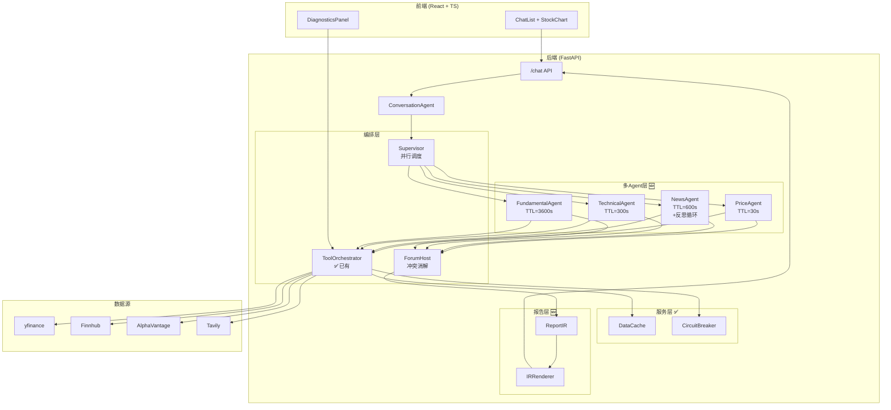
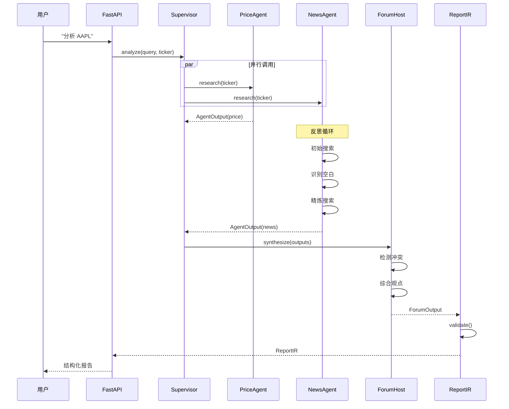

# FinSight 终极架构设计

> 📅 更新日期: 2025-12-27

---

## 一、BettaFish 核心机制借鉴

### 1.1 四大专职 Agent

| Agent | 职责 | FinSight 对应 |
|-------|------|---------------|
| QueryAgent | 国内外新闻搜索 | NewsAgent |
| MediaAgent | 多模态内容分析 | - (暂不实现) |
| InsightAgent | 私有数据库挖掘 | FundamentalAgent |
| ReportAgent | 报告整合生成 | ForumHost + IRRenderer |

### 1.2 论坛式协作机制

```
Agent 不直接通信，通过 ForumEngine 异步交流：

┌─────────────┐     ┌─────────────┐     ┌─────────────┐
│ PriceAgent  │     │ NewsAgent   │     │ TechAgent   │
└──────┬──────┘     └──────┬──────┘     └──────┬──────┘
       │                   │                   │
       └───────────────────┼───────────────────┘
                           ▼
                   ┌───────────────┐
                   │  ForumHost    │  ← LLM 主持人
                   │  (冲突消解)   │
                   └───────┬───────┘
                           ▼
                   ┌───────────────┐
                   │  综合报告     │
                   └───────────────┘
```

### 1.3 反思循环 (Reflection Loop)

```
初始搜索 → 首次总结 → [识别空白 → 精炼搜索 → 更新总结] × 2-3轮
```

**关键代码模式：**
```python
MAX_REFLECTIONS = 2

for i in range(MAX_REFLECTIONS):
    gaps = await identify_gaps(summary)  # LLM 识别知识空白
    if not gaps:
        break
    new_data = await targeted_search(gaps)
    summary = await update_summary(summary, new_data)
```

### 1.4 IR 中间表示

```python
# 先生成结构化 JSON
ReportIR = {
    "ticker": "AAPL",
    "sections": [...],
    "evidence": [...],
    "confidence": 0.85,
    "risks": [...]
}

# 校验后再渲染
if ir.validate():
    html = renderer.to_html(ir)
    pdf = renderer.to_pdf(ir)
```

---

## 二、FinSight 目标架构图

### 2.1 整体架构 (Mermaid)



### 2.2 数据流时序图



---

## 三、核心数据结构

### 3.1 AgentOutput

```python
@dataclass
class AgentOutput:
    agent_name: str           # "PriceAgent"
    summary: str              # 2-5句摘要
    evidence: List[Evidence]  # 证据列表
    confidence: float         # 0-1
    data_sources: List[str]   # ["yfinance", "finnhub"]
    as_of: datetime           # 数据时间
    fallback_used: bool       # 是否用了兜底
    risks: List[str]          # 风险因素
    reflection_rounds: int    # 反思轮数
```

### 3.2 ForumOutput

```python
@dataclass
class ForumOutput:
    consensus: List[str]      # 共识观点
    conflicts: List[Conflict] # 分歧观点
    recommendation: str       # BUY/HOLD/SELL
    confidence: float         # 综合置信度
    risks: List[str]          # 综合风险
    agent_contributions: Dict # 各Agent贡献
```

### 3.3 ReportIR

```python
class ReportIR(BaseModel):
    ticker: str
    title: str
    generated_at: datetime

    executive_summary: str
    recommendation: str  # BUY/HOLD/SELL
    confidence: float

    sections: List[Section]
    risks: List[str]
    data_sources: List[str]

    @validator('confidence')
    def check_range(cls, v):
        assert 0 <= v <= 1
        return v
```

---

## 四、目录结构对照

```
backend/
├── agents/                    # 🆕 阶段1
│   ├── __init__.py
│   ├── base.py               # AgentOutput + BaseFinancialAgent
│   ├── price_agent.py        # MAX_REFLECTIONS = 0
│   ├── news_agent.py         # MAX_REFLECTIONS = 2
│   ├── technical_agent.py
│   └── fundamental_agent.py
│
├── orchestration/
│   ├── orchestrator.py       # ✅ 已有
│   ├── cache.py              # ✅ 已有
│   ├── validator.py          # ✅ 已有
│   ├── supervisor.py         # 🆕 Supervisor 模式
│   └── forum.py              # 🆕 ForumHost
│
├── services/
│   ├── __init__.py           # ✅ 已有
│   └── circuit_breaker.py    # ✅ 已有
│
├── report/                    # 🆕 阶段2
│   ├── __init__.py
│   ├── ir.py                 # ReportIR + Section + Evidence
│   └── renderer.py           # to_markdown() / to_html()
│
├── langchain_agent.py        # ✅ 已有 (保留兼容)
└── tools.py                  # ✅ 已有
```

---

## 五、与现有架构的兼容策略

### 5.1 渐进式迁移

```
阶段1: 新旧并行
├── langchain_agent.py (现有单Agent) → 保留，用于 REPORT 意图
└── agents/ (新多Agent) → 用于 CHAT 意图

阶段2: 逐步替换
├── CHAT 意图 → 多Agent
├── REPORT 意图 → 多Agent + ForumHost
└── langchain_agent.py → 废弃或作为兜底
```

### 5.2 入口切换

```python
# backend/conversation/agent.py

def _handle_chat(self, query, metadata):
    if USE_MULTI_AGENT:  # 环境变量控制
        return self.multi_agent_handler.handle(query, metadata)
    else:
        return self.chat_handler.handle(query, metadata)
```

---

## 六、性能预期

| 指标 | 当前 | 目标 |
|------|------|------|
| 平均响应时间 | 3-5s | 1-2s (缓存命中) |
| 数据源成功率 | 85% | 99% (熔断+兜底) |
| 信息覆盖率 | 单Agent | +40% (多Agent并行) |
| 置信度评估 | 无 | 0-1 评分 |
