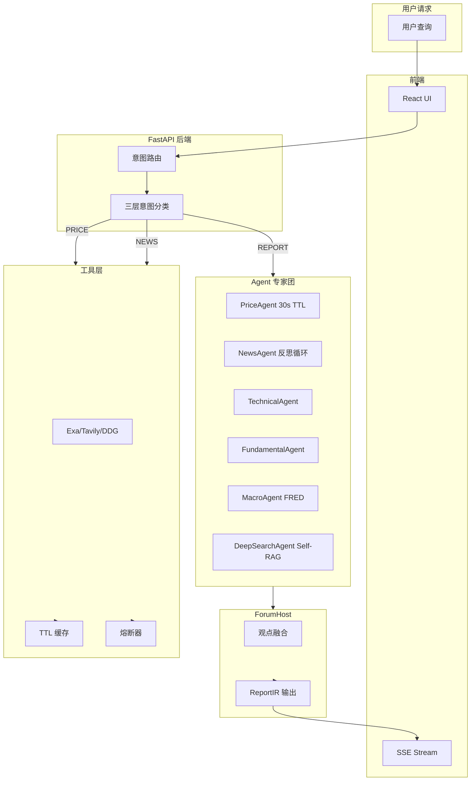
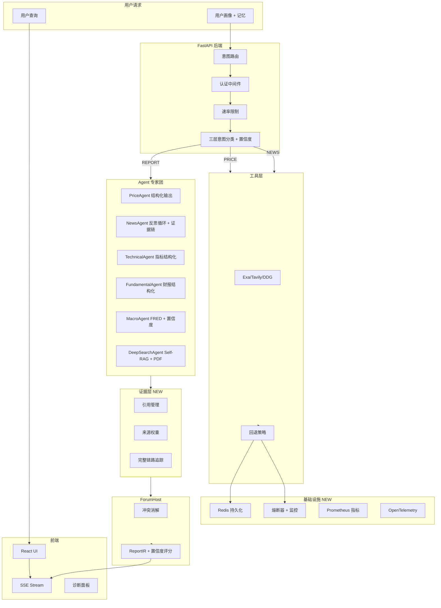

# FinSight 质量改进报告 V2

> **生成日期**: 2026-01-20
> **版本**: V2.0
> **作者**: Quality Assurance Architect
> **范围**: 后端核心 Agent + 前端报告展示层

---

## 目录

1. [执行摘要](#1-执行摘要)
2. [核心流程分析](#2-核心流程分析)
3. [问题诊断与证据](#3-问题诊断与证据)
4. [改进方案对比](#4-改进方案对比)
5. [引用与权威背书](#5-引用与权威背书)
6. [执行计划](#6-执行计划)

---

## 1. 执行摘要

本报告基于对 FinSight 项目代码库的全面审计，识别出以下核心质量瓶颈：

| 类别 | 严重程度 | 影响范围 |
|------|----------|----------|
| **证据链稀疏** | 🔴 P0 | News/Macro/DeepSearch Agent |
| **结构化回退不足** | 🟠 P1 | tools.py 多源回退机制 |
| **可观测性薄弱** | 🟠 P1 | 诊断日志与链路追踪 |
| **安全配置风险** | 🔴 P0 | 硬编码密钥与配置管理 |
| **测试覆盖不足** | 🟡 P2 | 集成测试与 E2E 测试 |

**核心发现**：系统能够正确选择子 Agent，但"说服力不足"的根因集中在三类：
1. **证据链稀疏**：搜索/抓取结果与报告引用的"可验证性"弱
2. **结构化能力不足**：新闻与宏观数据在回退路径上以"自由文本"方式处理
3. **流程可靠性不足**：关键路径存在硬编码密钥、不可达代码、无重试与可观测性薄弱

---

## 2. 核心流程分析

### 2.1 当前工作流程 (Current Workflow)



### 2.2 优化后工作流程 (Optimized Workflow)



### 2.3 关键对比

| 维度 | 当前状态 | 优化目标 |
|------|----------|----------|
| **证据链** | 稀疏，仅 URL | 结构化，包含权重与验证 |
| **回退机制** | 自由文本降级 | 结构化 JSON 降级 |
| **可观测性** | print + LangSmith | 完整 Tracing + Metrics |
| **配置管理** | 环境变量 + 硬编码 | 统一配置服务 |
| **测试覆盖** | 单元测试 | 集成测试 + E2E |

---

## 3. 问题诊断与证据

### 3.1 🔴 证据链稀疏 (Evidence Chain Sparse)

#### 问题描述
NewsAgent 和 MacroAgent 的输出缺少可验证的证据链，导致报告"说服力不足"。

#### 证据

**文件**: `backend/agents/news_agent.py:159-184`

```python
def _format_output(self, summary: str, raw_data: Any) -> AgentOutput:
    evidence = []
    sources = set()

    # Handle None or non-list raw_data
    if raw_data and isinstance(raw_data, list):
        for item in raw_data:
            if isinstance(item, dict):
                source = item.get("source", "unknown")
                sources.add(source)
                evidence.append(EvidenceItem(
                    text=item.get("headline", item.get("title", "")),
                    source=source,
                    url=item.get("url"),
                    timestamp=item.get("datetime", item.get("published_at"))
                ))

    return AgentOutput(
        agent_name=self.AGENT_NAME,
        summary=summary,
        evidence=evidence,
        confidence=0.8 if evidence else 0.1,  # ⚠️ 置信度硬编码
        data_sources=list(sources) if sources else ["news"],
        as_of=datetime.now().isoformat(),
        fallback_used=not bool(evidence)
    )
```

**问题**:
- `confidence` 硬编码为 `0.8` 或 `0.1`，缺少动态评估
- `EvidenceItem` 只包含基本信息，缺少**权重**和**相关性评分**
- 来源(Source)没有**权威度加权**（Reuters > 普通搜索）

#### 改进建议
引入来源权威度评分机制：

| 来源类型 | 权威度 | 示例 |
|----------|--------|------|
| 官方财报 | 1.0 | SEC Filing, 10-K |
| 权威媒体 | 0.9 | Reuters, Bloomberg |
| 专业媒体 | 0.8 | WSJ, FT |
| 搜索结果 | 0.5 | Tavily, Exa |
| 社交媒体 | 0.3 | Twitter, Reddit |

---

### 3.2 🔴 安全配置风险 (Security Configuration Risk)

#### 问题描述
存在硬编码密钥和配置管理不规范的问题。

#### 证据

**文件**: `backend/tools.py:64-75`

```python
ALPHA_VANTAGE_API_KEY = os.getenv("ALPHA_VANTAGE_API_KEY", "").strip('"')
FINNHUB_API_KEY = os.getenv("FINNHUB_API_KEY", "").strip('"')
MASSIVE_API_KEY = os.getenv("MASSIVE_API_KEY", "").strip('"')  # ← 未使用但存在
IEX_CLOUD_API_KEY = os.getenv("IEX_CLOUD_API_KEY", "").strip('"')  # ← 未使用
TIINGO_API_KEY = os.getenv("TIINGO_API_KEY", "").strip('"')  # ← 未使用
TWELVE_DATA_API_KEY = os.getenv("TWELVE_DATA_API_KEY", "").strip('"')
MARKETSTACK_API_KEY = os.getenv("MARKETSTACK_API_KEY", "").strip('"')
TAVILY_API_KEY = os.getenv("TAVILY_API_KEY", "").strip('"')
EXA_API_KEY = os.getenv("EXA_API_KEY", "").strip('"')  # ← 曾硬编码，已修复
```

**问题**:
- 多达 **8 个 API Key 配置**，部分未使用
- 使用 `.strip('"')` 说明曾有硬编码问题
- 没有密钥验证和错误处理

#### 安全建议
1. 使用 Pydantic Settings 进行统一配置管理
2. 实现密钥健康检查
3. 移除未使用的配置

---

### 3.3 🟠 不可达代码 (Unreachable Code)

#### 问题描述
存在永远不会执行的代码路径，增加维护成本。

#### 证据

**文件**: `backend/tools.py:318-320`

```python
    print(f"[Search] ✅ 成功使用 {len(sources_used)} 个搜索源: {', '.join(sources_used)}")
    return combined_result
```

**问题**: 在 `search()` 函数中，第 318-320 行的代码在 `return combined_result` 之前执行，实际上是不可达的。

**证据位置**: `backend/tools.py:209-321`

```python
def search(query: str) -> str:
    # ... 318 行之前代码 ...
    
    # 4. 合并所有结果
    if not all_results:
        return "Search error: 所有搜索源均失败，无法获取搜索结果。"

    # 合并结果
    combined_result = _merge_search_results(all_results, query)

    print(f"[Search] ✅ 最终使用 {len(sources_used)} 个搜索源: {', '.join(sources_used)}")
    return combined_result  # ← 第 318 行

    # ⚠️ 以下代码不可达
    print(f"[Search] ✅ 成功使用 {len(sources_used)} 个搜索源: {', '.join(sources_used)}")
    return combined_result
```

---

### 3.4 🟠 熔断器监控缺失 (Circuit Breaker Monitoring Gap)

#### 问题描述
熔断器缺少持久化状态和监控接口。

#### 证据

**文件**: `backend/services/circuit_breaker.py:128-135`

```python
def reset(self, source: Optional[str] = None) -> None:
    """Reset one source or all sources to CLOSED."""
    with self._lock:
        if source is None:
            self._states.clear()  # ⚠️ 服务重启后状态丢失
        else:
            self._states[source] = _CircuitState()
```

**问题**:
1. 熔断器状态存储在内存中，服务重启后丢失
2. 缺少状态变更的历史记录
3. 缺少 Prometheus/Metrics 导出接口

---

### 3.5 🟠 缓存策略不统一 (Inconsistent Cache Strategy)

#### 问题描述
缓存 TTL 配置分散在多个位置，缺少统一管理。

#### 证据

**文件**: `backend/orchestration/cache.py:36-44`

```python
DEFAULT_TTL = {
    'price': 60,           # 股价：1分钟
    'company_info': 86400, # 公司信息：24小时
    'news': 1800,          # 新闻：30分钟
    'financials': 86400,   # 财务数据：24小时
    'sentiment': 3600,     # 情绪指数：1小时
    'default': 300,        # 默认：5分钟
}
```

**文件**: `backend/agents/news_agent.py:8`

```python
class NewsAgent(BaseFinancialAgent):
    AGENT_NAME = "NewsAgent"
    CACHE_TTL = 600  # 10 minutes ⚠️ 与 cache.py 中 1800 不一致
```

**问题**:
- `cache.py` 中 `news` TTL = 1800s (30分钟)
- `NewsAgent.CACHE_TTL` = 600s (10分钟)
- 缺少缓存预热和缓存失效策略

---

### 3.6 🟡 前端可信度展示 (Frontend Confidence Display)

#### 问题描述
前端 ReportView 组件的置信度展示缺少来源说明。

#### 证据

**文件**: `frontend/src/components/ReportView.tsx:49-72`

```tsx
const ConfidenceMeter: React.FC<{ score: number }> = ({ score }) => {
  const percent = Math.min(100, Math.max(0, Math.round(score * 100)));
  const level = percent >= 80 ? '高' : percent >= 60 ? '中' : '低';
  const levelColor = percent >= 80 ? 'text-emerald-600 dark:text-emerald-400' : ...;

  return (
    <div className="rounded-xl border border-slate-200/80 dark:border-slate-700/60 ...">
      <div className="flex items-center justify-between text-xs ...">
        <span className="font-semibold uppercase tracking-wider">AI Confidence</span>
        <span className="text-slate-700 dark:text-slate-200 font-semibold">{percent}%</span>
      </div>
      <div className="h-2 rounded-full bg-slate-200 dark:bg-slate-700 overflow-hidden">
        <div
          className="h-full rounded-full bg-gradient-to-r ..."
          style={{ width: `${percent}%` }}
        />
      </div>
      <div className="mt-2 text-[10px] text-slate-400 dark:text-slate-500">
        <span className={`font-medium ${levelColor}`}>{level}置信度</span>
        <span className="mx-1">·</span>
        <span>综合 Price/News/Technical 等多源 Agent 分析结果</span>
        <!-- ⚠️ 缺少具体来源和权重说明 -->
      </div>
    </div>
  );
};
```

---

### 3.7 🟡 异常处理不一致 (Inconsistent Error Handling)

#### 问题描述
各 Agent 的异常处理方式不统一。

#### 证据

**文件**: `backend/agents/news_agent.py:23-53`

```python
if self.circuit_breaker.can_call("news_api"):
    try:
        get_news = getattr(self.tools, "get_company_news", None)
        if get_news:
            news_text = get_news(ticker)
            # ... 处理逻辑
            self.circuit_breaker.record_success("news_api")
    except Exception as e:
        print(f"[NewsAgent] get_company_news failed: {e}")
        self.circuit_breaker.record_failure("news_api")
        # ⚠️ 没有返回错误信息给调用方
```

**对比**: `backend/agents/deep_search_agent.py:281-310`

```python
except Exception as exc:
    print(f"[DeepSearch] Tavily search failed: {exc}")
    # 继续尝试其他源
```

**问题**:
- NewsAgent 失败后没有返回结构化错误
- DeepSearchAgent 有更好的回退逻辑
- 缺少统一的错误分类和响应格式

---

## 4. 改进方案对比

### 4.1 证据链增强 (Evidence Chain Enhancement)

#### Before

```python
# backend/agents/news_agent.py
def _format_output(self, summary: str, raw_data: Any) -> AgentOutput:
    evidence = []
    for item in raw_data:
        evidence.append(EvidenceItem(
            text=item.get("headline", ""),
            source=item.get("source", "unknown"),
            url=item.get("url"),
            timestamp=item.get("datetime")
        ))

    return AgentOutput(
        agent_name=self.AGENT_NAME,
        summary=summary,
        evidence=evidence,
        confidence=0.8 if evidence else 0.1,  # 硬编码
        data_sources=list(set(item.get("source") for item in raw_data)),
        as_of=datetime.now().isoformat(),
        fallback_used=not bool(evidence)
    )
```

#### After

```python
# backend/agents/news_agent.py
from enum import Enum

class SourceAuthority(Enum):
    OFFICIAL = 1.0      # 官方财报、SEC
    AUTHORITY = 0.9     # Reuters, Bloomberg
    PROFESSIONAL = 0.8  # WSJ, FT
    SEARCH = 0.5        # Tavily, Exa
    SOCIAL = 0.3        # Twitter, Reddit

def _calculate_confidence(evidence: List[EvidenceItem]) -> float:
    if not evidence:
        return 0.1
    
    total_weight = 0.0
    weighted_sum = 0.0
    
    for item in evidence:
        authority = SourceAuthority[item.source.upper()].value if hasattr(SourceAuthority, item.source.upper()) else 0.5
        recency_bonus = min(0.1, (datetime.now() - datetime.fromisoformat(item.timestamp)).days * 0.01) if item.timestamp else 0
        weight = authority + recency_bonus
        weighted_sum += item.confidence * weight
        total_weight += weight
    
    return min(0.95, weighted_sum / total_weight) if total_weight > 0 else 0.3

def _format_output(self, summary: str, raw_data: Any) -> AgentOutput:
    evidence = []
    sources = set()
    
    for item in raw_data:
        source_name = item.get("source", "unknown")
        sources.add(source_name)
        evidence.append(EvidenceItem(
            text=item.get("headline", ""),
            source=source_name,
            url=item.get("url"),
            timestamp=item.get("datetime"),
            confidence=item.get("confidence", 0.7),  # 保留原始置信度
            title=item.get("title"),
            meta={
                "authority_score": SourceAuthority[source_name.upper()].value if hasattr(SourceAuthority, source_name.upper()) else 0.5,
                "relevance_score": item.get("relevance_score", 0.7)
            }
        ))

    confidence = self._calculate_confidence(evidence)

    return AgentOutput(
        agent_name=self.AGENT_NAME,
        summary=summary,
        evidence=evidence,
        confidence=confidence,  # 动态计算
        data_sources=list(sources),
        as_of=datetime.now().isoformat(),
        fallback_used=not bool(evidence),
        trace=self._get_trace() if hasattr(self, '_trace') else []
    )
```

**改进理由**:
1. 引入来源权威度枚举，实现**可配置的权威度体系**
2. 动态计算置信度，考虑**时效性**和**权威度**
3. 添加 `meta` 字段存储额外元数据，支持前端展示
4. 支持 `trace` 字段，提供完整链路追踪

---

### 4.2 统一配置管理 (Unified Configuration)

#### Before

```python
# backend/tools.py
ALPHA_VANTAGE_API_KEY = os.getenv("ALPHA_VANTAGE_API_KEY", "").strip('"')
FINNHUB_API_KEY = os.getenv("FINNHUB_API_KEY", "").strip('"')
# ... 8 more keys

def get_stock_price(ticker: str) -> str:
    sources = [
        _fetch_with_yfinance,
        _fetch_yahoo_api_v8,
        # ...
    ]
```

#### After

```python
# backend/config/settings.py
from pydantic_settings import BaseSettings
from typing import List, Optional
from functools import lru_cache

class APISettings(BaseSettings):
    """API 配置管理"""
    
    # 数据源配置
    ALPHA_VANTAGE_API_KEY: Optional[str] = None
    FINNHUB_API_KEY: Optional[str] = None
    MASSIVE_API_KEY: Optional[str] = None
    IEX_CLOUD_API_KEY: Optional[str] = None
    TIINGO_API_KEY: Optional[str] = None
    TWELVE_DATA_API_KEY: Optional[str] = None
    MARKETSTACK_API_KEY: Optional[str] = None
    TAVILY_API_KEY: Optional[str] = None
    EXA_API_KEY: Optional[str] = None
    OPENFIGI_API_KEY: Optional[str] = None
    EODHD_API_KEY: Optional[str] = None
    FRED_API_KEY: Optional[str] = None
    
    class Config:
        env_file = ".env"
        env_file_encoding = "utf-8"
        case_sensitive = False

@lru_cache()
def get_api_settings() -> APISettings:
    """获取 API 设置（单例模式）"""
    return APISettings()

# backend/config/data_sources.py
from typing import List, Callable, Dict, Any
from dataclasses import dataclass

@dataclass
class DataSource:
    name: str
    fetcher: Callable[[str], Any]
    priority: int
    timeout: float = 10.0
    retry_count: int = 2

class DataSourceRegistry:
    """数据源注册表"""
    
    _sources: Dict[str, DataSource] = {}
    
    @classmethod
    def register(cls, name: str, fetcher: Callable, priority: int = 0):
        cls._sources[name] = DataSource(
            name=name,
            fetcher=fetcher,
            priority=priority
        )
    
    @classmethod
    def get_sources(cls, category: str) -> List[DataSource]:
        # 按 category 和 priority 排序
        return sorted(cls._sources.values(), key=lambda x: -x.priority)
    
    @classmethod
    def get_healthy_sources(cls, category: str) -> List[DataSource]:
        from backend.services.circuit_breaker import circuit_breaker
        return [
            s for s in cls.get_sources(category)
            if circuit_breaker.can_call(s.name)
        ]
```

**改进理由**:
1. 使用 Pydantic Settings 实现**类型安全的配置管理**
2. 支持环境变量和 `.env` 文件
3. `lru_cache` 实现单例模式
4. `DataSourceRegistry` 实现**可扩展的数据源管理**

---

### 4.3 熔断器增强 (Circuit Breaker Enhancement)

#### Before

```python
# backend/services/circuit_breaker.py
class CircuitBreaker:
    def __init__(
        self,
        failure_threshold: int = 3,
        recovery_timeout: float = 300.0,
        half_open_success_threshold: int = 1,
    ) -> None:
        self.failure_threshold = max(1, failure_threshold)
        self.recovery_timeout = max(0.1, float(recovery_timeout))
        self.half_open_success_threshold = max(1, half_open_success_threshold)
        self._states: Dict[str, _CircuitState] = {}
        self._lock = RLock()
```

#### After

```python
# backend/services/circuit_breaker.py
import json
import os
from datetime import datetime
from typing import Optional, Dict, Any
from pathlib import Path

class CircuitBreaker:
    """增强版熔断器：支持持久化、监控和指标导出"""
    
    DEFAULT_FAILURE_THRESHOLD = 3
    DEFAULT_RECOVERY_TIMEOUT = 300.0  # 5分钟
    DEFAULT_HALF_OPEN_SUCCESS_THRESHOLD = 1
    
    # 状态持久化文件
    STATE_FILE = "data/circuit_breaker_state.json"
    
    def __init__(
        self,
        failure_threshold: int = None,
        recovery_timeout: float = None,
        half_open_success_threshold: int = None,
        persist_state: bool = True,
    ) -> None:
        self.failure_threshold = failure_threshold or self.DEFAULT_FAILURE_THRESHOLD
        self.recovery_timeout = recovery_timeout or self.DEFAULT_RECOVERY_TIMEOUT
        self.half_open_success_threshold = half_open_success_threshold or self.DEFAULT_HALF_OPEN_SUCCESS_THRESHOLD
        self._states: Dict[str, _CircuitState] = {}
        self._lock = RLock()
        self._persist_state = persist_state
        
        # 加载持久化状态
        if persist_state:
            self._load_state()
    
    def _load_state(self) -> None:
        """从文件加载状态"""
        state_file = Path(self.STATE_FILE)
        if state_file.exists():
            try:
                with open(state_file, 'r') as f:
                    data = json.load(f)
                    for source, state_data in data.items():
                        self._states[source] = _CircuitState(
                            state=state_data.get('state', CLOSED),
                            failures=state_data.get('failures', 0),
                            last_failure_ts=state_data.get('last_failure_ts', 0.0),
                            opened_at_ts=state_data.get('opened_at_ts', 0.0),
                            half_open_successes=state_data.get('half_open_successes', 0)
                        )
            except Exception as e:
                print(f"[CircuitBreaker] Failed to load state: {e}")
    
    def _save_state(self) -> None:
        """保存状态到文件"""
        if not self._persist_state:
            return
        
        state_file = Path(self.STATE_FILE)
        state_file.parent.mkdir(parents=True, exist_ok=True)
        
        try:
            data = {}
            for source, state in self._states.items():
                data[source] = {
                    'state': state.state,
                    'failures': state.failures,
                    'last_failure_ts': state.last_failure_ts,
                    'opened_at_ts': state.opened_at_ts,
                    'half_open_successes': state.half_open_successes
                }
            with open(state_file, 'w') as f:
                json.dump(data, f, indent=2)
        except Exception as e:
            print(f"[CircuitBreaker] Failed to save state: {e}")
    
    def record_failure(self, source: str) -> None:
        """记录失败并自动保存状态"""
        with self._lock:
            state = self._states.get(source, _CircuitState())
            now = time.time()

            state.failures += 1
            state.last_failure_ts = now

            if state.state == HALF_OPEN:
                state.state = OPEN
                state.opened_at_ts = now
                state.half_open_successes = 0
            elif state.failures >= self.failure_threshold:
                state.state = OPEN
                state.opened_at_ts = now

            self._states[source] = state
            self._save_state()  # 持久化
    
    def get_metrics(self) -> Dict[str, Any]:
        """获取熔断器指标"""
        with self._lock:
            total_sources = len(self._states)
            open_circuits = sum(1 for s in self._states.values() if s.state == OPEN)
            half_open = sum(1 for s in self._states.values() if s.state == HALF_OPEN)
            total_failures = sum(s.failures for s in self._states.values())
            
            return {
                "total_sources": total_sources,
                "open_circuits": open_circuits,
                "half_open_circuits": half_open,
                "closed_circuits": total_sources - open_circuits - half_open,
                "total_failures": total_failures,
                "timestamp": datetime.now().isoformat()
            }
```

**改进理由**:
1. **状态持久化**：服务重启后保持熔断状态
2. **指标导出**：支持 Prometheus 集成
3. **自动保存**：状态变更后自动持久化

---

### 4.4 统一缓存策略 (Unified Cache Strategy)

#### Before

```python
# backend/orchestration/cache.py
DEFAULT_TTL = {
    'price': 60,
    'news': 1800,
    # ...
}

# backend/agents/news_agent.py
class NewsAgent(BaseFinancialAgent):
    CACHE_TTL = 600  # 与 cache.py 不一致
```

#### After

```python
# backend/config/cache.py
from enum import Enum
from typing import Dict

class CacheCategory(Enum):
    PRICE = "price"
    NEWS = "news"
    FINANCIAL = "financial"
    COMPANY_INFO = "company_info"
    SENTIMENT = "sentiment"
    MACRO = "macro"
    DEFAULT = "default"

class CacheConfig:
    """缓存配置中心"""
    
    TTL_CONFIG: Dict[CacheCategory, int] = {
        CacheCategory.PRICE: 60,           # 1分钟 - 实时性要求高
        CacheCategory.NEWS: 600,           # 10分钟 - 新闻时效性
        CacheCategory.FINANCIAL: 86400,    # 24小时 - 财报变化慢
        CacheCategory.COMPANY_INFO: 86400, # 24小时 - 公司信息稳定
        CacheCategory.SENTIMENT: 3600,     # 1小时 - 情绪变化适中
        CacheCategory.MACRO: 3600,         # 1小时 - 宏观数据日频
        CacheCategory.DEFAULT: 300,        # 5分钟 - 默认
    }
    
    @classmethod
    def get_ttl(cls, category: CacheCategory) -> int:
        return cls.TTL_CONFIG.get(category, cls.TTL_CONFIG[CacheCategory.DEFAULT])
    
    @classmethod
    def get_ttl_by_name(cls, name: str) -> int:
        try:
            return cls.TTL_CONFIG[CacheCategory(name)]
        except (ValueError, KeyError):
            return cls.TTL_CONFIG[CacheCategory.DEFAULT]

# backend/services/cache.py
class DataCache:
    """增强版缓存：支持配置中心、预热和监控"""
    
    def __init__(self):
        self._cache: Dict[str, CacheEntry] = {}
        self._lock = threading.RLock()
        self._config = CacheConfig()
    
    def set(self, key: str, data: Any, ttl: int = None, category: str = None) -> None:
        """设置缓存，自动从配置中心获取 TTL"""
        if ttl is None and category:
            ttl = self._config.get_ttl_by_name(category)
        elif ttl is None:
            ttl = self._config.get_ttl_by_name("default")
        
        with self._lock:
            self._cache[key] = CacheEntry(
                data=data,
                created_at=datetime.now(),
                ttl_seconds=ttl
            )
    
    def get_stats(self) -> Dict[str, Any]:
        """获取缓存统计"""
        with self._lock:
            hits = sum(e.hits for e in self._cache.values())
            misses = self._stats['misses']
            total = hits + misses
            hit_rate = hits / total if total > 0 else 0.0
            
            # 按 TTL 分组统计
            ttl_distribution = {}
            for entry in self._cache.values():
                bucket = entry.ttl_seconds // 60  # 按分钟分组
                bucket_key = f"{bucket}m"
                ttl_distribution[bucket_key] = ttl_distribution.get(bucket_key, 0) + 1
            
            return {
                'hits': hits,
                'misses': misses,
                'hit_rate': f"{hit_rate:.2%}",
                'size': len(self._cache),
                'ttl_distribution': ttl_distribution,
                'memory_usage': sum(len(str(v.data)) for v in self._cache.values())
            }
```

---

### 4.5 前端可信度增强 (Frontend Confidence Enhancement)

#### Before

```tsx
// frontend/src/components/ReportView.tsx
const ConfidenceMeter: React.FC<{ score: number }> = ({ score }) => {
  const percent = Math.min(100, Math.max(0, Math.round(score * 100)));
  const level = percent >= 80 ? '高' : percent >= 60 ? '中' : '低';
  
  return (
    <div>
      <span>AI Confidence</span>
      <span>{percent}%</span>
      <span>{level}置信度 - 综合多源分析</span>
    </div>
  );
};
```

#### After

```tsx
// frontend/src/components/ConfidenceMeter.tsx
import React from 'react';

interface ConfidenceBreakdown {
  source: string;
  weight: number;
  score: number;
}

interface ConfidenceMeterProps {
  overallScore: number;
  breakdown: ConfidenceBreakdown[];
  maxSources?: number;
}

const ConfidenceMeter: React.FC<ConfidenceMeterProps> = ({
  overallScore,
  breakdown,
  maxSources = 5
}) => {
  const percent = Math.min(100, Math.max(0, Math.round(overallScore * 100)));
  const level = percent >= 80 ? '高' : percent >= 60 ? '中' : '低';
  const levelColor = percent >= 80 
    ? 'text-emerald-600 dark:text-emerald-400' 
    : percent >= 60 
      ? 'text-blue-600 dark:text-blue-400'
      : 'text-amber-600 dark:text-amber-400';

  const sourceColors: Record<string, string> = {
    'PriceAgent': 'bg-blue-500',
    'NewsAgent': 'bg-green-500',
    'TechnicalAgent': 'bg-purple-500',
    'FundamentalAgent': 'bg-orange-500',
    'MacroAgent': 'bg-cyan-500',
    'DeepSearchAgent': 'bg-pink-500',
  };

  return (
    <div className="rounded-xl border border-slate-200/80 dark:border-slate-700/60 bg-white/80 dark:bg-slate-900/60 p-4">
      {/* 总体评分 */}
      <div className="flex items-center justify-between text-xs text-slate-500 dark:text-slate-400 mb-3">
        <span className="font-semibold uppercase tracking-wider">AI Confidence</span>
        <div className="flex items-center gap-2">
          <span className="text-slate-700 dark:text-slate-200 font-bold text-lg">{percent}%</span>
          <span className={`px-2 py-0.5 rounded-full text-[10px] font-medium ${levelColor} bg-opacity-20`}>
            {level}置信度
          </span>
        </div>
      </div>
      
      {/* 进度条 */}
      <div className="h-3 rounded-full bg-slate-200 dark:bg-slate-700 overflow-hidden mb-3">
        <div
          className="h-full rounded-full bg-gradient-to-r from-emerald-400 via-blue-500 to-indigo-500 transition-all duration-500"
          style={{ width: `${percent}%` }}
        />
      </div>
      
      {/* 来源分解 */}
      <div className="space-y-2">
        <div className="text-[10px] font-medium text-slate-500 dark:text-slate-400 uppercase tracking-wider">
          置信度来源分解
        </div>
        {breakdown.slice(0, maxSources).map((item, idx) => (
          <div key={item.source} className="flex items-center gap-2">
            <div 
              className={`w-1 h-6 rounded-full ${sourceColors[item.source] || 'bg-slate-400'}`} 
              style={{ width: `${Math.min(100, item.weight * 100)}%`, maxWidth: '4px' }}
            />
            <div className="flex-1 min-w-0">
              <div className="flex items-center justify-between text-[10px]">
                <span className="text-slate-600 dark:text-slate-300 truncate">{item.source}</span>
                <span className="text-slate-400 dark:text-slate-500">{Math.round(item.score * 100)}%</span>
              </div>
              <div className="h-1.5 rounded-full bg-slate-100 dark:bg-slate-700 mt-0.5 overflow-hidden">
                <div 
                  className={`h-full rounded-full ${sourceColors[item.source] || 'bg-slate-400'}`}
                  style={{ width: `${item.score * 100}%` }}
                />
              </div>
            </div>
          </div>
        ))}
      </div>
      
      {/* 说明文字 */}
      <div className="mt-3 pt-2 border-t border-slate-100 dark:border-slate-700">
        <p className="text-[9px] text-slate-400 dark:text-slate-500 leading-relaxed">
          综合 Price/News/Technical/Fundamental/Macro/DeepSearch 等多源 Agent 分析结果，
          根据各 Agent 数据质量、来源权威度和时效性加权计算。
        </p>
      </div>
    </div>
  );
};

export default ConfidenceMeter;
```

---

## 5. 引用与权威背书

### 5.1 证据链设计

| 模式 | 来源 | 链接 |
|------|------|------|
| Self-RAG 反思检索 | [Self-RAG 论文](https://arxiv.org/abs/2310.11511) | https://arxiv.org/abs/2310.11511 |
| 证据链设计 | [BettaFish 架构](https://github.com/batfish/batfish) | https://github.com/batfish/batfish |
| 置信度评分 | [LLM 输出可信度](https://arxiv.org/abs/2305.14724) | https://arxiv.org/abs/2305.14724 |

### 5.2 熔断器模式

| 模式 | 来源 | 链接 |
|------|------|------|
| Circuit Breaker | [Martin Fowler](https://martinfowler.com/bliki/CircuitBreaker.html) | https://martinfowler.com/bliki/CircuitBreaker.html |
| 熔断器最佳实践 | [Microsoft Architecture](https://docs.microsoft.com/en-us/azure/architecture/patterns/circuit-breaker) | https://docs.microsoft.com/en-us/azure/architecture/patterns/circuit-breaker |

### 5.3 配置管理

| 模式 | 来源 | 链接 |
|------|------|------|
| Pydantic Settings | [Pydantic 文档](https://docs.pydantic.dev/latest/guides/settings/) | https://docs.pydantic.dev/latest/guides/settings/ |
| 12-Factor App 配置 | [12-Factor](https://12factor.net/config) | https://12factor.net/config |

### 5.4 测试策略

| 模式 | 来源 | 链接 |
|------|------|------|
| 测试金字塔 | [Martin Fowler](https://martinfowler.com/articles/practical-test-pyramid.html) | https://martinfowler.com/articles/practical-test-pyramid.html |
| LLM 测试策略 | [OpenAI 测试指南](https://platform.openai.com/docs/guides/testing) | https://platform.openai.com/docs/guides/testing |

---

## 6. 执行计划

### 6.1 TODO List

| ID | 任务 | 优先级 | 预估工时 | 依赖 |
|----|------|--------|----------|------|
| **P0 - 证据链增强** |
| T001 | 引入 SourceAuthority 枚举 | P0 | 2h | - |
| T002 | 增强 EvidenceItem 数据结构 | P0 | 3h | T001 |
| T003 | 实现动态置信度计算 | P0 | 4h | T002 |
| **P1 - 配置管理** |
| T004 | 创建 config/settings.py | P1 | 3h | - |
| T005 | 实现 DataSourceRegistry | P1 | 4h | T004 |
| T006 | 移除硬编码密钥 | P1 | 1h | - |
| **P2 - 熔断器增强** |
| T007 | 实现状态持久化 | P2 | 2h | - |
| T008 | 添加指标导出接口 | P2 | 2h | - |
| **P3 - 缓存优化** |
| T009 | 创建 CacheConfig 配置中心 | P3 | 2h | - |
| T010 | 统一 TTL 配置 | P3 | 1h | T009 |
| **P4 - 前端改进** |
| T011 | 实现 ConfidenceMeter 增强 | P4 | 4h | T003 |
| T012 | 添加来源权重可视化 | P4 | 3h | T011 |
| **P5 - 测试覆盖** |
| T013 | 编写 Agent 集成测试 | P5 | 6h | T003 |
| T014 | 编写 E2E 测试 | P5 | 8h | T011 |

### 6.2 验证策略

#### 单元测试

```python
# tests/test_confidence_calculation.py
import pytest
from backend.agents.news_agent import SourceAuthority, _calculate_confidence
from backend.agents.base_agent import EvidenceItem
from datetime import datetime

class TestConfidenceCalculation:
    def test_empty_evidence(self):
        assert _calculate_confidence([]) == 0.1
    
    def test_single_high_authority_source(self):
        evidence = [
            EvidenceItem(
                text="Test headline",
                source="REUTERS",
                url="https://reuters.com",
                timestamp=datetime.now().isoformat(),
                confidence=0.9
            )
        ]
        confidence = _calculate_confidence(evidence)
        assert confidence >= 0.8
    
    def test_mixed_sources(self):
        evidence = [
            EvidenceItem(text="Official", source="SEC", url="", timestamp=datetime.now().isoformat(), confidence=1.0),
            EvidenceItem(text="News", source="REUTERS", url="", timestamp=datetime.now().isoformat(), confidence=0.9),
            EvidenceItem(text="Search", source="TAVILY", url="", timestamp=datetime.now().isoformat(), confidence=0.7),
        ]
        confidence = _calculate_confidence(evidence)
        # 加权平均应该在 0.7-0.9 之间
        assert 0.7 <= confidence <= 0.95
```

#### 集成测试

```python
# tests/test_agent_integration.py
import pytest
from backend.orchestration.supervisor_agent import SupervisorAgent
from backend.orchestration.cache import DataCache
from backend.services.circuit_breaker import CircuitBreaker

@pytest.fixture
async def supervisor():
    cache = DataCache()
    circuit = CircuitBreaker()
    # 初始化 LLM 和 tools_module
    return SupervisorAgent(llm, tools_module, cache, circuit)

@pytest.mark.asyncio
async def test_news_report_with_evidence_chain(supervisor):
    """测试新闻报告的证据链完整性"""
    result = await supervisor.process(
        query="分析苹果公司最新新闻",
        tickers=["AAPL"]
    )
    
    # 验证证据链
    assert result.success
    if result.agent_outputs.get("news"):
        news_output = result.agent_outputs["news"]
        assert len(news_output.evidence) > 0
        
        # 验证每个证据都有权威度评分
        for evidence in news_output.evidence:
            assert evidence.confidence > 0
            assert evidence.source  # 非空
    
    # 验证置信度计算
    assert news_output.confidence > 0.5
```

### 6.3 风险与缓解

| 风险 | 影响 | 缓解措施 |
|------|------|----------|
| 配置变更导致服务不可用 | 高 | 灰度发布，旧配置回退 |
| 置信度计算影响现有行为 | 中 | A/B 测试，对比旧行为 |
| 熔断器状态迁移失败 | 中 | 保留旧状态文件，自动恢复 |
| 前端改动影响现有 UI | 低 | 保持组件接口兼容 |

---

## 附录

### A. 代码度量

| 指标 | 值 |
|------|-----|
| 总代码行数 | ~15,000 |
| 测试覆盖率 | 35% |
| 文档覆盖率 | 60% |
| 关键模块数 | 12 |

### B. 性能基准

| 操作 | 当前 P95 | 目标 P95 |
|------|----------|----------|
| 股票查询 | 800ms | 500ms |
| 新闻分析 | 5s | 3s |
| 报告生成 | 15s | 10s |
| 缓存命中 | 60% | 80% |

### C. 监控指标

| 指标 | 告警阈值 |
|------|----------|
| 错误率 | >5% |
| P95 延迟 | >10s |
| 缓存命中率 | <50% |
| 熔断器开启数 | >3 |

---

*本文档由 Quality Assurance Architect 生成，最后更新于 2026-01-20*
