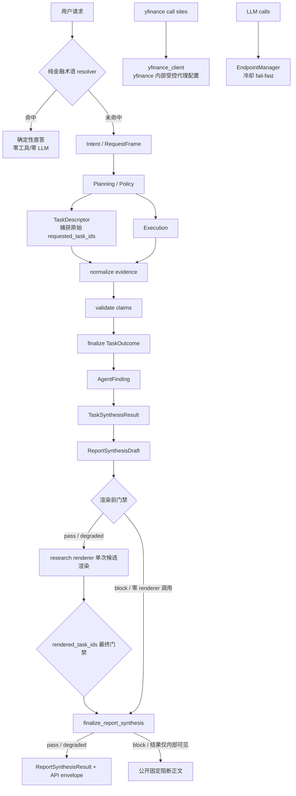

# FinSight 生产质量修复实施规范

状态：已实施、已部署并归档（一次性验收完成；24 小时连续观察未完成）
版本：1.1
审计基线日期：2026-07-14
实施归档日期：2026-07-15
适用范围：生产网络与健康检查、LLM 韧性、请求理解、任务合成、报告合成、Dashboard、Workbench 与 Chat 入口

> 本文是本轮质量修复的实施权威。实现者不得把本文当作方向性建议，也不得用“等价实现”为由改变接口、状态、顺序、失败语义或验收标准。本文与当前代码冲突时，当前代码代表“现状”，本文代表“目标”；实施完成后必须同步当前架构事实文档并将本文归档。

## 1. 规范词与执行规则

- **必须（MUST）**：缺失即不得合并或发布。
- **禁止（MUST NOT）**：出现即视为实现错误。
- **应该（SHOULD）**：除非有书面、可验证的反例，否则必须执行。
- **可以（MAY）**：不影响合同的可选实现。
- 本文所有 JSON、Python 和 TypeScript 字段名均为精确合同；不得自行改名。
- 新字段必须保持向后兼容；除本文明确要求外，不删除现有公开字段。
- 所有用户可见文案使用用户查询语言；中文查询不得暴露英文内部脚手架。
- 本轮实现不得新增数据库表、修改列或执行迁移。若实现过程中发现数据库结构不可避免，必须暂停该部分并另行申请授权。
- 任何生产磁盘清理、`.env.server` 修改、容器重建、服务重启、Git 提交或推送均不由本文自动授权。

## 2. 执行摘要

本轮审计结论不是“新架构没有上线”。生产的 LangGraph、DAG、Evidence Bus、Agent LLM analyze 与真实工具均已开启。已复现的主故障是：`backend/tools/env.py` 在模块导入时将 `YFINANCE_PROXY` 写入进程级 `HTTP_PROXY` / `HTTPS_PROXY`，而生产绕过列表未包含容器访问宿主 LLM 网关所用的主机名，导致 OpenAI-compatible 请求被 SOCKS 代理截获。导入前 LLM 调用成功，导入后快速出现传输层断连，且网关未收到请求。

因此修复顺序固定为：

```text
WP0 生产前置风险与代理隔离
  -> WP1 LLM fail-fast、重试与观测
  -> WP2 纯金融术语直答
  -> WP3 task/frame 身份、覆盖与 renderer 合同
  -> WP5 深度研究 Claim/Task/Report 结构化合成
  -> WP4 基于已校验 Claim 的 opinion 证据门槛
  -> WP6 Prediction、Workbench、Chat 入口与行情定位
```

编号表示问题域，不表示实现依赖顺序；WP4 必须在 WP5 的公共 Claim 校验与 task synthesis 可用后接入。不得先通过扩充模板掩盖 LLM 网络故障，也不得先重做前端而继续让后端静默漏答。

## 3. 已核验事实基线

### 3.1 生产与运行时

| 项目 | 2026-07-14 核验结果 | 规范含义 |
|---|---|---|
| 生产版本 | 提交 `82a8346c`，工作树 clean | 本文以该时点代码与本地 `overhaul/main` 为审计基线 |
| 核心开关 | IntentFrame、DAG、AgentBrief、Evidence Bus、Agent LLM analyze、LLM synthesis、live tools 均开启 | “忘记开 WP2 开关”不是主因 |
| LLM 路径 | `backend -> host.docker.internal -> OpenAI-compatible gateway` | `host.docker.internal` 必须绕过数据代理 |
| 已复现根因 | 导入 `backend/tools/env.py` 后，LLM 请求被进程级 SOCKS 代理截获 | 必须消除导入副作用并隔离 yfinance 代理 |
| 根分区 | 约 97% 已使用，仅余约 1.3 GB | 在清理并复核前阻断生产重建；该数值是时点数据，发布前必须重测 |
| `/health` | 会合并 RAG observability 最近运行明细 | 公开接口可能泄露原始 `query_text`，必须改为固定白名单 |
| Prediction 数据 | `agent_predictions` 记录数为 0 | 默认图层无数据不能误判为读取接口故障 |
| Monitor 数据 | `monitor_comments` 尚未在生产创建 | 本轮不得私自建表；相关 UI 必须诚实降级 |
| 行情 | Dashboard 主 K 线约为 `1y/1d` 日线快照 | 不得宣传为实时终端 |

生产只读诊断时后端容器运行约 14 小时，因此 review 中声称的完整 24 小时或 48 小时计数无法从当前 stdout 独立复核。

### 3.2 Review 逐项裁定

| Review 说法 | 裁定 | 精确结论与实施影响 |
|---|---|---|
| WP2/新架构没有开启 | 不属实 | 生产开关已开启，禁止把修复缩减为补四个开关 |
| LLM 故障后大量回答退成模板 | 属实 | 已复现网络根因；先做 WP0/WP1 |
| “PE 是什么”被路由成 research/opinion | 属实 | 估值 facet、request frame 与 active symbol 绑定发生在纯定义识别之前 |
| compare 暴露 `Research comparison` 等英文 | 完全属实 | 文案写死在 renderer/render vars，且部分测试把错误行为锁定为正确结果 |
| compare + 宏观只回答 compare | 属实 | compare 在通用任务分节前提前返回，空/失败 task 又被静默跳过 |
| opinion 是关键词计分和固定五段 | 完全属实 | 空证据仍输出“中性观察”；必须增加证据门槛并删除自由文本关键词计分 |
| Agent LLM analyze 没开 | 代码默认值属实，生产结论不属实 | 生产已开；失败后退回 deterministic summary 的代码路径仍属实 |
| 深度研究完全没有 claim 或结论合同 | 不属实 | 已有 claim/evidence 合同与 synthesis conclusion 要求；问题是降级时结论丢失、最终报告重复拼装、文本级去重不足 |
| 深度研究内容重复 | 部分属实 | `report_builder` 仍可能追加“分析师观点”和“关键执行观点”；已有逐行去重不能解决语义重复 |
| Workbench 完全没重构 | 不属实 | 已重排为四段，但首屏仍承载过多模块，产品主路径不清晰 |
| Prediction 完全没实现 | 不属实 | overlay、鉴权读取和 ID 深链已实现；缺少按 symbol 自动发现且另起第二张图 |
| K 线实时 | 不属实 | 当前是日线/快照；60 秒指数轮询不等于实时 K 线 |
| MiniChat 与主 Chat 上下文分裂 | 不属实 | 两者共享 session/messages；但 MiniChat 自有 SSE 管线会覆盖同 session abort controller，存在并发发送风险 |
| MiniChat 体验冗余 | 合理产品批评 | 本轮采用单一发送管线：移除嵌入式发送，入口跳转主 Chat |
| 对话质量为 50%-60% | 无数据支持 | 不得写入 KPI、发布报告或验收结论 |
| 24h/48h 具体失败次数 | 本次无法独立确认 | 只有建立结构化观测后才能统计 |

### 3.3 新发现但同属发布阻断的问题

1. 根分区 97% 是 P0 发布风险，可能引发镜像构建、日志、PostgreSQL 或 Docker 异常。
2. 公开 `/health` 返回 RAG 最近运行对象，存在原始查询泄露风险。
3. EndpointManager 在全部端点冷却时仍选择“最早恢复”的冷却端点发请求，会制造重试风暴。
4. provider 未上报 token usage 时，当前全零容易被误读为“已统计且消耗为零”。

## 4. 目标、非目标与质量指标

### 4.1 目标

1. yfinance 代理只能作用于 yfinance 调用，任何模块导入不得改变进程级代理环境。
2. LLM 全部端点冷却时零网络请求并快速失败；只重试可恢复故障。
3. 纯金融术语定义不依赖 router LLM、工具、ticker 或会话焦点。
4. 每个逻辑 task 都有可见结果，不允许 compare 吞掉其他任务。
5. opinion 只有在核心证据达标时才能给方向判断。
6. 深度研究按 claim/evidence/task 合成一次，输出明确总判断、分任务结论、风险与限制。
7. Dashboard 默认发现当前 symbol 最新一条可反序列化的 Prediction，并叠加到主 K 线。
8. Workbench 默认页只呈现每日决策所需的最小信息；问 AI 统一走主 Chat。
9. Dashboard 主 K 线明确标示“日线快照”和 `as_of`；其他行情页不在本轮扩大范围。

### 4.2 非目标

- 不建设 1m/5m 分时、WebSocket 行情、撮合、交易下单或实时预测流。
- 不训练或更换模型，不以 prompt 微调替代确定性合同。
- 不创建 `monitor_comments`、不回填 `agent_predictions`、不修改数据库 schema。
- 不恢复任何 `*_stub.py` 或旧 LangGraph 节点。
- 不重写全站视觉系统，不修改无关页面。
- 不用更多固定文案“美化”无证据输出。

### 4.3 SLO 与语义质量指标

| 指标 | 目标 | 测量规则 |
|---|---:|---|
| 公开健康接口敏感字段 | 0 | 对响应递归扫描 `query`、`query_text`、prompt、URL、token、key、recent run 对象 |
| 全冷却 fail-fast | 100% | `EndpointManager.select()` 不创建 LLM、不发 HTTP，进程内完成时间 < 50ms |
| 单逻辑 LLM 调用放大倍数 | 最多 3 次 provider 请求 | 包含首次请求；认证/配置错误必须为 1 次 |
| token usage 可解释性 | 100% | 每次真实 provider attempt 都有明确 `usage_state`，不得用零值代替未上报 |
| 纯术语路由正确率 | 规定测试集 100% | `route=direct`、`tasks=[]`、零 LLM、零工具、忽略 active symbol |
| 多任务覆盖率 | 100% | `visible task_id / requested task_id = 1.0`，包括失败与 blocked task |
| 用户可见内部脚手架 | 0 | 禁止本文列出的英文/内部标记与 `focus=` |
| opinion 无证据方向判断 | 0 | `direction_allowed=false` 时不得出现偏多、偏空、中性方向标签 |
| 报告展示 claim 溯源率 | 100% | 每个展示 claim 至少绑定一个存在的 `source_id` |
| 报告 task 覆盖率 | 100% | 每个请求 task 有一个且仅一个 `TaskSynthesisResult` |
| ID 级重复 | 0 | 同一 `claim_id` / `source_id` 在相同语义位置只渲染一次 |
| 默认 Prediction 租户隔离 | 100% | 所有读取都同时按 `user_id` 与 symbol/id 过滤 |

LLM 传输成功率目标为滚动 24 小时不低于 99%，但只有样本数达到 100 个逻辑调用时才计算；不足时必须标记 `insufficient_sample`，不得外推百分比。

## 5. 目标架构与跨层不变量



以下不变量跨所有工作包生效：

1. `task_id` 是 planning、execution、evidence、claim、synthesis 与 renderer 的唯一任务关联键。
2. `Claim.evidence_ids` 引用现有 evidence 的 `source_id`；不得创建第二套平行证据身份。
3. renderer 不调用工具、不补造数字、不从自由文本反推方向。
4. 失败结果进入显式状态与 diagnostics，不能通过空数组或省略 section 隐藏。
5. 真实行情序列永远来自 market data；Prediction 只提供标注，不提供 K 线数组。
6. 所有配置示例不包含真实端点、密钥、代理凭据或生产地址。

## 6. 公共状态与 Schema

### 6.1 TaskStatus

全链路只允许以下四个用户结果状态：

```python
TaskStatus = Literal["answered", "partial", "unavailable", "blocked"]
```

- `answered`：必需结果与证据均满足，存在非空、受支持的结论。
- `partial`：至少有一个有效结果或受支持 claim，但必需维度不完整。
- `unavailable`：未取得任何可支持答案的结果，或所有结果均 error/timeout/empty。
- `blocked`：被 policy、权限、确认门或输入缺失明确阻塞。

聚合函数固定为“取最差状态”：`blocked > unavailable > partial > answered`。输入为空时返回 `unavailable`；否则返回集合中优先级最高者。`ReportSynthesisResult.status` 必须对全部 `task_results.status` 使用该函数，不能用“有一个 answered 就算 answered”。这里的优先级只用于状态聚合，不用于展示排序。

`TaskStatus.blocked` 表示业务任务被权限、policy 或输入门槛阻塞；第 12.7 节的 `SynthesisQualityGateResult.state=block` 表示结构合同损坏。两者不是同一状态，禁止互相转换或共用枚举。

### 6.2 研究合成合同

实现必须先新增 `backend/graph/synthesis/contracts.py`，再实施 WP4/WP5 的任何消费方。该文件用 Pydantic v2 定义以下公共模型，版本固定为 `2026-07-14.research-synthesis.v1`。

```python
from backend.graph.intent_contract import EvidenceKind

NonEmptyStr = Annotated[str, StringConstraints(strip_whitespace=True, min_length=1)]
EvidenceDimension = Literal[
    "market", "technical", "fundamental", "valuation", "earnings",
    "catalyst", "risk", "macro", "news", "unknown",
]

class StrictContract(BaseModel):
    model_config = ConfigDict(extra="forbid")

class NormalizedEvidence(StrictContract):
    source_id: NonEmptyStr
    task_ids: list[NonEmptyStr] = Field(min_length=1)
    agent_name: NonEmptyStr | None
    kind: EvidenceKind | Literal["unknown"]
    text: NonEmptyStr
    title: NonEmptyStr | None
    source_name: NonEmptyStr | None
    url: NonEmptyStr | None
    as_of: NonEmptyStr | None
    market_price: float | None = Field(default=None, gt=0)

class RejectedEvidence(StrictContract):
    ordinal: int = Field(ge=0)
    source_id: NonEmptyStr | None
    task_ids: list[NonEmptyStr]  # zero or more explicit bindings observed before rejection
    agent_name: NonEmptyStr | None
    reason_code: Literal[
        "missing_source_id", "missing_task_binding", "empty_evidence_content",
        "evidence_id_content_conflict",
    ]

class EvidenceNormalizationResult(StrictContract):
    evidence_by_task: dict[NonEmptyStr, list[NormalizedEvidence]]
    evidence_index: dict[NonEmptyStr, NormalizedEvidence]
    rejected_evidence: list[RejectedEvidence]
    quality_block_reasons: list[NonEmptyStr]

class Claim(StrictContract):
    claim_id: NonEmptyStr
    task_id: NonEmptyStr
    agent_name: NonEmptyStr
    text: NonEmptyStr
    stance: Literal["bull", "bear", "neutral", "risk", "unknown"]
    dimension: EvidenceDimension
    confidence: float = Field(ge=0.0, le=1.0)
    evidence_ids: list[NonEmptyStr] = Field(min_length=1)  # existing source_id values
    limitations: list[NonEmptyStr]

class ClaimConflict(StrictContract):
    conflict_id: NonEmptyStr
    task_id: NonEmptyStr
    claim_ids: list[NonEmptyStr] = Field(min_length=2, max_length=2)
    material: bool
    resolved: Literal[False] = False
    affects_direction: bool

class RejectedClaim(StrictContract):
    ordinal: int = Field(ge=0)
    claim_id: NonEmptyStr | None
    task_id: NonEmptyStr | None
    agent_name: NonEmptyStr | None
    reason_code: Literal[
        "empty_claim_text", "invalid_claim_stance", "invalid_confidence",
        "missing_claim_identity",
        "missing_evidence_reference", "invalid_claim_reference",
        "cross_task_claim_reference", "claim_id_content_conflict",
    ]

class ClaimValidationResult(StrictContract):
    valid_claims: dict[NonEmptyStr, Claim]
    rejected_claims: list[RejectedClaim]
    conflicts: list[ClaimConflict]
    quality_block_reasons: list[NonEmptyStr]

class AgentFinding(StrictContract):
    task_id: NonEmptyStr
    agent_name: NonEmptyStr
    status: TaskStatus
    conclusion: NonEmptyStr | None
    claim_ids: list[NonEmptyStr]
    evidence_ids: list[NonEmptyStr]
    risks: list[NonEmptyStr]
    limitations: list[NonEmptyStr]
    fallback_used: bool
    error_codes: list[NonEmptyStr]

class TaskSynthesisResult(StrictContract):
    task_id: NonEmptyStr
    title: NonEmptyStr
    priority: int = Field(ge=0)
    order_index: int = Field(ge=0)
    request_frame_id: NonEmptyStr
    render_kind: Literal["single", "compare"]
    render_group_id: NonEmptyStr
    status: TaskStatus
    conclusion: NonEmptyStr | None
    claim_ids: list[NonEmptyStr]
    evidence_ids: list[NonEmptyStr]
    proposed_direction: Literal["bull", "bear", "neutral"] | None
    direction_supporting_claim_ids: list[NonEmptyStr]
    agent_names: list[NonEmptyStr]
    agreements: list[NonEmptyStr]
    disagreements: list[NonEmptyStr]
    conflicts: list[ClaimConflict]
    risks: list[NonEmptyStr]
    limitations: list[NonEmptyStr]
    fallback_used: bool
    error_codes: list[NonEmptyStr]

class ReportSynthesisDraft(StrictContract):
    schema_version: Literal["2026-07-14.research-synthesis.v1"]
    status: TaskStatus
    overall_conclusion: NonEmptyStr | None
    task_results: list[TaskSynthesisResult] = Field(min_length=1)
    claim_index: dict[NonEmptyStr, Claim]
    evidence_index: dict[NonEmptyStr, NormalizedEvidence]
    citation_ids: list[NonEmptyStr]
    conflicts: list[ClaimConflict]
    disagreements: list[NonEmptyStr]
    risks: list[NonEmptyStr]
    limitations: list[NonEmptyStr]
    fallback_used: bool

class ReportSynthesisResult(ReportSynthesisDraft):
    degraded: bool

class ResearchReportRenderResult(StrictContract):
    markdown: NonEmptyStr
    rendered_task_ids: list[NonEmptyStr] = Field(min_length=1)
```

所有 list 按首次出现顺序去重，任何 list 成员、nullable string 和字典 key 都不得是空白字符串；nullable string 只能是 `None` 或 trim 后非空。`claim_index` 的 key 必须逐项等于 value 的 `claim_id`，`evidence_index` 的 key 必须逐项等于 value 的 `source_id`；`evidence_by_task[key]` 中每个 evidence 都必须满足 `key in evidence.task_ids`。`claim_id`、`task_id`、`NormalizedEvidence.task_ids` 的成员和 evidence `source_id` 必须全局非空。一个 `claim_id` 只能对应一个规范化 Claim；内容冲突时质量门禁 `block`，不得后写覆盖。`ClaimConflict.claim_ids` 必须恰好包含 pairwise 算法比较的两个 ID，并按字典序排列。`ClaimConflict.resolved` 在 v1 固定为 `false`：有效的跨方向冲突不得由 LLM 自称“已解决”；未来若需要可验证的解决协议必须升级 schema version。

`TaskSynthesisResult.direction_supporting_claim_ids` 必须是同一对象 `claim_ids` 的稳定顺序子集；`proposed_direction=None` 时该列表必须为空，非空时每个支持 Claim 的 stance 必须等于 proposal。这里保存的是待 WP4 再校验的结构化提案，不等于允许向用户展示方向。`TaskSynthesisResult.fallback_used` 在任一参与的 `AgentFinding.fallback_used=true`、task synthesis LLM/解析失败或使用确定性 task fallback 时为 true。`ReportSynthesisDraft.fallback_used` 只表示 report synthesis 自身是否使用 fallback；质量门禁以 `draft.fallback_used or any(task.fallback_used for task in draft.task_results)` 判断整份报告是否使用过 fallback，不得从错误文案或 `error_codes` 反推。

`ReportSynthesisDraft` 是唯一合法的 renderer 输入；它没有 `degraded`，也不得用占位值伪造该字段。只有最终门禁完成后，`finalize_report_synthesis()` 才能从 draft 构造不可变的 `ReportSynthesisResult`，并原子设置 `degraded = final_gate.state != "pass"`。`ReportSynthesisResult` 是最终 artifact/API 投影模型，不得再送回 renderer。渲染前已经 `block` 时，最终门禁就是该 pre-render gate；仍可 finalize 结构化状态用于内部审计，但不得对外暴露被阻断的 Claim、evidence 或候选正文。

`Claim.dimension` 禁止从 claim 正文、summary、ticker 或 renderer 猜测。规范化优先级固定为：结构化 claim metadata 中的合法枚举且与引用 evidence kind 兼容 -> 引用 evidence 的唯一规范化 dimension -> 绑定 plan step 的 `inputs.required_evidence` 中唯一可映射 dimension -> 下列固定 Agent fallback -> `unknown`。固定 Agent fallback 只有 `price_agent=market`、`technical_agent=technical`、`fundamental_agent=fundamental`、`macro_agent=macro`、`risk_agent=risk`、`news_agent=news`、`deep_search_agent=unknown`；不得按 Agent 名子串扩展。

唯一合法 EvidenceKind 映射必须复用 `backend.graph.intent_contract.EvidenceKind`：`price_snapshot|performance_comparison -> market`；`technical_snapshot -> technical`；`company_profile|fundamental_snapshot|filing_context|holdings_ownership -> fundamental`；`earnings_estimates|transcript_context -> earnings`；`event_calendar -> catalyst`；`risk_profile|options_derivatives -> risk`；`macro_context -> macro`；`news_context -> news`；`document_context -> unknown`。结构化 metadata 的 `valuation` 仅在引用集合同时含至少一个 market kind 和至少一个 fundamental/earnings kind 时兼容；`catalyst` 可与 `event_calendar` 或 `news_context` 兼容。其他 metadata dimension 必须与上述直接映射一致。多个来源映射到不同维度且不满足这两个显式复合例外时为 `unknown`，不能任选一个。

进入上述模型前，必须调用一次 `normalize_evidence()` 并只消费其返回值。`source_id` 依次读取顶层 `source_id`、`meta.source_id`；`task_ids` 只能来自 plan step 的 `task_ids`/`task_id` 与请求任务的显式绑定，按首次出现顺序合并，不得按 ticker、正文或 URL 猜测；`kind` 依次读取合法的顶层 `kind`、`meta.evidence_kind`、`meta.kind`、绑定 step 的唯一 `inputs.required_evidence`，否则为 `unknown`；可展示 `text` 依次读取非空 `text`、`snippet`、`title` 或受支持结构化值的稳定 JSON。`title/source_name/url/as_of` 只从同名顶层字段和 `meta` 白名单提升。`market_price` 只允许在 `kind=price_snapshot` 时从顶层或 `meta` 的 `market_price/current_price/price/close` 按该顺序取第一个有限正数，禁止从正文解析；`as_of` 为空时它不能成为 WP4 价格锚点。

缺 `source_id`、`task_ids=[]` 或没有可展示内容的 evidence 进入 `rejected_evidence`，不能被 Claim 引用；拒绝项必须保留拒绝前实际观察到的零个或多个显式 `task_ids`。同一 `source_id` 的非绑定内容比较对象固定为 trim/类型归一后的 `agent_name`、`kind`、`text`、`title`、`source_name`、`url`、`as_of`、`market_price`，不含 `task_ids` 与输入 ordinal。非绑定内容完全相同时只保留首次 canonical evidence，并把后续显式绑定稳定合并进其 `task_ids`；`evidence_index[source_id]` 只保存这个 canonical 对象，`evidence_by_task` 则把它投影到每个成员 task。只有非绑定内容不同才写 `evidence_id_content_conflict` 并加入 quality block reason，不能因共享 compare step 绑定多个 task 而误报冲突。`agent_quality_contract.assign_evidence_source_ids()` 已分配的 ID 必须原样提升并复用，synthesis 层不得另造第二个 citation ID。`EvidenceNormalizationResult.evidence_index` 是 Claim validation、OpinionReadiness、quality gate、最终 renderer 和 citation 投影的唯一 evidence 事实源；禁止这些消费者再读 raw tool payload。

### 6.3 标准失败码

实现只使用以下稳定错误码；底层异常文本只进入受保护 diagnostics：

```text
task_blocked_by_policy
task_missing_subject
yfinance_proxy_changed_requires_restart
no_successful_result
required_evidence_missing
unsupported_claim
invalid_claim_reference
cross_task_claim_reference
ambiguous_task_frame_mapping
legacy_task_binding_degraded
llm_unavailable
all_endpoints_cooling_down
tool_timeout
tool_error
prediction_store_unavailable
prediction_not_available
synthesis_quality_blocked
llm_rate_limit_acquire_timeout
llm_configuration_error
llm_authentication_failed
llm_invalid_request
llm_policy_refusal
llm_quota_exhausted
llm_rate_limited
llm_timeout
llm_transport_error
llm_provider_5xx
llm_unknown_error
```

本节枚举只用于 `AgentFinding.error_codes`、`TaskSynthesisResult.error_codes` 和对外稳定错误码。`RejectedEvidence.reason_code`、`RejectedClaim.reason_code` 与 `SynthesisQualityGateResult.reasons` 属于各自 schema 已声明的内部质量原因命名空间，不得混写进 task error code，也不得把底层异常正文塞入任一命名空间。

## 7. WP0：生产前置风险、代理隔离与公开健康接口

### 7.1 WP0-A 磁盘发布门禁

发布前必须执行只读检查：

```bash
df -h /
docker system df
sudo du -xhd1 /var/lib/docker "$HOME" 2>/dev/null
```

门禁规则：

- 根分区使用率 `>= 90%` 或可用空间 `< 5 GiB`：阻断 build、pull、up、数据库操作与日志压测。
- 使用率 `85%-89%`：警告，并在发布记录写明容量负责人和预计增长。
- 只有两个条件同时满足（使用率 `< 90%` 且可用空间 `>= 5 GiB`）才可继续。

禁止把 `docker system prune -a --volumes` 写成标准步骤。清理对象必须先列出、确认不含数据库 volume、备份或当前镜像，再经主人明确授权后执行。本 Spec 不授权任何清理。

### 7.2 WP0-B 临时 NO_PROXY 止血

在代码根治发布前，生产 `.env.server` 的 `NO_PROXY` 与 `no_proxy` 必须在保留原值的基础上合并：

```text
host.docker.internal,localhost,127.0.0.1
```

合并算法固定为：按逗号拆分、trim、忽略空值、主机名大小写不敏感去重、保留原有条目顺序，再按上面顺序补缺失项；`NO_PROXY` 与 `no_proxy` 最终值必须一致。禁止直接覆盖用户已有绕过列表。

仓库镜像必须同步：

- `.env.server.example` 增加无真实值的 `YFINANCE_PROXY`、`SEARCH_PROXY`、`NO_PROXY`、`no_proxy` 示例及作用域说明；`SEARCH_PROXY` 默认留空。
- `docker-compose.yml` 显式将这四个变量传入 backend，且不得把 `YFINANCE_PROXY` 或 `SEARCH_PROXY` 映射成 `HTTP_PROXY` / `HTTPS_PROXY`。
- `docs/11_PRODUCTION_RUNBOOK.md` 在实施完成时补充代理隔离验证。

### 7.3 WP0-C yfinance 代理代码根治

`backend/tools/env.py` 必须删除以下所有导入副作用：

- 对 `os.environ["HTTP_PROXY"]` 的写入。
- 对 `os.environ["HTTPS_PROXY"]` 的写入。
- 输出完整代理 URL 的日志。

新增 `backend/tools/yfinance_client.py`，公开 API 固定为：

```python
class YFinanceProxyConfigurationChanged(RuntimeError): ...

def get_yfinance_proxy() -> str | None: ...
def create_ticker(symbol: str): ...
def download(*args, **kwargs): ...
```

实现规则：

1. `get_yfinance_proxy()` 每次读取并 trim `YFINANCE_PROXY`；空字符串返回 `None`。
2. 仓库锁定的 yfinance 版本是 `0.2.66`。该版本虽然保留 `yf.Ticker(..., proxy=...)` 形参，但会在父类初始化前访问 `self._data`，因此禁止传该参数；`yf.download(..., proxy=...)` 也已弃用。首次 `create_ticker()` 或 `download()` 必须在模块内锁保护下调用且只调用一次 `yf.set_config(proxy=get_yfinance_proxy())`，随后所有构造都调用 `yf.Ticker(symbol)`，所有下载都调用不含 `proxy` kwarg 的 `yf.download(...)`。
3. 首次配置值在进程生命周期内冻结。后续调用若发现 trim 后 `YFINANCE_PROXY` 与冻结值不同，必须在发起请求前抛 `YFinanceProxyConfigurationChanged`，稳定 code 为 `yfinance_proxy_changed_requires_restart`；禁止并发重配 yfinance singleton。调用方显式传入 `proxy` 时必须抛 `TypeError`，防止出现两个配置源。
4. 这里的锁只保护 yfinance singleton 的一次性初始化，不保护网络请求，也不改写任何环境变量。禁止通过临时改写 `os.environ`、请求级 context manager 或 monkey patch 模拟“局部代理”。`yf.set_config` 只改变 yfinance 内部配置，不得传播给 LLM、搜索、RAG 或其他 HTTP client。
5. helper import 本身不得调用 `yf.set_config`。日志只能写 `proxy_configured=true|false` 和稳定错误码，不能写 scheme 后的地址、用户名、密码或代理值的 hash。

以下 8 个生产文件中的全部 `yf.Ticker` / `yf.download` 调用必须迁移到上述 helper；迁移后这些文件不再直接 import yfinance：

```text
backend/utils/quote.py
backend/dashboard/peer_service.py
backend/dashboard/data_service.py
backend/tools/financial.py
backend/tools/screener.py
backend/tools/price.py
backend/tools/news.py
backend/services/alert_scheduler.py
```

`backend/tools/search.py` 不得再把 `YFINANCE_PROXY` 当搜索代理。若搜索确需显式代理，只读取独立变量 `SEARCH_PROXY`；这项改动不能再次写入进程环境。

### 7.4 WP0-D 公开 `/health` 白名单

`GET /health` 保持公开且保持现有 200/503 总体语义，但响应必须严格等于以下形状：

```json
{
  "status": "healthy|degraded",
  "components": {
    "langgraph_runner": {"status": "ok|initializing|error"},
    "checkpointer": {"status": "ok|initializing|error"},
    "orchestrator": {"status": "ok|error"},
    "rag": {"status": "ok|degraded|error"},
    "memory": {"status": "ok|unavailable"},
    "live_tools": {"status": "active|dry_run"}
  },
  "timestamp": "ISO-8601 UTC"
}
```

固定白名单意味着不得透传依赖返回的任意字典。公开响应禁止包含：backend 名称、模型名、维度、文档数、fallback 原因、异常文本、recent runs、observability、查询、URL、路径、DSN 或配置值。

完整 RAG 状态继续由已鉴权的 `/diagnostics/rag/status` 与 `/diagnostics/rag/*` 提供。`/health` 不得调用返回 recent run 对象的 `health_summary()`。鉴权 diagnostics 的既有能力不能因本改动被删除。

HTTP 与总体状态聚合固定为：总体 `healthy` 返回 200，总体 `degraded` 返回 503；orchestrator 不可用、RAG 初始化/访问抛错、配置要求 PostgreSQL 但实际 backend 不是 PostgreSQL，任一项都令总体为 `degraded`。仅 memory unavailable、live tools dry-run、runner/checkpointer initializing，或 RAG 仍可服务但使用已声明 fallback 时，不改变总体 200；对应 component 必须诚实显示 `unavailable`、`dry_run`、`initializing` 或 `degraded`。依赖检查自身抛错时，对应 component 为 `error`，且总体为 `degraded`。`timestamp` 必须是 UTC ISO-8601 且以 `Z` 结尾。

### 7.5 WP0 验收

- 设置 `YFINANCE_PROXY` 后 import `backend.tools.env`，导入前后的 `HTTP_PROXY`、`HTTPS_PROXY`、小写变体必须逐项相等。
- helper mock 断言 import 时 `yf.set_config` 为 0 次；首次调用时 `yf.set_config(proxy=<配置值>)` 恰为 1 次，后续 `yf.Ticker` / `yf.download` 均不含 `proxy` 参数。运行时改变 `YFINANCE_PROXY` 后零网络请求并抛稳定配置错误。
- 静态扫描确认上述 8 文件没有 `yf.Ticker`、`yf.download` 或 `import yfinance`。
- 公开 `/health` 对嵌套对象递归扫描，敏感键和测试查询文本均不存在。
- 从 backend 容器请求 LLM 网关时，网关能收到请求；先 import 所有 tools 后再次请求，结果不变。

## 8. WP1：LLM fail-fast、重试分类、备用端点与 token 观测

### 8.1 EndpointManager 合同

`backend/llm_config.py` 新增：

```python
class AllEndpointsCoolingDown(RuntimeError):
    code: Literal["all_endpoints_cooling_down"]
    retry_after_seconds: int
    endpoint_names: tuple[str, ...]
```

当没有启用端点时继续抛配置错误；当至少有一个启用端点但全部处于 cooldown 时，`select()` 必须抛 `AllEndpointsCoolingDown`。`retry_after_seconds` 为最早恢复时间向上取整且至少为 1。此路径禁止返回冷却端点、禁止创建 LLM client、禁止发网络请求。

`EndpointConfig` 增加非敏感 `failure_domain: str`。用户配置可以显式设置；环境端点默认使用规范化 API hostname，无法取得 hostname 时使用 endpoint name。日志和 API 只能暴露 `failure_domain` 标签，不能暴露完整 `api_base`。

生产高可用条件固定为：至少 2 个 enabled endpoint，且 `failure_domain` 去重后至少 2 个。单端点配置允许运行，但状态只能称为 `single_endpoint`，日志只能称为“重试”，不得称为“轮换”或“高可用”。

### 8.2 错误分类

在 `backend/services/llm_retry.py` 定义单一分类器，返回：

```python
class LLMErrorClassification(BaseModel):
    kind: Literal[
        "configuration", "authentication", "invalid_request", "policy",
        "quota_exhausted", "rate_limit", "timeout", "transport",
        "provider_5xx", "unknown"
    ]
    code: Literal[
        "llm_configuration_error", "llm_authentication_failed",
        "llm_invalid_request", "llm_policy_refusal", "llm_quota_exhausted",
        "llm_rate_limited", "llm_timeout", "llm_transport_error",
        "llm_provider_5xx", "llm_unknown_error",
    ]
    http_status: int | None
    retryable: bool
    endpoint_failure: bool
```

分类表是封闭规则：

| 故障 | kind / code | retryable | endpoint_failure | 行为 |
|---|---|---:|---:|---|
| 缺 base/model/key、非法 URL | `configuration / llm_configuration_error` | false | false | 立即失败 |
| 401/403、invalid key/token | `authentication / llm_authentication_failed` | false | false | 立即失败，不重试、不轮换 |
| 400/404/409/422 | `invalid_request / llm_invalid_request` | false | false | 立即失败；404 不能假定为瞬态 |
| content/safety/policy refusal | `policy / llm_policy_refusal` | false | false | 立即失败，不冷却端点 |
| 429 且结构化 provider code 为 `insufficient_quota`、`billing_hard_limit`、`billing_not_active` 或 `credit_balance_exhausted` | `quota_exhausted / llm_quota_exhausted` | false | false | 立即失败；换端点也不得冒充可恢复 |
| 其他 429/rate limit | `rate_limit / llm_rate_limited` | true | true | 优先未冷却备用端点；单端点最多再试一次 |
| 408/425、SDK timeout | `timeout / llm_timeout` | true | true | 按预算重试 |
| 500-599 | `provider_5xx / llm_provider_5xx` | true | true | 按预算重试 |
| connect/reset/RemoteProtocol/SSL EOF/DNS 瞬断 | `transport / llm_transport_error` | true | true | 按预算重试 |
| 无法分类 | `unknown / llm_unknown_error` | false | false | fail closed，不猜测重试 |

分类优先级固定为：显式本地配置错误 -> provider SDK 的 policy/refusal 类型 -> provider 结构化 quota code -> HTTP status -> timeout/transport 的异常类型与 cause chain -> 最后才允许窄化文本 fallback。显式 policy/refusal 即使携带 403 也归 `policy`；除此之外 401/403 归 `authentication`。文本 fallback 只允许识别表中明确的 HTTP 数字、四个精确 quota machine code、rate-limit、timeout、连接重置、DNS、SSL EOF；不得再通过泛化词 `blocked`、`forbidden`、`authentication`、`safety` 把错误标为 retryable。分类器可以读取异常的结构化字段和 cause chain，但不得把 prompt、response 或完整异常正文写入结果。

只有 `endpoint_failure=true` 才能调用现有命名的 `EndpointManager.report_failure()` 并进入 cooldown；所有 false 分支的 `cooldown_until` 必须保持不变。为承载 provider 的退避提示，该方法扩展为 `report_failure(endpoint_name, *, reason=None, retry_after_seconds=None)`；`retry_after_seconds` 只能接收分类器从合法 `Retry-After` 解析出的非负秒数，不能传异常文本。多端点重试选择顺序固定为：尚未尝试且 `failure_domain` 不同的可用端点 -> 尚未尝试但同 failure domain 的可用端点 -> 无候选则失败；同一层按 EndpointManager 的稳定配置顺序/既有加权游标选择，测试中必须可预测。cooldown 使用端点的 `cooldown_sec`；合法 `Retry-After` 大于它时取二者较大值，但记录到 `cooldown_until` 的 Retry-After 上限为 300 秒。请求线程实际等待仍受第 8.3 节 5 秒上限约束。

### 8.3 重试状态机

每个**逻辑 LLM 调用实例**在第一次可能触发 provider 前创建至多一个上下文；“业务阶段”不是预算边界，同一阶段内不同 task 不得共享三次预算。所有 retry helper、structured-output parser 和 JSON 格式纠错都显式接收该逻辑调用的同一个对象：

```python
@dataclass
class LLMAttemptBudget:
    max_provider_attempts: int  # 1..3
    provider_attempts_used: int = 0

    @property
    def remaining(self) -> int: ...
    def reserve_provider_attempt(self) -> int: ...  # 无余额时先抛错，不发请求

@dataclass(frozen=True)
class LLMCallContext:
    logical_call_id: str
    stage: str
    agent: str
    layer: str
    budget: LLMAttemptBudget
```

`LLMCallContext` 由最外层逻辑调用方创建；helper 接收到 context 后禁止创建子 context 或把格式纠错包装成“新逻辑调用”。同一 task 的首次请求、跨端点 retry/rotation、structured output 解析和 JSON repair 共用同一 `logical_call_id` 与 budget；不同 task 各自拥有独立 context，不能共用或转移剩余额度。每个非 blocked task 的 context factory 最多调用一次，确定性 blocked/fallback 分支可以不创建 context；report synthesis 若需要 LLM，必须使用与所有 task context 分离的独立 context。余额为 0 时只能走确定性 fallback。每个逻辑 LLM 调用的 provider 请求上限固定为：

```text
max_provider_attempts = min(3, max(2, enabled_endpoint_count))
```

若调用方显式配置更小上限，取更小值；配置更大不得突破 3。流程固定：

1. 首次调用使用 `EndpointManager.select()` 的端点。
2. 非 retryable 错误立即停止后续请求并抛出，保留 budget 中实际已用的 `provider_attempts_used`；只有它发生在首次 provider 请求时该值才等于 1。
3. 多端点模式遇到 retryable 错误：将当前端点冷却，选择尚未尝试且可用的端点。
4. 单端点模式遇到 retryable 错误：在标记 cooldown 前，对同一端点最多重试 1 次；这叫 retry，不叫 rotation。
5. 429 的 `Retry-After` 可遵守，但单次等待上限为 5 秒；超过上限时直接进入备用端点或失败，不能阻塞请求数分钟。
6. provider 错误后的每次等待采用 250-1000ms jitter；测试注入 sleeper，不真实 sleep。
7. 达到预算后报告最后错误并冷却失败端点。
8. 任意时刻 `select()` 抛 `AllEndpointsCoolingDown`，立即向上游传播结构化失败，不进入循环。

provider attempt 计数只在即将执行真实 `invoke/ainvoke` 前通过 `reserve_provider_attempt()` 原子递增。限流令牌获取、endpoint select、client factory、JSON parse 和本地校验都不是 provider attempt；限流令牌获取超时应立即抛 `llm_rate_limit_acquire_timeout`，不得在 provider 循环里反复获取。所有 LangChain/OpenAI-compatible client 必须设置 `max_retries=0`，确保一次 helper attempt 恰好对应一次 HTTP provider attempt。JSON 格式纠错是同一逻辑调用的后续 provider 请求，必须复用原 budget；禁止通过再次调用高层 helper 获得新的三次预算。

所有生产中的真实 provider `invoke/ainvoke` 必须进入 `backend/services/llm_retry.py` 的以下唯一异步入口；不允许“低风险”调用点自建 retry、直接调用 raw client 或依赖 SDK 内重试：

```python
async def ainvoke_llm(
    *,
    messages: Any,
    context: LLMCallContext,
    endpoint_manager: EndpointManager,
    client_factory: Callable[[EndpointConfig], Any],
    invoke: Callable[[Any, Any], Awaitable[Any]],
    sleeper: Callable[[float], Awaitable[None]],
) -> Any: ...
```

`ainvoke_llm()` 必须在入口内部先调用 `endpoint_manager.select()`，再把**已经选中的** `EndpointConfig` 传给 `client_factory`。当 `select()` 抛 `AllEndpointsCoolingDown` 时，`client_factory` 与 `invoke` 调用次数都必须为 0、不得发网络请求，只生成第 8.4 节的一个 `llm.call selection_failed` 事件。`client_factory` 只负责从传入配置构造 `max_retries=0` 的 client，不能再次 select、发送探测请求或隐藏 provider 调用。rotation/retry 时也由同一入口重新 select 并执行同一状态机。若某个现有调用方必须保留同步 API，同步入口只能是对该状态机的薄适配层；不得复制分类、选择、等待、预算或重试循环。

### 8.4 每次调用观测合同

每次真实 provider attempt 必须生成一个结构化事件，字段固定为：

```json
{
  "event": "llm.attempt",
  "timestamp": "ISO-8601 UTC",
  "logical_call_id": "opaque per-call id",
  "stage": "conversation_router|planner|subject_resolver|chart_intelligence|dashboard_scorer|agent_analyze|monitor_comment|monitor_l2|rebalance_enhancer|synthesize|report_synthesize|report_verify|other",
  "agent": "agent name or unattributed",
  "layer": "routing|planning|analysis|synthesis|rendering|unknown",
  "endpoint_name": "non-secret endpoint label",
  "failure_domain": "non-secret domain label",
  "model": "model id",
  "attempt": 1,
  "max_attempts": 3,
  "status": "success|failed",
  "error_kind": null,
  "error_code": null,
  "http_status": null,
  "retryable": false,
  "duration_ms": 123,
  "usage_state": "reported|not_reported|unavailable_due_to_failure",
  "prompt_tokens": null,
  "completion_tokens": null
}
```

若首次或重试选择时所有 endpoint 都在冷却，必须另发一个调用级事件，且不得伪造 `llm.attempt`：

```json
{
  "event": "llm.call",
  "timestamp": "ISO-8601 UTC",
  "logical_call_id": "opaque per-call id",
  "stage": "same enum as llm.attempt",
  "agent": "agent name or unattributed",
  "layer": "same enum as llm.attempt",
  "status": "selection_failed",
  "provider_attempts_used": 0,
  "error_code": "all_endpoints_cooling_down",
  "retry_after_seconds": 1
}
```

如果前面已有失败 attempt 后才进入全冷却，`provider_attempts_used` 写共享 budget 的实际已用值；仍只为真实请求生成对应数量的 `llm.attempt`。

成功响应有 usage 时 `usage_state=reported` 且 token 为非负整数；成功响应没有 usage 时两个 token 字段必须为 `null` 且 `usage_state=not_reported`；请求失败时为 `unavailable_due_to_failure`。禁止用 `0/0` 表示后两种情况。

run 汇总必须新增：

```json
{
  "usage_state": "reported|partial|not_reported",
  "reported_usage_calls": 0,
  "unreported_usage_calls": 0,
  "failed_llm_calls": 0,
  "selection_failed_llm_calls": 0
}
```

现有 token 总数字段为兼容可以保留，但只有 `usage_state=reported` 时才表示完整统计；`partial` 和 `not_reported` 时 UI/审计不得把零显示为“消耗 0”。

run 汇总算法固定为：没有成功 provider attempt 时为 `not_reported`；至少一个成功 attempt，且每个成功 attempt 都上报 usage、同时没有失败 attempt 时为 `reported`；其他情况一律为 `partial`。`reported_usage_calls`、`unreported_usage_calls` 和 `failed_llm_calls` 均按真实 provider attempt 计数，三者之和必须等于该 run 的 attempt 总数。`selection_failed_llm_calls` 按零请求的逻辑调用计数，不加入 attempt 等式。provider 明确上报合法 `0/0` 仍属于 `reported`，只有字段缺失才是 `not_reported`。

事件与日志禁止包含 API key、Authorization、完整 endpoint URL、prompt、response 正文和代理 URL。

### 8.5 备用端点配置

`.env.server.example` 必须保留一个启用的 primary 占位组，并提供一个默认注释掉的 secondary 占位组；两组使用现有受支持的环境变量名、不同的占位 hostname，并说明环境端点的 `failure_domain` 自动取规范化 hostname。`user_config.json.llm_endpoints[]` 额外允许显式 `failure_domain`，缺失时同样回退 hostname，再缺失才回退 endpoint name。示例不得填可用 key 或真实 URL。

生产完成本 WP 的前提不是“配置了两个名字”，而是两个端点确实位于独立故障域。若生产暂时只有一个端点：

- 功能可以运行；
- `/health` 不因此失败；
- 诊断必须显示 `single_endpoint`；
- 不得宣称自动容灾完成。

### 8.6 WP1 验收

- 全部 endpoint 冷却时 `ainvoke_llm()` 内部的 `select()` 抛结构化错误，client factory 与 mock transport 调用次数均为 0；正常路径 factory 恰好收到已选 `EndpointConfig` 且自身不调用 `select()`。
- 401、403、400、404、422 各自只调用 1 次。
- 结构化 `insufficient_quota` 只调用 1 次且不冷却；普通 429 可按预算轮换并冷却失败端点。
- 单端点 transport 失败调用 2 次，endpoint name 相同，日志使用 retry。
- 两个端点首个 503 时最多调用 2 次且第二次优先来自不同 `failure_domain`；不可重试错误前后 cooldown 完全相等。
- 三个端点连续失败总调用不超过 3。
- 首次响应 JSON 非法并触发格式纠错时，retry 与纠错合计仍不超过共享 budget 的 3 次；用嵌套 helper 重新获得预算的测试必须失败。
- 同一 synthesis 阶段的两个 task 各有独立三次上限；每个非 blocked task 的 context factory 最多调用一次，report synthesis 另用独立 context，blocked/纯确定性 fallback 的 factory 调用为 0。
- 成功但无 usage 的响应汇总为 `not_reported`，不是全零已统计。
- 静态/注入测试覆盖第 14 节列出的每个生产 LLM 调用点，证明 raw client 的真实 `invoke/ainvoke` 不可绕过统一入口。
- `backend/tests/test_llm_rotation.py` 与 `backend/tests/test_llm_usage.py` 覆盖上述全部分支。

## 9. WP2：金融术语确定性 Resolver

### 9.1 所属边界与调用位置

新增 `backend/graph/intent/financial_terms.py`，实现纯函数 resolver 和固定术语目录。`backend/graph/nodes/understand_request.py` 必须在读取 `FINSIGHT_INTENT_FRAME`、提取 ticker、绑定 selection/active symbol、调用 router LLM 或进入 legacy engine **之前** 调用该 resolver。唯一允许更早读取的控制态是“是否强制指定 Agent”：`request.options.agents` 在 API 层、`ui_context.agents_override` 在 Graph 层只折叠为布尔值 `forced_agent`。这样 `off`、`shadow`、`on` 三种 intent 模式具有同一行为，且 `PB` 不会先被误识别为 ticker。

调用顺序固定为：

```text
空白校验
  -> 读取 forced_agent 布尔控制态
  -> resolve_financial_term_definition(query, output_mode, forced_agent=forced_agent)
      -> 命中：build_financial_term_direct_result() 并结束 understand
      -> 未命中：进入现有 intent pipeline / legacy fallback
```

resolver 只能读取当前 `query`、`output_mode` 与 `forced_agent` 布尔值。`forced_agent=true` 固定返回 `None`，确保显式 `@agent`/Agent override 仍进入 policy；resolver 不得读取 Agent 名单本身。纯定义命中时必须忽略 `ui_context.active_symbol`、历史 focus、watchlist、selection 和 memory 中的 ticker；这些上下文不得把“PE 是什么”改写成某只股票的估值研究。

`backend/api/chat_router.py` 的同步与 SSE 入口当前在 Graph 前执行 `_ensure_llm_available()`，会让零 LLM 直答在 endpoint 不可用时错误返回 503。两条入口必须在预检前以同一算法计算 `resolved_output_mode=str(request.options.output_mode or "chat")` 和 `forced_agent=bool(request.options.agents 中存在 trim 后非空项)`，再用同一个 resolver 做**仅用于预检旁路判断**的纯函数调用：当 `FINSIGHT_FINANCIAL_TERM_RESOLVER=on`、`forced_agent=false` 且 resolver 命中时跳过 `_ensure_llm_available()`，仍照常进入 Graph，由 understand 节点重新确定并生成权威 direct state；其他请求保持现有预检。同步与 SSE 必须同样把非空 `request.options.agents` 投影到 `ui_context.agents_override`，禁止只在其中一条入口生效。API 层不得自行渲染第二份答案，也不得把预检 match 写成可信 Graph 结果。

### 9.2 术语目录

目录是代码内只读结构，不从 prompt、数据库或远程配置加载。首版必须完整支持下表，key 和公式为精确值：

| key | 接受别名（大小写不敏感，先做 NFKC） | 中文名称 | 固定公式 | 必须说明的限制 |
|---|---|---|---|---|
| `pe` | `PE`、`P/E`、市盈率 | 市盈率 | `股价 / 每股收益（EPS）` | EPS 为负或接近 0 时倍数可能无意义；TTM 与 Forward 口径不同 |
| `pb` | `PB`、`P/B`、市净率 | 市净率 | `股价 / 每股净资产` | 轻资产与高商誉行业的横向可比性有限 |
| `ps` | `PS`、`P/S`、市销率 | 市销率 | `市值 / 营业收入` | 不反映利润率、资本开支和现金流质量 |
| `peg` | `PEG`、市盈增长比 | 市盈增长比 | `市盈率 / 预期盈利增长率` | 增长率口径和单位必须一致；负增长时通常不适用 |
| `eps` | `EPS`、每股收益 | 每股收益 | `归属于普通股股东的净利润 / 加权平均普通股股数` | Basic 与 Diluted 口径不同，非经常项目会影响可比性 |
| `roe` | `ROE`、净资产收益率、股东权益回报率 | 净资产收益率 | `净利润 / 平均股东权益` | 高杠杆或回购会机械抬高 ROE |
| `roa` | `ROA`、总资产收益率、资产回报率 | 总资产收益率 | `净利润 / 平均总资产` | 资产密集度不同的行业不宜直接横比 |
| `ev_ebitda` | `EV/EBITDA`、企业价值倍数 | 企业价值/息税折旧摊销前利润 | `企业价值（EV）/ EBITDA` | 忽略资本开支与营运资本变化，金融企业通常不适用 |

单次 query 可以定义多个术语，例如“PE、PB 和 ROE 分别是什么”；输出按术语在 query 中首次出现的顺序排列并去重。连接词“和、与、以及、还有、and”本身不构成比较；出现“区别、对比、哪个、谁更、vs、versus、compare”等比较语义则不命中直答。

### 9.3 白名单语法与阻断优先级

resolver 必须采用“整句白名单语法”，禁止只检查 query 是否包含 `pe`、`roe` 等子串。实现算法固定为：

1. 对 query 做 Unicode NFKC、trim、连续空白折叠和英文大小写归一；保留原语言供渲染。
2. 按最长别名优先识别术语并记录 span；识别后将这些 span 替换为 `<TERM>`，不得再把它们交给 ticker 提取器。
3. 术语 span 外采用最长短语优先的封闭消费表。中文列举词仅允许 `和`、`与`、`以及`、`还有`、`分别`、`各自`；中文礼貌/格式词仅允许 `请`、`请问`、`麻烦`、`帮我`、`一下`、`简单`、`简要`、`用一句话`；中文定义意图仅允许 `是什么`、`什么意思`、`含义`、`定义`、`怎么算`、`如何计算`、`公式`、`怎么理解`、`解释`。英文列举/礼貌词仅允许 `and`、`each`、`respectively`、`please`、`briefly`、`in one sentence`；英文定义意图仅允许 `what is`、`what are`、`define`、`meaning of`、`explain`、`how is calculated`、`how are calculated`。消费后必须至少出现一个定义意图；只有礼貌词不能命中。
4. 除标点外存在任何其他实质 token，均返回 `None` 并交给正常路由。不得猜测用户只是想看定义。
5. `output_mode=investment_report` 时返回 `None`，尊重用户明确选择的报告工作流。

`FinancialTermMatch.language` 的判定同样是封闭规则：NFKC 后 query 含任一 Unicode Han 字符或消费了任一中文白名单短语则为 `zh`，否则为 `en`；不得调用语言模型或读取 locale 猜测。英文术语别名只在 ASCII 字母数字边界上匹配，避免把 `PE` 从更长单词中截出；中文别名按最长别名匹配。

以下任一信号优先阻断确定性直答，即使同时出现定义词：

- query 中有明确 ticker、公司名、指数、基金、加密资产、持仓或“这只股票/它/当前标的”等指代对象。
- 请求当前值、历史值、预测值、代入计算、数据查询、新闻、财报或来源。
- 请求高低、贵便宜、合理性、好坏、排名、比较、趋势、原因、影响、买卖或投资建议。
- 包含无法由白名单消费的数字，例如“PE 20 意味着什么”。
- 显式 `@agent`、工具、报告或工作流命令。

### 9.4 命中结果合同

新增：

```python
class FinancialTermMatch(BaseModel):
    schema_version: Literal["2026-07-14.financial-term.v1"]
    terms: tuple[Literal["pe", "pb", "ps", "peg", "eps", "roe", "roa", "ev_ebitda"], ...] = Field(min_length=1)
    language: Literal["zh", "en"]
    normalized_query: str = Field(min_length=1)

def resolve_financial_term_definition(
    query: str,
    output_mode: str,
    *,
    forced_agent: bool = False,
) -> FinancialTermMatch | None: ...
def render_financial_term_definition(match: FinancialTermMatch) -> str: ...
def build_financial_term_direct_result(state: GraphState, match: FinancialTermMatch) -> dict[str, Any]: ...
```

命中后返回的是 LangGraph **state delta**，必须满足以下字段；`resolved_output_mode = str(state.get("output_mode") or "chat")`，`rendered_text` 是同一个已渲染字符串，示例中的展开表达式表示保留原 state 内容：

```python
{
  "messages": [AIMessage(content=rendered_text)],
  "output_mode": resolved_output_mode,
  "understanding": {
    "route": "direct",
    "original_query": state["query"],
    "cleaned_query": state["query"],
    "language": match.language,
    "user_visible_summary": "固定术语定义",
    "tasks": [],
    "blocked_tasks": [],
    "context_refs": [],
    "fallback_assumptions": [],
    "confidence": 1.0,
    "output_mode": resolved_output_mode,
    "intent_frame": {
      "schema_version": "intent_frame/v1",
      "route": "direct",
      "query": state["query"],
      "output_mode": resolved_output_mode,
      "language": match.language,
      "tasks": [],
      "blocked": [],
      "context_refs": [],
      "fallback_assumptions": [],
      "reply_plan": {},
      "confidence": 1.0,
      "source": "deterministic_term_resolver"
    }
  },
  "tasks": [],
  "blocked_tasks": [],
  "chat_responded": True,
  "artifacts": {**state.get("artifacts", {}), "draft_markdown": rendered_text},
  "trace": {
    **state.get("trace", {}),
    "events": [*state.get("trace", {}).get("events", []), deterministic_match_event]
  }
}
```

`IntentFrame.route` 为 `direct`，`IntentFrame.source` 固定为 `deterministic_term_resolver`。trace 只能记录 schema version、term keys、`matched=true` 和耗时；不得伪造 router/LLM 调用。结果不得创建 plan、tool call、Agent run、RAG run 或 LLM attempt。

builder 必须保留已决定的 `output_mode`，在 `understanding.intent_frame` 写入该 IntentFrame 的 `model_dump()`，并向 `messages` 追加且只追加一个 `AIMessage(content=rendered_text)`；`artifacts.draft_markdown` 与该 message 正文字节级相等。它必须合并已有 `artifacts`、`trace` 及原 trace events，禁止用新对象覆盖其他节点已写内容。它可以复用现有 direct result 的字段形状，但不得写 `conversation_router`、伪造 `ConversationDecision`，也不得创建 `request_frame`。`chat_responded=true` 后 graph 必须直接走已有完成路径，不能再进入 planner/synthesis。

固定答案每个术语只允许四段：名称与一句定义、公式、如何理解、口径/限制。不得带某只股票的数值，不得追加“如需我可以分析当前标的”之类营销尾句，不得把“低倍数一定便宜”“高 ROE 一定优秀”等判断写入定义。

### 9.5 必测正反例

| query | active symbol | 期望 |
|---|---|---|
| `PE 是什么？` | 无 / `NVDA` | 均为 direct，terms=`[pe]`，零 LLM、零工具 |
| `p/e 怎么算` | `AAPL` | direct，terms=`[pe]` |
| `PB、ROE 和 EPS 分别是什么意思` | `MSFT` | direct，按 `[pb, roe, eps]` 渲染 |
| `请问 PE 是什么？用一句话解释。` | `AAPL` | direct，礼貌/格式词被白名单消费，零 LLM |
| `What is EV/EBITDA?` | 无 | 英文固定定义，零 LLM、零工具 |
| `AAPL 的 PE 是多少` | 任意 | 不命中 resolver，进入 research |
| `这只股票的 PB 是什么` | `AAPL` | 不命中；按上下文进入 research |
| `NVDA 和 AMD 哪个 PE 更合理` | 无 | 不命中；compare/research |
| `PE 和 PB 有什么区别` | 无 | 不命中；交给正常 answer/research 路由 |
| `PE 20 算高吗` | 无 | 不命中；不得输出纯定义冒充判断 |
| `生成一份 ROE 研究报告` | 无 | 不命中；尊重 report lane |
| `@fundamental_agent PE 是什么` 或 `options.agents` 非空 | 任意 | 不命中；进入 policy/Agent 流程 |

### 9.6 WP2 验收

- 上表全部通过，且 router mock、LLM mock、tool mock 的调用次数均为 0 或符合负例预期。
- `PB 是什么` 不出现在 ticker 列表中；`AAPL 的 PB 是多少` 仍能保留 AAPL。
- active symbol、历史 focus 和 selection 不改变纯定义结果的字节级正文。
- LLM 未配置或全部 endpoint 冷却时，同步与 SSE 的 `PE 是什么` 仍返回 200/direct 且 provider 请求为 0；`AAPL 的 PE 是多少` 仍按现有合同 503 或结构化降级。
- `backend/tests/test_contextual_conversation_router.py`、`backend/tests/test_request_frame_architecture.py` 和 `backend/tests/test_reply_contract_lanes.py` 同时覆盖 `on` 与 `off` intent 模式。

## 10. WP3：多任务覆盖、状态归一与 Renderer 所有权

### 10.1 TaskDescriptor 与 TaskOutcome 双阶段事实源

新增 `backend/graph/synthesis/task_outcomes.py`。synthesis 开始时先从原始请求任务与计划构造不含执行结果的 `TaskDescriptor`，evidence/Claim 校验完成后再 finalize 为 `TaskOutcome`；禁止让 evidence normalization 依赖尚未生成的 outcome：

```python
class TaskDescriptor(BaseModel):
    task_id: NonEmptyStr
    title: NonEmptyStr
    priority: int = Field(ge=0)
    order_index: int = Field(ge=0)
    operation: NonEmptyStr
    subject_label: NonEmptyStr
    tickers: list[NonEmptyStr]
    request_frame_id: NonEmptyStr
    render_kind: Literal["single", "compare"]
    render_group_id: NonEmptyStr
    intent_status: Literal["ready", "blocked"]
    required_step_ids: list[NonEmptyStr]
    required_evidence: list[EvidenceKind]
    error_codes: list[NonEmptyStr]

class TaskDescriptorBuildResult(BaseModel):
    descriptors: list[TaskDescriptor]
    requested_task_count: int = Field(ge=0)
    requested_task_ids: list[NonEmptyStr]
    invalid_task_ordinals: list[int]
    invalid_order_ordinals: list[int]
    duplicate_task_ids: list[NonEmptyStr]
    quality_block_reasons: list[NonEmptyStr]

class TaskOutcome(TaskDescriptor):
    status: TaskStatus
    successful_step_ids: list[NonEmptyStr]
    evidence_ids: list[NonEmptyStr]
    missing_evidence: list[NonEmptyStr]

class TaskOutcomeBuildResult(BaseModel):
    outcomes: list[TaskOutcome]
    outcome_task_ids: list[NonEmptyStr]
    missing_task_ids: list[NonEmptyStr]
    duplicate_task_ids: list[NonEmptyStr]
    quality_block_reasons: list[NonEmptyStr]

def build_task_descriptors(
    *, understanding_tasks: list[dict[str, Any]],
    blocked_tasks: list[dict[str, Any]],
    plan_tasks: list[dict[str, Any]],
    plan_steps: list[dict[str, Any]],
) -> TaskDescriptorBuildResult: ...

def finalize_task_outcomes(
    *, descriptors: list[TaskDescriptor],
    plan_steps: list[dict[str, Any]],
    task_results: dict[str, Any],
    evidence_normalization: EvidenceNormalizationResult,
    claim_validation: ClaimValidationResult,
) -> TaskOutcomeBuildResult: ...
```

`build_task_descriptors()` 的第一步必须在任何 normalization、过滤或兼容修复前，按 `understanding.tasks` 后接 `blocked_tasks` 的原始数组顺序分配只用于诊断的 input ordinal，并捕获 `requested_task_count`。随后按合法非负整数 `order_index` 升序稳定排序；缺失、非整数或负数的项置于所有合法项之后并保持 input ordinal 顺序，写入 `invalid_order_ordinals` 并加入 `invalid_order_index`。合法 `order_index` 相同时以 input ordinal 作 tie-break，同时加入 `duplicate_order_index`。所有合法非空 ID 原样进入 `requested_task_ids`，该序列保留原始重复以便门禁发现问题，绝不能从 descriptor、outcome、draft 或 renderer 反推。缺失/空 ID 的 input ordinal 写入 `invalid_task_ordinals` 并加入 `invalid_task_identity`，重复 ID 加入 `duplicate_task`；此时 `requested_task_count != len(requested_task_ids)` 本身必须令 coverage 失败，不能因 `NonEmptyStr` 无法承载坏 ID 而静默丢失该任务。

每个 ready intent task 必须在 `PlanIR.tasks` 中有且只有一个同 ID task，并恰好产生一个 `intent_status=ready` descriptor 与一个 outcome；每个 blocked task 不进入 PlanIR，但也必须产生一个 `intent_status=blocked` descriptor，随后直接 finalize 为 `status=blocked` outcome。`PlanTask.status` 在新路径固定为 `ready`。`required_step_ids` 严格等于按 `PlanIR.steps` 顺序收集的、显式包含该 ready task ID 的必需 step ID；blocked descriptor 的该列表固定为空。`required_evidence` 只从 PlanTask/绑定 step 的结构化要求按首次出现顺序取得，不从结果正文猜测；blocked descriptor 固定为空。`successful_step_ids` 不是新身份：它严格等于 `required_step_ids` 中已在 executor bucket 产生非空成功结果的 ID，并保持 plan 顺序；error/timeout/empty step 不进入该列表。`evidence_ids` 严格等于 `evidence_normalization.evidence_by_task[task_id]` 按规范化首次出现顺序提取的 `source_id`；共享 evidence 只出现一次。`missing_evidence` 是 `required_evidence` 中未被该 task 有效 evidence 覆盖的稳定差集。outcome `error_codes` 按首次出现顺序合并 descriptor、执行和缺证据的稳定错误码，不含异常正文。禁止另造 `result_id`。

阶段顺序是硬合同：`build_task_descriptors()` -> `normalize_evidence()` -> `validate_claims()` -> `finalize_task_outcomes()` -> `build_agent_findings()`。`TaskDescriptor` 只承载请求身份、计划要求与 intent 阻塞状态；`TaskOutcome` 才承载执行成功、规范化 evidence、有效 Claim 与缺失维度共同证明的运行状态。这里的 outcome 状态描述“是否已有足够的受支持输入可以作答”，不是最终自然语言结论；后续 task synthesis 只能保持或降级该上限。任何函数不得为方便而回退到“先建 outcome 再校验证据”的循环依赖。

task/frame 身份必须在 intent 创建 task 时写入，不能到 synthesis 再反推。ready 路径的 `IntentTask`、legacy `UnderstandingTask` dict、`PlanTask`，以及 blocked 路径的 `BlockedIntent`、legacy `BlockedTask` dict，必须分别沿各自链路无损携带以下字段：

```python
request_frame_id: NonEmptyStr
render_kind: Literal["single", "compare"]
render_group_id: NonEmptyStr
priority: int
order_index: int  # 当前请求 tasks 的零基原始顺序，必须唯一
```

ready 链路还必须无损携带非空 `title`、`subject_label`、`operation` 和 `tickers`。`title` 在 intent builder 创建 task 时一并创建，必须是用户语言的展示标题，不得等到 synthesis 用 operation enum 拼装；legacy checkpoint 缺 title 时兼容适配器只允许使用非空 `subject_label`，并加入 `legacy_task_binding_degraded`。`tickers` 严格等于 task 创建时逐项调用现有 `normalize_ticker()` 后按首次出现去重的结果，允许空列表；不得从 title、subject label、query 或 evidence 反推。

投影规则固定为：先创建/取得 `RequestFrame`，再由同一 builder 调用 `_add_task(..., request_frame_id=...)`。`RequestFrame.relation in {"compare", "rank"}` 或 `render_contract.shape == "compare"` 时二者必须一致并写 `render_kind=compare`；其他 relation 写 `single`。`render_group_id` 固定取 owning frame 的 `frame_id`。同一 compare frame 投影出的 per-ticker task 共享 group id；宏观、新闻等独立 frame 必须有自己的 group。若规则路径原本没有 frame，builder 必须先按同一输入创建一个 deterministic single frame，再创建 task，禁止事后按 query、ticker、operation 或 Agent 名匹配。

blocked 路径不得绕过该规则。新增唯一 `_add_blocked_task()` helper，所有 blocked 创建点都必须先创建/取得 owning frame，再写入上述五个字段；ready 与 blocked 共用同一个单调递增 `order_index` 分配器，禁止分别从 0 计数。blocked task 的身份链路到 legacy `BlockedTask`/`blocked_tasks` 为止：它不得进入 `PlanIR.tasks`，不得创建 `PlanTask` 或任何 `PlanStep`；`build_task_descriptors()` 必须直接从 `blocked_tasks` 读取并原样投影其身份和展示元数据，`finalize_task_outcomes()` 再从该 descriptor 生成 blocked outcome，不得寻找虚构的计划对象。blocked 合同还必须携带非空 `title`、`subject_label`、`operation`、规范化去重后的 `tickers`（允许空列表）和稳定 `error_code`。请求明确要求 opinion 但没有 symbol 时固定使用：`title="需要补充分析标的"`、`subject_label="未指定分析对象"`、`tickers=[]`、`operation="investment_opinion"`、`error_code="task_missing_subject"`、`render_kind="single"`、`render_group_id=request_frame_id`；`priority` 沿用该 operation 的规则优先级，若调用路径没有优先级则固定为 50。其他 blocked 类型沿用其真实 operation/subject/tickers；缺 subject label 时使用本地化的非空类别标签，禁止把空串传到 descriptor 或 outcome。frame/task ID 使用现有 request 内稳定 ordinal 生成器，不使用时间、随机数、query hash 或正文 hash。

`backend/graph/planning/frames.py` 不得继续把 `frame_id` 当 `task_id`。它必须从 `PlanTask.request_frame_id` 找到该 frame 的显式 task id 集合：per-ticker evidence step 只绑定 ticker 匹配的 task id，共享 compare step绑定该 group 的全部 task id；`PlanStep.task_ids` 始终只存真正 task id。`planning/util.py` 构造 `PlanTask`，`plan_ir.py` 校验字段，`policy_enforcement.py` 清洗 LLM plan 时必须保留并交叉校验这些 metadata，不能重算或丢弃。

新 schema 路径只接受显式字段。恢复旧 checkpoint 时，ready task 兼容适配器只能使用完全相等的 `task.id == plan_task.id`，以及唯一的 `task.id == request_frame.frame_id` 映射；仍缺字段的 ready task 降级为自己的 single group，加入 `legacy_task_binding_degraded`，并把 outcome 状态限制为最高 `partial`，不得猜成 compare 或获得质量 `pass`。旧 blocked checkpoint 不得寻找或创建 `PlanTask`：适配器保留其原 `blocked_task.id`，把它降级为自己的 deterministic single frame/group，使用上段固定非空标签补齐展示字段并加入 `legacy_task_binding_degraded`，不能丢弃或猜成 compare。一次 ready task 映射到多个 frame、frame relation/render shape 冲突、`order_index` 重复，或 compare task 无法取得唯一 group 时，记录 `ambiguous_task_frame_mapping` 并令 synthesis gate `block`。

状态推导为封闭算法：

1. 出现在 `blocked_tasks`：`blocked`。
2. 没有 bucket、bucket 没有成功结果，或所有结果均为 `None`、空容器、error/timeout：`unavailable`。
3. 至少一个非空成功结果，但存在必需结果缺失、必需 evidence kind 缺失、部分 step error，或只有证据没有受支持结论：`partial`。
4. 必需结果与证据全部满足，且有非空受支持结论：`answered`。

“成功结果”不得仅凭 dict 非空判断；包含 `error`、`status=error|timeout|unavailable` 或只有 diagnostics 的对象不算成功。evidence 必须具有非空 `source_id`、满足 `descriptor.task_id in evidence.task_ids` 且有可展示内容。状态 finalizer 中的“受支持结论可用”是封闭布尔值：研究/Agent task 至少存在一个属于该 task、引用合法 evidence 的有效 Claim；纯工具 operation 则必须存在该 operation renderer 已有白名单可确定性投影的结构化结果，且其 evidence 绑定合法。Agent summary、自由文本 fallback、未来的 TaskSynthesisResult 或 renderer 文案都不能用于抬高 outcome。状态 finalizer 不得调用 LLM。

descriptor 构建结果写入内部 `artifacts.task_descriptors`，finalize 结果写入 `artifacts.task_outcomes`；`trace.task_coverage` 写入 normalization 前已捕获的 `requested_task_count`、原始 `requested_task_ids`、`invalid_task_ordinals`、`invalid_order_ordinals`，以及 `outcome_task_ids`、`missing_task_ids`、`duplicate_task_ids` 和覆盖率。`outcome_task_ids` 严格等于按 descriptor `order_index` 生成的 outcome ID，不得只统计 ready/成功 task。覆盖率按原始 task 数量与 ID 多重集计算，只有无 invalid task/order ordinal、请求序列无重复、outcome 无重复且逐项一一对应时为 1.0；否则质量门禁失败。任何下游阶段只能透传这份 `requested_task_ids`，不得从 outcomes/draft 重新计算一份“看起来完整”的列表。

### 10.2 Renderer 调度合同

`backend/graph/renderers/registry.py` 不得再以“全局存在 compare”为由在 `render_task_sections()` 之前提前返回。新调度顺序固定为：

Renderer lane 的所有权必须在 `backend/graph/nodes/render_node.py` 一次决定：`output_mode in {"chat", "brief"}` 进入本节的 operation/group registry；`output_mode="investment_report"` 进入第 12 节的结构化研究报告 renderer。一个请求禁止先运行 registry 再运行研究报告 renderer，也禁止 report builder 再渲染第二遍。本文所称“深度研究报告”指 `investment_report` lane；仅有 `analysis_depth=deep_research` 但输出模式仍为 chat/brief 时，仍按本节渲染，只提高 planning/execution 深度。

1. 按 `priority` 升序、`order_index` 升序稳定地构造 render groups；同 group 内同样按这两个字段排序。
2. `single` group 调用与 operation 对应的 renderer，输入只能是该 group 的 task/outcome/result/evidence 切片。
3. `compare` group 调用 compare renderer，输入只能是该 group 的 task id 集合；compare renderer 不得读取全局其他 task 的结果。
4. 每个 task 在其 group 中生成一个带状态的可见小节；同一 task id 不得被第二个 renderer 消费。
5. 所有 group 渲染完成后统一执行 alert/blocked 外层包装和引用汇总，只能 finalize 一次。

group renderer 只能返回正文主体：不得在 group 内追加全局 alert、blocked 汇总或“来源”列表。现有 operation renderer 对 `_append_sources()` / `_finalize_chat_markdown()` 的调用必须改为 group-aware body 模式；引用由 registry 根据该 group 的 outcome/evidence 绑定收集，待所有 group 完成后按首次出现顺序一次性输出。单 task 请求也走同一 group 路径，禁止保留一条会提前做全局 finalize 的旧分支。

renderer 返回值升级为内部结构：

```python
class RenderedTaskGroup(BaseModel):
    group_id: NonEmptyStr
    rendered_task_ids: list[NonEmptyStr] = Field(min_length=1)
    markdown: NonEmptyStr
```

最终 trace 必须记录 `rendered_task_ids`。集合与 `TaskOutcome.task_id` 不相等或出现重复时禁止返回正常答案，改为稳定的内部质量错误，不得静默漏答。

### 10.3 状态小节与文案

每个 task 都必须展示状态，不允许 `continue` 跳过空 bucket：

| status | 中文标题后缀 | 正文要求 |
|---|---|---|
| `answered` | `已回答` | 展示结论与证据 |
| `partial` | `部分完成` | 展示已支持部分，并明确列出缺失维度 |
| `unavailable` | `暂不可用` | 写明稳定错误码对应的用户可理解原因，不展示底层异常 |
| `blocked` | `需要补充` 或 `受限` | 展示 policy/输入门槛和一个可执行补充项 |

中文 query 禁止出现以下用户可见文本或其拼装变体：

```text
Research comparison
Per-ticker evidence
[data missing]
Not covered
these tickers
focus=
valuation_reasonableness
fundamental_agent output was not available
```

英文 query 也不得暴露 `focus=`、operation 名、facet enum、task id 或 agent 内部错误；应使用自然语言标签表。`backend/graph/render_vars/__init__.py` 和 `backend/tests/fixtures/render_vars_legacy.py` 中的旧英文脚手架必须同步移除，测试不得继续把它锁定为正确行为。

### 10.4 Compare 的精确行为

compare group 首先输出一条横向结论，再逐个输出该 group 内标的的证据与状态。结论必须引用至少两个标的的可比 evidence；只有一个标的可用时状态为 `partial`，正文只能说明“暂不能完成横向判断”，不得宣布胜者。

例如 query“比较 NVDA 和 AMD 的估值，并说明利率上升为什么压制高估值股票”至少形成两个 render group：

```text
compare group: 只消费 NVDA/AMD 估值 tasks
macro group:   只消费利率机制 task
```

最终正文必须同时出现“估值对比”和“利率影响机制”两节。compare 不能把 macro evidence 当比较依据，macro 也不能复用 compare 的缺失状态。引用可以在文末统一列出，但 task 到 `source_id` 的绑定不能丢失。

### 10.5 WP3 验收

- 0、1、2、3 个成功 task 的组合均有确定状态；失败 task 永不消失。
- compare + macro、compare + news、price + news + macro 三类复合 query 的 task 覆盖率均为 1.0。
- compare group 输入中不存在 macro task id；mock compare renderer 可断言切片边界。
- 单 task 与多 group 请求的 alert、blocked 汇总和引用区都只出现一次；mock operation renderer 只能返回 body，不能提前 finalize。
- 中文响应递归/全文扫描不包含上节禁词和内部枚举。
- `backend/tests/test_templates_render.py`、`backend/tests/test_chat_response_contract.py`、`backend/tests/test_synthesize_node.py` 覆盖 answered/partial/unavailable/blocked 四态和重复 task id 门禁。

## 11. WP4：OpinionReadiness 证据门槛

### 11.1 合同

新增 `backend/graph/synthesis/opinion_readiness.py`：

```python
class OpinionReadiness(StrictContract):
    schema_version: Literal["2026-07-14.opinion-readiness.v1"]
    task_id: NonEmptyStr
    symbol: NonEmptyStr | None
    direction_allowed: bool
    proposed_direction: Literal["bull", "bear", "neutral"] | None
    supporting_claim_ids: list[NonEmptyStr]
    opposing_claim_ids: list[NonEmptyStr]
    price_anchor_source_id: NonEmptyStr | None
    qualified_dimensions: list[Literal[
        "technical", "fundamental", "valuation", "earnings", "catalyst", "risk"
    ]]
    unresolved_conflict_ids: list[NonEmptyStr]
    reason_codes: list[Literal[
        "missing_symbol", "missing_price_anchor", "missing_core_evidence",
        "insufficient_independent_dimensions", "unsupported_direction",
        "unresolved_material_conflict", "evidence_contract_invalid"
    ]]

def build_opinion_readiness(
    *, task_outcome: TaskOutcome, task_result: TaskSynthesisResult,
    claim_validation: ClaimValidationResult,
    evidence_normalization: EvidenceNormalizationResult,
) -> OpinionReadiness: ...
```

OpinionReadiness 是确定性的 synthesis 产物，`build_opinion_readiness()` 不调用 LLM；renderer 只能消费，不能自行计算。symbol 只能取 `task_outcome.tickers` 中恰好一个规范化值，禁止从 `subject_label`、query、Claim 正文或 evidence 文本反推。证据/维度计算读取该 task 的全部已校验 Claim 和规范化 evidence；方向提案及 supporting ID 只读取 `TaskSynthesisResult.proposed_direction` / `direction_supporting_claim_ids`。冲突计算读取该 task 的全部有效 Claim，不能因 task synthesis 未选中某条反向 Claim 就隐藏冲突。

`output_mode in {"chat", "brief"}` 且原始请求任务中至少有一个 `operation="investment_opinion"` 时，`synthesize.py` 必须复用 WP3/WP5 同一批公共函数，顺序固定为：对本请求 ready + blocked 原始任务调用一次 `build_task_descriptors()` 并捕获 `requested_task_ids` -> 对全部 descriptors 调用一次 `normalize_evidence()` -> 一次 `validate_claims()` -> 一次 `finalize_task_outcomes()` -> 一次 `build_agent_findings()` -> 仅对 opinion outcomes 调用一次 `synthesize_task_results()` -> 逐 opinion task 调用 `build_opinion_readiness()`。不得由 `opinion.py` 重新扫描 raw evidence、Agent summary 或自由文本。report lane 使用第 12.1 节完整流水线，不再运行这条 chat/brief opinion 分支，也不调用 opinion renderer。

上述 chat/brief 分支只写一个内部 artifact：

```text
artifacts.opinion_synthesis = {
  evidence_normalization: EvidenceNormalizationResult.model_dump(),
  claim_validation: ClaimValidationResult.model_dump(),
  task_results_by_task: {task_id: TaskSynthesisResult.model_dump()},
  readiness_by_task: {task_id: OpinionReadiness.model_dump()}
}
```

两个 by-task 字典的 key 必须等于 value.task_id，且 key 集合严格等于 opinion outcome ID 集合。registry 只把当前 opinion group 的 outcome、task result、readiness、Claim 和 evidence 切片交给 `opinion.py`。若 `EvidenceNormalizationResult.quality_block_reasons` 或 `ClaimValidationResult.quality_block_reasons` 任一非空，本请求全部 opinion task 都不得调用 synthesis LLM；其 task result 固定为 `unavailable`、`conclusion=None`、`error_codes` 包含 `synthesis_quality_blocked`，readiness 固定包含 `evidence_contract_invalid` 且 `direction_allowed=false`。其他非 opinion group 仍按自己的状态渲染。该 artifact 不新增公开 API 字段或数据库字段。WP4 的接入必须在 WP5 公共合同和 Claim validation 完成后进行。

### 11.2 方向允许算法

`direction_allowed=true` 必须同时满足：

1. task 恰好解析出一个规范化 symbol；无 symbol 或多 symbol 的 compare 不走 opinion renderer。
2. 存在价格锚点：有限正数、非空 `as_of`、非空 `source_id`，`kind=price_snapshot`，且 `task_outcome.task_id in evidence.task_ids`；共享 compare market evidence 可以服务其显式绑定的多个 task，新闻正文中的价格数字不算锚点。
3. 至少有两个不同且非 `unknown|market|macro|news` 的 `Claim.dimension`，各自至少包含一个通过 Claim 校验的 claim；用于两个维度的 claim 必须至少引用两个不同 `source_id`。dimension 只能按第 6.2 节来源取得，禁止从自由文本或 Agent 名临时推断。
4. 至少一个合格维度属于 `technical|fundamental|valuation|earnings`；仅有 catalyst + risk 不足以给方向。
5. `proposed_direction` 来自结构化 synthesis 或已校验 Claim.stance，且 `supporting_claim_ids` 至少覆盖第 3 条的两个维度。所有 supporting claim 的 stance 必须是同一个 `bull|bear|neutral` 并等于 proposed direction；`risk|unknown` 永远不能成为 proposed direction。不得从 summary 自由文本反推。
6. 不存在 `material=true, resolved=false, affects_direction=true` 的 ClaimConflict；存在时其 ID 全部写入 `unresolved_conflict_ids`，只展示分歧，方向关闭。

方向与冲突算法是封闭的：`directional_family(stance)` 对 `bull|bear|neutral` 返回自身，对 `risk|unknown` 返回 `None`。对同一 task 的有效 Claim 按 `claim_id` 排序，两两比较；family 不同即生成稳定 `conflict_id="conflict:{task_id}:{smaller_claim_id}:{larger_claim_id}"`，`affects_direction=true`，两者 confidence 均不低于 `0.60` 时 `material=true`，否则 `material=false`，`resolved=false`。相同 family、`risk` 与 `unknown` 不生成方向冲突。LLM 不能覆盖这些布尔值，也不能删除 material conflict；阈值变化需要 schema version 升级。

`neutral` 也是方向判断，必须满足相同门槛。缺证据时禁止用“中性观察”“暂时观望”“HOLD”伪装为安全答案。

### 11.3 删除关键词计分

删除 `backend/graph/renderers/opinion.py::_investment_opinion_bias()` 及其自由文本关键词表。价格单日涨跌、summary 中出现“多头/空头”、风险文字出现“可控/显著”均不能直接加减分。

LLM 可在 WP5 的结构化 synthesis 中提出 `proposed_direction`，但其 `supporting_claim_ids` 必须通过 ID、dimension、source 和 stance 校验。LLM 不可用时：

- 若至少两个满足第 11.2 节独立维度条件的受支持 claim，其 stance 均为同一 `bull|bear|neutral`，可以使用该一致 stance，状态最高为 `partial`。
- stance 冲突或没有 claim 时 `proposed_direction=None`。
- 禁止用固定模板补出方向。

### 11.4 Opinion Renderer

当 `direction_allowed=false` 时，第一节固定为“证据状态：暂不能形成方向判断”，随后只渲染实际存在的 evidence dimension、缺失项和限制；不存在的维度不生成空的固定五段。系统生成的标题、总括结论和仓位建议不得出现偏多、偏空、中性、买入、卖出、持有等系统方向。受支持 evidence 的原始新闻标题、外部评级或逐字引用可以包含这些词，但必须留在引用/证据区并紧邻标注“外部观点，不代表系统方向”，不得被提升为本系统结论。

当 `direction_allowed=true` 时，第一节可显示“偏多/偏空/中性”，但必须紧邻列出 `supporting_claim_ids` 对应的自然语言理由、价格锚点及 `as_of`。renderer 不得新增 Claim，不得把风险提示反向解释为方向。

无 symbol 的明确 opinion 请求必须由 `backend/graph/intent/task_builders.py` 创建 `task_missing_subject` blocked task，并由 `backend/graph/nodes/policy_gate.py` 做第二道校验；planner 不得为它创建执行 step。renderer 只显示补充标的提示，不能写“这个标的中性观察”。

### 11.5 WP4 验收

- 无 ticker、无价格、只有新闻、只有风险、价格 + 单一维度、两维但无受支持 claim、material conflict 七类输入均 `direction_allowed=false`。
- 价格 + 技术 + 基本面且 claim/evidence 引用有效时才允许结构化方向。
- `subject_label` 或 Claim 正文即使包含 ticker 样式文本，只要 `TaskOutcome.tickers` 不是恰好一个值，就必须命中 `missing_symbol`；禁止文本反推。
- chat/brief opinion 对 descriptor/normalize/validate/outcome finalize/findings/task synthesis 的调用次数分别为 1/1/1/1/1/1，artifact 两个 by-task key 集合与 opinion outcome 完全相等；report lane 不创建 `opinion_synthesis`、不重复调用 opinion renderer。
- opinion task 的 evidence/Claim quality block reason 令其零 synthesis LLM、`status=unavailable`、`direction_allowed=false`，但不吞掉同请求其他 render group。
- 对所有 `direction_allowed=false` 响应的系统标题、总括结论和建议区扫描方向词，命中数为 0；另测外部评级只在证据/引用区原样出现且带归属提示。
- `backend/tests/test_chat_response_contract.py` 和 `backend/tests/test_reply_contract_lanes.py` 覆盖 readiness 正反例；测试直接断言 `_investment_opinion_bias` 不再存在。

## 12. WP5：深度研究的结构化合成与单次渲染

### 12.1 唯一合法流水线

`output_mode=investment_report` 的深度研究报告必须使用以下单向流程，不允许任何旁路直接拼 Markdown：

```text
原始 ready + blocked 请求任务 + PlanIR + AgentOutput + raw evidence
  -> build_task_descriptors（一次；捕获 requested_task_ids）
  -> normalize_evidence（一次；只依赖 TaskDescriptor）
  -> validate_claims（只读取 raw_claims）
  -> finalize_task_outcomes
  -> build_agent_findings
  -> 按 task_id 生成 TaskSynthesisResult
  -> 生成 ReportSynthesisDraft
  -> 渲染前质量门禁
  -> [非 block] research_report renderer 单次候选渲染
  -> rendered_task_ids 最终门禁；finalize 为 ReportSynthesisResult
  -> ReportIR / API envelope
```

`backend/graph/nodes/synthesize.py` 只负责完成 descriptor/evidence/claim/outcome/finding/task/report draft 的结构化阶段；`backend/graph/nodes/render_node.py` 只做 lane 分派、两次 gate 调用、单次 renderer 调用和最终 finalize。在 report lane，pre-render gate 非 `block` 时才能调用新增的 `backend/graph/renderers/research_report.py::render_research_report()`，且调用次数恰好为 1。renderer 返回 `ResearchReportRenderResult` 后执行最终门禁；只有最终 gate 非 `block`，其 `markdown` 才能成为 `artifacts.draft_markdown`。`backend/graph/report_builder.py` 只把这些已验证 artifact 封装进现有 ReportIR/API envelope，不得再次渲染、摘要、追加或改写 Markdown。同步、SSE 和归档必须复用同一份字节级 markdown。

`backend/graph/synthesis/research_synthesis.py` 的公开入口固定如下；实现者可以新增私有纯函数，但不得另建平行公共协议：

```python
def normalize_evidence(
    *, task_descriptors: list[TaskDescriptor], plan_steps: list[dict[str, Any]],
    agent_outputs: dict[str, Any],
    raw_evidence_by_task: dict[str, list[dict[str, Any]]],
) -> EvidenceNormalizationResult: ...

def validate_claims(
    *, run_id: str, task_descriptors: list[TaskDescriptor],
    plan_steps: list[dict[str, Any]], agent_outputs: dict[str, Any],
    evidence_normalization: EvidenceNormalizationResult,
) -> ClaimValidationResult: ...

def build_agent_findings(
    *, task_outcomes: list[TaskOutcome], plan_steps: list[dict[str, Any]],
    agent_outputs: dict[str, Any], claim_validation: ClaimValidationResult,
    evidence_normalization: EvidenceNormalizationResult,
) -> list[AgentFinding]: ...

async def synthesize_task_results(
    *, task_outcomes: list[TaskOutcome], findings: list[AgentFinding],
    claim_validation: ClaimValidationResult,
    evidence_normalization: EvidenceNormalizationResult,
    llm_call_context_factory: Callable[[TaskOutcome], LLMCallContext],
) -> list[TaskSynthesisResult]: ...

async def synthesize_report_draft(
    *, task_results: list[TaskSynthesisResult],
    claim_validation: ClaimValidationResult,
    evidence_normalization: EvidenceNormalizationResult,
    llm_call_context_factory: Callable[[], LLMCallContext],
) -> ReportSynthesisDraft: ...

def evaluate_synthesis_quality(
    *, draft: ReportSynthesisDraft, requested_task_ids: list[NonEmptyStr],
    evidence_index: dict[NonEmptyStr, NormalizedEvidence],
    rendered_task_ids: list[NonEmptyStr] | None = None,
    structural_block_reasons: list[NonEmptyStr] | None = None,
) -> SynthesisQualityGateResult: ...

def finalize_report_synthesis(
    *, draft: ReportSynthesisDraft, final_gate: SynthesisQualityGateResult,
) -> ReportSynthesisResult: ...
```

跨 WP3/WP5 的唯一调用顺序固定为 `build_task_descriptors()` -> `normalize_evidence()` -> `validate_claims()` -> `finalize_task_outcomes()` -> `build_agent_findings()` -> `synthesize_task_results()` -> `synthesize_report_draft()`；`normalize_evidence()` 每个 report run 恰好调用一次。`requested_task_ids` 必须直接使用 `TaskDescriptorBuildResult.requested_task_ids`，后续任何阶段不得覆盖。`structural_block_reasons` 固定为按首次出现顺序去重合并 `TaskDescriptorBuildResult.quality_block_reasons`（包括 frame/legacy 适配器）、`EvidenceNormalizationResult.quality_block_reasons`、`ClaimValidationResult.quality_block_reasons` 与 `TaskOutcomeBuildResult.quality_block_reasons`，调用方不得漏传、压缩或从最终 outcome 状态反推。

`synthesize_task_results()` 对每个非 blocked task 最多调用一次 `llm_call_context_factory(task)`，并让该 task 的首次请求、retry/rotation 和 structured parse repair 共用返回的 context；不同 task 不共享 budget。blocked 或确定性零 LLM fallback 不得为了占位调用 factory。`synthesize_report_draft()` 仅在确实调用 report LLM 时最多调用一次它自己的零参数 factory，所得 context 与任何 task context 相互独立。所有 provider 请求都必须经过第 8.3 节 `ainvoke_llm()`。`rendered_task_ids=None` 表示渲染前门禁，传入列表表示最终门禁；API 只能暴露最终门禁结果。`finalize_report_synthesis()` 是纯函数，只能复制 draft 并增加由 gate 决定的 `degraded`，不能修改正文、status、索引或引用。

### 12.2 AgentOutput 到 AgentFinding

公共转换器只放在 `backend/graph/synthesis/`，禁止每个 Agent 自建协议。转换规则：

`backend/graph/adapters/agent_adapter.py` 必须先建立不可被 legacy 修复污染的 Claim 快照：Agent 返回值完成无损 dict/model dump 后、调用 `_normalize_agent_output()`、`extract_claims_from_agent_output()` 或任何 Claim 修复器之前，执行等价于 `payload["raw_claims"] = copy.deepcopy(payload.get("claims")) if isinstance(payload.get("claims"), list) else []` 的操作。输入自带的 `raw_claims` 属于不可信外部字段，必须无条件覆盖，不能合并或优先采用。`raw_claims` 是 adapter 内部 envelope 字段，不新增公开 AgentOutput/API 入参；若既有 Pydantic AgentOutput 禁止 extra field，则保存在 adapter 归一后的内部 dict，不得因此修改信任顺序。之后 legacy/off 路径可以继续把推断 stance、补 evidence ID、钳制 confidence 或从 summary 生成的兼容结果写入 `payload["claims"]`；`raw_claims` 必须保持字节/结构等价且不随 repaired `claims` 改变。

结构化 synthesis 的 `validate_claims()` 只能读取这份内部 `raw_claims`，禁止读取 repaired `claims`、summary、conclusion、risks 文本或 `backend/research/claim_extractor.py` 的输出。原始输出没有结构化 Claim 时，`raw_claims=[]`，不得从 summary 造 Claim；summary 最多按下方规则成为 limitation。校验器只能构造新的规范化对象，不能就地补引用、修改 stance、钳制 confidence 或把生成的 ID写回 `raw_claims`。这条信任边界同时适用于 chat/brief opinion 与 investment_report，不能只在 report lane 生效。

1. 按 `PlanIR.steps` 原始顺序读取 agent step，再按每个输出内部原始列表顺序处理。AgentOutput 只能用 step 的 `task_ids`/`task_id` 或输出中完全相同的显式 task id 绑定；不存在或指向非请求 task 的输出作为 orphan diagnostic，不参与 evidence、Claim 或结论。
2. 先调用 `normalize_evidence()`。它沿用 `backend/research/agent_quality_contract.py` 已分配的 `source_id`，并从 descriptor/step 显式关系补齐一个或多个 `task_ids`；不得复制成新 ID。后续阶段只接收 `EvidenceNormalizationResult`，不得再读 raw evidence。
3. 再调用 `validate_claims()`；最后才调用 `build_agent_findings()`。正式 `AgentFinding.claim_ids` 只能包含 `claim_validation.valid_claims` 中同时匹配该 finding 的 `task_id + agent_name` 的 ID，`evidence_ids` 是这些 Claim 引用的稳定并集。禁止先构造 finding 再让 Claim 校验反向依赖 finding。
4. 每个有合法 task 绑定的 `(task_id, agent_name)` 恰好生成一个 finding；重复输出先按 plan/output 顺序合并再构造，不能以后写覆盖。没有任何 AgentOutput 的 task 不伪造 finding，但仍必须在第 12.4 节生成 task result。
5. deterministic fallback summary 只有文本而没有 Claim 时，可以成为 finding limitation，但不能成为 conclusion；有证据无 Claim 的 finding 为 `partial`。任一 Agent fallback、输出解析 fallback 或本地 summary fallback 都必须写 `fallback_used=true`。
6. Agent 执行失败、超时或全部 evidence 无效时为 `unavailable`，保留稳定 error code，不保留底层异常正文。policy/输入阻塞对应的 finding 如存在则为 `blocked`，且不得从 AgentOutput 恢复为更好状态。

### 12.3 Claim 校验

校验器输出 `valid_claims`、`rejected_claims` 和稳定 reason code：

- raw Claim 按 plan step 顺序、AgentOutput 内原始 ordinal 组成唯一稳定输入顺序。`task_id` 缺失时只允许从恰好绑定一个 task 的 agent step 继承；step 绑定多个 task 时不得复制 Claim，必须以 `missing_claim_identity` 拒绝。`agent_name` 只允许取结构化输出字段或 agent step.name；仍为空则同样拒绝。
- 空 text、stance 缺失或不在 `bull|bear|neutral|risk|unknown`、confidence 非有限数或不在 0..1、无法取得非空 `task_id`/`agent_name`：分别以 `empty_claim_text`、`invalid_claim_stance`、`invalid_confidence` 或 `missing_claim_identity` 拒绝；禁止推断 stance 或钳制 confidence。`claim_id` 缺失但其余身份合法时，校验器可以在新对象中固定生成 `claim:{run_id}:{task_id}:{agent_name}:{ordinal}`；不得使用正文 hash、随机数或当前时间，也不得写回 `raw_claims`。
- 空 evidence 引用：拒绝作为事实 Claim；可把原文本降为 limitation，但不得展示为结论。
- 引用 ID 不存在于 `evidence_normalization.evidence_index`：拒绝并记录 `invalid_claim_reference`；ID 存在但 `Claim.task_id not in NormalizedEvidence.task_ids`：拒绝并记录 `cross_task_claim_reference`。共享 evidence 只对其 `task_ids` 中显式列出的 task 合法，不得因为同一 compare group 而放宽到整个请求。两类拒绝都加入 quality block reasons，不能只丢弃 Claim 后继续返回正常报告。
- 同一 `claim_id` 内容完全相同：保留首次出现。
- 同一 `claim_id` 对应不同规范化内容：质量门禁 `block`，不得以后写覆盖。
- 多个不同 claim id 语义相近不在此处靠字符串删除；由 task synthesis 选择展示 ID。
- `Claim.dimension` 按第 6.2 节封闭来源规范化；无法唯一映射必须写 `unknown`，不能拒绝 claim 后又从正文补维度。
- ClaimConflict 由第 11.2 节 pairwise 算法对 `valid_claims` 计算；Agent/LLM 输入携带的 `material/resolved/affects_direction` 一律不可信且不得透传。

Claim 的“内容完全相同”比较对象固定为 trim/类型归一后的 `task_id`、`agent_name`、`text`、`stance`、`dimension`、`confidence`、按首次出现去重的 `evidence_ids` 和 `limitations`，不含输入 ordinal。所有拒绝项保留原始 ordinal；不得在拒绝前排序导致定位漂移。

### 12.4 TaskSynthesisResult

每个 `TaskOutcome` 必须生成且只生成一个 `TaskSynthesisResult`，顺序与 planning task 一致。LLM 输入只能包含该 task 的有效 Claim、evidence 摘要、risks、limitations 和状态，不得看到其他 task 的原始工具 payload。

`task_id/title/priority/order_index/request_frame_id/render_kind/render_group_id` 必须逐字段等于 owning `TaskOutcome`，LLM 无权生成或覆盖。blocked outcome 直接生成完整的 blocked result，`conclusion=None`、`claim_ids=[]`、`evidence_ids=[]`、`proposed_direction=None`、`direction_supporting_claim_ids=[]`，并保留 outcome 的稳定错误码；不得调用 task synthesis LLM。任何 task result 的状态都不能优于 owning outcome 已证明的状态，只有新发现的无效 Claim、缺证据、冲突或 fallback 可以把它降为更差状态。

LLM 输出必须按第 6.2 节 schema 解析，且只能引用输入中存在的 ID。格式纠错仍计入 WP1 的三次 provider attempt 总预算。解析或 LLM 失败时使用以下确定性 fallback：

- directional family 只包含 `bull|bear|neutral`，`risk|unknown` 为 non-directional。恰有一个 directional family 时，从该 family 按 confidence 降序、原始 claim 顺序升序选择首条原文作为 task conclusion；状态最高为 `partial`，`error_codes` 加 `llm_unavailable`，limitations 增加本地化的“模型合成不可用，结论来自已校验证据”说明。
- 没有 directional family 但存在有效 Claim：按相同排序选择首条原文作为非方向 task conclusion，状态最高为 `partial`；该结论不能被 opinion renderer 转成方向。
- 存在两个或更多 directional family：`conclusion=None`，把有效 Claim 原文按 claim 首次出现顺序放入 disagreements，并附对应 ClaimConflict，状态 `partial`。v1 不允许 LLM 或 fallback 宣称冲突已解决。
- 有有效 evidence 但无有效 Claim：`conclusion=None`，状态 `partial`。
- 无有效 Claim 且无有效 evidence：`unavailable`。
- policy/输入阻塞：`blocked`，不得调用 synthesis LLM。

每个 `TaskSynthesisResult.claim_ids` 只列最终会在该 task 小节展示的 Claim；`evidence_ids` 必须严格等于按 claim_ids 顺序展开 `claim_index[claim_id].evidence_ids` 后首次出现去重的结果，不允许加入“可能有用但正文未引用”的 evidence。`fallback_used` 必须等于“参与该 task 的任一 finding fallback，或 task synthesis/解析/fallback 任一发生”；它只能从显式布尔 provenance 聚合。`proposed_direction` 与 `direction_supporting_claim_ids` 必须满足第 6.2、11.2 节，任一引用或 stance 校验失败时清空 proposal 并把 result 至少降为 `partial`，不能让 renderer 自行修复。

### 12.5 ReportSynthesisDraft 与最终结果

report synthesis 只消费 `TaskSynthesisResult`、`ClaimValidationResult` 和 `EvidenceNormalizationResult`，不再读取 `draft_markdown`、raw step result、raw evidence 或 Agent summary。它只生成 `ReportSynthesisDraft`，输出必须满足：

- `task_results` 与请求 task id 一一对应，不能合并后丢失 ID。
- `status` 严格使用第 6.1 节聚合函数计算，LLM 不提供该字段。
- `claim_index` 逐项等于 `claim_validation.valid_claims`，`evidence_index` 逐项等于 `evidence_normalization.evidence_index`；不得只保留“看起来有用”的子集，也不得重新解析 raw payload。
- `overall_conclusion` 只能由至少一个非空、受支持的 task conclusion 推导。
- 多 task 有未解决冲突时，overall conclusion 必须说明无法形成统一判断，不能选择一边。
- `citation_ids` 必须严格等于按 `task_results` 顺序、再按各 task 的 `claim_ids` 顺序展开有效 Claim 的 `evidence_ids` 后首次出现去重的稳定并集；它只包含最终展示 claim/task 实际引用的 source id，不能包含未展示 evidence，也不能漏掉展示引用。
- `fallback_used` 只表示 report LLM/解析/确定性 report fallback 是否发生；task/finding fallback 已向各自 `TaskSynthesisResult.fallback_used` 传播。draft 中不存在 `degraded`。

report LLM 失败的确定性 fallback：单个有结论 task 原样作为 overall conclusion；多个 task 仅输出“本轮完成 X/Y 个任务，无法形成统一总判断”并引导阅读分任务结论；零结论时 `overall_conclusion=None`。禁止拼接各 Agent summary 冒充总判断。

最终 `ReportSynthesisResult` 只能由 `finalize_report_synthesis()` 生成，且除新增 `degraded` 外与 draft 字段逐字/逐项相等。`degraded` 只取最终 gate：`pass=false`、`degraded=true`、`block=true`，禁止从 task status、fallback 文案或 API 的其他 quality 字段二次计算。

### 12.6 单次渲染与固定章节顺序

候选 Markdown 只能由 `render_research_report(draft: ReportSynthesisDraft)` 从 draft 的结构化字段生成；renderer 不接收 raw state、AgentOutput、tool payload 或最终 result。章节顺序固定为：

```text
总判断
分任务结论
关键论据与证据
分歧与风险
限制
引用
```

- `overall_conclusion=None` 时“总判断”明确显示证据不足，不能省略。
- “分任务结论”逐 task 展示状态和 conclusion；一个 task 一次。
- “关键论据与证据”按 `claim_id` 展示，并通过 `source_id` 关联引用；Agent 名只作为归属标签。
- disagreements 与 risks 只在“分歧与风险”出现一次。
- limitations 只在“限制”出现一次。
- 引用按 `source_id` 一次性渲染；同一 URL 的不同 source id 不得擅自合并，除非证据层已声明 canonical id。
- `ResearchReportRenderResult.rendered_task_ids` 按实际渲染顺序逐项记录；必须与 `draft.task_results` 一一对应且不得重复。renderer 不能为了通过 gate 伪报未渲染 task id。

删除结构化路径中由 `report_builder` 追加“分析师观点”“关键执行观点”、重复“数据完整性说明”或再次拼 Agent summary 的行为。现有 `_dedupe_markdown_lines()` 不得作为正确性机制；可以保留给 legacy/off 路径，但结构化路径的去重必须以 `task_id`、`claim_id`、`source_id` 为准。

### 12.7 质量门禁

新增内部模型：

```python
class SynthesisQualityGateResult(StrictContract):
    state: Literal["pass", "degraded", "block"]
    reasons: list[NonEmptyStr]
```

门禁只消费 draft、显式 requested task id、完整 `evidence_index` 和 structural reasons。传入的 `evidence_index` 必须与 `draft.evidence_index` 逐项相等；只传 source-id set 或重新读取 raw evidence 均不合格。`reasons` 只保存稳定 machine code，按首次发现顺序去重，不保存自然语言或异常正文。门禁按 `block > degraded > pass` 的短路优先级执行，禁止同时命中后由实现者任选：

1. 先检查 block：task 缺失/重复、`order_index` 重复、claim/source ID 内容冲突、claim/evidence index key 与 value ID 不一致、Claim 引用不存在，或引用的 evidence 不满足 `claim.task_id in evidence.task_ids`、`citation_ids` 不等于稳定并集、传入 evidence index 与 draft 不一致，或上游显式 structural block reason。一个 evidence 显式绑定多个 task 本身合法，不得据此 block。最终门禁要求 `rendered_task_ids` 逐项、顺序完全等于 `[task.task_id for task in draft.task_results]`；缺失、重复、额外 ID 或仅集合相等但顺序不同都命中 `renderer_task_coverage_mismatch`。pre-render 的 `rendered_task_ids=None` 只跳过这一项，其他 block 检查完全相同。任一命中即 `block`，不再计算较低状态。
2. 无 block 时检查 degraded：任一 task 非 `answered`、任一 task 或 report draft 使用 fallback、存在 unresolved material conflict、没有非空 overall conclusion，或没有受支持 task conclusion。finding fallback 已强制传播到 task，不再另读 findings。任一命中即 `degraded`。
3. 只有覆盖完整、所有 task 均 `answered`、全部引用有效、至少一个受支持 task conclusion、overall conclusion 非空且没有 fallback/conflict 时才 `pass`。

固定 reason code 至少包括：`invalid_task_identity`、`invalid_order_index`、`missing_task`、`duplicate_task`、`duplicate_order_index`、`claim_id_content_conflict`、`evidence_id_content_conflict`、`claim_index_key_mismatch`、`evidence_index_key_mismatch`、`invalid_claim_reference`、`cross_task_claim_reference`、`citation_set_mismatch`、`evidence_index_mismatch`、`renderer_task_coverage_mismatch`、`task_not_answered`、`fallback_used`、`unresolved_material_conflict`、`missing_overall_conclusion`、`missing_supported_task_conclusion`。上游更具体的 structural code 原样保留；不得全部压成 `structural_error`。

先执行渲染前门禁；非 block 才允许 renderer 工作。renderer 完成后以真实 `rendered_task_ids` 再执行最终门禁。最终 gate 为 `pass|degraded` 时，调用 finalize，把 candidate markdown 原样写入 `draft_markdown`；最终 gate 为 `block` 时也调用 finalize，但必须丢弃 candidate markdown，不得返回、索引、归档或持久化。pre-render 已 block 时不调用 renderer，以 pre-render gate 作为 final gate。

任一 `block` 都不得返回伪装正常的报告。`render_node.py` 使用唯一常量生成以下字节级正文，不调用 LLM 或 research renderer：

```markdown
## 报告暂不可用

本轮结果未通过内部一致性校验，未展示未经验证的内容。请重试。
```

API 保持现有 envelope，错误码固定为 `synthesis_quality_blocked`，`quality_blocked=true`、`publishable=false`，`report.report_quality.synthesis_gate.state="block"`。不得把 gate 的 `block` 拼成 `TaskStatus.blocked`；候选正文、Claim/evidence payload 和底层 diagnostics 不得进入公开响应。

### 12.8 兼容与 API 暴露

非 block 时，节点 artifacts 固定写入：`research_synthesis` 为最终 `ReportSynthesisResult.model_dump()`、`research_synthesis_gate` 为最终 gate、`research_report_render` 为唯一 render result、`draft_markdown` 为与 render result 完全相同的 markdown。`report_builder` 只能读取这四项并封装。现有 ReportIR 顶层字段保持兼容，新增公开结构放在：

```text
report.meta.research_synthesis
report.report_quality.synthesis_gate
```

block 时内部仍可保存 final result 与 gate 供受保护 diagnostics 使用，但 `report.meta.research_synthesis`、`research_report_render` 和候选正文不得复制到公开 envelope；公开 report 只包含现有必要字段、固定阻断正文和 synthesis gate。`agent_claims`、`agent_evidence`、`chart_specs` 兼容字段可以保留，但必须从同一 claim/evidence index 投影，不能重新收集。前端旧版 ReportView 即使忽略新字段，也必须能显示最终 Markdown；本轮不要求数据库持久化新 schema。

### 12.9 WP5 验收

- 1、2、N task，以及 Agent 全成功、部分失败、全失败、LLM synthesis 失败均有快照测试。
- 每个展示 Claim 至少一个有效 source id；同一 canonical evidence 显式绑定 compare 的两个 task 时两边引用均合法，引用未列入其 `task_ids` 的第三个 task 时 gate 必须 block。
- 同一 claim/source 重复输入十次，最终只展示一次对应 ID。
- 正文不包含“分析师观点”“关键执行观点”的自动追加段，章节顺序精确匹配 12.6。
- 测试断言公开调用严格按 descriptor -> normalize evidence -> validate claims -> finalize outcomes -> build findings -> task draft -> report draft -> pre-gate -> render -> final-gate -> finalize；pre-gate block 的 renderer 调用数为 0，final-gate block 的候选 markdown 不出现在响应、索引或归档 mock 中。
- `backend/tests/test_report_builder_synthesis_report.py` 与 `backend/tests/test_report_builder_quality_gate.py` 覆盖转换、fallback、draft/final、去重、renderer task 顺序错位和 block；`backend/tests/test_chat_response_contract.py` 验证 API 最终正文。

## 13. WP6：Prediction 主图、单一 Chat 入口、Workbench 与行情定位

### 13.1 按 symbol 获取最新 Prediction

在 `backend/api/agents_router.py` 中新增以下静态路由，并且代码注册位置必须位于 `/api/agents/predictions/{prediction_id}` 之前，防止 `latest` 被动态参数捕获：

```http
GET /api/agents/predictions/latest?symbol=AAPL
```

合同固定为：

| 情况 | 状态码 | body |
|---|---:|---|
| 已登录且存在记录 | 200 | 与现有按 ID 接口完全相同的 `{"prediction": overlay}` |
| 已登录但没有记录 | 204 | 空 body；latest 不使用 404 |
| 匿名/未认证 | 401 | 现有安全错误格式 |
| store 未配置、不可连接或查询失败 | 503 | 稳定 detail，不含 SQL/DSN |
| symbol 缺失或非法 | 422 | FastAPI validation error |

symbol 先 trim，再用现有 `normalize_ticker()` 规范化，最后必须完整匹配 ASCII 白名单 `r'^(?=.{1,32}$)(?:\^[A-Z0-9][A-Z0-9.-]*|[A-Z0-9][A-Z0-9.-]*(?:=[A-Z])?)$'`，否则 422。该规则必须覆盖 `^GSPC`、`BRK-B`、`0700.HK`、`GC=F`，并拒绝空白、斜杠、反斜杠、空格、控制字符和非 ASCII 残留。读取必须调用现有 `get_latest(user_id=user_id, symbol=symbol)`，同时按 user_id 与 symbol 过滤。不得先按 symbol 全局查询后在 Python 中判断租户。

latest 查询固定为 `user_id + normalized symbol` 过滤、`created_at DESC`、`LIMIT 1`。没有行返回 204；最新一行必须能被现有 `AgentPrediction` 成功反序列化，否则返回 503，禁止静默跳过坏行再选更旧记录。不新增 status 过滤，不回填空表，不创建索引或迁移。204 必须使用显式空 `Response(status_code=204)`，不能返回 JSON `null`。overlay 构造提取为共用函数，按 ID 与 latest 两个路由不得复制字段列表。

两个 GET 路由都必须是数据库只读操作。当前 `AgentPredictionStore.get()` / `get_latest()` 内部调用 `ensure_schema()` 的行为必须从读路径移除；只允许 `engine.connect()` + `SELECT`，禁止 `engine.begin()`、`CREATE`、`ALTER`、`INSERT`、`UPDATE` 或调用任何 schema helper。表不存在、列不兼容或反序列化失败都转换为 `PredictionStoreUnavailable`，路由返回 503；不得为让 GET 成功而自动修表。写路径中既有 `ensure_schema()` 不在本轮重构，但本轮部署和验收不得触发它。

### 13.2 Dashboard Prediction 加载与主图合并

`frontend/src/api/domains/predictions.ts` 新增 `getLatestPrediction(symbol)`，204 返回显式 `{status: 'not_found'}`，不得对空 body 调用 `response.json()`。新增 `usePredictionOverlay(symbol, explicitPredictionId)`，加载优先级固定为：

1. URL 有合法 `analysis=<id>`：只加载该 ID。
2. 没有 `analysis`：加载当前 symbol 的 latest。
3. 显式 ID 失败时不静默回退 latest，避免深链被替换成另一条判断。
4. symbol/ID 变化时取消旧请求或忽略旧响应；旧 symbol 的 overlay 绝不能闪现在新主图。
5. 204、401、404、503、网络失败和非法 envelope 都只关闭 AI overlay，不影响真实行情 K 线。

“合法显式 ID”固定为 trim 后可被标准 UUID parser 接受的值。只要 URL 存在非空但非法的 `analysis`，就进入 `invalid_explicit_id` 降级态：不请求按 ID、不回退 latest、主 K 线照常。这样错误深链不会被静默替换为另一条 Prediction。

ID 与 latest 的每个 200 envelope 都必须调用 `normalizePredictionOverlay(payload, expectedSymbol)`，其中 `expectedSymbol` 是当前路由规范化后的 symbol。响应中的 `overlay.symbol` 不相等时进入 `symbol_mismatch` 降级态：不渲染、不回退 latest、不污染 cache。该规则专门阻止 `/dashboard/MSFT?analysis=<AAPL-id>` 把 AAPL 标注叠到 MSFT K 线上。

复用现有 `normalizePredictionOverlay()` 与 `applyPredictionOverlay()`。`TechnicalTab` 接收 overlay 并传给 `SupportResistanceChart`；该组件先构造真实行情 option，再把 prediction annotations 合并到 candlestick series。Prediction 不得提供、替换、裁剪或重排 OHLCV `series.data`。

删除 Dashboard 顶层第二张 `SmartChartRenderer` 的渲染与相关 `predictionChartBlock`。有 overlay 时在主图标题旁显示 `AI 标注 · ${STATUS_SUFFIX[status]}`；必须复用并导出唯一的完整状态映射：`waiting=等待`、`open=生效`、`triggered=已触发`、`invalidated=已失效`、`hit_target=已达目标`、`hit_stop=已止损`、`held_range=区间成立`、`broke_range=区间突破`。禁止把 8 个状态压缩成四类或复制第二份标签表。无数据时不占一个空图区域。显式深链和 latest 都只能出现一张主 K 线。

### 13.3 MiniChat 退役为主 Chat handoff

主 Chat 的 `useChatStream` 保持唯一 SSE 发送管线。`MiniChat.tsx` 不得再调用 `apiClient.sendMessageStream`、创建 AbortController、写 session loading、写 messages 或处理 report recovery。DashboardWorkspace 与 WorkbenchWorkspace 不再挂载 45% 高度的 MiniChat；RightPanel 只保留诊断/执行/提醒等上下文 tab。

新增一个共享的 chat handoff helper。迁移范围只包括当前会打开 MiniChat、驻场“问TA”或只预填 Chat draft 的入口：Dashboard“问 AI”、Dashboard 五个 tab 的 `onAskAbout`/“问这条”selection 入口、驻场“问TA”、Finding“看完整简报”、Workbench 的 Chat 跳转和 Command Palette“问 AI”。`useDashboardDeepDive` / `onDeepDive` 当前执行真实 Agent 深挖的按钮必须保持原行为，禁止因按钮文字含“深入分析”而改成 Chat 跳转。输入合同：

```ts
type ChatHandoff = {
  draft: string;
  activeSymbol?: string;
  selections?: SelectionItem[];
  sourceView: 'dashboard' | 'workbench' | 'command_palette';
  sourceTab?: string;
};
```

helper 必须：trim 后的 `draft` 为空则拒绝 handoff；用新 draft 覆盖主 Chat 当前 session 的 draft，但不创建新 session、不清空 history；`activeSymbol` 未提供时保留当前值，提供时规范化后替换；`selections` 未提供时保留当前值，提供数组时通过 `dashboardStore.setSelections()` 整体替换（空数组表示清空，并同步单选兼容字段）；把 `sourceView/sourceTab` 保存为下一次发送使用的一次性 ui_context。随后导航到 `/chat?prompt=<encoded>&context_symbol=<encoded>`，**不得自动发送**。selection 正文和 source context 不得放进 URL。

Dashboard 五个 tab 的 `handleAskAbout(selection)` 都必须从“只调用 `setActiveSelection(selection)`”改为调用该 helper：`OverviewTab.tsx` 写 `sourceTab="overview"`、`FinancialTab.tsx` 写 `financial`、`TechnicalTab.tsx` 写 `technical`、`PeersTab.tsx` 写 `peers`、`NewsTab.tsx` 写 `news`；统一传 `sourceView="dashboard"`、当前规范化 symbol、`selections=[selection]`，draft 固定为 `请结合已选内容分析 {symbol}：{selection.title}`。symbol 缺失时省略 symbol 片段但 draft 仍须非空。`onDeepDive` / `useDashboardDeepDive` 继续执行真实 Agent，不得复用 handoff。

一次性 context 的唯一 store 合同位于 `frontend/src/store/useStore.ts`，不得由 helper 的模块变量或 localStorage 自建：

```ts
type PendingChatHandoffContext = {
  sessionId: string;
  sourceView: ChatHandoff['sourceView'];
  sourceTab?: string;
};

pendingChatHandoffContextBySession: Record<string, PendingChatHandoffContext | undefined>;
setPendingChatHandoffContext(sessionId: string, value: PendingChatHandoffContext): void;
takePendingChatHandoffContext(sessionId: string): PendingChatHandoffContext | undefined;
```

helper 读取 handoff 当下的主 Chat `sessionId`，以该 ID 写入；同一 session 的后一次 handoff 覆盖前一次，不同 session 互不消费。`sourceTab` trim 后为空则省略，非空时最长 64 个字符且不得含控制字符。该字段不持久化；删除会话时同步删除对应 entry。

唯一发送点 `frontend/src/hooks/useChatStream.ts` 在冻结 `requestSessionId` 后、构造 `ChatContext` 前调用一次 `takePendingChatHandoffContext(requestSessionId)`。take 必须在同一个 store update 中读取并删除；仅 ID 完全匹配时合并为 wire context 的 `source_view` / `source_tab`，其他 session 不得消费。它在调用发送 API 前即清除，因此网络失败、abort 或 provider 失败都不会隐式重放。`frontend/src/api/contracts.ts`、`backend/api/schemas.py` 与 `backend/api/session_context.py` 必须显式声明和白名单复制这两个字段；`view` 仍表示当前 `chat` view，不能被 source view 覆盖。

`ChatRoute` 只消费这两个 query 参数一次：恢复 draft/active asset、聚焦 composer 后立即用 replace navigation 清理 `prompt` 与 `context_symbol`，同时保留其他合法 query 参数。刷新清理后的 `/chat` 不得再次覆盖用户后来编辑的 draft。`ChatInput` 继续通过现有 ui_context 构造器发送 active symbol、selections 和一次性 source context；请求开始后清除 source context，发送失败也不重复自动发送。

Dashboard 的“问 AI”从“打开右侧面板”改为直接 handoff。Workbench 中会预填 draft、注入 selection 或直接写 Chat message 的入口统一使用 helper，包括 Finding“看完整简报”、`PortfolioSummaryBar`“分析我的持仓”、`ReportSection`“继续追问”和调仓 `ActionButtons`“发送到对话”；调仓入口不得再用 `addMessage()` 伪造一条 assistant history，而应把已接受动作组成用户可编辑 draft。只携带既有 `report_id` 的“在聊天中打开”和 backtest 深链不是 draft handoff，保持原路由合同。页面切换后焦点落在主 Chat composer，已有 session/history 不清空。

### 13.4 Workbench 信息架构

Workbench 一级分段固定为 `今日`、`持仓`、`研究`、`监控` 四个 tab；默认 `today`。禁止继续把所有组件纵向铺在默认页。

`今日` 首屏只允许以下内容，顺序固定：

1. 今日标题与 `MorningBriefCard`。
2. “待处理”列表：合并 `Finding.status=new`、DailyTask 的有效状态 `pending` 和本地 TaskRunState `interrupted`，三类合计最多 3 条。排序键固定为 `(kind_rank, source_rank, original_index)`：new finding 的 `kind_rank=0`，interrupted task 为 1，pending task 为 2；finding 的 `source_rank=-created_at_epoch_ms`（新到旧），interrupted task 为 `-updatedAt_epoch_ms`，pending task 为后端 `priority`（1 最高）。无效时间按 0，排序保持稳定。不得从标题文字猜“严重度”。完整 FindingsFeed 与 TaskSection 进入“监控”tab。
3. 持仓一行摘要：复用 `PortfolioSummaryBar`，不展示 editor、饼图、绩效图或归因图。
4. 最近研究：`latestReports` 只取第 1 条，点击后切换“研究”tab 并打开报告。

待处理 identity 与去重固定为：Finding 使用 `finding:<finding.id>`；DailyTask 与对应本地 run 共用 `task:<DailyTask.id>`。同一 task 同时满足本地 `interrupted` 与后端 `pending` 时只保留一条，并以 `interrupted` 的 kind/status、更新时间和操作入口覆盖 pending；先去重，再排序并截取 3 条。Today 摘要与完整 TaskSection 必须消费同一份规范化 task/run selector，禁止各自复制会漂移的合并逻辑。

数据所有权固定如下，实施者不得为了拼 today 摘要在页面和子组件各发一遍请求：

1. 新增 `frontend/src/hooks/useWorkbenchTasks.ts`，从现有 `TaskSection` 搬入 DailyTask 获取、`useTaskPersistence()` 组合和 `useTaskExecution()` 组合；`Workbench` 每个 session/symbol 只调用一次，并把同一个 controller 传给 today 摘要和完整 `TaskSection`。`TaskSection` 退化为消费 controller 的完整列表视图，不再自行 fetch 或再次调用 persistence hook。
2. 新增纯函数文件 `frontend/src/components/workbench/todayQueue.ts`，导出 `selectTaskRunItems(tasks, runStates)` 与 `selectTodayQueue(findings, taskRunItems, limit=3)`。前者负责把全部 DailyTask/run state 规范化为全量 row，处理 task/run identity、`interrupted` 覆盖同 task 的 `pending` 和稳定 source index；`running`、`done`、`error`、`expired` 等非 Today 状态也必须保留，完整 `TaskSection` 直接消费该全量结果。后者先只筛选 `Finding.status=new` 与 task row 的 `pending|interrupted`，再按本节固定 identity 去重、执行 kind/source/original 排序并截断；Today 摘要只消费该结果。Workbench 与 TaskSection 禁止各自复制状态优先级或 task/run 合并逻辑。
3. `Workbench` 只调用一次 `useFindings(sessionId)`，today 摘要消费其中 `status=new` 的结果，完整 `FindingsFeed` 通过 props 复用同一 hook result；`FindingsFeed` 不再创建第二个 query/subscription。
4. `MonitorCommentFeed` 仅在“监控”tab 挂载；`useMonitorCommentFeed` 识别初始 HTTP 503 后设置本页面生命周期的 terminal unavailable 状态，清除 retry timer 且不再 connect。切走 tab 卸载，返回 tab 可开启新的页面级尝试。

二级归属固定为：

| tab | 组件 |
|---|---|
| `持仓` | PortfolioEditor、PortfolioPerformance、PortfolioPieChart、AttributionPanel、RebalanceEntryCard |
| `研究` | ReportSection、ReportView、WorkbenchQualityDrawer；保留 report 深链 |
| `监控` | 完整 FindingsFeed、TaskSection、MonitorConfigPanel、MacroCalendarPanel |

`?report=<id>` 直接激活“研究”，`?focus=monitor` 映射到“监控”，`from=dashboard&symbol=` 行为保持。无 `monitor_comments` 表时 MonitorCommentFeed 必须显示“该数据源暂不可用”，不能建表、伪造空成功或阻断其他 tab。

Monitor Comment 的 GET/SSE 初始 snapshot 同样必须只读：`MonitorCommentStore.list()` / `list_after()` 不得调用 `ensure_schema()`。表不存在时 REST 返回 503，SSE 在建立业务流前返回 503（不能先返回 200 再无限重连）；前端收到 503 后本次页面生命周期停止重连并显示上述降级文案。`create()` 的既有写路径不在本轮启用或调用，禁止为了展示该 tab 自动建表。

### 13.5 “日线快照”真实性合同

Dashboard 主 K 线和 Prediction overlay 都是 `1y/1d` 日线数据。本轮必须：

- 主图标题固定包含“日线快照”。
- 紧邻显示 `as_of`；优先 `data.meta.market_chart.as_of`，其次最后一根 K 线时间，均无值时显示“截至时间未知”。
- tooltip 和状态文案不得使用“实时”“盘中”“live”或“毫秒级”。
- Dashboard 顶栏静态 `MARKET: OPEN` 改为 `DATA: 日线快照`；本轮不实现交易时段计算。
- 60 秒指数报价轮询只能描述为报价刷新，不得推导 K 线实时更新。

实时行情、1m/5m K 线与 WebSocket 属于 P2 独立项目，不得塞入本轮修复。

### 13.6 WP6 验收

- 路由表中 `/predictions/latest` 位于动态 ID 路由前；`latest` 不会进入 `get_prediction("latest")`。
- latest 200/204/401/422/503、跨租户不可见均有 API 测试；按 ID/latest GET 与 Monitor Comment GET/SSE 的 schema helper 调用次数均为 0。
- URL ID 优先、无 ID 自动 latest、显式 ID symbol mismatch、快速切 symbol 丢弃旧响应、overlay 异常不影响 K 线均有前端单测。
- Dashboard DOM 中只存在一个 candlestick 图容器；其行情 data 在应用 overlay 前后深度相等。
- 代码扫描确认 MiniChat/右侧面板没有 `sendMessageStream`，主 Chat 仍可发送、停止和恢复；pending context 只被匹配 session 原子消费一次，失败不重放，Agent deep-dive 按钮仍执行原流程。
- Workbench 默认页最多 3 条待处理、1 行持仓、1 份报告；二级 tab 可访问原有功能。
- Playwright 在桌面 1440×900 与移动 390×844 验证无重叠、主图可见、handoff draft/context 正确、tab 可达。

## 14. 逐文件修改矩阵

下表是实现范围白名单。确需修改未列文件时，实施者必须在 PR 说明“为何合同无法在既有边界完成”，不得顺手重构。

| 工作包 | 文件 | 操作与责任 |
|---|---|---|
| WP0 | `backend/tools/env.py` | 删除进程代理写入和敏感代理日志 |
| WP0 | `backend/tools/yfinance_client.py`（新） | yfinance 唯一入口；`set_config` 一次性初始化、运行时变更拒绝、调用不传 proxy |
| WP0 | `backend/utils/quote.py`、`backend/dashboard/peer_service.py`、`backend/dashboard/data_service.py`、`backend/tools/financial.py`、`backend/tools/screener.py`、`backend/tools/price.py`、`backend/tools/news.py`、`backend/services/alert_scheduler.py` | 迁移 Ticker/download 调用；不直接 import yfinance |
| WP0 | `backend/tools/search.py` | 与 YFINANCE_PROXY 解耦，仅可使用 SEARCH_PROXY |
| WP0 | `backend/api/system_router.py` | 公开 health 固定白名单 |
| WP0 | `.env.server.example`、`docker-compose.yml`、`docs/11_PRODUCTION_RUNBOOK.md` | 无 secret 示例、变量透传、验证步骤 |
| WP1 | `backend/llm_config.py` | cooldown fail-fast、failure_domain、高可用状态 |
| WP1 | `backend/services/llm_retry.py` | 单一 `ainvoke_llm()` 入口、错误分类与最多三次状态机 |
| WP1 | `backend/services/llm_usage.py` | nullable token 与 usage_state 汇总 |
| WP1 | `backend/graph/intent/router.py`、`backend/graph/nodes/planner.py`、`backend/graph/nodes/synthesize.py`、`backend/graph/nodes/research_debate.py`、`backend/graph/adapters/agent_adapter.py`、`backend/agents/base_agent.py`、`backend/agents/deep_search_agent.py`、`backend/agents/news_agent.py`、`backend/services/monitor_commentator.py` | 调用时提供 stage/agent/layer；不自建重试 |
| WP1 | `backend/api/chart_intelligence.py`、`backend/dashboard/scorers.py`、`backend/graph/nodes/resolve_subject.py`、`backend/graph/synthesis/narrative.py`、`backend/report/verifier.py`、`backend/services/monitor_l2.py`、`backend/services/rebalance_llm_enhancer.py`、`backend/api/app_factory.py` | 其直接或注入的真实 LLM 调用统一进入 retry/usage 入口并共享逻辑调用预算 |
| WP2 | `backend/graph/intent/financial_terms.py`（新） | 术语目录、白名单解析、固定渲染 |
| WP2 | `backend/graph/nodes/understand_request.py` | 在所有 intent 模式与上下文绑定前短路 |
| WP2 | `backend/api/chat_router.py` | 同步/SSE 的 LLM availability 预检仅对确定性命中旁路；Graph 仍为结果 owner |
| WP2 | `backend/graph/intent/frame.py`、`backend/graph/state.py` | 允许 deterministic source 与必要 trace 类型 |
| WP3 | `backend/graph/intent/task_builders.py`、`backend/graph/intent/frame.py`、`backend/graph/request_frame.py`、`backend/graph/understanding_v2.py`、`backend/graph/state.py` | task 创建时写入 frame/group/render/priority/order metadata，并无损投影 legacy state |
| WP3 | `backend/graph/intent/legacy_engine.py`、`backend/graph/intent/pipeline.py` | 所有 ready/blocked 创建路径统一经过 frame-aware helper；禁止直接 append 不完整 task |
| WP3 | `backend/graph/plan_ir.py`、`backend/graph/planning/frames.py`、`backend/graph/planning/steps.py`、`backend/graph/planning/util.py`、`backend/graph/planning/policy_enforcement.py` | PlanTask 保留绑定；frame steps 只引用真实 task id；清洗后交叉校验 |
| WP3 | `backend/graph/synthesis/task_outcomes.py`（新） | TaskDescriptor、原始 requested IDs、TaskOutcome finalize 与四态算法 |
| WP3 | `backend/graph/nodes/synthesize.py` | 保存 outcomes/coverage，进入统一 renderer |
| WP3 | `backend/graph/renderers/registry.py`、`backend/graph/renderers/shared.py`、`backend/graph/renderers/compare.py`、`backend/graph/renderers/portfolio.py`、`backend/graph/renderers/url_fetch.py`、`backend/graph/renderers/earnings.py`、`backend/graph/renderers/valuation.py`、`backend/graph/renderers/holdings.py`、`backend/graph/renderers/price.py`、`backend/graph/renderers/opinion.py`、`backend/graph/renderers/news.py`、`backend/graph/renderers/misc.py` | group body 模式、切片、每 task 可见；全局 alert/blocked/引用只 finalize 一次 |
| WP3 | `backend/graph/render_vars/__init__.py`、`backend/tests/fixtures/render_vars_legacy.py`、`backend/graph/templates/*.md` | 移除英文脚手架和 raw enum |
| WP4 | `backend/graph/synthesis/opinion_readiness.py`（新） | readiness 封闭算法 |
| WP4 | `backend/graph/renderers/opinion.py`、`backend/graph/nodes/synthesize.py` | 删除关键词计分，只消费结构化 readiness |
| WP4 | `backend/graph/intent/task_builders.py`、`backend/graph/nodes/policy_gate.py` | 无 symbol opinion 生成 blocked task，policy 二次阻断且不创建执行 step |
| WP5 | `backend/graph/synthesis/contracts.py`（新）、`backend/graph/synthesis/research_synthesis.py`（新） | 第 6.2 节模型、转换、校验、fallback、gate |
| WP5 | `backend/research/agent_quality_contract.py`、`backend/research/claim_extractor.py`、`backend/graph/adapters/agent_adapter.py` | 复用 source id；修复前深拷贝并保护 raw_claims；legacy repaired claims 与结构化信任边界隔离 |
| WP5 | `backend/graph/nodes/synthesize.py` | 按唯一顺序生成 descriptor、evidence normalization、Claim validation、outcome、finding、task result 和 report draft |
| WP5 | `backend/graph/nodes/render_node.py`、`backend/graph/renderers/research_report.py`（新） | report lane 的 pre/final gate、单次候选渲染、block 丢弃和最终 finalize |
| WP5 | `backend/graph/report_builder.py` | 只封装已验证 artifact，停止二次渲染、摘要和补写 |
| WP6 | `backend/api/agents_router.py` | latest 静态路由、共用 overlay builder |
| WP6 | `backend/services/agent_prediction_store.py` | get/get_latest 严格只读、tenant+symbol 查询；保留但不触发既有写路径 schema helper |
| WP6 | `backend/services/monitor_comment_store.py`、`backend/api/monitor_router.py` | list/SSE 严格只读；缺表 503，不自动建表 |
| WP6 | `frontend/src/api/domains/predictions.ts`、`frontend/src/types/chartPrediction.ts` | latest client、204 与白名单解析 |
| WP6 | `frontend/src/hooks/usePredictionOverlay.ts`（新） | ID/latest 优先级、取消与降级 |
| WP6 | `frontend/src/pages/Dashboard.tsx`、`frontend/src/components/dashboard/DashboardTabs.tsx`、`frontend/src/components/dashboard/tabs/TechnicalTab.tsx`、`frontend/src/components/dashboard/tabs/technical/SupportResistanceChart.tsx`、`frontend/src/components/charts/PredictionOverlay.ts` | 删除第二张图，逐层透传 overlay/load state，接入主 K 线，复用完整状态标签并显示日线 as_of |
| WP6 | `frontend/src/components/MiniChat.tsx`、`frontend/src/components/RightPanel.tsx`、`frontend/src/components/layout/WorkspaceShell.tsx`、`frontend/src/components/layout/DashboardWorkspace.tsx`、`frontend/src/components/layout/WorkbenchWorkspace.tsx`、`frontend/src/components/layout/ContextPanelShell.tsx` | 停止 MiniChat SSE 和 45% 嵌入区，接入 handoff；移除 `showMiniChat` 分支 |
| WP6 | `frontend/src/utils/chatHandoff.ts`（新）、`frontend/src/store/useStore.ts`、`frontend/src/store/dashboardStore.ts`、`frontend/src/hooks/useChatStream.ts`、`frontend/src/api/contracts.ts`、`frontend/src/App.tsx`、`frontend/src/components/CommandPalette.tsx`、`frontend/src/components/dashboard/tabs/shared/residentAnalyst.ts` | 主 Chat 草稿/asset/selections、按 session 一次性 context、原子消费与单一跳转；保留 Agent deep-dive |
| WP6 | `frontend/src/components/dashboard/tabs/OverviewTab.tsx`、`frontend/src/components/dashboard/tabs/FinancialTab.tsx`、`frontend/src/components/dashboard/tabs/TechnicalTab.tsx`、`frontend/src/components/dashboard/tabs/PeersTab.tsx`、`frontend/src/components/dashboard/tabs/NewsTab.tsx` | 五个 `onAskAbout` 均携带 `selections: [selection]` handoff 到主 Chat；`onDeepDive` 不变 |
| WP6 | `backend/api/schemas.py`、`backend/api/session_context.py` | 显式接收并白名单复制 `source_view/source_tab`；同步 OpenAPI |
| WP6 | `frontend/src/pages/Workbench.tsx`、`frontend/src/hooks/useWorkbenchTasks.ts`（新）、`frontend/src/components/workbench/todayQueue.ts`（新）、`frontend/src/hooks/useTaskPersistence.ts`、`frontend/src/hooks/useFindings.ts` | 四 tab、today 单一数据所有权、task/run 规范化、三类待处理去重排序与首屏限额 |
| WP6 | `frontend/src/components/workbench/TaskSection.tsx`、`frontend/src/components/workbench/FindingsFeed.tsx`、`frontend/src/components/workbench/FindingCard.tsx`、`frontend/src/components/workbench/MonitorCommentFeed.tsx`、`frontend/src/hooks/useMonitorCommentFeed.ts` | 完整列表移入 monitor tab、复用 page-owned 数据；Monitor 503 terminal unavailable |
| WP6 | `frontend/src/components/workbench/PortfolioSummaryBar.tsx`、`frontend/src/components/workbench/ReportSection.tsx`、`frontend/src/components/workbench/rebalance/ActionButtons.tsx`、`frontend/src/utils/reportLinkage.ts` | Workbench draft handoff 统一走 helper，不直接写 Chat history；report/backtest 深链保持 |
| 文档 | `docs/01_ARCHITECTURE.md`、`docs/LANGGRAPH_FLOW.md`、`docs/LANGGRAPH_PIPELINE_DEEP_DIVE.md`、`docs/11_PRODUCTION_RUNBOOK.md`、`docs/DOCS_INDEX.md` | 实施完成时同步事实源；本 Spec 完成后归档 |

禁止修改 `backend/services/agent_prediction_store.py` 的建表/ALTER 逻辑来“顺手修生产”；本轮只能调用已有读取方法。若该文件在目标分支仍会启动时建表，应作为独立、需数据库授权的后续事项，不在本 Spec 内执行。

## 15. 测试与验证矩阵

### 15.1 后端自动化测试

| 测试文件 | 必须新增/更新的断言 |
|---|---|
| `backend/tests/test_yfinance_proxy_isolation.py`（新） | import 无环境副作用、`set_config` 首次一次、Ticker/download 不传 proxy、运行时变更 fail-fast、日志无凭据、8 文件静态扫描 |
| `backend/tests/test_llm_rotation.py` | 全冷却零 client/零请求、单端点 retry、跨 failure domain 优先、硬 quota/非 retryable 后不再请求且保留实际 attempts、`report_failure`/Retry-After 上限、每逻辑调用最多三次 |
| `backend/tests/test_llm_usage.py` | reported/not_reported/failure、nullable token、selection-failed call、partial run 汇总 |
| `backend/tests/test_llm_callsite_contract.py`（新） | 第 14 节全部生产 LLM 调用点使用固定签名 `ainvoke_llm()`；入口先 select、factory 接收已选 config 且不二次 select；client `max_retries=0`；不同 task context 隔离、同 task JSON repair 不重置 budget、report 使用独立 context |
| `backend/tests/test_health_and_validation.py` | 固定响应 shape、敏感键递归扫描、RAG degraded 语义 |
| `backend/tests/test_contextual_conversation_router.py` | 术语正反例、精确礼貌词表、forced agent 阻断、active symbol 无影响、router 调用为 0 |
| `backend/tests/test_langgraph_api_stub.py` | LLM unavailable/cooldown 时同步与 SSE 纯术语仍 200/direct；普通 research 不旁路预检 |
| `backend/tests/test_request_frame_architecture.py` | 定义不生成 frame/task；ready task 的 title/tickers/frame/render/order 到 PlanTask 无损；blocked task 不进入 PlanIR/step；frame step 不把 frame id 当 task id；ticker 值/compare 仍进入 research |
| `backend/tests/test_reply_contract_lanes.py` | direct state delta 合并 messages/artifacts/trace、report mode 不短路、无 ticker opinion blocked |
| `backend/tests/test_templates_render.py` | 禁词扫描、四状态本地化、模板无 raw enum |
| `backend/tests/test_chat_response_contract.py` | compare 不吞 macro、opinion readiness 的结构化 ticker/descriptor-first 单次公共合成/artifact/quality-block 正反例、固定报告顺序、所有 task 可见 |
| `backend/tests/test_agent_adapter_resilience.py`、`backend/tests/test_agent_claim_extractor.py` | adapter 在任何 legacy repair 前深拷贝原始 claims；外部 raw_claims 被覆盖；raw snapshot 不被补引用、改 stance、钳 confidence 或写入 hash ID；无原始 Claim 时结构化路径不从 summary 造 Claim，legacy/off repaired claims 行为仍可保留 |
| `backend/tests/test_synthesize_node.py` | TaskDescriptor -> normalize -> validate -> TaskOutcome 的无环顺序、四态、blocked 非空 frame/render/order 合同且不进入 PlanIR/PlanStep、successful step ids、normalization 前 ready+blocked requested IDs、缺/重复 ID 与缺/非法/重复 order 的确定性诊断和 block、group 切片与单次外层 finalize、结构化 fallback、覆盖率门禁 |
| `backend/tests/test_report_builder_synthesis_report.py` | descriptor -> normalize -> validate -> outcome -> finding -> task -> draft -> gate -> render -> final 的 ID 链、单次渲染、无重复追加 |
| `backend/tests/test_report_builder_quality_gate.py` | 缺失/跨 task 引用分别编码；相同 source/相同非绑定内容稳定合并 task_ids 且不冲突、不同非绑定内容才冲突；完整 evidence index、ID/字典 key 冲突、citation 稳定并集、缺/重复 task block、pre-block 零 render、final-block 丢候选正文；`block > degraded > pass` 与 degraded 等式 |
| `backend/tests/test_agent_prediction_store.py` | `get/get_latest` 同时绑定 user_id 与 id/symbol、排序、无数据；schema helper 调用 0、SQL 只有 SELECT |
| `backend/tests/test_agents_router.py`（新或现有同类文件） | latest 200/204/401/422/503、路由优先级、与按 ID envelope 一致 |
| `backend/tests/test_monitor_comment_store.py`、`backend/tests/test_monitor_router.py` | list/list_after/SSE snapshot 不 ensure schema；缺表为 503 且无 DDL |

所有 LLM 测试必须 mock transport/client 和 sleeper；不得访问真实 provider。数据库测试使用 fake store 或既有隔离 fixture，不得连接生产。

### 15.2 前端自动化测试

至少新增以下聚焦测试；文件名可遵循现有 Vitest 目录习惯，但责任不可合并丢失：

- Prediction API：204 不 parse JSON；symbol 白名单四个合法样例与非法样例；ID/latest 优先级；401/503 非阻断。
- `usePredictionOverlay`：快速 AAPL -> MSFT 切换时 AAPL 晚响应被丢弃；MSFT + AAPL 显式 ID 返回 `symbol_mismatch` 且不叠图、不回退。
- `SupportResistanceChart`：overlay 前后 OHLCV data 深度相等，markLine/markPoint/markArea 正确进入第一条 K 线 series。
- Dashboard：显式 ID、自动 latest、无数据、错误态都只有一个主图；展示“日线快照”和 as_of。
- Chat handoff：draft、active symbol、selection、source tab 正确；Overview/Financial/Technical/Peers/News 五个 `onAskAbout` 都传 `selections=[selection]` 并跳主 Chat；同 session 后一次 handoff 覆盖前一次、不同 session 隔离、删除会话同步清除该 session pending context；pending context 按匹配 session 原子 take 一次且失败不重放；不调用发送 API；主 Chat composer 获取焦点；Agent deep-dive mock 仍被调用。
- ChatRoute query 生命周期：replace navigation 清除 `prompt`/`context_symbol`，保留其他合法 query 参数；清理后刷新不再覆盖用户后来编辑的 draft，也不自动发送。
- RightPanel/MiniChat：Dashboard 与 Workbench DOM 不再出现 MiniChat 发送控件；唯一 `sendMessageStream` 消费者是主 Chat hook。
- Workbench：默认 today、`todayQueue` 三类事项按固定键合并且最多 3 条、同 task interrupted 覆盖 pending 且只占一槽；完整 TaskSection 仍保留 `running|done|error|expired` 等非 Today row；Workbench 与 TaskSection 共享同一个 task controller，Workbench 每个 session/symbol 对 `useWorkbenchTasks` 和 `useFindings` 各只调用一次，FindingsFeed 不再创建第二个 findings query/subscription；持仓一行、最近 1 报告；四 tab 与 `report/focus` 深链。
- Workbench handoff：Finding“看完整简报”、PortfolioSummaryBar“分析我的持仓”、ReportSection“继续追问”和 ActionButtons“发送到对话”均生成可编辑 draft 且不自动发送；ActionButtons 不调用 `addMessage()` 伪造 assistant history，既有 report/backtest 深链保持不变。
- Monitor：MonitorCommentFeed 只在“监控”tab 挂载；初始 503 后本次挂载 connect 次数不再增加并诚实降级，切出 tab 必须卸载，重新进入可进行一次新的页面级连接尝试。

前端定向命令示例：

```powershell
npm run test:unit --prefix frontend -- --run src/api/domains/predictions.test.ts src/hooks/usePredictionOverlay.test.tsx src/components/dashboard/tabs/technical/SupportResistanceChart.test.tsx src/components/dashboard/tabs/DashboardAskAboutHandoff.test.tsx src/utils/chatHandoff.test.ts src/store/useStore.conversation.test.ts src/App.chatHandoff.test.tsx src/components/workbench/todayQueue.test.ts src/components/workbench/WorkbenchChatHandoff.test.tsx src/hooks/useMonitorCommentFeed.test.tsx src/pages/Workbench.test.tsx
```

### 15.3 必要命令顺序

实现迭代时先跑对应工作包的聚焦测试。全部实现完成后只运行一次以下广泛验证：

```powershell
python -m pytest backend/tests -q
npm run test:unit --prefix frontend
npm run build --prefix frontend
npm run test:e2e --prefix frontend
```

失败后按根因定向重跑；不得原样连续重复。OpenAPI 发生变化后必须更新 `frontend/src/api/openapi.snapshot.json` 和 `frontend/src/api/schema.d.ts`，并验证 diff 只包含 latest 路由合同与 ChatContext 的 `source_view/source_tab` 两个可选字段。

### 15.4 Playwright 关键路径

1. 登录后打开 `/dashboard/AAPL`，没有 `analysis` 时请求 latest；无记录返回 204，主 K 线正常。
2. 打开 `/dashboard/AAPL?analysis=<fixture-id>`，标注叠加在同一 K 线，切到 MSFT 后旧标注消失。
3. 点击 Dashboard“问 AI”，跳到主 Chat，draft 包含 AAPL 与当前 tab，上下文 symbol 为 AAPL，页面未自动发送。
4. 打开 Workbench，首屏限额满足；切换持仓/研究/监控均可达；移动端无横向溢出和遮挡。
5. 截图与 DOM 断言同时检查“日线快照”和 as_of，不只做视觉目测。

### 15.5 生产只读验收

生产验收只允许读请求和现有容器日志，不写数据库、不创建 Prediction、不触发磁盘清理：

1. 复核根盘门禁；不满足立即停止。
2. 从 backend 容器直连配置的 LLM gateway；导入全部 `backend.tools` 前后各调用一次，gateway 均能收到。
3. 请求公开 `/health`，递归扫描无 `query_text`、recent run、URL、token、key、异常和内部配置。
4. 代表性 query：纯 PE 定义、AAPL PE 当前值、NVDA/AMD compare + macro、无证据 opinion、部分 Agent 失败的 report。
5. 查看结构化 `llm.attempt` 与 `llm.call`，确认认证/硬 quota 不重试、全 cooldown 只有 selection_failed call 且无 attempt/网络请求、没有三次以上放大。
6. 对已有账号只读请求 latest；当前空表应为 204，不能为了演示插入记录。

不得在文档、命令历史或验收附件记录真实主机、账号、密码、API key、代理凭据或完整 endpoint。

## 16. 发布、灰度与回滚

### 16.1 发布前置

以下任一条件不满足即不得发布：

- WP0 磁盘双门槛通过。
- 后端和前端广泛验证全部通过。
- `.env.server` 变更已由主人明确授权，且旧值已在安全位置备份。
- 至少验证一个 LLM endpoint 可达；若只有单故障域，发布记录明确 `single_endpoint`。
- 公开 health 敏感字段为 0。
- 没有数据库 migration、建表、回填脚本或 production seed。

### 16.2 最小灰度开关

只允许新增两个语义开关，避免形成不可维护的开关矩阵：

```text
FINSIGHT_FINANCIAL_TERM_RESOLVER=on|off
FINSIGHT_STRUCTURED_SYNTHESIS=off|shadow|on
```

- resolver 默认 `on`；`off` 只用于紧急回滚。
- structured synthesis 首次生产设 `shadow`，只运行确定性转换、校验与 coverage 统计，禁止额外调用第二次 LLM；shadow 不改变当前响应正文，只记录 schema 校验、coverage、gate 和与旧路径的状态差异，观察通过后设 `on`。
- WP0 的代理隔离、公开 health 白名单和 WP1 的错误分类/fail-fast 是正确性与安全修复，不允许用 feature flag 关闭。

### 16.3 发布顺序

1. 在非对外端口启动新 backend 容器，执行 health、LLM 直连、工具导入和定向 query；不切流量。
2. 切换 backend，先启用 WP0/WP1 与 term resolver，structured synthesis 保持 shadow。
3. 观察至少 30 分钟且累计至少 20 个逻辑 LLM 调用；检查请求放大、5xx、cooldown、task coverage 和敏感日志。
4. 将 structured synthesis 切为 on，重复 compare/opinion/report 冒烟。
5. 部署 frontend，验证 latest、单主图、handoff 和 Workbench。
6. 观察 24 小时；样本不足时报告原始计数，不写虚假百分比。

### 16.4 回滚触发与动作

立即回滚条件：公开 health 出现任一敏感字段、跨租户 Prediction 可见、任一请求 task coverage 小于 1.0、任一新路径报告出现 `synthesis_gate=block`、主 K 线不可用、单逻辑调用超过三次，或至少 20 个样本时 LLM 成功率低于 95%。

回滚动作按层执行：

- 术语误判：`FINSIGHT_FINANCIAL_TERM_RESOLVER=off`，保留 WP0/WP1。
- 报告/renderer 回归：`FINSIGHT_STRUCTURED_SYNTHESIS=off`，恢复旧渲染；保留观测事件。
- 前端回归：恢复上一 frontend image；backend latest 路由可保留，因为是向后兼容 GET。
- backend 基础故障：恢复上一 backend image，但继续保留经验证的 NO_PROXY 绕过；若必须回退代理代码，需明确记录 LLM 风险。
- health 泄露或跨租户：直接摘流量，不得只降级告警继续运行。

本轮没有数据库变更，因此回滚不执行 down migration、DELETE 或数据恢复。

## 17. 完成定义（Definition of Done）

只有以下全部满足，才可把本文从“待实施”改为“已完成”：

1. WP0-WP6 的 MUST 与各自验收全部通过，无“后续补测试”例外。
2. 纯术语测试集 100% direct/zero-LLM；多任务 task 覆盖率 100%；无证据 opinion 的系统标题/结论/建议区方向词为 0。
3. 所有展示 Claim 可追溯到有效 source id；报告没有 ID 重复和二次拼装。
4. latest API 的租户隔离、204 语义、symbol 白名单和静态路由顺序通过测试；显式 ID 跨 symbol 不叠图。
5. Dashboard 只有一张主 K 线，标明“日线快照”和 as_of；MiniChat 不再发送 SSE；handoff context 按 session 只消费一次。
6. Workbench 默认页符合 3 条事项、1 行持仓、1 份报告上限，原功能可从二级 tab 到达。
7. 后端 pytest、前端 unit/build/e2e 全部成功，生产只读冒烟成功。
8. 发布记录包含磁盘数值、endpoint failure-domain 状态、样本数、原始成功/失败计数和回滚镜像；不包含 secret。
9. `docs/01_ARCHITECTURE.md`、LangGraph 文档、runbook、OpenAPI 与前端类型已和代码同步。
10. `git diff --check` 通过，工作树只包含经审查的实现与文档，不含临时日志、截图、凭据或生产导出。

实施完成后将本文状态改为“已完成”，再随同一次性验收证据归档；不得把它长期冒充当前运行时事实源。

## 18. 明确禁止的实现

- 禁止模块 import 改写 `HTTP_PROXY` / `HTTPS_PROXY` 或用 context manager 临时污染进程环境。
- 禁止对 yfinance 0.2.66 调用 `Ticker(proxy=...)`，禁止每请求重配 `yf.set_config`，禁止运行时代理变化后继续请求。
- 禁止 endpoint 全冷却时挑一个继续请求，或重试认证、硬 quota、配置、400/404/409/422、policy 错误。
- 禁止 `client_factory` 自行 select 或绕过 `ainvoke_llm()` 发真实 provider 请求；禁止不同 task 共用一个 `LLMCallContext`。
- 禁止 JSON repair、structured output 或嵌套 helper 创建新 budget 绕过单逻辑调用三次上限。
- 禁止用 token `0/0` 表示 provider 未上报。
- 禁止用 prompt/LLM 识别纯金融术语，或以“包含 pe”作为直答条件。
- 禁止在术语 resolver 前绑定 active symbol、history focus 或把 PB 当 ticker。
- 禁止 compare renderer 对完整 state 提前 return、消费非 compare task 或跳过失败 task。
- 禁止把 `frame_id` 当 task id，或在 synthesis 中按 query/ticker/operation 猜 task 的 render group。
- 禁止让 `normalize_evidence()` / `validate_claims()` 依赖尚未 finalize 的 `TaskOutcome`，或从 outcome/draft 反推 `requested_task_ids`。
- 禁止把共享 evidence 压回单一 `task_id`、为每个 task 复制新 source id，或把合法的多 task 绑定误报为内容冲突。
- 禁止把英文脚手架、raw facet/operation、task id 和底层异常暴露给用户。
- 禁止从自由文本关键词、单日涨跌或缺证据状态计算 opinion；`neutral` 不得作为默认值。
- 禁止把 Agent summary、draft Markdown 或 tool payload 直接拼成最终报告。
- 禁止结构化 synthesis 读取 repaired `claims` 或从 summary 造 Claim；外部传入的 `raw_claims` 不得覆盖 adapter 在修复前建立的快照。
- 禁止 report builder 在结构化报告后再追加“分析师观点”“关键执行观点”或第二份风险/限制。
- 禁止仅靠逐行字符串去重声明报告无重复。
- 禁止 Prediction 提供或替换 K 线 data，禁止为 overlay 再建第二张行情图。
- 禁止把响应 symbol 与当前路由 symbol 不一致的 Prediction 叠到主图，禁止 mismatch 后回退 latest。
- 禁止把 `/predictions/latest` 注册在动态 ID 路由之后，禁止 latest 无数据返回 404。
- 禁止 MiniChat 与主 Chat 各自维护 SSE/AbortController，禁止 handoff 后自动发送，禁止用模块变量/localStorage 保存一次性 source context。
- 禁止把日线快照、60 秒报价轮询宣传为实时行情。
- 禁止本轮创建/修改数据库 schema、回填 Prediction、创建 monitor_comments、清理磁盘、重启生产、提交或推送 Git；这些动作均需主人另行明确授权。
- 禁止在代码、文档、测试 fixture、日志或验收材料中写入真实密码、token、代理凭据、生产主机或个人绝对路径。

## 19. 实施交付格式

实现者最终必须按以下顺序报告，不得只写“已修复”：

1. 各 WP 实际修改文件与合同差异。
2. 定向测试和一次广泛验证的命令、通过数与失败数。
3. 未执行事项，尤其是磁盘清理、生产配置、部署、重启、数据库和 Git 操作。
4. 当前工作树未提交内容。
5. 是否需要服务重启及原因。
6. 生产只读验收的原始计数、样本窗口和限制，不做无数据外推。

本文没有待实现者自行决定的产品问题。若现实代码无法满足某项精确合同，实施者必须暂停该工作包并提交冲突证据，不得自行放宽状态码、字段、证据门槛、章节顺序或安全边界。

## 20. 实施与发布记录（2026-07-15）

本节是一次性收口证据，不作为当前运行时事实源。当前架构和运维合同以 `docs/01_ARCHITECTURE.md`、`docs/LANGGRAPH_FLOW.md`、`docs/LANGGRAPH_PIPELINE_DEEP_DIVE.md` 与 `docs/11_PRODUCTION_RUNBOOK.md` 为准。

### 20.1 实现基线

- WP0-WP6 主实现提交为 `8d5e59b`；部署前又合入 `8d5b6f7`、`8011628`、`5d0db25`、`6de54bc`、`5387bc8` 与 `7480ac8` 六个请求期稳定性修复。
- 最终部署提交为 `7480ac8`，backend 镜像摘要前缀为 `4d9a11d6715b`，frontend 镜像摘要前缀为 `aa14b07d819b`。
- 生产启用 `FINSIGHT_STRUCTURED_SYNTHESIS=on`，RAG 使用 `hash` embedding 与 `1024` 维度；真实值通过服务器安全配置维护，未写入仓库。
- 未执行数据库 migration、建表、回填、seed 或 Prediction 插入；未修改数据库 volume。

### 20.2 代码验证

- WP0-WP6 聚焦后端与前端合同测试、前端 build/e2e、OpenAPI 快照和文档同步在主实现阶段完成。
- 最后两轮事件循环、RAG 与 chunker 聚焦组通过 20 项；chunker 单独通过 11 项；`compileall` 与 `git diff --check` 通过。
- 广泛后端静态门禁仍记录一个实施前偏差：`backend/rag/execution_pipeline.py` 为 910 行，而既有门限为 900 行。本轮未修改该文件，不能把这一项记录为通过，也不能把它误归因于本轮修复。
- Windows 本地 BGE/Torch 原生路径曾出现访问冲突；按生产实际 `hash/1024` 配置验证后不再触发该路径。

### 20.3 灰度与正式冒烟

- 最终 canary 冷态报告：279 秒、HTTP 200、严格 JSON、无非有限数值、`success=true`；138 次健康探针中 1 次在启动后第 2 秒达到 2 秒超时，其后全部 200。
- 同一 canary 预热后新 session：254 秒、HTTP 200、严格 JSON、无非有限数值、`success=true`；127 次健康探针全部 200。最后 Agent 到 RAG/合成窗口未复现原约 66 秒事件循环冻结。
- 正式公开 health：HTTP 200，顶层字段仅为 `status`、`components`、`timestamp`；敏感词递归扫描命中 0。
- 纯 PE 定义：1 秒、HTTP 200、`success=true`、未降级。
- NVDA/AMD compare + macro：响应记录 `374429ms`、HTTP 200、严格 JSON、无非有限数值、`success=true`；118 次独立健康探针全部 200。外部 LLM 输出未通过结构校验，按合同降级为 `llm_output_invalid`，但 `quality=pass`、`publishable=true`。
- NVDA + 不存在标的 ZZZZZZ 报告：252 秒、HTTP 200、严格 JSON、无非有限数值、`success=true`、`publishable=true`、`quality_blocked=false`；126 次健康探针全部 200。最终合成因外部 LLM 暂时不可用降级为 `llm_unavailable`，正文明确披露数据缺口，`synthesis_gate` 为 `degraded` 而非 `block`。
- 正式 backend 自切换起记录 14 次 `llm.attempt`：13 次成功、1 次失败、0 次 `synthesis_gate=block`；只观察到 1 个 failure domain，因此状态必须称为 `single_endpoint`，不得宣称高可用。当前日志未产生独立 `llm.call` 事件，不能用 attempt 数伪装逻辑调用数。

### 20.4 浏览器验收

- 公网 Welcome、匿名 Chat、Dashboard、Workbench 均可访问；页面无 JavaScript `pageerror`。
- Dashboard AAPL 技术面只有 1 个 `dashboard-primary-candlestick`，显示“日线快照”；真实 K 线像素非空。
- Dashboard“问 AI”跳转到主 Chat，草稿为“关于 AAPL 的技术面，”，URL 中一次性参数已清理，未自动发送；页面只有 1 个 textarea 和 1 条发送管线。
- Workbench 的“今日 / 持仓 / 研究 / 监控”四个 tab 均可达，“今日”显示“最多 3 条”合同。
- 390px 移动端 `scrollWidth=390`、`innerWidth=390`，无页面级横向溢出。
- 匿名验收观察到 1 个预期鉴权 401、1 个 30 秒行情超时，以及页面切换时被 abort 的请求；它们未造成页面崩溃，但属于后续观测项。

### 20.5 发布、回滚与容量

- 切换前分别为旧 backend 和 frontend 创建 `rollback-pre-7480ac8-20260715` 回滚标签；正式容器切换后均为 healthy。
- 清理前根盘 40 GB、已用 36 GB、可用 2.6 GB、使用率 94%；清理后已用 33 GB、可用 5.5 GB、使用率 86%。
- canary 已删除；全部未使用 Docker build cache 从 27 项清为 0，释放约 2.712 GB；另删除 5 个未被容器引用的 FinSight 旧 remediation/历史 rollback 镜像。
- 实际清理时 FinSight dangling 镜像计数为 0，因此没有虚构“删除 16 个”的结果。postgres、volumes、当前正式镜像、本次部署前回滚镜像与其他项目资源均保留。

### 20.6 限制

- 本记录是部署后约半小时的一次性窗口，不代表 24 小时可用性结论；没有足够样本时不外推成功率。
- `single_endpoint`、一次结构化输出降级、一次 provider 不可用降级、匿名行情超时和既有 910/900 静态门禁偏差均保留为后续观测事项。
