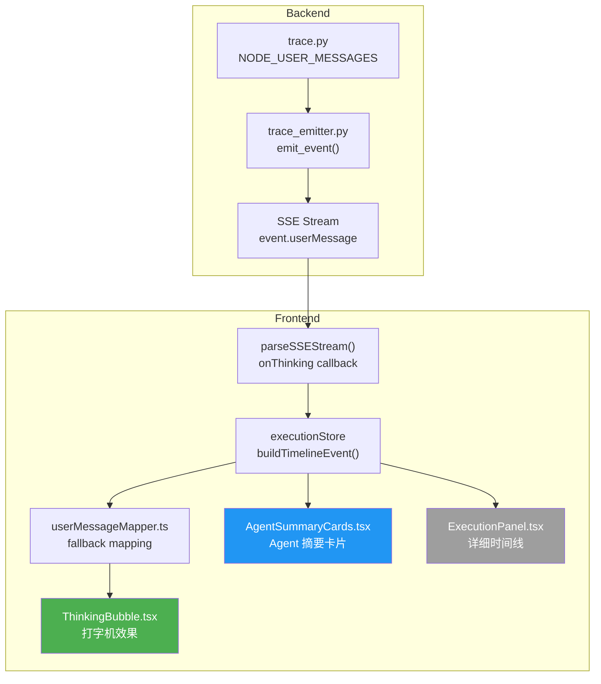
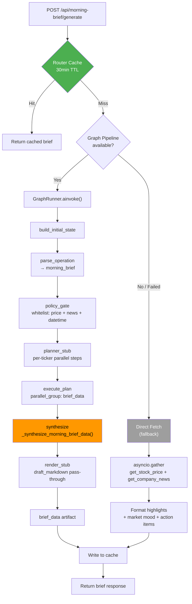
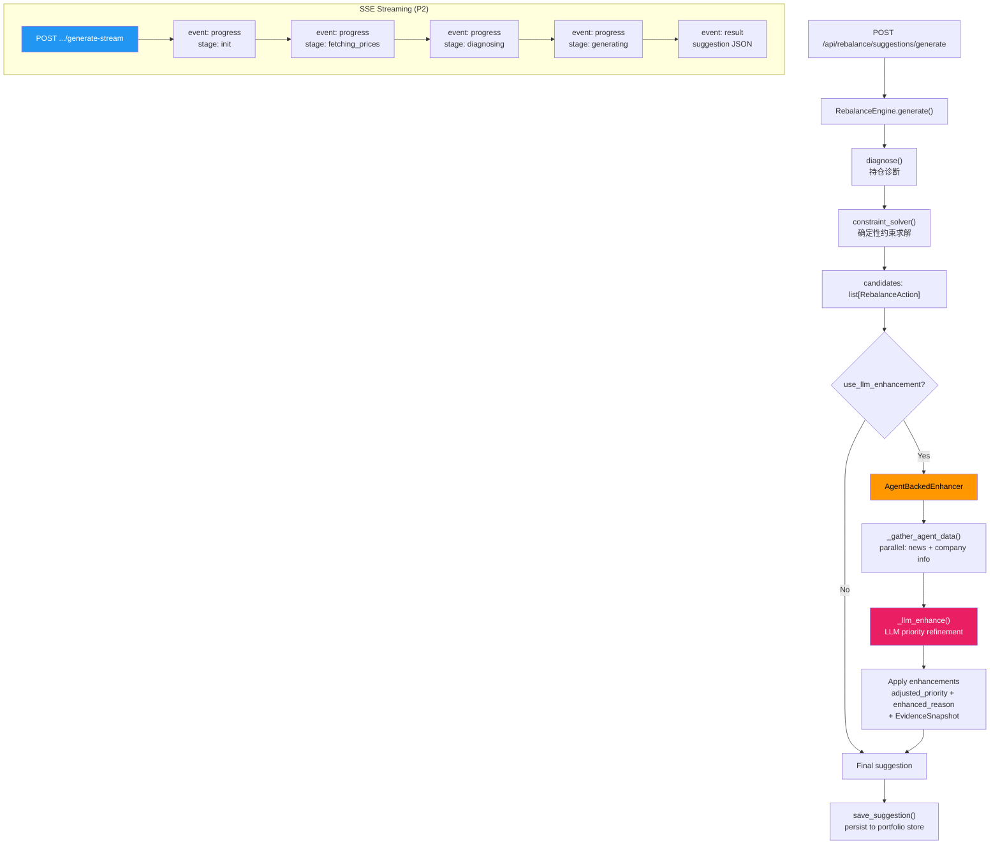

# P0-P2 Quality Orchestration & Productization

> 日期：2026-02-26
> 分支：`feat/p0-p2-quality-orchestration-productization`
> 范围：ThinkingBubble 三层展示 · 晨报 Graph Pipeline 接入 · 调仓 LLM 增强

---

## Todolist（16/16 ✅）

### P0: ThinkingBubble 三层展示（8/8）

- [x] P0-1: `backend/graph/trace.py` — 添加 `NODE_USER_MESSAGES` 映射 + `AGENT_DISPLAY_NAMES`
- [x] P0-2: `backend/orchestration/trace_emitter.py` — 注入 `userMessage` 到 SSE 事件
- [x] P0-3: `frontend/src/types/execution.ts` — 添加 `userMessage` 字段到 TimelineEvent
- [x] P0-4: `frontend/src/store/executionStore.ts` — `buildTimelineEvent` 提取 userMessage
- [x] P0-5: `frontend/src/utils/userMessageMapper.ts` — 创建前端回退映射（NEW）
- [x] P0-6: `frontend/src/components/execution/ThinkingBubble.tsx` — 创建思考气泡组件（NEW）
- [x] P0-7: `frontend/src/components/execution/AgentSummaryCards.tsx` — 创建 Agent 摘要卡片（NEW）
- [x] P0-8: `frontend/src/components/execution/ExecutionPanel.tsx` — 增强用户模式展示

### P1: 晨报 Graph Pipeline 接入（6/6）

- [x] P1-1: `backend/graph/nodes/parse_operation.py` — 添加 `morning_brief` 操作识别
- [x] P1-2: `backend/graph/nodes/planner_stub.py` — 添加 morning_brief 计划模板
- [x] P1-3: `backend/graph/nodes/policy_gate.py` — 添加 morning_brief 工具白名单
- [x] P1-4: `backend/graph/nodes/synthesize.py` — 添加 morning_brief 确定性结构化合成
- [x] P1-5: `backend/graph/nodes/render_stub.py` — morning_brief 直通渲染
- [x] P1-6: `backend/api/morning_brief_router.py` + `main.py` — 切换到 Graph Pipeline（带 fallback）

### P2: 调仓 LLM 增强（2/2）

- [x] P2-1: `backend/services/rebalance_llm_enhancer.py` — 创建 AgentBackedEnhancer（NEW）
- [x] P2-2: `backend/api/rebalance_router.py` — 添加 SSE 流式端点 `generate-stream`

---

## 架构决策记录

### ADR-P0: ThinkingBubble 三层展示

**背景**：原始执行面板以程序员视角展示 trace 事件，对普通用户不友好。

**决策**：
1. 后端 `trace.py` 维护 `NODE_USER_MESSAGES` 映射，将内部节点名翻译为用户友好消息
2. `trace_emitter.py` 在每个 SSE 事件中注入 `userMessage` 字段
3. 前端 `userMessageMapper.ts` 作为回退层，确保即使后端未配置也有友好文案
4. `ThinkingBubble.tsx` 以打字机效果展示当前阶段的思考过程
5. `AgentSummaryCards.tsx` 以卡片形式展示各 Agent 的研究摘要

**三层展示架构**：
```
Layer 1: ThinkingBubble — 实时思考气泡（打字机效果）
Layer 2: AgentSummaryCards — Agent 摘要卡片（完成后展示）
Layer 3: ExecutionPanel Timeline — 详细时间线（可展开）
```

### ADR-P1-001: 晨报使用确定性合成（非 LLM）

**决策**：晨报合成在 `synthesize.py` 中使用纯确定性逻辑（无 LLM 调用），零 token 成本。

**理由**：晨报数据已由 price/news 工具提供完整结构化数据，不需要 LLM 推理。

### ADR-P1-002: 缓存保留在 Router 层

**决策**：`morning_brief_router.py` 的 30 分钟缓存层保留，Graph Pipeline 仅在 cache miss 时调用。

**理由**：避免重复调用 Graph Pipeline（含 16 节点开销），缓存命中直接返回。

### ADR-P2: 调仓不使用 Graph Pipeline

**决策**：调仓引擎（RebalanceEngine）不接入 LangGraph Pipeline，保持独立路径。

**理由**：
- HC-2 约束：调仓为写操作（suggestion），需要严格 `suggestion_only` 安全模式
- 结构化输出：调仓结果为精确 JSON schema，不需要自然语言合成
- 独立性：调仓引擎可独立演进，不受 Graph Pipeline 变更影响

---

## 架构图

### 1. ThinkingBubble 三层展示数据流



### 2. 晨报 Graph Pipeline 完整流程



### 3. 调仓 LLM 增强路径



---

## 文件变更清单

### 新增文件（3）

| 文件 | 用途 |
|------|------|
| `frontend/src/utils/userMessageMapper.ts` | 前端 userMessage 回退映射 |
| `frontend/src/components/execution/ThinkingBubble.tsx` | 思考气泡组件 |
| `frontend/src/components/execution/AgentSummaryCards.tsx` | Agent 摘要卡片组件 |
| `backend/services/rebalance_llm_enhancer.py` | Agent-backed LLM 增强器 |

### 修改文件（12）

| 文件 | 变更摘要 |
|------|---------|
| `backend/graph/trace.py` | 添加 NODE_USER_MESSAGES + AGENT_DISPLAY_NAMES |
| `backend/orchestration/trace_emitter.py` | 注入 userMessage 到 SSE 事件 |
| `backend/graph/nodes/parse_operation.py` | 添加 morning_brief 操作识别（关键词 + 置信度） |
| `backend/graph/nodes/planner_stub.py` | 添加 morning_brief 计划模板（per-ticker 并行） |
| `backend/graph/nodes/policy_gate.py` | 添加 morning_brief 工具白名单 |
| `backend/graph/nodes/synthesize.py` | 添加 morning_brief 确定性合成逻辑 |
| `backend/graph/nodes/render_stub.py` | 添加 morning_brief draft_markdown 直通 |
| `backend/api/morning_brief_router.py` | 新增 Graph Pipeline 调用路径（带 fallback） |
| `backend/api/rebalance_router.py` | 新增 SSE 流式端点 generate-stream |
| `backend/api/main.py` | 注入 Graph runner + AgentBackedEnhancer |
| `frontend/src/types/execution.ts` | 添加 userMessage 字段 |
| `frontend/src/store/executionStore.ts` | buildTimelineEvent 提取 userMessage |
| `frontend/src/components/execution/ExecutionPanel.tsx` | 增强用户模式展示 |

---

## 关键实现细节

### P0: userMessage 注入链路

```
trace.py NODE_USER_MESSAGES[node_name]
    ↓
trace_emitter.py emit_event(userMessage=...)
    ↓
SSE event { "userMessage": "正在分析价格趋势..." }
    ↓
executionStore.buildTimelineEvent() extracts userMessage
    ↓
userMessageMapper.ts provides fallback if missing
    ↓
ThinkingBubble renders with typewriter effect
```

### P1: morning_brief 操作识别关键词

```python
_MORNING_BRIEF_KEYWORDS = (
    "晨报", "早报", "晨间", "早间", "每日简报", "今日概览",
    "morning brief", "daily brief", "morning report", "daily summary",
    "今日行情", "盘前", "开盘前",
)
```

- 置信度：0.85
- 工具白名单：`get_stock_price`, `get_company_news`, `get_current_datetime`
- 最大 ticker 数：6

### P2: AgentBackedEnhancer 安全机制

1. **LLM 失败回退**：任何阶段失败都返回原始 candidates（不丢失数据）
2. **优先级范围校验**：`max(1, min(5, int(new_priority)))`
3. **Ticker 限制**：最多增强 6 个 actionable ticker
4. **JSON 解析容错**：bracket-finding fallback（`[` ... `]`）
5. **Evidence 追踪**：每个增强操作附带 `EvidenceSnapshot(source="llm_agent_analysis")`
