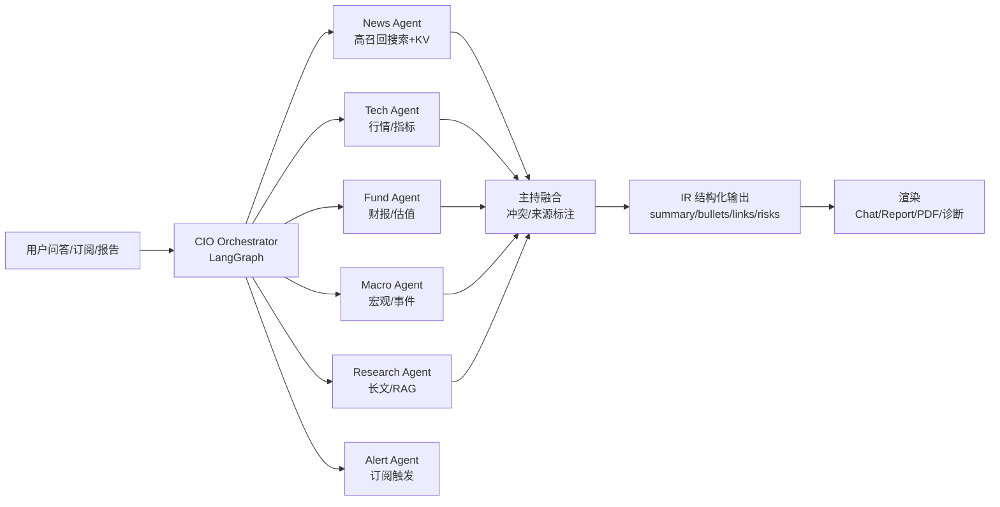

# 2025-12-09 BettaFish → FinSight 多 Agent 落地指北（纠偏版）

参考仓库：https://github.com/666ghj/BettaFish  
目标：在 FinSight 现有「单 Agent + 工具」基础上，引入 BettaFish 的议会式多 Agent、IR 报告链路、高召回搜索与可观测性，纠偏当前数据不稳 / 缓存缺失 / 结构化不足的痛点。

---

## 1. 现状问题（FinSight）
- 单 CIO Agent 绑定大量工具，缺少「谁负责什么」的边界；失败时可观测性弱。
- 工具回退依赖实时源，缺少短缓存 / KV，数据过期判定靠 Agent 主观。
- 回答直接生成长文，缺少 IR（中间表示）与可重放、可折叠的结构化输出。
- DeepSearch/子 Agent 思路零散，触发、TTL、结果复用与前端展示未收敛。

---

## 2. BettaFish 可借鉴的机制
- **Forum/主持人协作**：Query/Media/Insight/Report 并行，主持人融合冲突，保证输出一致性。
- **专属工具池**：每个 Agent 只拿到少量工具 + 专用 Prompt，避免“大杂烩”。
- **高召回搜集 → LLM 摘要**：多源搜索/爬取先聚合证据，再 2-5 句摘要，严格保留 Markdown 链接。
- **IR 报告链路**：ReportEngine 先产出 JSON IR（章节/摘要/链接/风险），校验后再渲染 HTML/PDF。
- **数据采集与预取**：MindSpider 持续爬取热点，降低实时调用压力；失败路径有可读的 skip/fallback 理由。

---

## 3. FinSight 新架构草图

---

## 4. 落地路线（结合当前代码）

### P0（本周止血）
- `backend/tools.py`：统一输出 Schema（data/as_of/source/fallback_used/errors）；按 symbol+period 加 30-60s 短缓存，标记 hard/soft fail。
- `backend/langchain_agent.py`：加 `max_iterations/timeout`，输出结构化字段（observations/risks/reco/data_origin），并在日志打印节点耗时。
- 前端诊断：在 ThinkingProcess/图表旁展示 `data_origin`、`as_of`、`fallback_used`，避免“黑箱”。

### P1（两周：最小多 Agent）
- 新建 `backend/agents/`：`news_agent.py`（Tavily+DDG 并行，强制保留链接）、`tech_agent.py`、`fund_agent.py`、`macro_agent.py`。每个 Agent 仅绑定 2-4 个工具 + 专属 Prompt，输出统一 JSON：`{summary, bullets[], links[], confidence, as_of, source, risks?}`。
- Orchestrator（LangGraph 主图）：在 `backend/conversation/agent.py` 或 `langchain_agent.py` 内拆节点，支持并行子图 + 主持融合（冲突时列出分歧与偏好原因）。
- KV：`kv[key=ticker:field] = {as_of, source, text/ir, links, ttl}`；TTL：news 30-60min、tech 10-30min、fund 12-24h、macro 2-6h。主链路先查 KV，过期则触发子 Agent。

### P2（四周：DeepSearch + IR）
- Research/DeepSearch Agent：当工具空/限流/数据过旧时触发，高召回搜索 + 爬取长文，LLM 只做摘要 + 链接，写入 KV，并可选向量化到 `backend/research/vector_store.py`。
- IR Pipeline：在 CIO 汇总后先生成 IR（summary/bullets/links/risks/next_steps），校验字段完备再渲染最终文本或 PDF，方便前端折叠与复用。
- 前端：新增「摘要 + 链接」展示模式；诊断面板显示「KV 命中/重搜」「触发了哪些子 Agent」。

### P3（后续增强）
- Alert Agent：订阅触发后调用 Orchestrator 仅运行 News/Macro 分支，输出简报邮件（含链接/风险/下一步行动）。
- 数据采集任务：仿 MindSpider，定时抓热门标的新闻/宏观事件写 KV，降低实时请求成本。

---

## 5. 关键实施要点（来自 BettaFish 思路）
- **主持人/Forum 机制**：在 LangGraph 顶层节点做“主持人提示”，要求列出冲突与采纳理由，防止不同子 Agent 结论被淹没。
- **工具专属化与降噪**：子 Agent 工具列表保持极小；Prompt 明确“只返回 N 句摘要 + Markdown 链接，禁止编造”。
- **高召回→轻摘要**：搜索/爬取结果先聚合，摘要长度可控（2-5 句），并保留原文链接数组，写入 KV。
- **IR 校验**：参考 BettaFish `ReportEngine/ir/validator.py` 做字段校验；FinSight 可用 Pydantic/Schema 校验 IR，再渲染。
- **可观测性**：每个节点打印 `source/duration/retry/fail_reason/fallback_used`，并传到前端；失败路径返回可读解释，避免 500。

---

## 6. 验收建议
- 典型请求（如“分析 TSLA”）至少调用 2 个子 Agent，诊断面板可见命中/重搜、耗时、来源。
- 复问同一标的且 TTL 内，直接命中 KV；过期则自动重搜，日志可见。
- 报告/回答具备 IR 结构，前端可折叠“摘要/链接/风险/下一步”。
- 全部高成本源失败时，返回结构化软失败而非 500，并可选触发 DeepSearch 兜底。

---

## 7. 推荐文件落地点
- Agent 侧：`backend/agents/{news,tech,fund,macro,research}_agent.py`，`backend/conversation/agent.py`/`backend/langchain_agent.py`（Orchestrator/主持融合）。
- 工具层：`backend/tools.py`（统一 Schema/缓存/失败标签），`backend/langchain_tools.py`（工具注册）。
- 缓存/RAG：`backend/research/vector_store.py`、`backend/research/deepsearch.py`（可新建），KV 存放在现有缓存层或轻量 store。
- 前端：ThinkingProcess/诊断面板、聊天气泡链接展示、图表旁 `data_origin/as_of` 提示。

---

下一步建议：先按 P0 完成工具 Schema + 缓存 + 日志，再切 P1 做最小多 Agent 与 KV，最后接入 IR 校验与 DeepSearch，避免一次性大改难以回归。***
