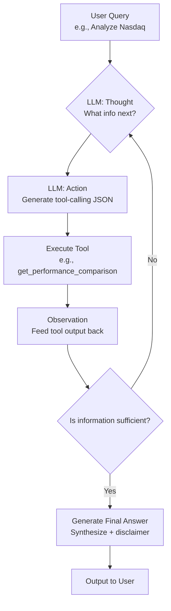

# FinSight: AI-Powered Stock Analysis Agent

[English Version](./readme.md) | [中文版](./readme_cn.md)
[example](./example.md)
## Core Concept

FinSight is an intelligent agent powered by a Large Language Model (LLM) for real-time stock and market analysis. It leverages the **ReAct (Reasoning + Acting)** framework to autonomously gather data by calling tools like `yfinance` and web search, ultimately synthesizing a structured analytical report.

-   **Use Cases**: Quickly get a comprehensive overview of a stock, index, or market trend. For example: "Analyze NVDA stock" or "How has the Nasdaq performed recently?".
-   **Core Advantages**: Features autonomous reasoning, real-time data retrieval, and a modular tool design. It can easily switch between different models like Gemini and OpenAI via the LiteLLM proxy.
-   **Simple Setup**: Just clone the repository, create a virtual environment, install dependencies, and set up your API key to run it from the command line.
-   **Limitations**: Analysis relies on public, free APIs, so data may have slight delays. The project does not provide real-time trading capabilities.

---

## How It Works (The ReAct Framework)

FinSight works by simulating the thought process of a financial analyst. It follows a "Thought -> Action -> Observation" loop until it has gathered enough information to answer the user's query.



---

## Quick Start

1.  **Clone the Repository**:
    ```bash
    git clone https://github.com/kkkano/FinSight-main.git
    cd FinSight-main
    ```

2.  **Create and Activate a Virtual Environment**:
    *   **Linux/macOS**:
        ```bash
        python3 -m venv .venv && source .venv/bin/activate
        ```
    *   **Windows**:
        ```bash
        python -m venv .venv && .\.venv\Scripts\activate
        ```
        
3.  **Install Dependencies**:
    ```bash
    pip install -r requirements.txt
    pip install -r requirements.txt -i https://mirrors.aliyun.com/pypi/simple/
    ```

4.  **Configure API Keys**:
    Create a file named `.env` in the project's root directory and add your API key:
    ```env
    GEMINI_PROXY_API_KEY="your_gemini_api_key_here"
    ```

5.  **Run the Agent**:
    ```bash
    python main.py
    ```
    Once started, enter your query (e.g., "Analyze AAPL") or type "exit" to quit.

---

## Execution Example: Analyzing "Nasdaq"

Here is a complete walkthrough of FinSight's thought and execution process when handling the user query "Nasdaq".

**User Input:**
```
> Nasdaq
```

---

#### Step 1: Get Current Date

-   **Thought**: I need to get the current date and time to ensure the analysis is timely.
-   **Action**: Call the `get_current_datetime` tool.
-   **Result**: `2025-10-12 20:09:11`

*This step ensures all subsequent data analysis is based on the most current time.*

---

#### Step 2: Search for Nasdaq Overview

-   **Thought**: I have the current date. Now I need to understand the basics of the Nasdaq Composite index.
-   **Action**: Call the `search` tool with the query `"Nasdaq composite index overview"`.
-   **Result**:
    > Search Results:
    > 1.  **Wikipedia Nasdaq Composite**: The Nasdaq Composite (ticker symbol ^IXIC) is a stock market index that includes almost all stocks listed on the Nasdaq stock exchange...

*This step confirms the subject of analysis (^IXIC) and its definition, laying the groundwork for subsequent data retrieval.*

---

#### Step 3: Compare Performance with Other Indices

-   **Thought**: To better evaluate the Nasdaq's performance, I should compare it against other major market indices.
-   **Action**: Call the `get_performance_comparison` tool to compare `^IXIC` (Nasdaq), `^GSPC` (S&P 500), and `^DJI` (Dow Jones).
-   **Result**:

| Index | Current Value | Year-to-Date (YTD) | 1-Year Return |
| :--- | :--- | :--- | :--- |
| **Nasdaq Composite** | **22204.43** | **+15.16%** | **+21.05%** |
| S&P 500 | 6552.51 | +11.65% | +12.68% |
| Dow Jones Indu. | 34890.12 | +7.28% | +6.10% |

*The data shows that the Nasdaq significantly outperforms the S&P 500 and Dow Jones in both YTD and 1-year returns, reflecting the strong momentum in the tech sector.*

---

#### Step 4: Analyze Historical Drawdowns

-   **Thought**: Strong growth often comes with high volatility. I need to analyze the Nasdaq's historical drawdowns to uncover its risk profile.
-   **Action**: Call the `analyze_historical_drawdowns` tool for `^IXIC`.
-   **Result**:
    > **Top 3 Historical Drawdowns for ^IXIC:**
    > 1.  **2000 Crash (Dot-com Bubble)**: Max Drawdown **-77.93%** | Recovery: 5518 days (~15.1 years)
    > 2.  **1973 Crash (Oil Crisis)**: Max Drawdown **-59.90%** | Recovery: 2063 days (~5.6 years)
    > 3.  **2021 Crash (Rate Hikes)**: Max Drawdown **-36.40%** | Recovery: 829 days (~2.3 years)

*Historical data clearly shows the Nasdaq's high-risk nature, especially during market bubble bursts, where recovery can take an extremely long time.*

---

#### Step 5: Generate Final Analysis Report

-   **Thought**: I have gathered the definition, recent performance, peer comparison, and historical risks for the Nasdaq. I can now generate a comprehensive analysis.
-   **Final Answer**:

    > The Nasdaq Composite Index (^IXIC) is a market index dominated by technology and growth-oriented companies.
    >
    > **Recent Performance (as of Oct 12, 2025):**
    > It has shown very strong performance, with a year-to-date gain of **+15.16%** and a 1-year return of **+21.05%**. This significantly outpaces both the S&P 500 and the Dow Jones, indicating high investor enthusiasm for the technology and innovation sectors.
    >
    > **Historical Risk:**
    > However, high returns come with high risk. History shows that the Nasdaq is highly volatile during market crises. The most notable example is the dot-com bubble burst in 2000, where the index plummeted nearly **78%** and took over 15 years to fully recover.
    >
    > **Summary:**
    > The Nasdaq is currently in a strong uptrend, but investors must be mindful of its inherent volatility. History serves as a reminder that while chasing high growth, risk management is paramount.
    >
    > *Disclaimer: This analysis does not constitute financial advice.*

---

## Project Structure

-   `agent.py`: The core ReAct loop, responsible for parsing the LLM's thoughts and actions.
-   `tools.py`: Definitions for all financial tools (e.g., `get_stock_price`).
-   `llm_service.py`: A wrapper for making calls to the LiteLLM proxy.
-   `main.py`: The command-line entry point for the project.
-   `requirements.txt`: A list of project dependencies.
-   `.env`: Stores API keys.