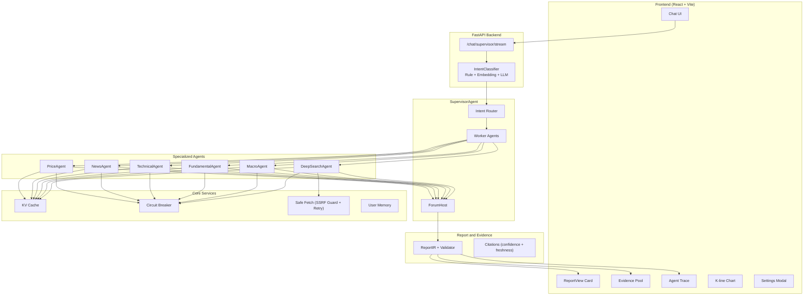
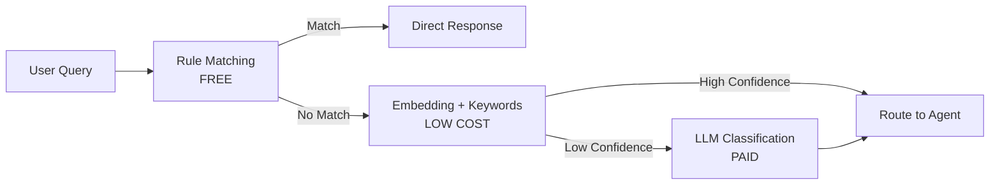
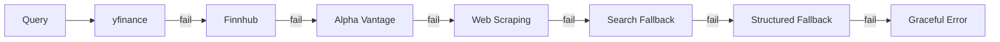

# FinSight AI - Multi-Agent Financial Intelligence Platform

[](https://github.com/langchain-ai/langchain)
[](https://github.com/langchain-ai/langgraph)
[](https://www.python.org/)
[](https://react.dev/)
[](https://www.typescriptlang.org/)
[](./LICENSE)

**English Version** | [Chinese Docs](./readme_cn.md) | [Docs](./docs/)

---

## Overview

FinSight AI is a conversational, multi-agent financial research assistant that combines:

- Supervisor Agent architecture: intent classification + worker agent coordination + forum synthesis
- 6 specialized agents: Price, News, Technical, Fundamental, Macro, DeepSearch
- FastAPI backend + LangChain + LangGraph orchestration
- React + TypeScript + Tailwind frontend with professional report cards
- Real-time market data with multi-source fallback (yfinance, Finnhub, Alpha Vantage, etc.)

The goal is to feel like talking to a Chief Investment Officer who can quickly pull data, run analysis playbooks, and produce professional-grade investment reports.

---

## Key Features

### Multi-Agent Supervisor Architecture
```
User Query -> IntentClassifier (Rule + Embedding + LLM) -> SupervisorAgent
                                                        |
             +------------------------------------------+----------------------------------+
             | Worker Agents (Parallel Execution)                                          |
             | - PriceAgent (real-time quotes)                                              |
             | - NewsAgent (news + sentiment)                                               |
             | - TechnicalAgent (indicators)                                               |
             | - FundamentalAgent (financials)                                             |
             | - MacroAgent (economic data)                                                |
             | - DeepSearchAgent (web research)                                            |
             +-----------------------------------------------------------------------------+
                                                        |
                                   ForumHost (synthesis + confidence scoring)
                                                        |
                         ReportIR (citations + confidence + freshness)
                                                        |
                     Frontend ReportView (evidence pool + trace drill-down)
```

### Professional Report Generation
- 8-section analysis reports: Executive Summary, Market Position, Fundamental Analysis, Macro and Catalysts, Risk Assessment, Investment Strategy, Scenario Analysis, Monitoring Events
- Agent contribution tracking: see which agent provided each insight
- Evidence pool with citation confidence and freshness metadata
- ReportIR schema validation for citations (confidence and freshness)
- ReportSection carries section-level confidence/agent attribution/data sources
- PlanIR + Executor for step-level planning and execution trace
- EvidencePolicy enforces citation validity and coverage thresholds
- Structured News and Macro fallbacks keep downstream analysis stable
- get_company_news returns structured items; handlers format for display
- Safe DeepSearch retrieval with SSRF guard and HTTP retry
- Dynamic DeepSearch query templates driven by intent keywords
- DataContext summaries capture per-source as_of/currency/adjustment and flag inconsistencies
- BudgetManager enforces max tools / rounds / time with budget snapshots in responses
- Security gate (API Key + rate limiting) and footer disclaimer template ensure compliance
- SearchConvergence module for info gain scoring, content deduplication, and stop conditions
- TraceEvent Schema v1 with versioned event format (event_type/duration/metadata)
- Supervisor stream normalizes trace output to v1 for all agent outputs and plan traces
- Regression testing framework with 25 baseline cases and automated comparison reports

### Smart Intent Classification
- 3-layer hybrid system: rule matching -> embedding similarity -> LLM fallback
- NEWS sub-intent: distinguishes fetch news vs analyze news impact
- Cost efficient: simple queries handled by rules with no LLM cost
- Report intent rules cover “analyze/分析” with ticker context (no LLM required)

### Real-time Streaming and Transparency
- Token-by-token streaming responses
- Interactive K-line charts with full-screen mode
- Agent trace drill-down with expandable steps
- Portfolio snapshot with editable holdings

### Alert and Subscription System
- Price alerts: email notifications when price changes exceed thresholds
- News alerts: daily news digests for watched stocks
- Background schedulers with APScheduler

---

## Architecture

### System Architecture



### Intent Classification Flow



### Data Fallback Strategy



---

## Available Tools

| Tool | Description | Data Sources |
|------|-------------|--------------|
| `get_stock_price` | Real-time quote with fallback | yfinance -> Finnhub -> Alpha Vantage -> Web |
| `get_company_info` | Company fundamentals | yfinance |
| `get_company_news` | Latest headlines (structured list) | Reuters RSS + Bloomberg RSS + Finnhub |
| `search` | Web search | Exa -> Tavily -> Wikipedia -> DuckDuckGo |
| `get_market_sentiment` | Fear and Greed index | CNN |
| `get_economic_events` | Macro calendar | Exa search |
| `get_financial_statements` | Income, balance, cash flow | yfinance |
| `get_key_metrics` | PE, ROE, margins | yfinance + calculated |
| `analyze_historical_drawdowns` | Drawdown analysis | yfinance |
| `get_performance_comparison` | Multi-ticker comparison | yfinance |

---

## Quick Start

### 1. Backend (FastAPI)

```bash
# Create virtual environment
python -m venv .venv
source .venv/bin/activate  # Windows: .venv\Scripts\activate

# Install dependencies
pip install -r requirements.txt

# Configure environment
cp .env.example .env
# Edit .env with your API keys
# Optional: frontend Settings Modal writes `user_config.json` (overrides .env for LLM)

# Start server
python -m uvicorn backend.api.main:app --host 0.0.0.0 --port 8000 --reload
```

### 2. Frontend (React + Vite)

```bash
cd frontend
npm install
npm run dev
```

Open `http://localhost:5173` in your browser.

### 3. Health Check

```bash
curl http://localhost:8000/health
# {"status": "healthy"}
```

### 4. Testing

```bash
pytest backend/tests -q
```

---

## Environment Variables

```env
# LLM Configuration
GEMINI_PROXY_API_KEY=your_key
GEMINI_PROXY_API_BASE=https://your-proxy/v1

# Financial Data APIs (recommended)
ALPHA_VANTAGE_API_KEY=...
FINNHUB_API_KEY=...
TIINGO_API_KEY=...
TAVILY_API_KEY=...
EXA_API_KEY=...

# Email Alerts
SMTP_SERVER=smtp.gmail.com
SMTP_PORT=587
SMTP_USER=your_email@gmail.com
SMTP_PASSWORD=your_app_password
EMAIL_FROM=FinSight <your_email@gmail.com>

# Scheduler
PRICE_ALERT_SCHEDULER_ENABLED=true
PRICE_ALERT_INTERVAL_MINUTES=15
NEWS_ALERT_SCHEDULER_ENABLED=true
NEWS_ALERT_INTERVAL_MINUTES=30

# LangSmith (optional)
LANGSMITH_API_KEY=...
LANGSMITH_PROJECT=FinSight
ENABLE_LANGSMITH=false

# Quality & Guardrails
DATA_CONTEXT_MAX_SKEW_HOURS=24
BUDGET_MAX_TOOL_CALLS=24
BUDGET_MAX_ROUNDS=12
BUDGET_MAX_SECONDS=120
CHAT_HISTORY_MAX_MESSAGES=12
CACHE_JITTER_RATIO=0.1
CACHE_NEGATIVE_TTL=60
PRICE_CB_FAILURE_THRESHOLD=5
PRICE_CB_RECOVERY_TIMEOUT=60
NEWS_CB_FAILURE_THRESHOLD=3
NEWS_CB_RECOVERY_TIMEOUT=180
LOG_LEVEL=INFO

# Security Gate
API_AUTH_ENABLED=false
API_AUTH_KEYS=
RATE_LIMIT_ENABLED=false
RATE_LIMIT_PER_MINUTE=120
RATE_LIMIT_WINDOW_SECONDS=60
```

LLM config precedence:
- `user_config.json` (if present, saved from UI) overrides `.env`
- `.env` provides default provider/model/api_base/api_key

---

## Observability

- `GET /health` basic health check
- `GET /metrics` Prometheus metrics (requires `prometheus-client`)
- `GET /diagnostics/orchestrator` orchestrator stats
- `GET /diagnostics/langgraph` report agent diagnostics

## Project Structure

```
FinSight/
|-- backend/
|   |-- agents/
|   |   |-- base_agent.py
|   |   |-- price_agent.py
|   |   |-- news_agent.py
|   |   |-- technical_agent.py
|   |   |-- fundamental_agent.py
|   |   |-- macro_agent.py
|   |   |-- deep_search_agent.py
|   |-- orchestration/
|   |   |-- supervisor_agent.py
|   |   |-- intent_classifier.py
|   |   |-- forum.py
|   |-- report/
|   |   |-- ir.py
|   |   |-- validator.py
|   |-- services/
|   |   |-- cache.py
|   |   |-- circuit_breaker.py
|   |   |-- memory.py
|   |-- api/
|   |   |-- main.py
|   |-- langchain_tools.py
|   |-- legacy/
|   |   |-- streaming_support.py
|   |-- tools/
|   |   |-- search.py
|   |   |-- news.py
|   |   |-- price.py
|   |   |-- financial.py
|   |   |-- macro.py
|   |   |-- web.py
|-- frontend/
|   |-- src/
|   |   |-- components/
|   |   |   |-- ReportView.tsx
|   |   |   |-- ThinkingProcess.tsx
|   |   |   |-- RightPanel.tsx
|   |   |   |-- Sidebar.tsx
|   |   |-- store/useStore.ts
|   |   |-- api/client.ts
|-- docs/
|   |-- archive/
|   |-- plans/
|   |-- reports/
|   |-- design/
|-- images/
```

---

## Status

> Last Updated: 2026-01-23 | Version: 0.6.5

### Current Progress

| Module | Progress | Notes |
|--------|----------|-------|
| Tools Layer | 100% | Multi-source fallback, caching, circuit breaker |
| Agent Layer | 100% | 6 agents + structured fallbacks |
| Orchestration | 100% | Supervisor + Forum + streaming |
| Report Card | 100% | Evidence metadata and citation validation |
| Transparency | 90% | Trace drill-down and diagnostics |
| Alert System | 90% | Price and news alerts |

### Known Issues

| Issue | Severity | Status |
|-------|----------|--------|
| RAG not integrated with DeepSearch | Medium | Planned |
| RiskAgent not implemented | Medium | Phase 3 |
| Mobile responsive needs work | Low | Backlog |

---

## Roadmap

### Completed (v0.6.x)
- [x] Multi-Agent Supervisor architecture
- [x] 8-section professional reports
- [x] NEWS sub-intent classification
- [x] Evidence metadata (confidence + freshness)
- [x] Structured News/Macro fallbacks
- [x] DeepSearch SSRF guard and retry
- [x] Dynamic DeepSearch query templates
- [x] Portfolio snapshot with holdings input
- [x] Full-screen K-line charts

### In Progress
- [ ] RAG integration with DeepSearch
- [ ] User long-term memory (vector store)

### Planned (v0.7.x)
- [ ] RiskAgent (VaR, position sizing)
- [ ] Portfolio analysis
- [ ] Multi-language support
- [ ] Mobile responsive design

---

## Contributing

Contributions are welcome. Please read our contributing guidelines before submitting PRs.

### Contributors

- Human Developer - Architecture, Frontend, Backend
- Claude (Anthropic) - Code assistance, Documentation

---

## License

MIT License - see [LICENSE](./LICENSE) for details.

---

## Acknowledgments

- [LangChain](https://github.com/langchain-ai/langchain) - LLM framework
- [LangGraph](https://github.com/langgraph-ai/langgraph) - Agent orchestration
- [yfinance](https://github.com/ranaroussi/yfinance) - Market data
- [ECharts](https://echarts.apache.org/) - Charting library
