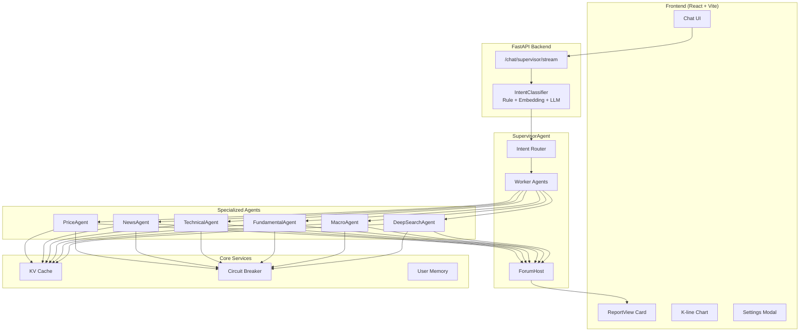
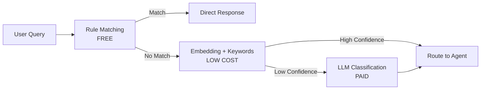
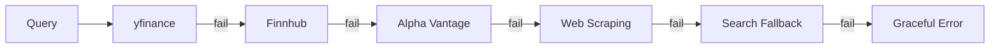

# FinSight AI – Multi-Agent Financial Intelligence Platform

[](https://github.com/langchain-ai/langchain)
[](https://github.com/langchain-ai/langgraph)
[](https://www.python.org/)
[](https://react.dev/)
[](https://www.typescriptlang.org/)
[](./LICENSE)

**[English Version](./readme.md)** | [中文文档](./readme_cn.md) | [Docs](./docs/)

---

## Overview

FinSight AI is a **conversational, multi-agent financial research assistant** that combines:

- **Supervisor Agent Architecture**: Intent classification + Worker Agent coordination + Forum synthesis
- **6 Specialized Agents**: Price, News, Technical, Fundamental, Macro, DeepSearch
- **FastAPI Backend** + LangChain + LangGraph for orchestration
- **React + TypeScript + Tailwind** frontend with professional report cards
- **Real-time Market Data** with multi-source fallback (yfinance, Finnhub, Alpha Vantage, etc.)

The goal is to feel like talking to a **Chief Investment Officer** who can quickly pull data, run analysis playbooks, and produce professional-grade investment reports.

---

## Key Features

### Multi-Agent Supervisor Architecture
```
User Query → IntentClassifier (Rule + Embedding + LLM) → SupervisorAgent
                                                              ↓
                    ┌────────────────────────────────────────────┐
                    │  Worker Agents (Parallel Execution)        │
                    │  ├── PriceAgent (real-time quotes)         │
                    │  ├── NewsAgent (news + sentiment)          │
                    │  ├── TechnicalAgent (indicators)           │
                    │  ├── FundamentalAgent (financials)         │
                    │  ├── MacroAgent (economic data)            │
                    │  └── DeepSearchAgent (web research)        │
                    └────────────────────────────────────────────┘
                                                              ↓
                              ForumHost (Synthesis + Confidence Scoring)
                                                              ↓
                              ReportIR → Frontend ReportView Card
```

### Professional Report Generation
- **8-Section Analysis Reports**: Executive Summary, Market Position, Fundamental Analysis, Macro & Catalysts, Risk Assessment, Investment Strategy, Scenario Analysis, Monitoring Events
- **Agent Contribution Tracking**: See which Agent provided each insight
- **Confidence Scoring**: AI confidence level with evidence sources
- **Citation Links**: Click to view original sources

### Smart Intent Classification
- **3-Layer Hybrid System**: Rule matching → Embedding similarity → LLM fallback
- **NEWS Sub-intent**: Distinguishes "fetch news" vs "analyze news impact"
- **Cost Efficient**: Simple queries handled by rules, no LLM cost

### Real-time Streaming & Visualization
- **Token-by-token Streaming**: ChatGPT-like typewriter effect
- **Interactive K-line Charts**: Full-screen modal with multiple timeframes
- **Agent Progress Indicators**: Real-time execution status

### Alert & Subscription System
- **Price Alerts**: Email notifications when price changes exceed threshold
- **News Alerts**: Daily news digest for watched stocks
- **Background Schedulers**: APScheduler with configurable intervals

---

## UI Screenshots

### Deep Research Report Card
*Complete 8-section investment analysis with Agent status tracking, confidence scoring, and citation links*


### Report Sections & Evidence Panel
*Expandable sections with ForumHost synthesis, chapter navigation, and source citations*


### Full-Screen K-line Chart Modal
*Interactive candlestick chart with multiple timeframes (24h, 1M, 3M, 6M, 1Y, 2Y, 5Y, All) and OHLC tooltip*


### Price Alert Email Notification
*Automated email notification when stock price moves beyond configured threshold*


### News Alert Email Digest
*Daily/scheduled news digest with headlines, sources, and direct links*


---

## Architecture

### System Architecture



### Intent Classification Flow



### Data Fallback Strategy



---

## Available Tools

| Tool | Description | Data Sources |
|------|-------------|--------------|
| `get_stock_price` | Real-time quote with fallback | yfinance → Finnhub → Alpha Vantage → Web |
| `get_company_info` | Company fundamentals | yfinance |
| `get_company_news` | Latest headlines | Reuters RSS + Bloomberg RSS + Finnhub |
| `search` | Web search | Exa → Tavily → Wikipedia → DuckDuckGo |
| `get_market_sentiment` | Fear & Greed index | CNN |
| `get_economic_events` | Macro calendar | Exa search |
| `get_financial_statements` | Income/Balance/Cash flow | yfinance |
| `get_key_metrics` | PE, ROE, Margins | yfinance + calculated |
| `analyze_historical_drawdowns` | Drawdown analysis | yfinance |
| `get_performance_comparison` | Multi-ticker comparison | yfinance |

---

## Quick Start

### 1. Backend (FastAPI)

```bash
# Create virtual environment
python -m venv .venv
source .venv/bin/activate  # Windows: .venv\Scripts\activate

# Install dependencies
pip install -r requirements.txt

# Configure environment
cp .env.example .env
# Edit .env with your API keys

# Start server
python -m uvicorn backend.api.main:app --host 0.0.0.0 --port 8000 --reload
```

### 2. Frontend (React + Vite)

```bash
cd frontend
npm install
npm run dev
```

Open `http://localhost:5173` in your browser.

### 3. Health Check

```bash
curl http://localhost:8000/health
# {"status": "healthy"}
```

---

## Environment Variables

```env
# LLM Configuration
GEMINI_PROXY_API_KEY=your_key
GEMINI_PROXY_API_BASE=https://your-proxy/v1

# Financial Data APIs (recommended)
ALPHA_VANTAGE_API_KEY=...
FINNHUB_API_KEY=...
TIINGO_API_KEY=...
TAVILY_API_KEY=...
EXA_API_KEY=...

# Email Alerts
SMTP_SERVER=smtp.gmail.com
SMTP_PORT=587
SMTP_USER=your_email@gmail.com
SMTP_PASSWORD=your_app_password
EMAIL_FROM=FinSight <your_email@gmail.com>

# Scheduler
PRICE_ALERT_SCHEDULER_ENABLED=true
PRICE_ALERT_INTERVAL_MINUTES=15
NEWS_ALERT_SCHEDULER_ENABLED=true
NEWS_ALERT_INTERVAL_MINUTES=30

# LangSmith (optional)
LANGSMITH_API_KEY=...
LANGSMITH_PROJECT=FinSight
ENABLE_LANGSMITH=false
```

---

## Project Structure

```
FinSight/
├── backend/
│   ├── agents/                 # Specialized Agents
│   │   ├── base_agent.py       # BaseFinancialAgent
│   │   ├── price_agent.py      # Real-time quotes
│   │   ├── news_agent.py       # News + sentiment
│   │   ├── technical_agent.py  # Technical indicators
│   │   ├── fundamental_agent.py# Financial analysis
│   │   ├── macro_agent.py      # Macro economics
│   │   └── deep_search_agent.py# Web research
│   ├── orchestration/
│   │   ├── supervisor_agent.py # Main coordinator
│   │   ├── intent_classifier.py# Intent classification
│   │   └── forum.py            # Agent synthesis
│   ├── services/
│   │   ├── cache.py            # KV cache
│   │   ├── circuit_breaker.py  # Fault tolerance
│   │   └── memory.py           # User profiles
│   ├── api/
│   │   └── main.py             # FastAPI endpoints
│   └── tools.py                # Financial tools
├── frontend/
│   └── src/
│       ├── components/
│       │   ├── ChatList.tsx
│       │   ├── ChatInput.tsx
│       │   ├── ReportView.tsx
│       │   └── ThinkingProcess.tsx
│       └── api/client.ts
├── docs/
│   ├── 01_ARCHITECTURE.md
│   ├── PROJECT_STATUS.md
│   ├── ROADMAP.md
│   └── TECHNICAL_QNA.md
└── images/                     # Screenshots
```

---

## Status

> **Last Updated**: 2026-01-13 | **Version**: 0.6.3

### Current Progress

| Module | Progress | Notes |
|--------|----------|-------|
| **Tools Layer** | ✅ 100% | Multi-source fallback, caching, circuit breaker |
| **Agent Layer** | ✅ 100% | All 6 agents operational |
| **Orchestration** | ✅ 100% | Supervisor + Forum + Streaming |
| **Report Card** | ✅ 100% | 8-section professional reports |
| **Intent Classification** | ✅ 100% | 3-layer hybrid + NEWS sub-intent |
| **Alert System** | ✅ 90% | Price + News alerts working |

### Known Issues

| Issue | Severity | Status |
|-------|----------|--------|
| RAG not integrated with DeepSearch | Medium | Planned |
| RiskAgent not implemented | Medium | Phase 3 |
| Mobile responsive needs work | Low | Backlog |

---

## Roadmap

### Completed (v0.6.x)
- [x] Multi-Agent Supervisor Architecture
- [x] 8-Section Professional Reports
- [x] NEWS Sub-intent Classification
- [x] Real-time Streaming Output
- [x] Email Alert System
- [x] Full-screen K-line Charts

### In Progress
- [ ] RAG Integration with DeepSearch
- [ ] User Long-term Memory (Vector Store)

### Planned (v0.7.x)
- [ ] RiskAgent (VaR, Position Sizing)
- [ ] Portfolio Analysis
- [ ] Multi-language Support
- [ ] Mobile Responsive Design

---

## Contributing

Contributions are welcome! Please read our contributing guidelines before submitting PRs.

### Contributors

- **Human Developer** - Architecture, Frontend, Backend
- **Claude (Anthropic)** - Code assistance, Documentation

---

## License

MIT License - see [LICENSE](./LICENSE) for details.

---

## Acknowledgments

- [LangChain](https://github.com/langchain-ai/langchain) - LLM framework
- [LangGraph](https://github.com/langchain-ai/langgraph) - Agent orchestration
- [yfinance](https://github.com/ranaroussi/yfinance) - Market data
- [ECharts](https://echarts.apache.org/) - Charting library
