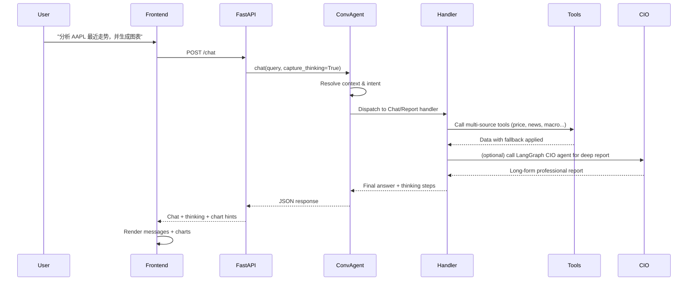
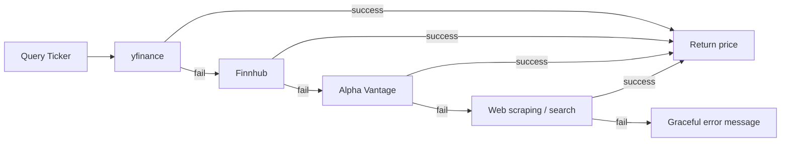

# FinSight AI – Conversational Market Intelligence Agent

[](https://github.com/langchain-ai/langchain)
[](https://github.com/langchain-ai/langgraph)
[](https://www.python.org/)
[](https://react.dev/)
[](https://www.typescriptlang.org/)

[English Version](./readme.md) | [中文文档](./readme_cn.md) | [Docs](./docs/)

---

## 🚀 Overview

FinSight AI is a **conversational, tool‑calling financial research assistant**.  
It combines a FastAPI backend, a LangGraph‑powered CIO agent, and a modern React + TypeScript frontend:

- Multi‑turn chat interface, optimized for equity and index analysis.
- LangGraph agent that calls structured **LangChain tools** for prices, fundamentals, news, macro data, and risk metrics.
- Dual‑panel UI: left‑side chat, right‑side market visualization (auto‑expands when charts are requested).
- Theme + layout controls (dark/light, centered vs full‑width), and PDF export for conversations.

The goal is to feel like talking to a **Chief Investment Officer** who can quickly pull data, run a playbook, and produce professional‑grade reports.

---

## ✨ Key Features

- **Conversational CIO Agent**
  - Multi‑turn dialogue with lightweight context management.
  - Intent routing: fast chat vs deep report vs follow‑up.
  - Uses a LangGraph CIO report agent for long‑form analysis.

- **Smart Charting & Visualization**
  - Inline chart tags in responses (e.g. `[CHART:AAPL:line]`).
  - Right‑side `StockChart` panel auto‑expands when a ticker is requested.
  - ECharts‑based visualization (price history, performance, etc.).

- **Multi‑Source Financial Data with Fallback**
  - Tools read from multiple providers (`yfinance`, Finnhub, Alpha Vantage, scraping, search APIs).
  - Each tool is resilient: if one source fails, it falls back to the next.

- **Reasoning Trace**
  - Optional “thinking process” view in the chat UI.
  - Shows intermediate steps, tool calls, and elapsed time.

- **Modern Frontend UX**
  - ChatGPT‑style layout with a fixed header.
  - Theme toggle, layout mode (centered vs full‑width), Settings modal.
  - Conversation export as PDF.

---

## 🧱 Architecture

### System Architecture

```mermaid
flowchart LR
    U[User] --> FE[Frontend (React + TS)]
    FE -->|HTTP / JSON| API[FastAPI Backend]

    subgraph Backend
        API --> AG[ConversationAgent]
        AG --> RT[Router + ContextManager]
        AG --> HD[Handlers (Chat / Report / Followup)]
        HD --> ORC[ToolOrchestrator]
        HD --> CIO[LangGraph CIO Agent\n(LangChainFinancialAgent)]
        ORC --> TOOLS[backend.tools\n+ langchain_tools]
    end

    subgraph Data Sources
        TOOLS --> PX[Prices & OHLCV\nyfinance / APIs]
        TOOLS --> FUND[Fundamentals\ncompany profiles]
        TOOLS --> NEWS[News & Search\nTavily / DDGS / web]
        TOOLS --> MACRO[Macro & Sentiment\nindices / calendars]
    end

    FE <-->|Streaming / Responses| API
```

### Conversational Flow



### Data Fallback Strategy (Simplified)

The `backend.tools` module implements **multi‑source strategies**. Example (price fetch):



Each tool follows a similar pattern: try the cheapest / fastest source first, then fall back while logging failures.

---

## 🛠 Available Tools (LangChain / LangGraph)

The LangGraph CIO agent uses tools defined in `langchain_tools.py`, which wrap implementations in `backend/tools.py`.

| Tool Name                    | Description                                                     |
|-----------------------------|-----------------------------------------------------------------|
| `get_current_datetime`      | Get the current timestamp for anchoring reports.               |
| `get_stock_price`           | Live quote for a ticker or index with multi‑source fallback.   |
| `get_company_info`          | Company fundamentals (industry, cap, profile).                 |
| `get_company_news`          | Latest headlines for a ticker / index.                         |
| `search`                    | Market / macro search (Tavily + DDGS + Wikipedia fallback).    |
| `get_market_sentiment`      | Current market fear/greed sentiment index.                     |
| `get_economic_events`       | Upcoming macro events (FOMC, CPI, payrolls, etc.).            |
| `get_performance_comparison`| YTD / 1Y performance for a labeled set of tickers.            |
| `analyze_historical_drawdowns` | Major drawdowns with depth, duration, recovery stats.     |

> The CIO report agent is encouraged (via its system prompt) to call `get_current_datetime` first, then search + price + news + macro tools, and finally risk tools.

---

## 📦 Requirements

- **Python**: 3.10+  
- **Node.js**: 18+ (for the React frontend)
- See `requirements.txt` for exact Python dependencies (LangChain 1.1, LangGraph 1.0.4, FastAPI 0.122, etc.).

Environment variables (`.env` in project root):

- `GEMINI_PROXY_API_KEY`, `GEMINI_PROXY_API_BASE` – OpenAI‑compatible Gemini proxy used by the LangGraph agent.
- Optional financial data APIs:
  - `ALPHA_VANTAGE_API_KEY`, `FINNHUB_API_KEY`, `TIINGO_API_KEY`, `MARKETSTACK_API_KEY`, etc.
- Optional search / observability:
  - `TAVILY_API_KEY`, `LANGSMITH_API_KEY`, `LANGSMITH_PROJECT`, `ENABLE_LANGSMITH`.

Even with only `GEMINI_PROXY_API_KEY` set, the agent can work using public/anonymous data sources (yfinance, DDGS, Wikipedia), but some tools will be richer when API keys are configured.

---

## ▶️ Running the Project

From repository root:

```bash
# 1. Backend (FastAPI)
python -m venv .venv
source .venv/bin/activate  # Windows: .venv\Scripts\activate
pip install -r requirements.txt

python -m uvicorn backend.api.main:app --host 0.0.0.0 --port 8000 --reload
```

```bash
# 2. Frontend (React + Vite)
cd frontend
npm install
npm run dev
```

Then open Vite’s dev URL (typically `http://localhost:5173`) in a browser.

Once running, you can check backend health via:  
- `http://127.0.0.1:8000/` or `http://127.0.0.1:8000/health` (both return `status: "healthy"` plus a UTC timestamp).

> The Settings panel (LLM and layout) reads and writes `/api/config`, but **layout mode and theme also persist locally** via `localStorage`, so basic layout switching works even when the backend is not reachable.

---

## 💬 Example Usage

### 1. Quick Market Check

> “简单分析一下 AAPL 最近 3 个月的走势，顺便和纳指比较一下表现。”  

Flow:

1. Router classifies this as `chat` + `report` hybrid.
2. Handler calls tools: `get_stock_price`, `get_performance_comparison`, `get_company_news`.
3. CIO agent may be used for a short structured summary.
4. Response includes a narrative plus chart hints; frontend shows the chart in the right panel.

### 2. Deep CIO‑Style Report

> “用专业机构报告的风格，生成一份关于 NVIDIA 的详细投资分析报告，至少 800 字，并给出风险和建议。”  

Flow:

1. ConversationAgent routes to the `ReportHandler`.
2. `ReportHandler` invokes the LangGraph CIO agent (`LangChainFinancialAgent.analyze`).
3. CIO agent calls `get_current_datetime`, `search`, `get_stock_price`, `get_company_info`, `get_company_news`, `get_market_sentiment`, and risk tools as needed.
4. Final response follows the CIO system prompt template (Executive Summary / Macro / Risk / Strategy / Takeaways).

### 3. Follow‑Up Question

> “相比纳指，这样的回撤算严重吗？再帮我看看 2022 年最大的几次跌幅。”  

The context manager resolves references to the previous ticker and timeframe, then routes to the follow‑up handler, which reuses tools (especially `analyze_historical_drawdowns`) and produces incremental analysis instead of a full report.

---

## 📁 Project Structure (Current)

Simplified view of the main directories:

```text
FinSight/
├── backend/
│   ├── api/
│   │   ├── main.py              # FastAPI app (chat, streaming, config, PDF export, stock APIs)
│   │   └── chart_detector.py    # Chart type detection helper
│   ├── conversation/
│   │   ├── agent.py             # ConversationAgent (router + handlers + context)
│   │   ├── context.py           # ContextManager (multi‑turn history)
│   │   └── router.py            # Intent routing (CHAT / REPORT / FOLLOWUP / ALERT / CLARIFY ...)
│   ├── handlers/                # Chat / report / follow‑up handlers
│   ├── orchestration/           # ToolOrchestrator and tool bridge
│   ├── services/                # PDF export, email subscription, etc.
│   ├── tests/                   # Backend tests
│   ├── tools.py                 # Core financial tools with fallback logic
│   └── langchain_agent.py       # LangGraph CIO agent (LangChainFinancialAgent)
│
├── frontend/
│   ├── src/
│   │   ├── App.tsx              # Main layout (chat + chart panels, header)
│   │   ├── api/client.ts        # Axios client for FastAPI
│   │   ├── components/
│   │   │   ├── ChatList.tsx
│   │   │   ├── ChatInput.tsx
│   │   │   ├── StockChart.tsx
│   │   │   ├── InlineChart.tsx
│   │   │   ├── SettingsModal.tsx
│   │   │   └── ThinkingProcess.tsx
│   │   └── store/useStore.ts    # Zustand store (messages, theme, layoutMode, currentTicker)
│   └── ...                      # Vite config, assets, Tailwind config
│
├── docs/                        # Design docs, blueprints, logs
│   ├── CONVERSATIONAL_AGENT_BLUEPRINT_V3.md
│   ├── Future_Blueprint_CN.md
│   ├── DATA_SOURCES_ADDED.md
│   ├── API_KEYS_CONFIGURED.md
│   └── ...
│
├── test/                        # High‑level tests (e.g. LangGraph agent)
├── archive/                     # Legacy agents/tools/tests kept for reference
├── langchain_tools.py           # LangChain tool registry used by LangGraph
├── streaming_support.py         # Streaming utilities (planned integration)
├── requirements.txt             # Python dependencies
└── readme*.md                   # This documentation (EN/CN)
```

---

## 🔁 Rollback & Compatibility Strategy

- **Legacy agent and tools are archived but kept** under `archive/` to make rollback easy.
- `backend.tools` functions are still usable directly and are wrapped by `langchain_tools` for LangGraph.
- The ConversationAgent interface (`agent.chat(...)`) remains stable, so the frontend can keep calling the same `/chat` endpoint even as internal implementations evolve.
- The new LangGraph CIO agent is injected as the report engine inside `ConversationAgent`, so you can:
  - Temporarily disable it and fall back to a simpler report generator.
  - Or extend it with more tools without changing the HTTP API.

---

## 🧪 Testing

Basic backend tests (including the LangGraph agent) live under `test/` and `backend/tests/`:

```bash
python -m pytest
```

You can also add focused tests for tools and handlers to keep the agent’s behavior stable as you iterate on prompts and tools.

---

## 📌 Status

- **Backend**: FastAPI + ConversationAgent + LangGraph CIO agent in production use.  
- **Frontend**: React + TS + Tailwind, dual‑panel layout with theme/layout controls and PDF export.  
- **Docs**: See `docs/Future_Blueprint_CN.md` and the new execution blueprint for upcoming multi‑agent and DeepSearch features.
