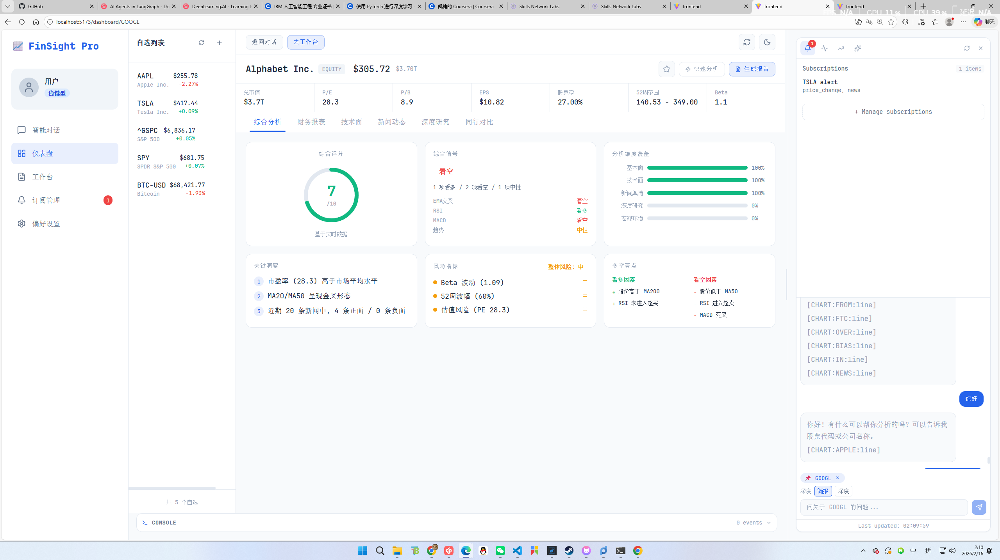
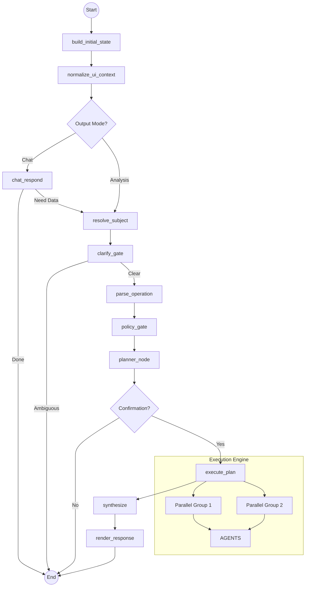
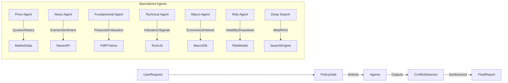
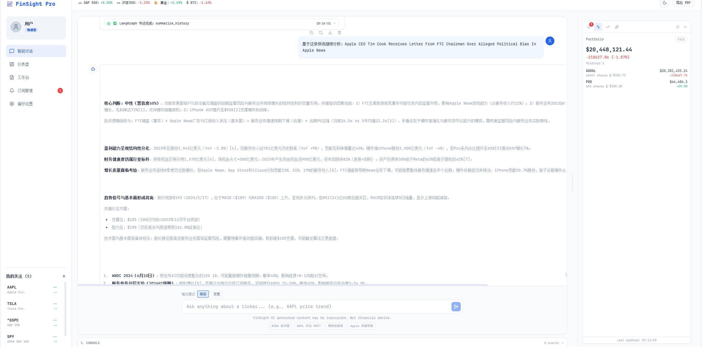
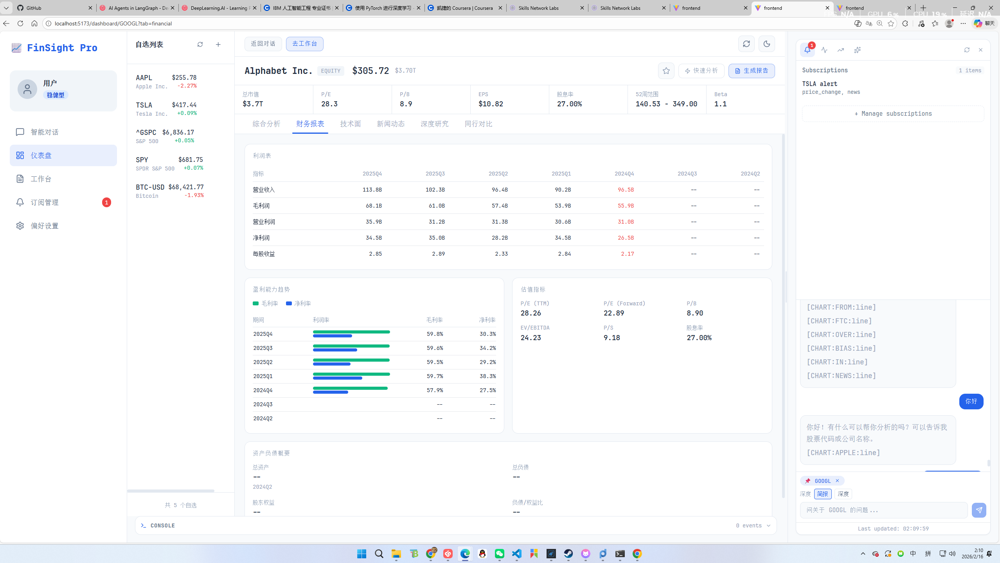
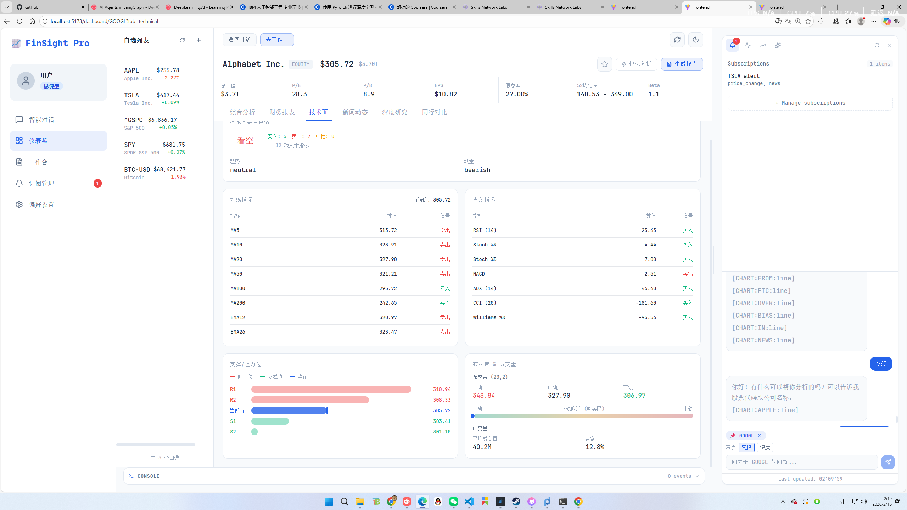

# FinSight AI

[English](./readme.md) | [中文](./readme_cn.md) | [Docs Index](./docs/DOCS_INDEX.md)

**FinSight AI** is a professional-grade, multi-agent financial research system built on **LangGraph**. It unifies conversational analysis, structured dashboard monitoring, and autonomous task execution into a single coherent platform.



## 🚀 Key Features

- **Multi-Agent Orchestration**: 7 specialized agents (Price, News, Fundamental, Technical, etc.) working in parallel.
- **Unified LangGraph Pipeline**: A single, robust 14-node graph handling everything from quick chats to deep investment reports.
- **Adaptive Execution**: 
  - **Planning**: LLM-based planning with deterministic fallback (`stub` mode).
  - **Execution**: Parallel execution groups with caching and error recovery.
  - **Synthesis**: Conflict detection between agents (e.g., Technical vs. Fundamental signals).
- **Professional Dashboard**: Institutional-grade UI with TradingKey-style insights, real-time charts (ECharts), and markdown reporting.
- **RAG Engine**: Hybrid search (Dense + Sparse) with re-ranking and source attribution.

## Phase I (I1-I4) Highlights

- **I1 Agent Timeline**: End-to-end `run_id` propagation and timeline rendering in execution panel.
- **I2 Score Explainability**: Every dashboard insight card includes deterministic `score_breakdown` and a drill-down drawer.
- **I3 Conflict Matrix**: Research tab now surfaces agent conflicts using structured diagnostics first, text fallback second.
- **I4 Proactive Alerts Feed**: New `GET /api/alerts/feed` endpoint and right-panel event stream with unread badge.

## 🏗️ System Architecture

FinSight uses a stateful **LangGraph** pipeline that manages the lifecycle of a request from user input to final rendering.


```mermaid
flowchart TD
    START((Start)) --> INIT[build_initial_state]
    INIT --> CTX[normalize_ui_context]
    CTX --> MODE{Output Mode?}
    
    MODE -->|Chat| RESP[chat_respond]
    MODE -->|Analysis| SUBJ[resolve_subject]
    
    RESP -->|Done| END((End))
    RESP -->|Need Data| SUBJ
    
    SUBJ --> CLARIFY[clarify_gate]
    CLARIFY -->|Ambiguous| END
    CLARIFY -->|Clear| PARSE[parse_operation]
    
    PARSE --> POLICY[policy_gate]
    POLICY --> PLANNER[planner_node]
    
    PLANNER --> APPROVE{Confirmation?}
    APPROVE -->|No| END
    APPROVE -->|Yes| EXEC[execute_plan]
    
    EXEC --> SYNTH[synthesize]
    SYNTH --> RENDER[render_response]
    RENDER --> END

    subgraph "Execution Engine"
    EXEC --> G1[Parallel Group 1]
    EXEC --> G2[Parallel Group 2]
    G1 --> AGENTS
    G2 --> AGENTS
    end
```

### 🧠 Agent Ecosystem

The system delegates tasks to specialized agents based on capability scoring and policy rules.


```mermaid
graph LR
    UserRequest --> PolicyGate
    PolicyGate -->|Selects| Agents
    
    subgraph "Specialized Agents"
    PA[Price Agent] -->|Quotes/History| MarketData
    NA[News Agent] -->|Events/Sentiment| NewsAPI
    FA[Fundamental Agent] -->|Financials/Valuation| FMP/Yahoo
    TA[Technical Agent] -->|Indicators/Signals| TechLib
    MA[Macro Agent] -->|Economics/Interest| MacroDB
    RA[Risk Agent] -->|Volatility/Drawdown| RiskModel
    DS[Deep Search] -->|Web/RAG| SearchEngine
    end
    
    Agents -->|Outputs| ConflictDetector
    ConflictDetector -->|Synthesized| FinalReport
```

## 💾 Data & State Architecture

### Core State (`GraphState`)
The state machine maintains context across the lifecycle:

| Field | Type | Description |
|-------|------|-------------|
| `messages` | `list` | Conversation history (append-only) |
| `subject` | `Object` | Resolved entity (e.g., "AAPL", "Tech Sector") |
| `plan_ir` | `Object` | Execution plan (steps, dependencies, costs) |
| `artifacts` | `Object` | Raw results from agents and tools |
| `policy` | `Object` | Constraints (budget, allowed_tools) |
| `trace` | `Object` | O11y metrics (latencies, failures) |

### Agent Insights (`InsightCard`)
The Dashboard uses a structured schema for AI-generated insights:

```typescript
interface InsightCard {
  agent_name: string;      // e.g., "technical_agent"
  score: number;           // 0-10 confident score
  score_label: string;     // "Bullish", "Neutral", "Bearish"
  summary: string;         // Concise markdown summary
  key_points: string[];    // Bullet points for quick reading
  key_metrics: Metric[];   // Structured data (e.g., "RSI: 72")
  confidence: "high" | "medium" | "low";
}
```

## 🛡️ Resilience & Fallbacks

FinSight is designed for production reliability:

1.  **Planner Fallback**: If the LLM planner fails or times out, the system degrades to a deterministic `planner_stub` that uses keyword mapping to select tools.
2.  **Conflict Detection**: The `synthesize` node checks 8 pairs of opposing agents (e.g., Technical says "Buy", Fundamental says "Sell") and flags contradictions in the final report.
3.  **Execution Caching**: Every tool calling step is hashed. Re-running the same query fetches from cache instantly.
4.  **Deduplication**: Intelligent ticker resolution handles "GOOGL" vs "GOOGLE" and "Berkshire" variations automatically.

## 🛠️ Getting Started

### Backend Setup
```bash
# 1. Create venv
python -m venv .venv
.venv\Scripts\activate

# 2. Install dependencies
pip install -r requirements.txt

# 3. Configure environment
copy user_config.json.example user_config.json
# Edit API keys in user_config.json or .env

# 4. Run Server
python -m uvicorn backend.api.main:app --host 0.0.0.0 --port 8000
```

### Frontend Setup
```bash
cd frontend
pnpm install
pnpm dev
```

## 📸 Gallery

| Investment Report | Real-time Chat |
|-------------------|----------------|
|  |  |

| Market Dashboard | Technical Analysis |
|------------------|--------------------|
|  |  |
