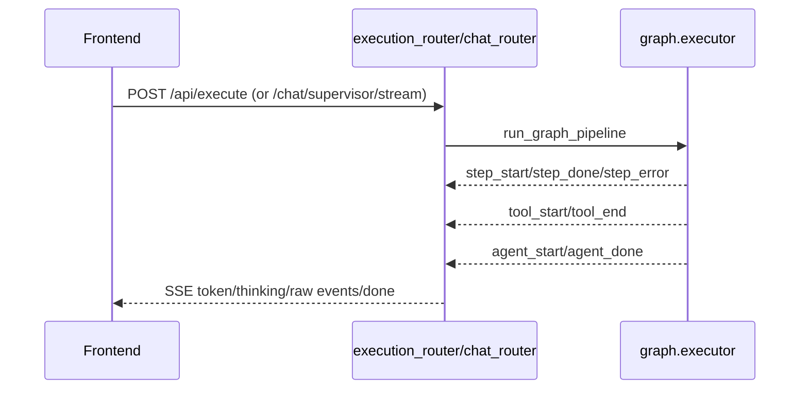

# FinSight AI

[English](./readme.md) | [中文](./readme_cn.md) | [文档索引](./docs/DOCS_INDEX.md)

FinSight 是一个基于 LangGraph 的多智能体投研系统，包含三条主工作流：

- `Chat`：对话式研究，支持 `brief/chat/investment_report` 输出
- `Dashboard`：结构化行情与多标签页分析（含 AI Insights）
- `Workbench`：任务驱动执行、报告时间线、调仓入口

## 快速启动

### Backend

```bash
python -m venv .venv
# Windows
.venv\Scripts\activate
# macOS/Linux
# source .venv/bin/activate
pip install -r requirements.txt
python -m uvicorn backend.api.main:app --host 0.0.0.0 --port 8000
```

### Frontend

```bash
pnpm install --dir frontend
pnpm dev --dir frontend
```

### 基线校验

```bash
pytest -q backend/tests/test_news_tags.py backend/tests/test_insights_engine.py backend/tests/test_policy_gate.py
npx tsc -b --noEmit --project frontend/tsconfig.json
```

## 系统架构（当前实现）

```mermaid
flowchart LR
  UI[React UI] --> CHAT[/chat/supervisor/stream]
  UI --> EXEC[/api/execute]
  CHAT --> PIPE[run_graph_pipeline]
  EXEC --> PIPE
  PIPE --> RUNNER[LangGraph Runner]
  RUNNER --> GRAPH[StateGraph Nodes]
  GRAPH --> POLICY[policy_gate]
  POLICY --> PLANNER[planner / planner_stub]
  PLANNER --> CONFIRM[confirmation_gate]
  CONFIRM --> EXECUTOR[execute_plan_stub]
  EXECUTOR --> ADAPTER[tool_adapter + agent_adapter]
  ADAPTER --> TOOLS[backend.langchain_tools]
  ADAPTER --> AGENTS[backend.agents.*]
  EXECUTOR --> SYNTH[synthesize]
  SYNTH --> RENDER[render_stub]
  RENDER --> PIPE
  PIPE --> SSE[SSE Events]
  PIPE --> RESP[Final Report/Markdown]
```

### 执行事件流（SSE）


```mermaid
sequenceDiagram
  participant FE as Frontend
  participant API as execution_router/chat_router
  participant EX as graph.executor
  FE->>API: POST /api/execute (or /chat/supervisor/stream)
  API->>EX: run_graph_pipeline
  EX-->>API: step_start/step_done/step_error
  EX-->>API: tool_start/tool_end
  EX-->>API: agent_start/agent_done
  API-->>FE: SSE token/thinking/raw events/done
```

## Agent 与 Tool（最新）

- 可选 Agent：`price_agent`, `news_agent`, `fundamental_agent`, `technical_agent`, `macro_agent`, `risk_agent`, `deep_search_agent`
- Tool 注册中心：`backend/langchain_tools.py`（`FINANCIAL_TOOLS`）
- Planner allowlist 入口：`backend/graph/nodes/policy_gate.py`
- Stub 关键词路由：`backend/graph/nodes/planner_stub.py`

> 详细矩阵见：`docs/AGENTS_GUIDE.md`

## 关键 API

- `POST /chat/supervisor`
- `POST /chat/supervisor/stream`
- `POST /api/execute`
- `POST /api/execute/resume`
- `GET /api/dashboard`
- `GET /api/dashboard/insights`
- `GET /api/agents/preferences`
- `PUT /api/agents/preferences`
- `GET /api/reports/index`
- `GET /health`

## 关键运行开关

- `LANGGRAPH_PLANNER_MODE=stub|llm`
- `LANGGRAPH_SYNTHESIZE_MODE=stub|llm`
- `LANGGRAPH_EXECUTE_LIVE_TOOLS=true|false`
- `LANGGRAPH_REPORT_MAX_AGENTS` / `LANGGRAPH_REPORT_MIN_AGENTS`
- `TRACE_RAW_ENABLED=true|false`
- `RAG_V2_BACKEND=auto|sqlite|postgres`

## 文档

- 总索引：`docs/DOCS_INDEX.md`
- 架构：`docs/01_ARCHITECTURE.md`
- Agent/Tool 链路：`docs/AGENTS_GUIDE.md`
- Dashboard 开发：`docs/DASHBOARD_DEVELOPMENT_GUIDE.md`
- 投研看板路线：`docs/DASHBOARD_AGENT_TODOLIST.md`

## License

MIT
