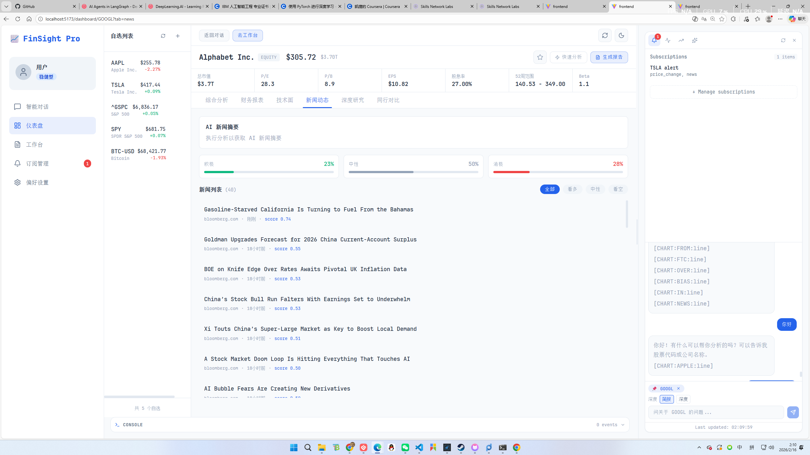
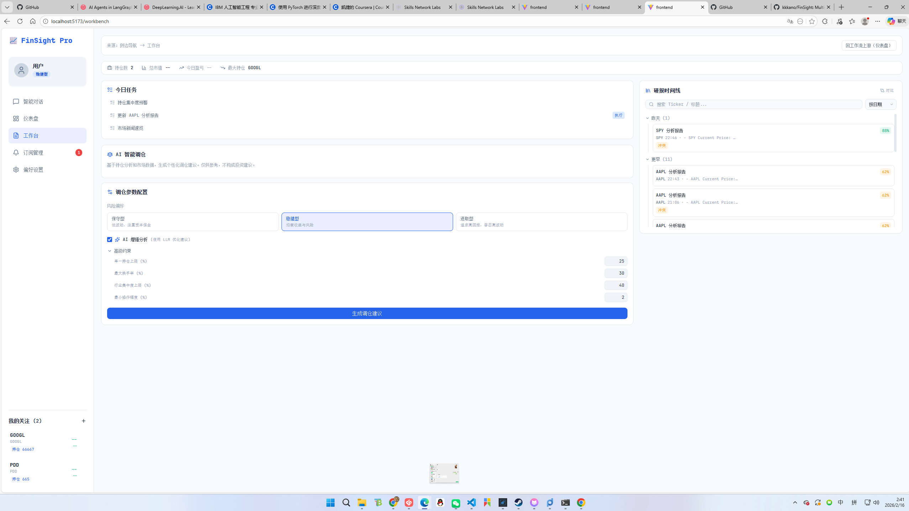
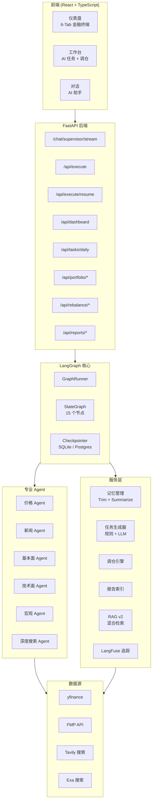
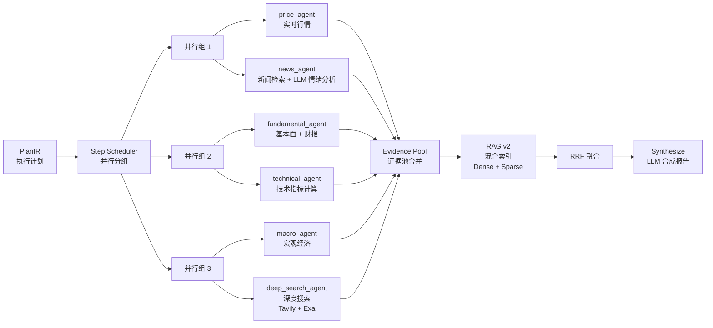
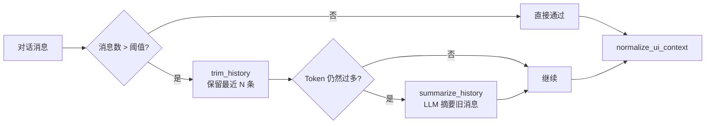
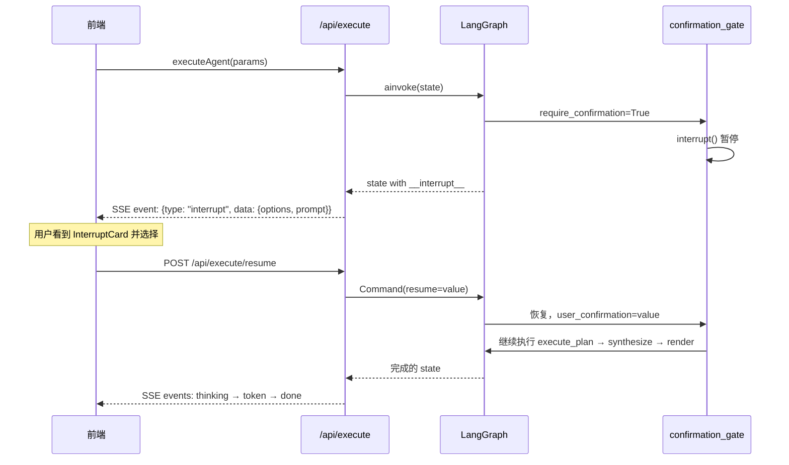

# FinSight AI — 智能金融分析平台

[](https://github.com/langchain-ai/langchain)
[](https://github.com/langchain-ai/langgraph)
[](https://www.python.org/)
[](https://react.dev/)
[](https://www.typescriptlang.org/)
[](./LICENSE)

> 基于 LangGraph 的多 Agent 投资研究平台。集成实时行情、新闻分析、技术指标、同行对比、AI 驱动任务生成和调仓建议。

---

## 目录

- [功能概览](#功能概览)
- [截图展示](#截图展示)
- [快速开始](#快速开始)
- [系统架构](#系统架构)
- [LangGraph 管道详解](#langgraph-管道详解)
- [评分体系 (口径表)](#评分体系-口径表)
- [API 端点](#api-端点)
- [内置工具 & Agent](#内置工具--agent)
- [运行时配置](#运行时配置)
- [契约版本](#契约版本)
- [文档索引](#文档索引)
- [License](#license)

---

## 功能概览

### 仪表盘 (Dashboard) — TradingKey 风格金融终端

- **Stock Header**: 实时价格 + 涨跌幅 + 快速操作按钮
- **Metrics Bar**: PE / PB / EPS / 股息率 / 52 周区间 / Beta 七列关键指标
- **6-Tab 专业布局**:
  - 📊 **综合分析**: 评分环 + 雷达图 + 洞察卡片 + 风险指标 + 利好利空 (无报告也可用)
  - 📋 **财务报表**: 利润表 + 盈利趋势图 + 估值网格 + 资产负债摘要
  - 📈 **技术面**: 均线表 + 振荡器表 + 支撑阻力图 + 布林带
  - 📰 **新闻动态**: 情绪统计 + 筛选 + AI 新闻摘要
  - 🔬 **深度研究**: 报告元数据 + 核心发现 + 冲突面板 + 引用列表
  - 👥 **同行对比**: 评分网格 + 12+ 列指标对比表 + PE/营收增速条形图

### 工作台 (Workbench) — AI 驱动的任务执行中心

- **持仓概览条**: 总市值 / 今日盈亏 / 持仓数 / 最大持仓
- **AI 任务生成**: 双层引擎 (规则层 + LLM 层) 自动生成个性化任务
- **就地执行**: 一键执行任务 + SSE 实时进度 + Human-in-the-loop 中断/恢复
- **研报时间线**: 按日期分组 + 搜索/排序 + 双报告对比
- **调仓建议**: AI 驱动的 suggestion_only 模式调仓 (不执行交易)

### 对话 (Chat) — AI 投资助手

- **多轮对话**: LangGraph 记忆管理 (trim + summarize + cleanup)
- **自动分类**: 闲聊 / 快速分析 / 深度报告 三种输出模式
- **投资报告**: 结构化卡片 (核心观点 + Agent 分析 + 风险 + 引用)

---

## 截图展示

### 仪表盘 — 综合分析 Tab


### 仪表盘 — 财务报表 Tab


### 仪表盘 — 技术面 Tab


### 仪表盘 — 新闻动态 Tab


### 工作台 — AI 任务 + 研报时间线


### 对话 — AI 投资报告


### 投资报告示例
| | |
|---|---|
|  |  |
|  |  |
|  | |

### 开发者控制台 — SSE 事件追踪 + Agent 执行日志


---

## 快速开始

### 后端

```bash
python -m venv .venv
# Windows: .venv\Scripts\activate
# macOS/Linux: source .venv/bin/activate
pip install -r requirements.txt

# 配置环境变量
cp .env.example .env
# 编辑 .env 填入 OPENAI_API_KEY 等

python -m uvicorn backend.api.main:app --host 0.0.0.0 --port 8000
```

### 前端

```bash
cd frontend && pnpm install && pnpm dev
```

### 验证

```bash
pytest -q backend/tests
cd frontend && pnpm build && pnpm tsc --noEmit
```

---

## 系统架构


```mermaid
graph TB
    subgraph Frontend["前端 (React + TypeScript)"]
        DASH[仪表盘<br/>6-Tab 金融终端]
        WB[工作台<br/>AI 任务 + 调仓]
        CHAT[对话<br/>AI 助手]
    end

    subgraph API["FastAPI 后端"]
        CHAT_API["/chat/supervisor/stream"]
        EXEC_API["/api/execute"]
        RESUME_API["/api/execute/resume"]
        DASH_API["/api/dashboard"]
        TASK_API["/api/tasks/daily"]
        PORT_API["/api/portfolio/*"]
        REB_API["/api/rebalance/*"]
        RPT_API["/api/reports/*"]
    end

    subgraph Core["LangGraph 核心"]
        RUNNER[GraphRunner]
        GRAPH[StateGraph<br/>15 个节点]
        CP[Checkpointer<br/>SQLite / Postgres]
    end

    subgraph Agents["专业 Agent"]
        PA[价格 Agent]
        NA[新闻 Agent]
        FA[基本面 Agent]
        TA[技术面 Agent]
        MA[宏观 Agent]
        DA[深度搜索 Agent]
    end

    subgraph Services["服务层"]
        MEM[记忆管理<br/>Trim + Summarize]
        TASK_GEN[任务生成器<br/>规则 + LLM]
        REB_ENG[调仓引擎]
        RPT_IDX[报告索引]
        RAG[RAG v2<br/>混合检索]
        LF[LangFuse 追踪]
    end

    subgraph Data["数据源"]
        YF[yfinance]
        FMP[FMP API]
        TAVILY[Tavily 搜索]
        EXA[Exa 搜索]
    end

    Frontend --> API
    API --> Core
    Core --> Agents
    Agents --> Data
    Core --> Services
    Services --> Data
```

---

## LangGraph 管道详解

### 完整图拓扑

```mermaid
flowchart TD
    START((START)) --> BIS[build_initial_state<br/>初始化状态]
    BIS --> TH[trim_history<br/>修剪对话历史]
    TH --> SH[summarize_history<br/>摘要长历史]
    SH --> NUI[normalize_ui_context<br/>标准化前端上下文]
    NUI --> DOM[decide_output_mode<br/>决定输出模式]
    DOM --> CR{chat_respond<br/>闲聊检测}

    CR -->|闲聊/问候| END1((END))
    CR -->|需要分析| RS[resolve_subject<br/>解析分析主体]

    RS --> CL{clarify<br/>是否需要澄清?}
    CL -->|需要澄清| END2((END<br/>返回追问))
    CL -->|无需澄清| PO[parse_operation<br/>解析操作类型]

    PO --> PG[policy_gate<br/>策略门控<br/>预算/工具/Agent]
    PG --> PL[planner<br/>LLM 规划<br/>生成 PlanIR]
    PL --> CG[confirmation_gate<br/>人工确认中断<br/>interrupt()]
    CG --> EP[execute_plan<br/>执行计划<br/>Agent 并行调度]
    EP --> SYN[synthesize<br/>LLM 合成<br/>生成报告]
    SYN --> REN[render<br/>渲染 Markdown]
    REN --> END3((END))

    style BIS fill:#1e293b,stroke:#fa8019,color:#e8eaed
    style TH fill:#1e293b,stroke:#6366f1,color:#e8eaed
    style SH fill:#1e293b,stroke:#6366f1,color:#e8eaed
    style CG fill:#1e293b,stroke:#f74f5c,color:#e8eaed
    style EP fill:#1e293b,stroke:#0cad92,color:#e8eaed
    style SYN fill:#1e293b,stroke:#0cad92,color:#e8eaed
```

### 各节点说明

| 节点 | 功能 | 关键逻辑 |
|------|------|----------|
| `build_initial_state` | 初始化 GraphState | 设置 schema_version、thread_id、query |
| `trim_history` | 修剪对话历史 | 保留最近 N 条消息，防止 token 溢出 |
| `summarize_history` | 摘要长历史 | 当历史超阈值时，LLM 生成摘要替换旧消息 |
| `normalize_ui_context` | 标准化 UI 上下文 | 解析 active_symbol、selection、view 等前端上下文 |
| `decide_output_mode` | 决定输出模式 | `chat` / `brief` / `investment_report`，基于 query 关键词 + LLM 分类 |
| `chat_respond` | 闲聊检测 | 问候/闲聊直接回复，不走分析管道 |
| `resolve_subject` | 解析分析主体 | 提取 tickers、subject_type (company/news/filing/portfolio) |
| `clarify` | 澄清检查 | 信息不足时生成追问 + 建议选项 |
| `parse_operation` | 解析操作类型 | 确定 operation.name (analyze/compare/monitor...) |
| `policy_gate` | 策略门控 | 设定 budget (max_rounds/tools/agents)、allowed_tools/agents |
| `planner` | LLM 规划 | 生成 PlanIR (steps, required_agents, rationale)，支持 A/B 测试 |
| `confirmation_gate` | 人工确认中断 | `require_confirmation=True` 时调用 `interrupt()`，等待用户确认 |
| `execute_plan` | 执行计划 | 并行调度 Agent + Tool，收集 evidence_pool，RAG 索引 |
| `synthesize` | LLM 合成 | 基于 evidence + RAG context 生成投资报告，质量门控 |
| `render` | 渲染 | 生成最终 Markdown + 报告元数据 |

### Agent 执行流程 (execute_plan 内部)


```mermaid
flowchart LR
    PLAN[PlanIR<br/>执行计划] --> SCHED[Step Scheduler<br/>并行分组]

    SCHED --> G1[并行组 1]
    SCHED --> G2[并行组 2]
    SCHED --> G3[并行组 3]

    G1 --> PA[price_agent<br/>实时行情]
    G1 --> NA[news_agent<br/>新闻检索 + LLM 情绪分析]

    G2 --> FA[fundamental_agent<br/>基本面 + 财报]
    G2 --> TA[technical_agent<br/>技术指标计算]

    G3 --> MA[macro_agent<br/>宏观经济]
    G3 --> DA[deep_search_agent<br/>深度搜索<br/>Tavily + Exa]

    PA --> POOL[Evidence Pool<br/>证据池合并]
    NA --> POOL
    FA --> POOL
    TA --> POOL
    MA --> POOL
    DA --> POOL

    POOL --> RAG[RAG v2<br/>混合索引<br/>Dense + Sparse]
    RAG --> RRF[RRF 融合]
    RRF --> SYN[Synthesize<br/>LLM 合成报告]
```

### 记忆管理流程


```mermaid
flowchart LR
    MSG[对话消息] --> TRIM{消息数 > 阈值?}
    TRIM -->|是| CUT[trim_history<br/>保留最近 N 条]
    TRIM -->|否| PASS[直接通过]

    CUT --> SUM{Token 仍然过多?}
    SUM -->|是| SUMM[summarize_history<br/>LLM 摘要旧消息]
    SUM -->|否| PASS2[继续]

    SUMM --> PASS2
    PASS --> NUI[normalize_ui_context]
    PASS2 --> NUI
```

### Human-in-the-Loop (Interrupt/Resume)


```mermaid
sequenceDiagram
    participant FE as 前端
    participant API as /api/execute
    participant GRAPH as LangGraph
    participant GATE as confirmation_gate

    FE->>API: executeAgent(params)
    API->>GRAPH: ainvoke(state)
    GRAPH->>GATE: require_confirmation=True
    GATE->>GATE: interrupt() 暂停
    GRAPH-->>API: state with __interrupt__
    API-->>FE: SSE event: {type: "interrupt", data: {options, prompt}}

    Note over FE: 用户看到 InterruptCard 并选择

    FE->>API: POST /api/execute/resume
    API->>GRAPH: Command(resume=value)
    GRAPH->>GATE: 恢复，user_confirmation=value
    GATE->>GRAPH: 继续执行 execute_plan → synthesize → render
    GRAPH-->>API: 完成的 state
    API-->>FE: SSE events: thinking → token → done
```

---

## 评分体系 (口径表)

> Dashboard 的评分采用**三层来源分层设计**，确保无报告时也能展示基线分数。

### 分层规则

| 层级 | 来源 | 用途 | 时效 |
|------|------|------|------|
| **实时分 (L0)** | 后端原始指标 + 前端规则计算 | 看盘、排序、初筛 | 随行情实时更新 |
| **报告分 (L1)** | ReportIR 的 confidence_score + agent 分析 | 结论、建议、风险判断 | 报告生成时固定 |
| **覆盖规则** | 有"新鲜报告" (24h 内且引用数达标) 用 L1；否则用 L0 并标注"待报告校准" | — | — |

### 综合评分 (ScoreRing)

| 维度 | 权重 | 数据来源 (无报告/L0) | 数据来源 (有报告/L1) | 计算公式 |
|------|------|----------------------|----------------------|----------|
| PE 合理性 | +2 | `valuation.trailing_pe` vs 行业 | report.confidence | PE 在 [10, 25] 区间 → +2, 否则 +0 |
| 技术趋势 | +2 | `technicals.trend` | report.agent_outputs.technical | trend=bullish → +2, bearish → +0, neutral → +1 |
| RSI 状态 | +1 | `technicals.rsi` | report.agent_outputs.technical | RSI ∈ [30, 70] → +1, 否则 +0 |
| Beta 风险 | +1 | `valuation.beta` | valuation.beta | beta < 1.5 → +1, 否则 +0 |
| 新闻情绪 | +1 | 新闻列表关键词统计 (正面/负面比) | report.agent_outputs.news.sentiment | 正面 > 负面 → +1 |
| **总分** | **/10** | `sum / 7 × 10` 映射到 1-10 | `confidence_score × 10` (直接覆盖) | — |

### 雷达图 (DimensionRadar) — 五维度

| 维度 | 无报告 (L0) | 有报告 (L1) |
|------|-------------|-------------|
| 基本面 | `valuation` 字段完整度 × 100 | report.agent_status.fundamental.confidence × 100 |
| 技术面 | 基于 trend/RSI/MACD 信号强度 | report.agent_status.technical.confidence × 100 |
| 新闻情绪 | 新闻条数权重 + 关键词正负比 | report.agent_status.news.confidence × 100 |
| 深度研究 | **0** (标注"待分析") | report.agent_status.deep_search.confidence × 100 |
| 宏观环境 | **0** (标注"待分析") | report.agent_status.macro.confidence × 100 |

### 分析师评级 (AnalystRatingCard)

| 状态 | 来源 | 逻辑 |
|------|------|------|
| 无报告 | 技术信号共识 | MA 交叉 + RSI + MACD → "偏多" / "偏空" / "中性" |
| 有报告 | report.recommendation + report.sentiment | 直接展示完整评级 |

### 关键洞察 (KeyInsightsCard)

| 状态 | 来源 | 生成规则 |
|------|------|----------|
| 无报告 | valuation + technicals + news | 自动生成 3 条: PE 对比行业 / MA 趋势 / 新闻正负比 |
| 有报告 | report.core_viewpoints | 展示 top 3 观点 (bullish + bearish) |

### 高风险动作门控

- **调仓建议**: 只接受 L1 报告分 (或先触发生成报告)
- **前端必须展示**: `score_source` (实时/报告) + `confidence` 级别

---

## API 端点

### 核心对话

| 方法 | 路径 | 说明 |
|------|------|------|
| POST | `/chat/supervisor` | 同步对话 |
| POST | `/chat/supervisor/stream` | SSE 流式对话 |
| POST | `/api/execute` | 执行分析任务 (SSE) |
| POST | `/api/execute/resume` | 恢复被中断的执行 (SSE) |

### 仪表盘

| 方法 | 路径 | 说明 |
|------|------|------|
| GET | `/api/dashboard` | 获取完整仪表盘数据 (v2: snapshot + valuation + financials + technicals + peers) |

### 任务

| 方法 | 路径 | 说明 |
|------|------|------|
| GET | `/api/tasks/daily` | AI 生成每日任务 (双层: 规则 + LLM) |

### 报告

| 方法 | 路径 | 说明 |
|------|------|------|
| GET | `/api/reports` | 报告索引列表 |
| GET | `/api/reports/{id}` | 获取报告详情 |
| GET | `/api/reports/compare` | 双报告对比 (diff: 置信度 + 情绪 + 风险) |
| POST | `/api/reports/{id}/favorite` | 收藏/取消收藏 |

### 持仓

| 方法 | 路径 | 说明 |
|------|------|------|
| GET | `/api/portfolio/summary` | 持仓汇总 (总市值 + 盈亏 + 分布) |
| POST | `/api/portfolio/positions` | 同步持仓数据 |
| PUT | `/api/portfolio/positions/{ticker}` | 更新单个持仓 |
| DELETE | `/api/portfolio/positions/{ticker}` | 移除持仓 |

### 调仓建议

| 方法 | 路径 | 说明 |
|------|------|------|
| POST | `/api/rebalance/suggestions/generate` | 生成调仓建议 (suggestion_only, executable=false) |
| GET | `/api/rebalance/suggestions` | 历史建议列表 |
| PATCH | `/api/rebalance/suggestions/{id}` | 更新建议状态 (viewed / dismissed / sent_to_chat) |

### 系统

| 方法 | 路径 | 说明 |
|------|------|------|
| GET | `/health` | 健康检查 |
| GET | `/metrics` | 运行指标 |
| GET | `/diagnostics/orchestrator` | 编排器诊断 |
| GET | `/diagnostics/planner-ab` | Planner A/B 测试指标 |

---

## 内置工具 & Agent

### 工具 (Tools)

| 工具 | 用途 | 数据源 |
|------|------|--------|
| `get_stock_price` | 实时行情快照 | yfinance |
| `get_company_news` | 公司新闻检索 | yfinance + FMP |
| `get_company_info` | 公司概况和基本面 | yfinance |
| `search` | Web 检索增强 | Tavily / Exa |
| `get_market_sentiment` | 市场情绪 | 多源聚合 |
| `get_economic_events` | 宏观经济事件 | FMP |
| `get_performance_comparison` | 标的表现对比 | yfinance |
| `analyze_historical_drawdowns` | 回撤/风险历史 | yfinance |
| `get_technical_snapshot` | 技术指标汇总 (RSI/MACD/MA/Bollinger/Stochastic/ADX/CCI/Williams%R) | yfinance |
| `get_current_datetime` | 当前时间 | 系统 |

### 专业 Agent

| Agent | 职责 | 工具 | 关键输出 |
|-------|------|------|----------|
| `price_agent` | 实时行情分析 | get_stock_price, get_performance_comparison | 价格/涨跌幅/成交量 |
| `news_agent` | 新闻检索 + LLM 情绪分析 | get_company_news, search | 新闻列表 + sentiment + 影响评估 |
| `fundamental_agent` | 基本面/财报分析 | get_company_info | PE/PB/EPS/营收/利润 + 评估 |
| `technical_agent` | 技术指标计算 + 信号判断 | get_technical_snapshot | 趋势/支撑阻力/超买超卖 |
| `macro_agent` | 宏观经济环境 | get_economic_events, get_market_sentiment | 宏观风险/机会 |
| `deep_search_agent` | 深度 Web 搜索 + 收敛分析 | search (Tavily + Exa) | 高质量证据 + 来源验证 |

---

## 运行时配置

| 变量 | 默认值 | 说明 |
|------|--------|------|
| `LANGGRAPH_PLANNER_MODE` | `stub` | `stub` 确定性规划, `llm` LLM 规划 |
| `LANGGRAPH_PLANNER_AB_ENABLED` | `false` | 启用 Planner A/B 测试 |
| `LANGGRAPH_SYNTHESIZE_MODE` | `stub` | `stub` 确定性合成, `llm` LLM 合成 |
| `LANGGRAPH_EXECUTE_LIVE_TOOLS` | `false` | 启用真实工具/Agent 调用 |
| `LANGGRAPH_SHOW_EVIDENCE` | `false` | 在 Markdown 中显示证据链接 |
| `LANGGRAPH_CHECKPOINTER_BACKEND` | `sqlite` | Checkpointer: `sqlite` / `postgres` |
| `LANGFUSE_ENABLED` | `false` | 启用 LangFuse 追踪 |
| `API_AUTH_ENABLED` | `false` | 启用 API 认证 |
| `RATE_LIMIT_ENABLED` | `false` | 启用 HTTP 限流 |
| `CORS_ALLOW_ORIGINS` | `http://localhost:5173` | CORS 允许源 |
| `VITE_API_BASE_URL` | `http://127.0.0.1:8000` | 前端连接后端地址 |

---

## 契约版本

| 契约 | 版本 | 定义位置 |
|------|------|----------|
| Chat Request | `chat.request.v1` | `backend/contracts.py` |
| Chat Response | `chat.response.v1` | `backend/contracts.py` |
| Graph State | `graph.state.v1` | `backend/contracts.py` |
| SSE Event | `chat.sse.v1` | `backend/contracts.py` |
| Trace | `trace.v1` | `backend/contracts.py` |
| Dashboard Data | `dashboard.data.v2` | `backend/contracts.py` + `backend/dashboard/contracts.py` |

---

## 文档索引

### 活跃文档 (权威来源)

| 文档 | 说明 |
|------|------|
| `docs/06a_LANGGRAPH_DESIGN_SPEC.md` | LangGraph 设计规范 (SSOT, 唯一开发标准) |
| `docs/06b_LANGGRAPH_CHANGELOG.md` | LangGraph 变更日志 (配合 06a 使用) |
| `docs/01_ARCHITECTURE.md` | 系统架构详解 |
| `docs/05_RAG_ARCHITECTURE.md` | RAG v2 混合检索架构 |
| `docs/11_PRODUCTION_RUNBOOK.md` | 生产运维手册 |
| `docs/LANGGRAPH_FLOW.md` | LangGraph 15 节点数据流文档 |
| `docs/LANGGRAPH_PIPELINE_DEEP_DIVE.md` | LangGraph 管道深度拆解 (12 张 Mermaid 图) |
| `docs/AGENTS_GUIDE.md` | 6 个 Agent 详细文档 (数据源/输出/容错) |
| `docs/PROMPT_OPTIMIZATION_CHANGELOG.md` | 18 个 LLM 提示词优化前后对比 |

### 次级参考文档

| 文档 | 说明 |
|------|------|
| `docs/DASHBOARD_DEVELOPMENT_GUIDE.md` | Dashboard 开发指南 |
| `docs/ROUTING_ARCHITECTURE_STANDARD.md` | 路由架构标准 |
| `docs/PROJECT_STRUCTURE.md` | 项目目录结构 |
| `docs/REPORT_CHART_SPEC.md` | 报表图表规格 |

### 历史文档 (已归档至 `docs/archive/`)

- Phase 0-3 阶段文档、Sprint 日志、执行计划等均已归档
- `docs/archive/06_LANGGRAPH_REFACTOR_GUIDE.md` — 已废弃，由 06a+06b 取代

---

## 降级策略

| 层级 | 主要 | 降级 |
|------|------|------|
| 澄清 | `Clarify` LLM 判断 | 确定性追问消息 |
| 规划 | `planner` LLM 生成 PlanIR | `planner_stub` 最小计划 |
| 合成 | `synthesize` LLM 生成报告 | 确定性 render_vars |
| 工具数据 | 实时 API 调用 | 结构化降级 + fallback_reason |
| Checkpointer | SQLite / Postgres | Memory (如允许) |
| Dashboard 数据 | 全字段返回 | 返回 None + fallback_reason |

---

## 致谢

- [LangChain](https://github.com/langchain-ai/langchain) / [LangGraph](https://github.com/langchain-ai/langgraph)
- [yfinance](https://github.com/ranaroussi/yfinance) / [FMP](https://financialmodelingprep.com/)
- [ECharts](https://echarts.apache.org/) / [Tailwind CSS](https://tailwindcss.com/)
- [LangFuse](https://langfuse.com/)

## License

MIT License - see [LICENSE](./LICENSE)
