# FinSight AI - LangGraph Financial Copilot

[](https://github.com/langchain-ai/langchain)
[](https://github.com/langchain-ai/langgraph)
[](https://www.python.org/)
[](https://react.dev/)
[](https://www.typescriptlang.org/)
[](./LICENSE)

**English** | [中文文档](./readme_cn.md) | [Docs Index](./docs/DOCS_INDEX.md)

---

## Overview

> **SSOT**: `docs/06_LANGGRAPH_REFACTOR_GUIDE.md`  
> **Production Runbook**: `docs/11_PRODUCTION_RUNBOOK.md`

FinSight is now centered on a **single LangGraph orchestration path** for `/chat/supervisor*`:

- One graph entrypoint: `BuildInitialState -> NormalizeUIContext -> DecideOutputMode -> ResolveSubject -> Clarify -> ParseOperation -> PolicyGate -> Planner -> ExecutePlan -> Synthesize -> Render`
- Unified state contract: `subject_type + operation + output_mode`
- Explicit report mode: `options.output_mode=investment_report`
- Selection context is structured input (`news | filing | doc`), not a report intent hack
- Persistent checkpointer support: `sqlite` / `postgres` (with controlled fallback)

---

## Quick Start

### Backend

```bash
python -m venv .venv
# Windows: .venv\Scripts\activate
# macOS/Linux: source .venv/bin/activate
pip install -r requirements.txt
python -m uvicorn backend.api.main:app --host 0.0.0.0 --port 8000
```

### Frontend

```bash
npm ci --prefix frontend
npm run dev --prefix frontend
```

### Pre-Release Gate

```bash
pytest -q backend/tests
npm run build --prefix frontend
npm run test:e2e --prefix frontend
python tests/retrieval_eval/run_retrieval_eval.py --gate --report-prefix local
```

---

## Runtime Flags

| Variable | Default | Purpose |
|---|---:|---|
| `LANGGRAPH_PLANNER_MODE` | `stub` | `stub` deterministic planning, `llm` constrained PlanIR generation |
| `LANGGRAPH_SYNTHESIZE_MODE` | `stub` | `stub` deterministic render vars, `llm` synthesis with validation |
| `LANGGRAPH_EXECUTE_LIVE_TOOLS` | `false` | Execute real tools/agents in executor |
| `LANGGRAPH_SHOW_EVIDENCE` | `false` | Show evidence links in markdown output |
| `LANGGRAPH_CHECKPOINTER_BACKEND` | `sqlite` | `sqlite` or `postgres` checkpointer backend |
| `LANGGRAPH_CHECKPOINTER_ALLOW_MEMORY_FALLBACK` | `true` | Allow fallback to memory checkpointer on backend failures |
| `API_AUTH_ENABLED` | `false` | Enable API-key auth |
| `RATE_LIMIT_ENABLED` | `false` | Enable HTTP rate limiting |

---

## Current Architecture

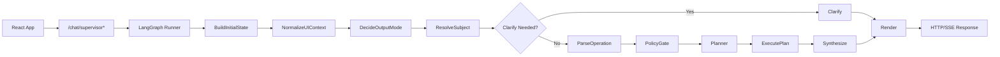
```mermaid
flowchart LR
    FE[React App] --> API["/chat/supervisor*"]
    API --> G[LangGraph Runner]
    G --> N1[BuildInitialState]
    N1 --> N2[NormalizeUIContext]
    N2 --> N3[DecideOutputMode]
    N3 --> N4[ResolveSubject]
    N4 --> N5{Clarify Needed?}
    N5 -->|Yes| C[Clarify]
    N5 -->|No| N6[ParseOperation]
    C --> RENDER[Render]
    N6 --> N7[PolicyGate]
    N7 --> N8[Planner]
    N8 --> N9[ExecutePlan]
    N9 --> N10[Synthesize]
    N10 --> RENDER
    RENDER --> RESP[HTTP/SSE Response]
```

### Retrieval / RAG v2 Path

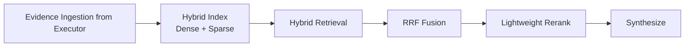
```mermaid
flowchart LR
    INGEST[Evidence Ingestion from Executor] --> IDX[Hybrid Index\nDense + Sparse]
    IDX --> RETR[Hybrid Retrieval]
    RETR --> RRF[RRF Fusion]
    RRF --> RERANK[Lightweight Rerank]
    RERANK --> SYN[Synthesize]
```

---

## Fallback Strategy

| Layer | Primary | Fallback |
|---|---|---|
| Clarification | `Clarify` node in graph | deterministic clarify message |
| Planning | `LANGGRAPH_PLANNER_MODE=llm` | `planner_stub` with policy-constrained minimal plan |
| Synthesis | `LANGGRAPH_SYNTHESIZE_MODE=llm` | deterministic synthesize render vars |
| Tool data | source-specific tool chain | structured fallback results with metadata |
| Checkpointer | sqlite/postgres saver | memory saver (if explicitly allowed) |

---

## Built-in Tools

| Tool | Use |
|---|---|
| `get_stock_price` | real-time snapshot / quote context |
| `get_company_news` | company news retrieval |
| `get_company_info` | profile and fundamentals summary |
| `search` | web retrieval fallback and enrichment |
| `get_market_sentiment` | broad market sentiment |
| `get_economic_events` | macro event summary |
| `get_performance_comparison` | ticker performance comparison |
| `analyze_historical_drawdowns` | drawdown/risk history |
| `get_technical_snapshot` | RSI/MACD/MA technical summary |
| `get_current_datetime` | deterministic time context |

## Built-in Specialist Agents

- `price_agent`
- `news_agent`
- `fundamental_agent`
- `technical_agent`
- `macro_agent`
- `deep_search_agent`

---

## API and Contracts

### Core Endpoints

- `POST /chat/supervisor`
- `POST /chat/supervisor/stream`
- `GET /health`
- `GET /metrics`
- `GET /diagnostics/orchestrator`

### Contract Versions

- `chat.request.v1`
- `chat.response.v1`
- `graph.state.v1`
- `chat.sse.v1`
- `trace.v1`

(Defined in `backend/contracts.py`)

---

## Screenshots

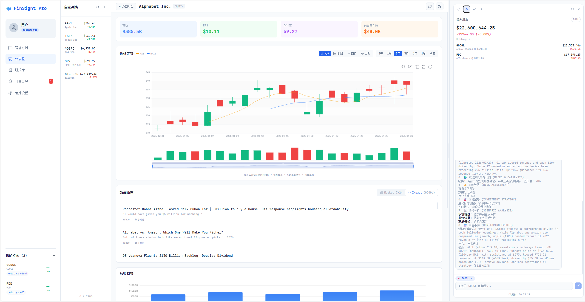
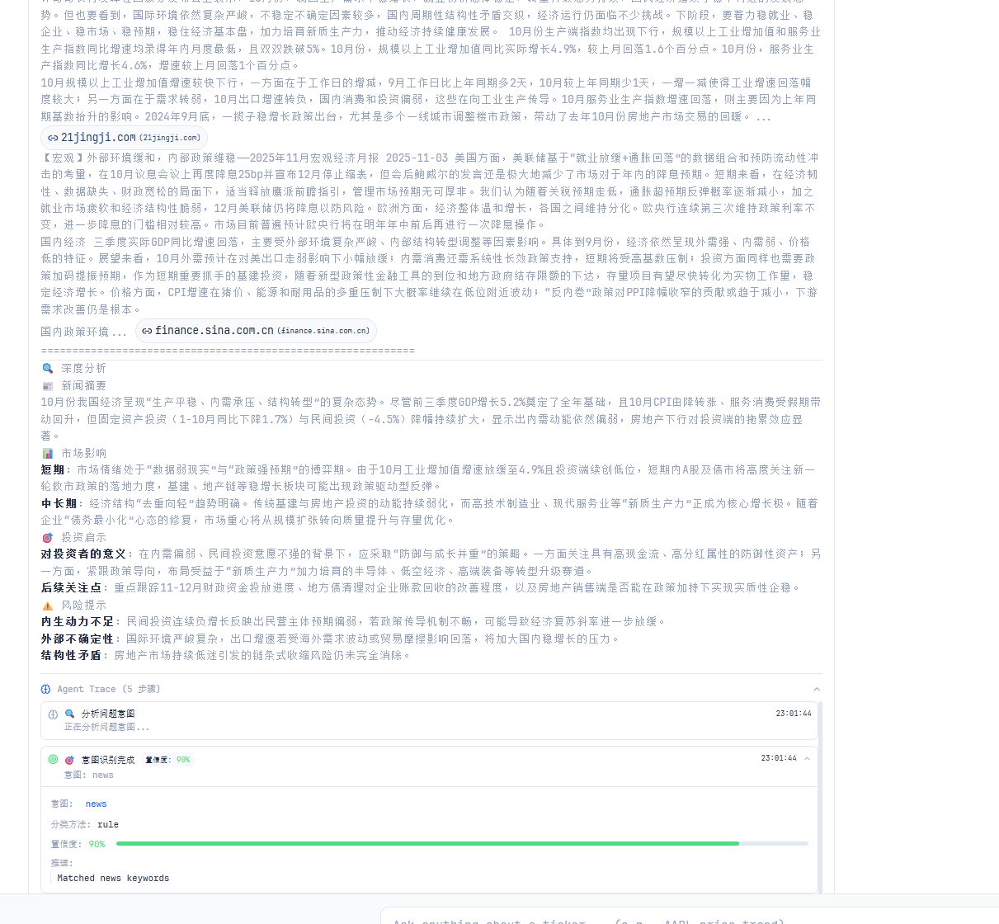
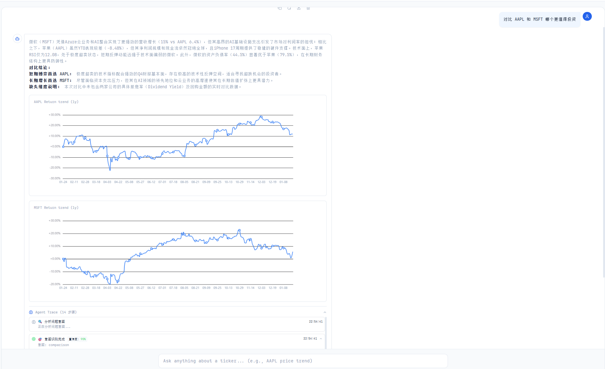
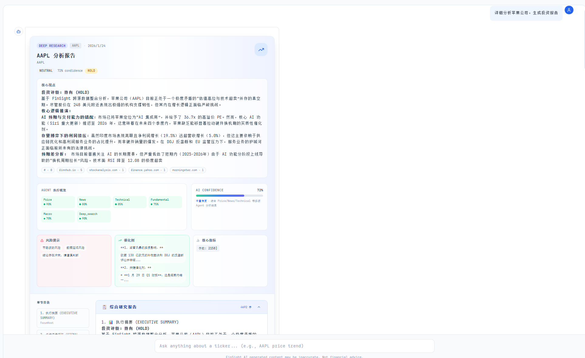
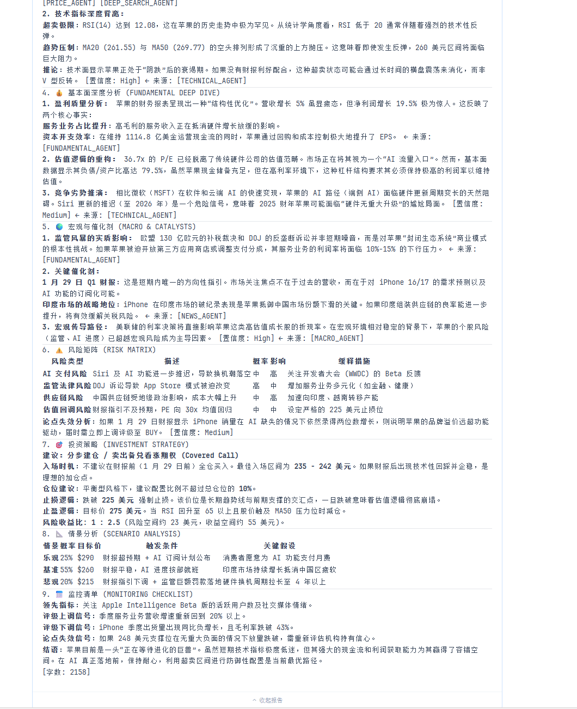
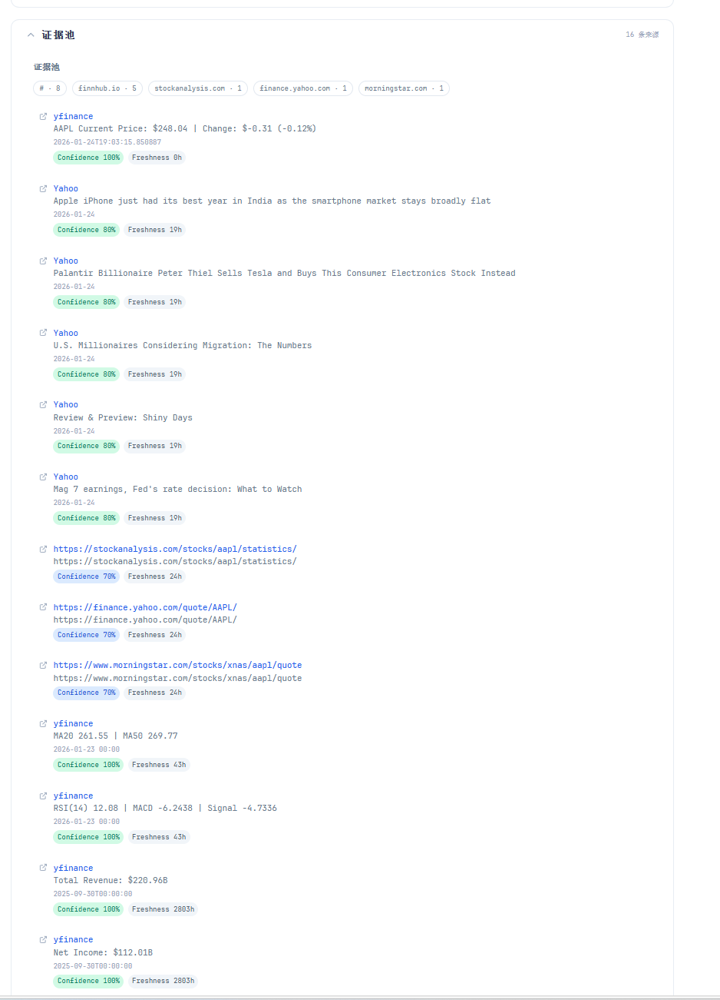
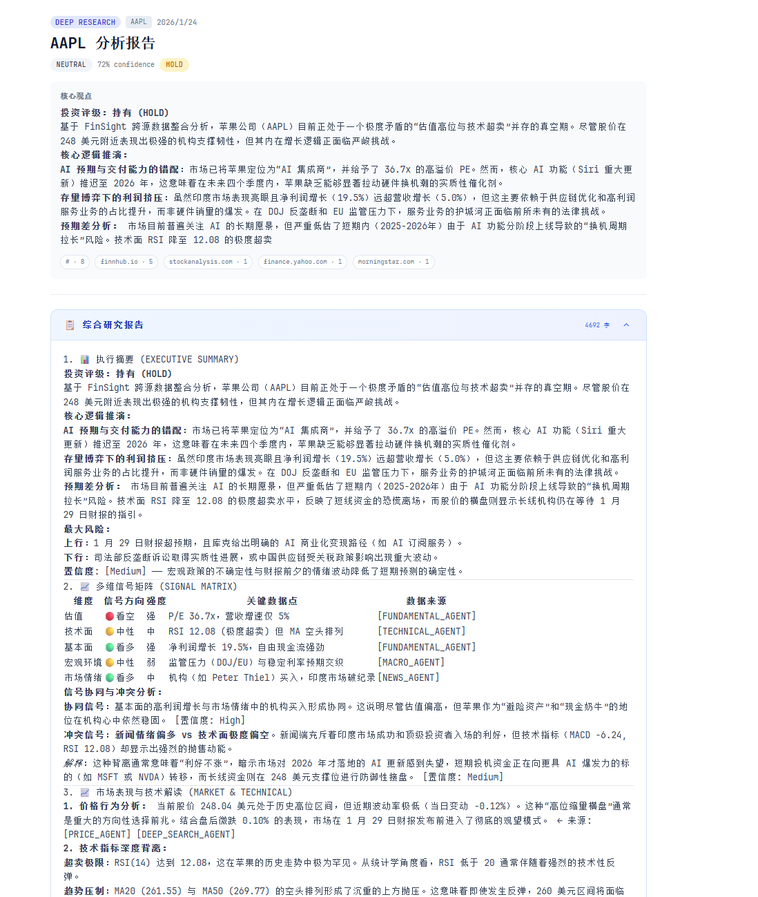
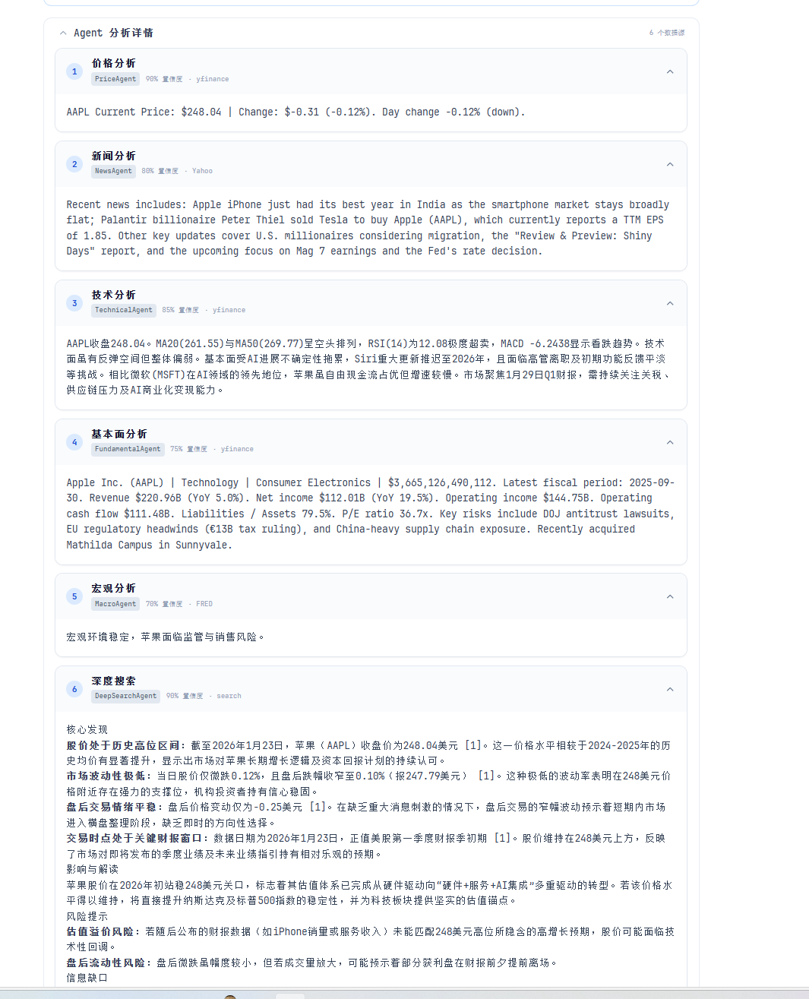
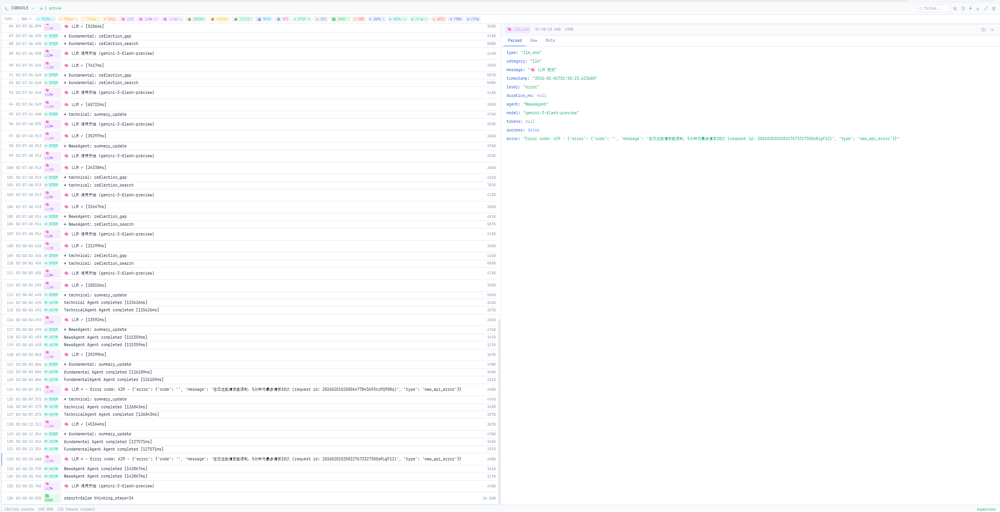

---

## Documentation Map

### Active (implementation authority)

- `docs/06_LANGGRAPH_REFACTOR_GUIDE.md`
- `docs/11_PRODUCTION_RUNBOOK.md`
- `docs/01_ARCHITECTURE.md` (not-black-box runtime internals: query->agent selection examples, planner/executor mermaid flows, per-agent inner workflow)
- `docs/05_RAG_ARCHITECTURE.md`
- `tests/retrieval_eval/run_retrieval_eval.py` (retrieval quality baseline runner)

## Retrieval Evaluation Baseline

```bash
# Unit checks for metric logic
pytest -q tests/retrieval_eval/test_retrieval_eval_runner.py

# Offline retrieval gate (Recall@K / nDCG@K / citation coverage / latency)
python tests/retrieval_eval/run_retrieval_eval.py --gate --report-prefix local
```

Thresholds and baseline:

- `tests/retrieval_eval/thresholds.json`
- `tests/retrieval_eval/baseline_results.json`

### Historical phase docs (reference only)

- `docs/02_PHASE0_COMPLETION.md`
- `docs/03_PHASE1_IMPLEMENTATION.md`
- `docs/04_PHASE2_DEEP_RESEARCH.md`
- `docs/05_PHASE3_ACTIVE_SERVICE.md`
- `docs/Thinking/2026-01-31_architecture_refactor_guide.md`
- `docs/Thinking/2026-01-31_routing_architecture_decision.md`

---

## Current Priorities

- Retrieval eval set expansion and hard-negative coverage
- Nightly postgres-backed retrieval benchmark and drift tracking
- Production observability hardening and contract stability
- Keep docs aligned with SSOT after each architecture change

---

## Acknowledgments

- [LangChain](https://github.com/langchain-ai/langchain)
- [LangGraph](https://github.com/langchain-ai/langgraph)
- [yfinance](https://github.com/ranaroussi/yfinance)
- [ECharts](https://echarts.apache.org/)

## License

MIT License - see [LICENSE](./LICENSE)
