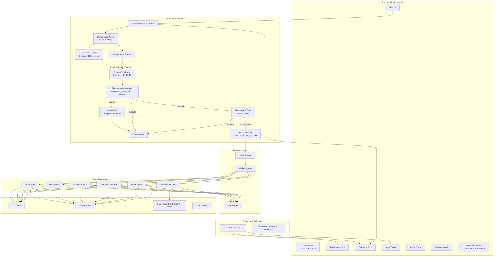
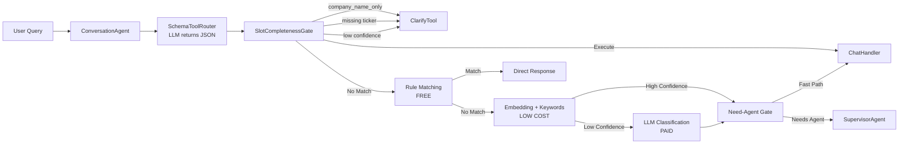
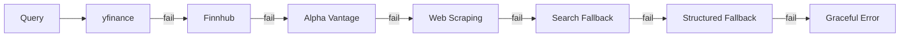

# FinSight AI - Multi-Agent Financial Intelligence Platform

[](https://github.com/langchain-ai/langchain)
[](./docs/01_ARCHITECTURE.md)
[](https://www.python.org/)
[](https://react.dev/)
[](https://www.typescriptlang.org/)
[](./LICENSE)

**English Version** | [Chinese Docs](./readme_cn.md) | [Docs](./docs/)

---

## Overview

FinSight AI is a conversational, multi-agent financial research assistant that combines:

- Supervisor Agent architecture: intent classification + worker agent coordination + forum synthesis
- 6 specialized agents: Price, News, Technical, Fundamental, Macro, DeepSearch
- FastAPI backend + LangChain + Supervisor-Forum orchestration
- React + TypeScript + Tailwind frontend with professional report cards
- Real-time market data with multi-source fallback (yfinance, Finnhub, Alpha Vantage, etc.)

The goal is to feel like talking to a Chief Investment Officer who can quickly pull data, run analysis playbooks, and produce professional-grade investment reports.

---

## Screenshots


---

## Key Features

### Multi-Agent Supervisor Architecture
```
User Query -> IntentClassifier (Rule + Embedding + LLM) -> SupervisorAgent
                                                        |
             +------------------------------------------+----------------------------------+
             | Worker Agents (Parallel Execution)                                          |
             | - PriceAgent (real-time quotes)                                              |
             | - NewsAgent (news + sentiment)                                               |
             | - TechnicalAgent (indicators)                                               |
             | - FundamentalAgent (financials)                                             |
             | - MacroAgent (economic data)                                                |
             | - DeepSearchAgent (web research)                                            |
             +-----------------------------------------------------------------------------+
                                                        |
                                   ForumHost (synthesis + confidence scoring)
                                                        |
                         ReportIR (citations + confidence + freshness)
                                                        |
                     Frontend ReportView (evidence pool + trace drill-down)
```

### Professional Report Generation
- 8-section analysis reports: Executive Summary, Market Position, Fundamental Analysis, Macro and Catalysts, Risk Assessment, Investment Strategy, Scenario Analysis, Monitoring Events
- Agent contribution tracking: see which agent provided each insight
- Evidence pool with citation confidence and freshness metadata
- ReportIR schema validation for citations (confidence and freshness)
- ReportSection carries section-level confidence/agent attribution/data sources
- PlanIR + Executor for step-level planning and execution trace
- EvidencePolicy enforces citation validity and coverage thresholds
- Structured News and Macro fallbacks keep downstream analysis stable
- News/Report responses include a short overall summary for clarity
- get_company_news returns structured items; handlers format for display
- Safe DeepSearch retrieval with SSRF guard and HTTP retry
- Dynamic DeepSearch query templates driven by intent keywords
- DataContext summaries capture per-source as_of/currency/adjustment and flag inconsistencies
- BudgetManager enforces max tools / rounds / time with budget snapshots in responses
- Security gate (API Key + rate limiting) and footer disclaimer template ensure compliance
- SearchConvergence module for info gain scoring, content deduplication, and stop conditions
- TraceEvent Schema v1 with versioned event format (event_type/duration/metadata)
- Supervisor stream normalizes trace output to v1 for all agent outputs and plan traces
- Regression testing framework with 25 baseline cases and automated comparison reports
- **Routing Architecture Standard**: dual-layer Intent design (see [ROUTING_ARCHITECTURE_STANDARD.md](./docs/ROUTING_ARCHITECTURE_STANDARD.md))

### Smart Intent Classification
- 3-layer hybrid system: rule matching -> embedding similarity -> LLM fallback
- NEWS sub-intent: distinguishes fetch news vs analyze news impact
- NEWS keyword fast-path reduces misclassification to generic search
- Selection Context (news/report reference) routes analysis through a single news-analysis pipeline (no duplicate prompts)
- Cost efficient: simple queries handled by rules with no LLM cost
- Report intent rules cover “analyze/分析” with ticker context (no LLM required)
- Reliability-first Agent Gate: CHAT can escalate to Supervisor based on timeliness/decision/evidence needs
- SchemaToolRouter: one-shot tool selection + Pydantic validation + template-based ClarifyTool; wired into /chat/supervisor & /chat/supervisor/stream; invalid JSON/unknown tool -> clarify
- Pending tool state stores missing slots for multi-turn clarification

### Real-time Streaming and Transparency
- Token-by-token streaming responses
- Interactive K-line charts with full-screen mode
- Multi-ticker comparisons auto-render multiple charts
- Agent trace drill-down with expandable steps
- Portfolio snapshot with editable holdings
- Agent Gate decisions are visible in trace (used agent vs fast path)
- Evidence pool is shown when tools/agents are invoked
- **Developer Console**: Real-time SSE event viewer with 26 event types (tool_start/end, llm_start/end, cache_hit/miss, agent_start/done/step, supervisor_start/done, etc.)
- **Selection Context**: News/Report reference system - click "Ask about this" in Dashboard to attach specific news context to your questions
- Observability is non-blocking: TraceEmitter accepts forward-compatible metadata fields so tracing cannot break business logic

### Selection Context → Unified News Analysis

```mermaid
flowchart LR
    UI[Dashboard NewsFeed<br/>Ask about this] --> Store[Zustand<br/>activeSelection]
    Store --> Req[/chat/supervisor/stream<br/>context.selection/]
    Req --> CM[ContextManager<br/>builds [System Context]]
    CM --> SA[SupervisorAgent]
    SA -->|NEWS + Selection Context| ANA[_handle_news_analysis<br/>single implementation]
    ANA --> OUT[Structured analysis<br/>summary/impact/insight/risks]
```

### Alert and Subscription System
- Price alerts: email notifications when price changes exceed thresholds
- News alerts: daily news digests for watched stocks
- Background schedulers with APScheduler

---

## Architecture

### System Architecture


```mermaid
flowchart TB
    subgraph Frontend["Frontend (React + Vite)"]
        UI[Chat UI]
        Dashboard["Dashboard<br/>(KPI/Chart/News)"]
        ReportView[ReportView Card]
        Evidence[Evidence Pool]
        Trace[Agent Trace]
        Chart["K-line Chart"]
        Settings["Settings Modal"]
        SelectionCtx["Selection Context<br/>(News/Report Reference)"]
    end

    subgraph API["FastAPI Backend"]
        Stream["/chat/supervisor(/stream)"]
        CA["ConversationAgent<br/>(Unified Entry)"]
        CM["ContextManager<br/>(History + References)"]
        Router["ConversationRouter"]
        subgraph SchemaLayer["Schema-Driven Routing"]
            SchemaRouter["SchemaToolRouter<br/>LLM tool + Pydantic"]
            SlotGate["SlotCompletenessGate<br/>company_name_only + guards"]
            Clarify["ClarifyTool<br/>Template questions"]
        end
        Gate["Need-Agent Gate<br/>Reliability-first"]
        ChatHandler["ChatHandler"]
        Classifier["IntentClassifier<br/>Rule + Embedding + LLM"]
    end

    subgraph Supervisor["SupervisorAgent"]
        SupRouter["Intent Router"]
        Workers["Worker Agents"]
        Forum["ForumHost"]
    end

    subgraph Agents["Specialized Agents"]
        PA["PriceAgent"]
        NA["NewsAgent"]
        TA["TechnicalAgent"]
        FA["FundamentalAgent"]
        MA["MacroAgent"]
        DSA["DeepSearchAgent"]
    end

    subgraph ReportIR["Report and Evidence"]
        IR["ReportIR + Validator"]
        Citations["Citations (confidence + freshness)"]
    end

    subgraph Services["Core Services"]
        Cache["KV Cache"]
        CB["Circuit Breaker"]
        SafeFetch["Safe Fetch (SSRF Guard + Retry)"]
        Memory["User Memory"]
    end

    UI --> Stream
    Stream --> CA
    CA --> CM
    CA --> Router
    Router --> SchemaRouter
    SchemaRouter --> SlotGate
    SlotGate -->|clarify| Clarify
    Clarify --> ChatHandler
    SlotGate -->|execute| ChatHandler
    SlotGate -->|fallback| Gate
    Gate -->|fast path| ChatHandler
    Gate -->|needs agent| Classifier
    Classifier --> SupRouter
    SupRouter --> Workers
    Workers --> PA & NA & TA & FA & MA & DSA
    PA & NA & TA & FA & MA & DSA --> Forum
    Forum --> IR --> ReportView
    IR --> Evidence
    IR --> Trace
    Stream --> Evidence

    PA & NA & TA & FA & MA & DSA --> Cache
    PA & NA & TA & FA & MA & DSA --> CB
    DSA --> SafeFetch

```

### Intent Classification Flow


```mermaid
flowchart LR
    Input[User Query] --> CA[ConversationAgent]
    CA --> Schema[SchemaToolRouter<br/>LLM returns JSON]
    Schema --> SlotGate[SlotCompletenessGate]
    SlotGate -->|company_name_only| Clarify[ClarifyTool]
    SlotGate -->|missing ticker| Clarify
    SlotGate -->|low confidence| Clarify
    SlotGate -->|Execute| Chat[ChatHandler]
    SlotGate -->|No Match| Rule[Rule Matching<br/>FREE]
    Rule -->|Match| Direct[Direct Response]
    Rule -->|No Match| Embed[Embedding + Keywords<br/>LOW COST]
    Embed -->|High Confidence| Gate[Need-Agent Gate]
    Embed -->|Low Confidence| LLM[LLM Classification<br/>PAID]
    LLM --> Gate
    Gate -->|Fast Path| Chat
    Gate -->|Needs Agent| Agent[SupervisorAgent]
```

### Data Fallback Strategy


```mermaid
graph LR
    Q[Query] --> A[yfinance]
    A -->|fail| B[Finnhub]
    B -->|fail| C[Alpha Vantage]
    C -->|fail| D[Web Scraping]
    D -->|fail| E[Search Fallback]
    E -->|fail| F[Structured Fallback]
    F -->|fail| G[Graceful Error]
```

---

## Available Tools

| Tool | Description | Data Sources |
|------|-------------|--------------|
| `get_stock_price` | Real-time quote with fallback | yfinance -> Finnhub -> Alpha Vantage -> Web |
| `get_company_info` | Company fundamentals | yfinance |
| `get_company_news` | Latest headlines (structured list) | Reuters RSS + Bloomberg RSS + Finnhub |
| `search` | Web search | Exa -> Tavily -> DuckDuckGo (Wikipedia only for non-finance queries) |
| `get_market_sentiment` | Fear and Greed index | CNN |
| `get_economic_events` | Macro calendar | Exa search |
| `get_financial_statements` | Income, balance, cash flow | yfinance |
| `get_key_metrics` | PE, ROE, margins | yfinance + calculated |
| `analyze_historical_drawdowns` | Drawdown analysis | yfinance |
| `get_performance_comparison` | Multi-ticker comparison | yfinance |

---

## Quick Start

### 1. Backend (FastAPI)

```bash
# Create virtual environment
python -m venv .venv
source .venv/bin/activate  # Windows: .venv\Scripts\activate

# Install dependencies
pip install -r requirements.txt

# Configure environment
cp .env.example .env
# Edit .env with your API keys
# Optional: frontend Settings Modal writes `user_config.json` (overrides .env for LLM)

# Start server
python -m uvicorn backend.api.main:app --host 0.0.0.0 --port 8000 --reload
```

### 2. Frontend (React + Vite)

```bash
cd frontend
npm install
npm run dev
```

Open `http://localhost:5173` in your browser.

### 3. Health Check

```bash
curl http://localhost:8000/health
# {"status": "healthy"}
```

### 4. Testing

```bash
pytest backend/tests -q
```

---

## Environment Variables

```env
# LLM Configuration
GEMINI_PROXY_API_KEY=your_key
GEMINI_PROXY_API_BASE=https://your-proxy/v1

# Financial Data APIs (recommended)
ALPHA_VANTAGE_API_KEY=...
FINNHUB_API_KEY=...
TIINGO_API_KEY=...
TAVILY_API_KEY=...
EXA_API_KEY=...
FRED_API_KEY=...
BLOOMBERG_RSS_URLS=...

# Email Alerts
SMTP_SERVER=smtp.gmail.com
SMTP_PORT=587
SMTP_USER=your_email@gmail.com
SMTP_PASSWORD=your_app_password
EMAIL_FROM=FinSight <your_email@gmail.com>

# Scheduler
PRICE_ALERT_SCHEDULER_ENABLED=true
PRICE_ALERT_INTERVAL_MINUTES=15
NEWS_ALERT_SCHEDULER_ENABLED=true
NEWS_ALERT_INTERVAL_MINUTES=30

# LangSmith (optional)
LANGSMITH_API_KEY=...
LANGSMITH_PROJECT=FinSight
ENABLE_LANGSMITH=false

# Quality & Guardrails
DATA_CONTEXT_MAX_SKEW_HOURS=24
BUDGET_MAX_TOOL_CALLS=50
BUDGET_MAX_ROUNDS=12
BUDGET_MAX_SECONDS=600
CHAT_HISTORY_MAX_MESSAGES=12
CACHE_JITTER_RATIO=0.1
CACHE_NEGATIVE_TTL=60
PRICE_CB_FAILURE_THRESHOLD=5
PRICE_CB_RECOVERY_TIMEOUT=60
NEWS_CB_FAILURE_THRESHOLD=3
NEWS_CB_RECOVERY_TIMEOUT=180
LOG_LEVEL=INFO

# Security Gate
API_AUTH_ENABLED=false
API_AUTH_KEYS=
RATE_LIMIT_ENABLED=false
RATE_LIMIT_PER_MINUTE=120
RATE_LIMIT_WINDOW_SECONDS=60
```

LLM config precedence:
- `user_config.json` (if present, saved from UI) overrides `.env`
- `.env` provides default provider/model/api_base/api_key

---

## Observability

- `GET /health` basic health check
- `GET /metrics` Prometheus metrics (requires `prometheus-client`)
- `GET /diagnostics/orchestrator` orchestrator stats

## Project Structure

```
FinSight/
|-- backend/
|   |-- agents/                     # 6 Worker Agents
|   |   |-- base_agent.py
|   |   |-- price_agent.py
|   |   |-- news_agent.py
|   |   |-- technical_agent.py
|   |   |-- fundamental_agent.py
|   |   |-- macro_agent.py
|   |   |-- deep_search_agent.py
|   |   |-- search_convergence.py
|   |-- conversation/               # Conversation entry + routing
|   |   |-- agent.py                # ConversationAgent (unified entry)
|   |   |-- context.py              # ContextManager
|   |   |-- router.py               # ConversationRouter
|   |   |-- schema_router.py        # SchemaToolRouter + SlotCompletenessGate
|   |-- orchestration/              # Supervisor-Forum coordination
|   |   |-- supervisor_agent.py
|   |   |-- intent_classifier.py
|   |   |-- forum.py
|   |   |-- orchestrator.py
|   |   |-- tools_bridge.py
|   |   |-- cache.py
|   |   |-- budget.py
|   |   |-- data_context.py
|   |   |-- validator.py
|   |   |-- trace.py / trace_schema.py
|   |-- handlers/                   # Intent handlers
|   |   |-- chat_handler.py
|   |   |-- followup_handler.py
|   |-- report/                     # Report IR + validation
|   |   |-- ir.py
|   |   |-- validator.py
|   |   |-- evidence_policy.py
|   |   |-- disclaimer.py
|   |-- knowledge/                  # RAG + Vector store
|   |   |-- rag_engine.py
|   |   |-- vector_store.py
|   |-- config/                     # Ticker mapping + config
|   |   |-- ticker_mapping.py
|   |-- security/                   # SSRF protection
|   |   |-- ssrf.py
|   |-- services/                   # Core services
|   |   |-- circuit_breaker.py
|   |   |-- memory.py
|   |   |-- pdf_export.py
|   |   |-- rate_limiter.py
|   |   |-- health_probe.py
|   |-- api/                        # FastAPI endpoints
|   |   |-- main.py
|   |   |-- schemas.py
|   |   |-- streaming.py
|   |   |-- chart_detector.py
|   |-- tools/                      # Financial data tools
|   |   |-- search.py
|   |   |-- news.py
|   |   |-- price.py
|   |   |-- financial.py
|   |   |-- macro.py
|   |   |-- web.py
|   |-- langchain_tools.py
|   |-- tests/                      # Backend tests
|-- tests/                          # New test directory
|   |-- regression/                 # Regression tests + evaluators
|   |-- unit/                       # Unit tests
|-- frontend/
|   |-- src/
|   |   |-- components/
|   |   |   |-- ReportView.tsx
|   |   |   |-- ThinkingProcess.tsx
|   |   |   |-- RightPanel.tsx
|   |   |   |-- Sidebar.tsx
|   |   |-- store/useStore.ts
|   |   |-- api/client.ts
|-- docs/
|-- images/
```

---

## Status

> Last Updated: 2026-02-02 | Version: 0.7.0

### Current Progress

| Module | Progress | Notes |
|--------|----------|-------|
| Tools Layer | 100% | Multi-source fallback, caching, circuit breaker |
| Agent Layer | 100% | 6 agents + structured fallbacks |
| Orchestration | 100% | Supervisor + Forum + streaming |
| Report Card | 100% | Evidence metadata and citation validation |
| Transparency | 90% | Trace drill-down and diagnostics |
| Alert System | 90% | Price and news alerts |

### Known Issues

| Issue | Severity | Status |
|-------|----------|--------|
| RAG not integrated with DeepSearch | Medium | Planned |
| RiskAgent not implemented | Medium | Phase 3 |
| Mobile responsive needs work | Low | Backlog |

---

## Roadmap

### Completed (v0.6.x)
- [x] Multi-Agent Supervisor architecture
- [x] 8-section professional reports
- [x] NEWS sub-intent classification
- [x] Evidence metadata (confidence + freshness)
- [x] Structured News/Macro fallbacks
- [x] DeepSearch SSRF guard and retry
- [x] Dynamic DeepSearch query templates
- [x] Portfolio snapshot with holdings input
- [x] Full-screen K-line charts
- [x] SchemaToolRouter: one-shot LLM tool selection + Pydantic validation
- [x] SlotCompletenessGate: company_name_only rule + sentiment guard + ticker validation
- [x] Multi-turn slot filling with pending_tool_call state
- [x] ClarifyTool template-based follow-up questions
- [x] Architecture refactor regression tests (12 test cases)

### In Progress
- [ ] RAG integration with DeepSearch
- [ ] User long-term memory (vector store)

### Planned (v0.7.x)
- [ ] RiskAgent (VaR, position sizing)
- [ ] Portfolio analysis
- [ ] Multi-language support
- [ ] Mobile responsive design

---

## Contributing

Contributions are welcome. Please read our contributing guidelines before submitting PRs.

### Contributors

- Human Developer - Architecture, Frontend, Backend
- Claude (Anthropic) - Code assistance, Documentation

---

## License

MIT License - see [LICENSE](./LICENSE) for details.

---

## Acknowledgments

- [LangChain](https://github.com/langchain-ai/langchain) - LLM framework
- [LangGraph](https://github.com/langgraph-ai/langgraph) - Agent orchestration
- [yfinance](https://github.com/ranaroussi/yfinance) - Market data
- [ECharts](https://echarts.apache.org/) - Charting library
