# FinSight AI – Conversational Market Intelligence Agent

[](https://github.com/langchain-ai/langchain)
[](https://github.com/langchain-ai/langgraph)
[](https://www.python.org/)
[](https://react.dev/)
[](https://www.typescriptlang.org/)

**[English Version](./readme.md)** | [中文文档](./readme_cn.md) | [Docs](./docs/)

---

## 🚀 Overview

FinSight AI is a **conversational, tool‑calling financial research assistant** that combines:

- FastAPI backend + LangChain + **LangGraph CIO Agent**
- React + TypeScript + Tailwind frontend with ChatGPT-style interface and market visualization
- **Financial tools** for real-time quotes, fundamentals, news, macro data, and risk metrics

The goal is to feel like talking to a **Chief Investment Officer** who can quickly pull data, run analysis playbooks, and produce professional-grade reports.

---

## ✨ Key Features

### Conversational CIO Agent
- Multi-turn dialogue with lightweight context management
- Intent routing: fast chat vs deep report vs follow-up
- LangGraph-powered CIO agent for long-form professional analysis

### Smart Charting & Visualization
- AI responses can embed chart hints (e.g., `[CHART:AAPL:line]`)
- Right-side `StockChart` panel auto-expands when charts are requested
- ECharts-based visualization for price history, performance comparisons, etc.

### Multi-Source Data with Fallback
- Each tool implements multi-source fallback (yfinance → API → scraping → search)
- Ensures "data availability" while providing clear error messages on failures

### Reasoning Trace
- Optional "thinking process" view in chat UI
- Shows intermediate steps, tool calls, and elapsed time

### Streaming Output (Added 2025-12-27)
- LLM responses stream token-by-token, ChatGPT-like typewriter effect
- No waiting for complete response, AI replies appear immediately
- Real-time tool call status display
- Built on SSE (Server-Sent Events) technology

### Modern Frontend UX
- Fixed header: FinSight branding + theme toggle + PDF export + settings
- Dual-panel layout: left for chat, right for charts (collapsible)
- Dark/light theme support, centered vs full-width layout modes

### Alerts & Subscriptions
- Email alerts for price changes (`price_change`) and news
- Background schedulers (APScheduler) with multi-source fallback
- Frontend settings modal for subscribe/unsubscribe, view last alert times
- Scheduler logs written to `logs/alerts.log`

---

## UI Preview


---

## 🧱 Architecture

### System Architecture

```mermaid
flowchart LR
    U[User] --> FE[Frontend (React + TS)]
    FE -->|HTTP / JSON| API[FastAPI Backend]

    subgraph Backend
        API --> AG[ConversationAgent]
        AG --> RT[Router + ContextManager]
        AG --> HD[Handlers (Chat / Report / Followup)]
        HD --> ORC[ToolOrchestrator]
        HD --> CIO[LangGraph CIO Agent\n(LangChainFinancialAgent)]
        ORC --> TOOLS[backend.tools\n+ langchain_tools]
    end

    subgraph Data Sources
        TOOLS --> PX[Prices & OHLCV\nyfinance / APIs]
        TOOLS --> FUND[Fundamentals\ncompany profiles]
        TOOLS --> NEWS[News & Search\nTavily / DDGS / web]
        TOOLS --> MACRO[Macro & Sentiment\nindices / calendars]
    end

    FE <-->|Streaming / Responses| API
```

### Conversational Flow

```mermaid
sequenceDiagram
    participant User
    participant Frontend
    participant FastAPI
    participant ConvAgent
    participant Handler
    participant Tools
    participant CIO

    User->>Frontend: "Analyze AAPL trend with chart"
    Frontend->>FastAPI: POST /chat
    FastAPI->>ConvAgent: chat(query, capture_thinking=True)
    ConvAgent->>ConvAgent: Resolve context & intent
    ConvAgent->>Handler: Dispatch to Chat/Report handler
    Handler->>Tools: Call multi‑source tools (price, news, macro...)
    Tools-->>Handler: Data with fallback applied
    Handler->>CIO: (optional) call LangGraph CIO agent for deep report
    CIO-->>Handler: Long‑form professional report
    Handler-->>ConvAgent: Final answer + thinking steps
    ConvAgent-->>FastAPI: JSON response
    FastAPI-->>Frontend: Chat + thinking + chart hints
    Frontend->>Frontend: Render messages + charts
```



### Data Fallback Strategy

The `backend.tools` module implements **multi‑source strategies**. Example:


Each tool follows a similar pattern: try the cheapest/fastest source first, then fall back while logging failures.

### Market News Sources

- Primary: Reuters RSS (default) + Bloomberg RSS (default list; extend via `BLOOMBERG_RSS_URLS`).
- Secondary: Finnhub `general_news` (48h recency filter).
- Fallback: search with 3d/7d recency gating and date extraction.

Bloomberg defaults:

```text
https://feeds.bloomberg.com/markets/news.rss
https://feeds.bloomberg.com/technology/news.rss
https://feeds.bloomberg.com/politics/news.rss
https://feeds.bloomberg.com/wealth/news.rss
https://feeds.bloomberg.com/pursuits/news.rss
https://feeds.bloomberg.com/businessweek/news.rss
https://feeds.bloomberg.com/industries/news.rss
```

---

## 🛠 Available Tools

The LangGraph CIO agent uses tools defined in `langchain_tools.py`:

| Tool Name | Description |
|-----------|-------------|
| `get_current_datetime` | Get current timestamp for anchoring reports |
| `get_stock_price` | Live quote with multi-source fallback |
| `get_company_info` | Company fundamentals (industry, cap, profile) |
| `get_company_news` | Latest headlines for a ticker/index |
| `search` | Market/macro search (Tavily + DDGS + Wikipedia fallback) |
| `get_market_sentiment` | Current market fear/greed sentiment index |
| `get_economic_events` | Upcoming macro events (FOMC, CPI, payrolls, etc.) |
| `get_performance_comparison` | YTD/1Y performance for labeled tickers |
| `analyze_historical_drawdowns` | Major drawdowns with depth, duration, recovery stats |

> The CIO report agent is encouraged (via system prompt) to call `get_current_datetime` first, then search + price + news + macro tools, and finally risk tools.

---

## 📦 Requirements

### Tech Stack
- **Python**: 3.10+
- **Node.js**: 18+ (for React frontend)
- Key Python dependencies (see `requirements.txt`):
  - `langchain==1.1.0`
  - `langgraph==1.0.4`
  - `fastapi==0.122.0`
  - `uvicorn[standard]==0.38.0`
  - `yfinance`, `finnhub-python`, `tavily-python`, `ddgs`, `reportlab`, etc.

### Environment Variables

`.env` configuration:

```env
# LLM / LangGraph Agent
GEMINI_PROXY_API_KEY=your_key
GEMINI_PROXY_API_BASE=https://your-proxy/v1

# Financial Data APIs (optional but recommended)
ALPHA_VANTAGE_API_KEY=...
FINNHUB_API_KEY=...
TIINGO_API_KEY=...
MARKETSTACK_API_KEY=...
TAVILY_API_KEY=...

# News RSS (optional, comma-separated; defaults include Bloomberg + Reuters)
BLOOMBERG_RSS_URLS=

# LangSmith (optional)
LANGSMITH_API_KEY=...
LANGSMITH_PROJECT=FinSight
ENABLE_LANGSMITH=false

# SMTP Email Configuration (for subscriptions)
SMTP_SERVER=smtp.gmail.com
SMTP_PORT=587
SMTP_USER=your_email@gmail.com
SMTP_PASSWORD=your_password
EMAIL_FROM=FinSight Alert <your_email@gmail.com>

# Scheduler Configuration
PRICE_ALERT_SCHEDULER_ENABLED=true
PRICE_ALERT_INTERVAL_MINUTES=15
NEWS_ALERT_SCHEDULER_ENABLED=true
NEWS_ALERT_INTERVAL_MINUTES=30
```

---

## ▶️ Running the Project

### 1. Backend (FastAPI)

```bash
python -m venv .venv
source .venv/bin/activate  # Windows: .venv\Scripts\activate
pip install -r requirements.txt

python -m uvicorn backend.api.main:app --host 0.0.0.0 --port 8000 --reload
```

### 2. Frontend (React + Vite)

```bash
cd frontend
npm install
npm run dev
```

Open Vite's dev URL (typically `http://localhost:5173`) in a browser.

Check backend health:
- `http://127.0.0.1:8000/` or `http://127.0.0.1:8000/health` (returns `status: "healthy"`)

> Layout mode and theme persist locally via `localStorage`, so basic layout switching works even when backend is unreachable.

---

## 💬 Example Usage

### 1. Quick Market Check

> "Analyze AAPL's recent 3-month trend and compare performance with NASDAQ."

**Flow:**
1. Router classifies as `chat` + `report` hybrid
2. Handler calls tools: `get_stock_price`, `get_performance_comparison`, `get_company_news`
3. CIO agent may be used for structured summary
4. Response includes narrative + chart hints; frontend shows chart in right panel

### 2. Deep CIO-Style Report

> "Generate a detailed investment analysis report on NVIDIA in professional style, at least 800 words, including risks and recommendations."

**Flow:**
1. ConversationAgent routes to `ReportHandler`
2. `ReportHandler` invokes LangGraph CIO agent (`LangChainFinancialAgent.analyze`)
3. CIO agent calls `get_current_datetime`, `search`, `get_stock_price`, `get_company_info`, `get_company_news`, `get_market_sentiment`, and risk tools as needed
4. Final response follows CIO system prompt template (Executive Summary / Macro / Risk / Strategy / Takeaways)

### 3. Follow-Up Question

> "Compared to NASDAQ, is this drawdown severe? Show me the largest drops since 2022."

Context manager resolves references to previous ticker and timeframe, routes to follow-up handler, which reuses tools (especially `analyze_historical_drawdowns`) and produces incremental analysis.

---

## 📁 Project Structure

```text
FinSight/
├── backend/
│   ├── api/
│   │   ├── main.py              # FastAPI app (chat, streaming, config, PDF export, stock APIs)
│   │   └── chart_detector.py    # Chart type detection helper
│   ├── conversation/
│   │   ├── agent.py             # ConversationAgent (router + handlers + context)
│   │   ├── context.py           # ContextManager (multi‑turn history)
│   │   └── router.py            # Intent routing (CHAT / REPORT / FOLLOWUP / ALERT / CLARIFY ...)
│   ├── handlers/                # Chat / report / follow‑up handlers
│   ├── orchestration/           # ToolOrchestrator and tool bridge
│   ├── services/                # PDF export, email subscription, etc.
│   ├── tests/                   # Backend tests
│   ├── tools.py                 # Core financial tools with fallback logic
│   └── langchain_agent.py       # LangGraph CIO agent (LangChainFinancialAgent)
│
├── frontend/
│   ├── src/
│   │   ├── App.tsx              # Main layout (chat + chart panels, header)
│   │   ├── api/client.ts        # Axios client for FastAPI
│   │   ├── components/
│   │   │   ├── ChatList.tsx
│   │   │   ├── ChatInput.tsx
│   │   │   ├── StockChart.tsx
│   │   │   ├── InlineChart.tsx
│   │   │   ├── SettingsModal.tsx
│   │   │   └── ThinkingProcess.tsx
│   │   └── store/useStore.ts    # Zustand store (messages, theme, layoutMode, currentTicker)
│   └── ...                      # Vite config, assets, Tailwind config
│
├── docs/                        # Design docs, blueprints, logs
│   ├── CONVERSATIONAL_AGENT_BLUEPRINT_V3.md
│   ├── Future_Blueprint_CN.md
│   ├── Future_Blueprint_Execution_Plan_CN.md
│   ├── DATA_SOURCES_ADDED.md
│   ├── API_KEYS_CONFIGURED.md
│   └── ...
│
├── test/                        # High‑level tests (e.g. LangGraph agent)
├── archive/                     # Legacy agents/tools/tests kept for reference
├── langchain_tools.py           # LangChain tool registry used by LangGraph
├── streaming_support.py         # Streaming utilities (planned integration)
├── requirements.txt             # Python dependencies
└── readme*.md                   # Documentation (EN/CN)
```

---

## 🧪 Testing

Basic backend tests (including LangGraph agent) live under `test/` and `backend/tests/`:

```bash
python -m pytest
```

Add focused tests for tools and handlers to keep agent behavior stable as you iterate.

---

## 🔄 Future Upgrade Plan

FinSight will evolve from "single-agent + tools" to a **multi-agent collaborative platform with reflection loops, IR structuring, and KV caching**. See `docs/Future_Blueprint_Execution_Plan_CN.md` for detailed execution plan.

### Upgrade Roadmap (6 weeks)

#### Phase 0: Foundation Enhancement (Week 1-2)
- ✅ Tool output standardization (unified structure + source tracking + fallback marking)
- ✅ KV cache layer (configurable TTL: quotes 30s, news 10min, financials 1hr)
- ✅ Circuit breaker (auto-skip failed sources, periodic recovery probes)
- ✅ Search fallback (Tavily 3s timeout, avoid total failures)
- ✅ LangGraph tracing (full call chain visible in LangSmith)
- ✅ Frontend diagnostics panel (tool latency, cache hits, data sources)

#### Phase 1: Sub-Agent Prototypes (Week 3-4)
- ✅ BaseAgent abstract class (reflection loop + evidence collection)
- ✅ 4 resident agents: PriceAgent, NewsAgent, TechnicalAgent, FundamentalAgent
- ✅ Orchestrator parallel scheduling
- ✅ ForumHost conflict resolution (identify divergence + synthesize views + confidence scoring)

#### Phase 2: IR + On-Demand Agents (Week 5-6)
- ✅ IR Schema (Pydantic validation: sections/evidence/confidence/risks)
- ✅ DeepSearchAgent (high-recall search when info insufficient)
- ✅ MacroAgent (triggered on-demand for macro queries)
- ✅ Frontend structured display (collapsible sections + agent contribution badges + evidence links)
- ✅ End-to-end test coverage

### Core Upgrade Benefits

| Dimension | Current | After Upgrade | Improvement |
|-----------|---------|---------------|-------------|
| **Data Quality** | Single agent may miss info | 4 specialized agents parallel search | Info coverage ↑40% |
| **Availability** | Tool failure → 500 error | Circuit breaker + search fallback | Success rate 85%→99% |
| **Response Speed** | Re-search every time | KV cache hits | Avg latency 3s→300ms |
| **Confidence** | No reliability assessment | Forum synthesis + confidence scoring | User decision support ↑ |
| **Maintainability** | Monolithic agent hard to extend | Modular agents + IR validation | Iteration efficiency ↑3x |

For detailed technical design, code examples, and acceptance criteria, see full execution plan document.

---

## 📌 Status

> **Last Updated**: 2026-01-09 | **Version**: 0.5.2

### Current Progress

| Module | Progress | Notes |
|--------|----------|-------|
| **Tools Layer** | ✅ 100% | Multi-source fallback, caching, circuit breaker |
| **Agent Layer** | ✅ 80% | 4 agents done (Price/News/Macro/DeepSearch), 2 pending (Technical/Fundamental) |
| **Orchestration** | ✅ 85% | Supervisor async fixed; streaming enabled in /chat/stream |
| **Report Card** | ✅ 95% | Report streaming works; visual polish still pending |
| **Streaming Output** | ✅ 85% | True token streaming + reference resolution in /chat/stream |

### Known Issues

| Issue | Severity | Status | Solution |
|-------|----------|--------|----------|
| REPORT intent edge cases (CN/no ticker) | 🟡 Medium | Monitoring | Continue tuning rules + prompt clarity |
| RAG/Self-RAG not implemented | 🟡 Medium | Pending | Add retrieval pipeline + reflective loop |

### Next Steps

1. **Add TechnicalAgent & FundamentalAgent** - MA/RSI/MACD + PE/ROE analysis
2. **DeepSearchAgent Real Retrieval** - PDF parsing + credible sources
3. **Self-RAG v1** - Reflective retrieval + evidence chain
4. **Frontend Card Optimization** - Align with design_concept_v2.html

> For detailed project status and architecture diagrams, see [docs/PROJECT_STATUS.md](./docs/PROJECT_STATUS.md)

---


## 📄 License

MIT License
