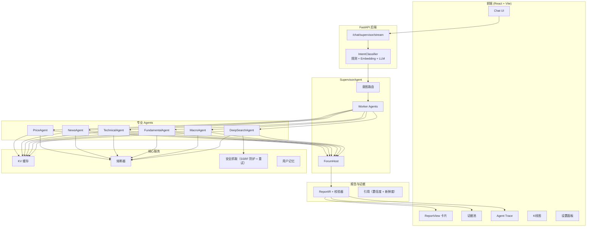
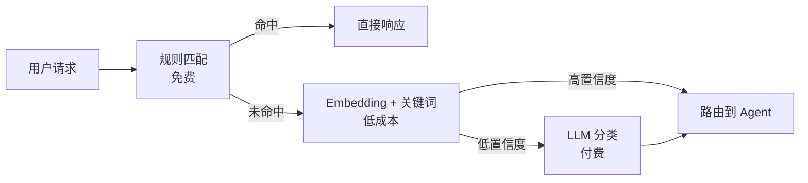
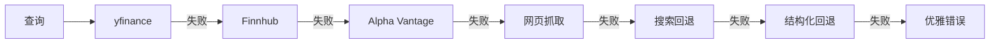

# FinSight AI：多智能体金融研究平台

[](https://github.com/langchain-ai/langchain)
[](https://github.com/langchain-ai/langgraph)
[](https://www.python.org/)
[](https://react.dev/)
[](https://www.typescriptlang.org/)
[](./LICENSE)

[English Version](./readme.md) | **中文文档** | [更多文档](./docs/)

---

## 项目概述

FinSight AI 是一个对话式多智能体金融研究助手，核心能力包括：

- Supervisor Agent 架构：意图分类 + Worker Agent 协同 + Forum 综合
- 6 大专用 Agent：Price、News、Technical、Fundamental、Macro、DeepSearch
- FastAPI 后端 + LangChain + LangGraph 编排
- React + TypeScript + Tailwind 前端，专业报告卡片展示
- 实时市场数据，多源回退（yfinance、Finnhub、Alpha Vantage 等）

目标是让它像一位随身的首席投资官（CIO），既能快速取数，也能输出专业级投资研究报告。

---

## 核心特点

### 多智能体 Supervisor 架构
```
用户提问 -> IntentClassifier (规则 + Embedding + LLM) -> SupervisorAgent
                                                        |
             +------------------------------------------+----------------------------------+
             | Worker Agents（并行执行）                                                |
             | - PriceAgent（实时行情）                                                 |
             | - NewsAgent（新闻与情绪）                                                |
             | - TechnicalAgent（技术指标）                                             |
             | - FundamentalAgent（基本面）                                             |
             | - MacroAgent（宏观数据）                                                 |
             | - DeepSearchAgent（深度检索）                                            |
             +-----------------------------------------------------------------------------+
                                                        |
                                   ForumHost（综合 + 置信度评分）
                                                        |
                         ReportIR（引用 + 置信度 + 新鲜度）
                                                        |
                     前端 ReportView（证据池 + Trace 展开）
```

### 专业报告生成
- 8 节结构化报告：执行摘要、市场定位、基本面分析、宏观与催化、风险评估、投资策略、情景分析、监控事件
- Agent 贡献追踪：显示每个洞见来自哪个 Agent
- 证据池：引用包含置信度与新鲜度字段
- ReportIR 引用 schema 校验，保证字段完整
- ReportSection 保留章节级置信度/来源 Agent/数据源
- PlanIR + Executor：计划模板 + 执行 trace（step 级可追溯）
- EvidencePolicy：引用校验 + 覆盖率阈值约束
- News/Macro 回退结构化，保证下游分析稳定
- get_company_news 输出结构化列表，统一格式展示
- DeepSearch 加入 SSRF 防护与重试
- DeepSearch 动态查询模板根据意图关键词生成
- DataContext 汇总各个数据源的 as_of/currency/adjustment，自动标注不一致
- BudgetManager 控制工具调用/轮次/耗时，预算快照随响应回传
- 安全门禁（API Key + 限流）与免责声明模板确保合规
- SearchConvergence 模块：信息增益评分 + 内容去重 + 停止条件
- TraceEvent Schema v1：统一事件格式（event_type/duration/metadata）
- Supervisor 流式输出统一 normalize 到 trace v1
- 回归测试框架：25 条基准用例 + 自动对比报告

### 智能意图分类
- 3 层混合系统：规则匹配 -> Embedding 相似度 -> LLM 兜底
- NEWS 子意图区分“拉取新闻”和“分析新闻影响”
- 成本优化：简单请求优先走规则
- 报告意图覆盖“分析/Analyze”，有 ticker 时无需 LLM

### 实时可视化与透明度
- 流式输出（逐字呈现）
- 交互式 K 线图（支持全屏）
- Agent Trace 分层展开，可逐步查看工具调用
- 资产组合快照 + 持仓编辑

### 订阅提醒系统
- 价格提醒：达到阈值自动邮件通知
- 新闻提醒：关注股票的定时新闻摘要
- APScheduler 后台调度

---

## 系统架构

### 整体架构



### 意图分类流程



### 数据回退策略



---

## 可用工具

| 工具 | 说明 | 数据源 |
|------|------|--------|
| `get_stock_price` | 实时报价 + 多源回退 | yfinance -> Finnhub -> Alpha Vantage -> Web |
| `get_company_info` | 公司基本面 | yfinance |
| `get_company_news` | 最新新闻（结构化列表） | Reuters RSS + Bloomberg RSS + Finnhub |
| `search` | 网络搜索 | Exa -> Tavily -> Wikipedia -> DuckDuckGo |
| `get_market_sentiment` | 恐惧与贪婪指数 | CNN |
| `get_economic_events` | 宏观日历 | Exa search |
| `get_financial_statements` | 三大财务报表 | yfinance |
| `get_key_metrics` | PE、ROE、利润率 | yfinance + 计算 |
| `analyze_historical_drawdowns` | 回撤分析 | yfinance |
| `get_performance_comparison` | 多标的对比 | yfinance |

---

## 快速开始

### 1. 后端 (FastAPI)

```bash
# 创建虚拟环境
python -m venv .venv
source .venv/bin/activate  # Windows: .venv\Scripts\activate

# 安装依赖
pip install -r requirements.txt

# 配置环境变量
cp .env.example .env
# 编辑 .env 填入 API 密钥
# 可选：前端 Settings Modal 会写入 `user_config.json`（LLM 配置优先级高于 .env）

# 启动服务
python -m uvicorn backend.api.main:app --host 0.0.0.0 --port 8000 --reload
```

### 2. 前端 (React + Vite)

```bash
cd frontend
npm install
npm run dev
```

浏览器访问 `http://localhost:5173`

### 3. 健康检查

```bash
curl http://localhost:8000/health
# {"status": "healthy"}
```

### 4. 测试

```bash
pytest backend/tests -q
```

---

## 环境变量

```env
# LLM 配置
GEMINI_PROXY_API_KEY=your_key
GEMINI_PROXY_API_BASE=https://your-proxy/v1

# 金融数据 API（推荐）
ALPHA_VANTAGE_API_KEY=...
FINNHUB_API_KEY=...
TIINGO_API_KEY=...
TAVILY_API_KEY=...
EXA_API_KEY=...

# 邮件提醒
SMTP_SERVER=smtp.gmail.com
SMTP_PORT=587
SMTP_USER=your_email@gmail.com
SMTP_PASSWORD=your_app_password
EMAIL_FROM=FinSight <your_email@gmail.com>

# 调度器
PRICE_ALERT_SCHEDULER_ENABLED=true
PRICE_ALERT_INTERVAL_MINUTES=15
NEWS_ALERT_SCHEDULER_ENABLED=true
NEWS_ALERT_INTERVAL_MINUTES=30

# LangSmith（可选）
LANGSMITH_API_KEY=...
LANGSMITH_PROJECT=FinSight
ENABLE_LANGSMITH=false

# 质量和门槛
DATA_CONTEXT_MAX_SKEW_HOURS=24
BUDGET_MAX_TOOL_CALLS=24
BUDGET_MAX_ROUNDS=12
BUDGET_MAX_SECONDS=120
CHAT_HISTORY_MAX_MESSAGES=12
CACHE_JITTER_RATIO=0.1
CACHE_NEGATIVE_TTL=60
PRICE_CB_FAILURE_THRESHOLD=5
PRICE_CB_RECOVERY_TIMEOUT=60
NEWS_CB_FAILURE_THRESHOLD=3
NEWS_CB_RECOVERY_TIMEOUT=180
LOG_LEVEL=INFO

# 安全门禁
API_AUTH_ENABLED=false
API_AUTH_KEYS=
RATE_LIMIT_ENABLED=false
RATE_LIMIT_PER_MINUTE=120
RATE_LIMIT_WINDOW_SECONDS=60
```

LLM 配置优先级：
- `user_config.json`（如果存在，由前端保存）优先生效
- `.env` 提供默认 provider/model/api_base/api_key

---

## 可观测性

- `GET /health` 基础健康检查
- `GET /metrics` Prometheus 指标（需安装 `prometheus-client`）
- `GET /diagnostics/orchestrator` 编排器统计
- `GET /diagnostics/langgraph` 报告 Agent 自检

## 项目结构

```
FinSight/
|-- backend/
|   |-- agents/
|   |   |-- base_agent.py
|   |   |-- price_agent.py
|   |   |-- news_agent.py
|   |   |-- technical_agent.py
|   |   |-- fundamental_agent.py
|   |   |-- macro_agent.py
|   |   |-- deep_search_agent.py
|   |-- orchestration/
|   |   |-- supervisor_agent.py
|   |   |-- intent_classifier.py
|   |   |-- forum.py
|   |-- report/
|   |   |-- ir.py
|   |   |-- validator.py
|   |-- services/
|   |   |-- cache.py
|   |   |-- circuit_breaker.py
|   |   |-- memory.py
|   |-- api/
|   |   |-- main.py
|   |-- langchain_tools.py
|   |-- legacy/
|   |   |-- streaming_support.py
|   |-- tools/
|   |   |-- search.py
|   |   |-- news.py
|   |   |-- price.py
|   |   |-- financial.py
|   |   |-- macro.py
|   |   |-- web.py
|-- frontend/
|   |-- src/
|   |   |-- components/
|   |   |   |-- ReportView.tsx
|   |   |   |-- ThinkingProcess.tsx
|   |   |   |-- RightPanel.tsx
|   |   |   |-- Sidebar.tsx
|   |   |-- store/useStore.ts
|   |   |-- api/client.ts
|-- docs/
|   |-- archive/
|   |-- plans/
|   |-- reports/
|   |-- design/
|-- images/
```

---

## 当前状态

> 最后更新: 2026-01-23 | 版本: 0.6.5

### 完成进度

| 模块 | 进度 | 说明 |
|------|------|------|
| 工具层 | 100% | 多源回退、缓存、熔断 |
| Agent 层 | 100% | 6 个 Agent + 回退结构化 |
| 编排层 | 100% | Supervisor + Forum + 流式 |
| 报告卡片 | 100% | 引用置信度 + 新鲜度校验 |
| 可解释性 | 90% | Trace 展开 + 诊断 |
| 提醒系统 | 90% | 价格 + 新闻提醒 |

### 已知问题

| 问题 | 严重程度 | 状态 |
|------|----------|------|
| DeepSearch 未接入 RAG | 中 | 计划中 |
| RiskAgent 未实现 | 中 | Phase 3 |
| 移动端响应式待优化 | 低 | Backlog |

---

## 路线图

### 已完成 (v0.6.x)
- [x] 多智能体 Supervisor 架构
- [x] 8 节专业报告
- [x] NEWS 子意图分类
- [x] 引用置信度与新鲜度字段
- [x] News/Macro 结构化回退
- [x] DeepSearch SSRF 防护 + 重试
- [x] DeepSearch 动态查询模板
- [x] 资产组合快照（持仓输入）
- [x] 全屏 K 线图

### 进行中
- [ ] DeepSearch 接入 RAG
- [ ] 用户长期记忆（向量库）

### 计划中 (v0.7.x)
- [ ] RiskAgent（VaR、仓位建议）
- [ ] 组合分析
- [ ] 多语言支持
- [ ] 移动端响应式

---

## 贡献

欢迎贡献代码！提交 PR 前请阅读贡献指南。

### 贡献者

- Human Developer - 架构、前端、后端
- Claude (Anthropic) - 代码辅助、文档

---

## 许可证

MIT License - 详见 [LICENSE](./LICENSE)

---

## 致谢

- [LangChain](https://github.com/langchain-ai/langchain) - LLM 框架
- [LangGraph](https://github.com/langchain-ai/langgraph) - Agent 编排
- [yfinance](https://github.com/ranaroussi/yfinance) - 市场数据
- [ECharts](https://echarts.apache.org/) - 图表库
