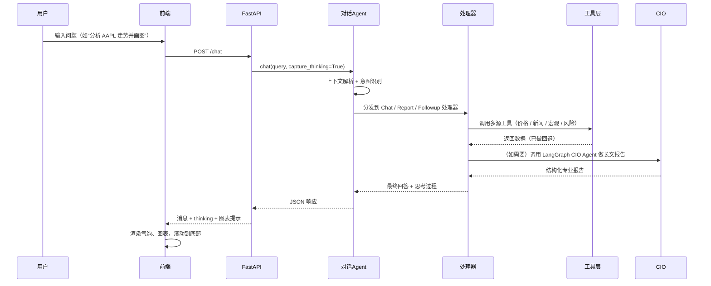
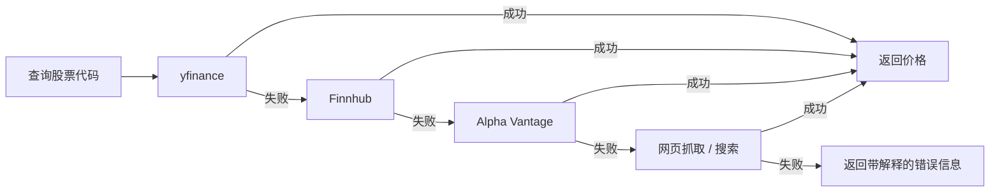
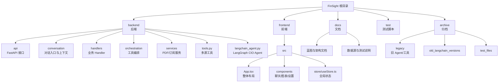

# FinSight AI：对话式智能金融分析助手

[](https://github.com/langchain-ai/langchain)
[](https://github.com/langchain-ai/langgraph)
[](https://www.python.org/)
[](https://react.dev/)
[](https://www.typescriptlang.org/)

[English Version](./readme.md) | **中文文档** | [更多文档](./docs/)

---

## ???????

- ?? P1 ????????? + ????/????????????/stub??
- ??????????? fail_rate / cooldown / skip_reason?API ??????????
- ????DeepSearch ? Agent???????/???+ ?? RAG ??????????????????????

---

## 🚀 项目概述

FinSight AI 是一个面向股票 / 指数的 **对话式金融研究 Agent**：

- 后端基于 FastAPI + LangChain + **LangGraph CIO Agent**。
- 前端基于 React + TypeScript + Tailwind，提供类 ChatGPT 的对话界面和行情面板。
- 通过一组 **金融工具（Tools）** 自动抓取行情、公司基本面、新闻、宏观数据、风险指标，并生成专业报告。

目标是让它像一位随身的 **首席投资官（CIO）**，既能快速聊天，又能产出 800+ 字的机构风格分析报告。

---

## ✨ 核心特点

- **对话式 CIO Agent**
  - 多轮对话，上下文管理（自动识别“这只股票”“之前那家公司”等引用）。
  - 意图路由：快速问答（CHAT）、深度报告（REPORT）、追问（FOLLOWUP）等。
  - REPORT 场景由 LangGraph 驱动的 CIO Agent 负责，按模板输出专业报告。

- **智能图表与可视化**
  - AI 回答中可以嵌入图表提示（如 `[CHART:AAPL:line]`）。
  - 前端右侧 `StockChart` 面板在需要图表时自动展开。
  - 使用 ECharts 渲染价格走势、绩效对比等图表。

- **多源数据 + 回退策略**
  - 单个工具内部就包含多数据源回退（yfinance / API / 抓取 / 搜索）。
  - 尽量保证“有数据可用”，并在失败时给出清晰错误信息。

- **思考过程可视化**
  - 可选显示“思考过程”：每一步调用了什么工具、耗时多少、最终如何得出结论。

- **现代前端体验**
  - 顶部品牌条：FinSight 标识 + 副标题 + 主题切换 + 导出 PDF + 设置。
  - 左右布局：左侧对话，右侧图表，可折叠。
  - 支持深色 / 浅色主题，支持“居中布局”与“铺满宽度”两种布局模式，并可在设置中切换。

- **订阅提醒（新增）**
  - 支持邮件提醒：价格波动（`price_change`）、新闻（`news`），多只股票一次性订阅。
  - 后台调度（APScheduler）：价格/新闻定期扫描，多源回退（yfinance → Alpha Vantage/Finnhub → Yahoo 抓取 → Stooq 兜底；新闻 yfinance → Finnhub → Alpha Vantage）。
  - 前端设置弹窗可添加/取消订阅，查看最近价格/新闻提醒时间。
  - 调度日志写入 `logs/alerts.log`，便于排查发送/限流问题。

## 界面预览


---

## 🧱 当前架构

### 整体架构图

```mermaid
flowchart LR
    U[用户] --> FE[前端 Frontend\nReact + TS]
    FE -->|HTTP / JSON| API[FastAPI 后端]

    subgraph Backend[后端]
        API --> AG[ConversationAgent\n对话统一入口]
        AG --> RT[Router + ContextManager\n意图路由 + 上下文管理]
        AG --> HD[Handlers\nChat / Report / Followup]
        HD --> ORC[ToolOrchestrator\n工具编排]
        HD --> CIO[LangGraph CIO Agent\n(LangChainFinancialAgent)]
        ORC --> TOOLS[backend.tools\n+ langchain_tools]
    end

    subgraph DataSources[数据源]
        TOOLS --> PX[行情 / K 线\nyfinance / API]
        TOOLS --> FUND[公司基本面\nprofile / 财报摘要]
        TOOLS --> NEWS[新闻 & 搜索\nTavily / DDGS / 抓取]
        TOOLS --> MACRO[宏观 & 情绪\n指数 / 日历 / 情绪指标]
    end

    FE <-->|响应 / 流式输出| API
```

### 对话流程（现在）



---

## 🔁 数据回退策略（简要说明）

数据回退逻辑集中在 `backend/tools.py` 中，每个工具内部都采用“多源兜底”策略。例如：



其他工具（新闻、宏观、情绪等）也采用类似的分层回退逻辑，尽量做到：

- 能拿到数据时：给出带来源说明的结果。
- 拿不到数据时：说明失败原因，提示用户可以尝试换标的 / 换时间窗口。

---

## 🛠 可用工具列表（LangChain / LangGraph）

`langchain_tools.py` 中基于 `@tool` 定义了一组金融工具，并绑定到 LangGraph CIO Agent 上：

| 工具名                         | 功能说明                                                   |
|-------------------------------|------------------------------------------------------------|
| `get_current_datetime`        | 获取当前时间戳，用于报告时间锚定。                        |
| `get_stock_price`             | 获取股票 / 指数的最新价格，多数据源回退。                 |
| `get_company_info`            | 查询公司基本面信息（行业、市值、简介等）。                |
| `get_company_news`            | 获取与标的相关的最新新闻标题。                            |
| `search`                      | 市场 / 宏观搜索（Tavily + DDGS + Wikipedia 回退）。       |
| `get_market_sentiment`        | 获取当前市场情绪（Fear & Greed 等）。                     |
| `get_economic_events`         | 获取未来一段时间的宏观事件（日历）。                      |
| `get_performance_comparison`  | 多标的绩效对比（YTD / 1Y），用于相对强弱分析。            |
| `analyze_historical_drawdowns`| 分析历史大回撤（幅度、持续时间、恢复时间等）。           |

> LangGraph CIO Agent 的系统提示中会明确要求：先调用 `get_current_datetime`，再调用搜索、价格、新闻、宏观、风险工具，最后再写出结构化报告。

---

## 📦 环境与依赖（requirements 已更新）

- Python 3.10+  
- Node.js 18+（前端）  
- 关键 Python 依赖（完整见 `requirements.txt`）：
  - `langchain==1.1.0`
  - `langgraph==1.0.4`
  - `fastapi==0.122.0`
  - `uvicorn[standard]==0.38.0`
  - `yfinance`, `finnhub-python`, `tavily-python`, `ddgs`, `reportlab` 等。

`.env` 中常用配置：

```env
# LLM / LangGraph Agent
GEMINI_PROXY_API_KEY=你的密钥
GEMINI_PROXY_API_BASE=https://你的代理地址/v1

# 数据源 API（可选但推荐）
ALPHA_VANTAGE_API_KEY=...
FINNHUB_API_KEY=...
TIINGO_API_KEY=...
MARKETSTACK_API_KEY=...
TAVILY_API_KEY=...

# LangSmith（可选）
LANGSMITH_API_KEY=...
LANGSMITH_PROJECT=FinSight
ENABLE_LANGSMITH=false
```

---

## ▶️ 启动方式

### 1. 启动后端（FastAPI）

```bash
python -m venv .venv
.\.venv\Scripts\activate  # Windows
pip install -r requirements.txt

python -m uvicorn backend.api.main:app --host 0.0.0.0 --port 8000 --reload
```

### 2. 启动前端（React + Vite）

```bash
cd frontend
npm install
npm run dev
```

在浏览器中访问提示的本地地址（通常是 `http://localhost:5173`）。  

启动后可以访问：  
- `http://127.0.0.1:8000/` 或 `http://127.0.0.1:8000/health` 检查后端健康状态（`status: "healthy"`）。  

> 即使后端 `/api/config` 暂时不可用，前端的 **主题和布局模式** 也会持久化在 `localStorage` 中；保存配置失败时只会在控制台打印错误，不会阻塞使用。

---

## 💬 使用示例

### 示例一：快速走势 + 对比

> “帮我看看 AAPL 最近 3 个月的走势，并和纳指对比一下表现。”  

系统行为：

1. 对话 Agent 将其识别为「聊天 + 轻量分析」。
2. 调用 `get_stock_price`、`get_performance_comparison`、`get_company_news` 等工具。
3. 前端右侧图表面板自动展开，展示 AAPL 与指数的对比曲线。
4. 如开启思考过程，会看到每一步调用了哪些工具、耗时多久。

### 示例二：生成 CIO 风格长文报告

> “用机构研究报告的风格，写一份关于 NVIDIA 的详细投资分析，至少 800 字，包含风险和投资建议。”  

系统行为：

1. Router 将其路由到 `ReportHandler`。
2. `ReportHandler` 调用 `LangChainFinancialAgent.analyze`（LangGraph CIO Agent）。
3. CIO Agent 按系统提示依次调用时间、搜索、价格、公司信息、新闻、宏观、风险等工具。
4. 输出结构化报告：执行摘要、市场位置、宏观环境、风险分析、投资策略、关键要点等。

### 示例三：连续追问

> “和去年相比，这次回撤算严重吗？再帮我列一下 2020 之后最大的几次跌幅。”  

系统行为：

1. 上下文管理器解析「这次回撤」指向前一轮提到的标的与时间区间。
2. Router 识别为 `FOLLOWUP`，调用 `FollowupHandler`。
3. 工具层复用 `analyze_historical_drawdowns` 等工具，输出对比分析而非完全重写报告。

---

## 📁 项目结构（当前）



```text
FinSight/
├── backend/
│   ├── api/
│   │   ├── main.py              # FastAPI 入口：/chat、/chat/stream、/api/config、/api/export/pdf 等
│   │   └── chart_detector.py    # 图表类型识别工具
│   ├── conversation/
│   │   ├── agent.py             # ConversationAgent：对话总入口
│   │   ├── context.py           # 上下文与会话记忆
│   │   └── router.py            # 意图识别与路由
│   ├── handlers/                # Chat / Report / Followup 等处理器
│   ├── orchestration/           # ToolOrchestrator 与工具桥接
│   ├── services/                # PDF 导出、订阅服务等
│   ├── tests/                   # 后端测试
│   ├── tools.py                 # 金融工具实现 + 多源回退逻辑
│   └── langchain_agent.py       # LangGraph CIO Agent（LangChainFinancialAgent）
│
├── frontend/
│   ├── src/
│   │   ├── App.tsx              # 主布局：顶部品牌条 + 左右面板
│   │   ├── api/client.ts        # 调用 FastAPI 的 Axios 客户端
│   │   ├── components/
│   │   │   ├── ChatList.tsx
│   │   │   ├── ChatInput.tsx
│   │   │   ├── StockChart.tsx
│   │   │   ├── InlineChart.tsx
│   │   │   ├── SettingsModal.tsx
│   │   │   └── ThinkingProcess.tsx
│   │   └── store/useStore.ts    # Zustand 状态（消息、主题、布局模式、当前 ticker 等）
│   └── ...                      # Vite 配置、样式等
│
├── docs/                        # 各类文档与蓝图
│   ├── CONVERSATIONAL_AGENT_BLUEPRINT_V3.md
│   ├── Future_Blueprint_CN.md
│   ├── DATA_SOURCES_ADDED.md
│   ├── API_KEYS_CONFIGURED.md
│   └── ...
│
├── test/                        # 高层测试（如 LangGraph Agent）
├── archive/                     # 旧版本 Agent / 工具 / 测试的归档
├── langchain_tools.py           # LangChain 工具注册表（供 LangGraph 绑定）
├── streaming_support.py         # 流式输出支持（计划继续集成）
├── requirements.txt             # Python 依赖（已更新）
└── readme*.md                   # 本文件及英文版说明
```

---

## 🔁 回退策略与兼容性说明

- 原有的老 Agent / 工具文件已移动到 `archive/`，便于日后回溯与比较。
- `backend.tools` 仍是底层事实来源，实现了所有金融工具及回退逻辑；`langchain_tools` 只是为 LangChain / LangGraph 做的一层包装。
- 对前端而言，`/chat` 接口保持稳定：
  - 内部可以自由替换为不同的 Agent 实现（传统 ReAct / LangGraph / 多 Agent）。
  - 也可以根据需要启用 / 关闭 LangGraph CIO Agent，而无需改动前端。

---

## 🧪 测试

在项目根目录执行：

```bash
python -m pytest
```

建议根据 `docs/TESTING_GUIDE.md` 与蓝图文档，为新的工具、Handler 和 Agent 行为逐步补充测试用例，保证重构与升级过程的可控性。

---

## 📌 当前状态

- **后端**：FastAPI + ConversationAgent 已运行在新的 LangGraph CIO Agent 之上。  
- **前端**：支持深色 / 浅色主题、布局模式切换、图表自动展开、PDF 导出等。  
- **蓝图**：未来的 Sub‑Agent、多因子深度研究、邮件订阅与 DeepSearch 设计详见 `docs/Future_Blueprint_CN.md` 及新的执行蓝图文档。  