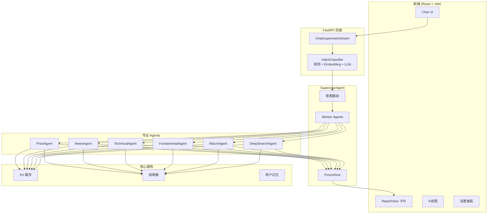
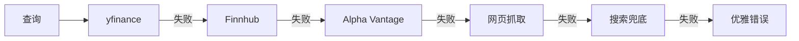

# FinSight AI：多智能体金融研究平台

[](https://github.com/langchain-ai/langchain)
[](https://github.com/langchain-ai/langgraph)
[](https://www.python.org/)
[](https://react.dev/)
[](https://www.typescriptlang.org/)
[](./LICENSE)

[English Version](./readme.md) | **中文文档** | [更多文档](./docs/)

---

## 项目概述

FinSight AI 是一个**对话式、多智能体金融研究助手**，核心特点：

- **Supervisor Agent 架构**：意图分类 + Worker Agent 协调 + Forum 综合
- **6 大专业 Agent**：Price、News、Technical、Fundamental、Macro、DeepSearch
- **FastAPI 后端** + LangChain + LangGraph 协调引擎
- **React + TypeScript + Tailwind** 前端，专业报告卡片展示
- **实时市场数据**，多源回退（yfinance、Finnhub、Alpha Vantage 等）

目标是让它像一位随身的**首席投资官（CIO）**，既能快速聊天，又能产出专业机构级投资研报。

---

## 核心特点

### 多智能体 Supervisor 架构
```
用户查询 → IntentClassifier (规则 + Embedding + LLM) → SupervisorAgent
                                                              ↓
                    ┌────────────────────────────────────────────┐
                    │  Worker Agents (并行执行)                   │
                    │  ├── PriceAgent (实时行情)                  │
                    │  ├── NewsAgent (新闻舆情)                   │
                    │  ├── TechnicalAgent (技术指标)              │
                    │  ├── FundamentalAgent (基本面)              │
                    │  ├── MacroAgent (宏观数据)                  │
                    │  └── DeepSearchAgent (深度研究)             │
                    └────────────────────────────────────────────┘
                                                              ↓
                              ForumHost (综合 + 置信度评分)
                                                              ↓
                              ReportIR → 前端 ReportView 卡片
```

### 专业报告生成
- **8 节结构化分析报告**：执行摘要、市场定位、基本面分析、宏观催化剂、风险评估、投资策略、情景分析、监控事件
- **Agent 贡献追踪**：显示每个洞见来自哪个 Agent
- **置信度评分**：AI 置信度 + 证据来源说明
- **引用链接**：点击查看原始来源

### 智能意图分类
- **三层混合系统**：规则匹配 → Embedding 相似度 → LLM 兜底
- **NEWS 子意图**：区分"获取新闻"与"分析新闻影响"
- **成本优化**：简单查询规则处理，无 LLM 成本

### 实时流式与可视化
- **逐字流式输出**：类 ChatGPT 打字机效果
- **交互式 K 线图**：全屏弹窗，多时间周期
- **Agent 进度指示器**：实时执行状态

### 订阅提醒系统
- **价格提醒**：股价超过阈值时邮件通知
- **新闻提醒**：关注股票的每日新闻摘要
- **后台调度**：APScheduler 可配置间隔

---

## 界面预览

### 深度研究报告卡片
*完整 8 节投资分析，包含 Agent 状态追踪、置信度评分和引用来源*


### 报告章节与证据面板
*可展开章节，ForumHost 综合分析，章节导航，来源引用*


### 全屏 K 线图弹窗
*交互式蜡烛图，多时间周期（24小时、1月、3月、6月、1年、2年、5年、全部），OHLC 提示*


### 价格异动邮件提醒
*股价超过配置阈值时自动发送邮件通知*


### 新闻摘要邮件
*定时新闻摘要，包含标题、来源和直接链接*


---

## 系统架构

### 整体架构图



### 意图分类流程


### 数据回退策略



---

## 可用工具

| 工具 | 说明 | 数据源 |
|------|------|--------|
| `get_stock_price` | 实时报价 + 多源回退 | yfinance → Finnhub → Alpha Vantage → Web |
| `get_company_info` | 公司基本面 | yfinance |
| `get_company_news` | 最新新闻 | Reuters RSS + Bloomberg RSS + Finnhub |
| `search` | 网络搜索 | Exa → Tavily → Wikipedia → DuckDuckGo |
| `get_market_sentiment` | 恐惧贪婪指数 | CNN |
| `get_economic_events` | 宏观日历 | Exa 搜索 |
| `get_financial_statements` | 三大财务报表 | yfinance |
| `get_key_metrics` | PE、ROE、利润率 | yfinance + 计算 |
| `analyze_historical_drawdowns` | 回撤分析 | yfinance |
| `get_performance_comparison` | 多标的对比 | yfinance |

---

## 快速开始

### 1. 后端 (FastAPI)

```bash
# 创建虚拟环境
python -m venv .venv
source .venv/bin/activate  # Windows: .venv\Scripts\activate

# 安装依赖
pip install -r requirements.txt

# 配置环境变量
cp .env.example .env
# 编辑 .env 填入 API 密钥

# 启动服务
python -m uvicorn backend.api.main:app --host 0.0.0.0 --port 8000 --reload
```

### 2. 前端 (React + Vite)

```bash
cd frontend
npm install
npm run dev
```

在浏览器打开 `http://localhost:5173`

### 3. 健康检查

```bash
curl http://localhost:8000/health
# {"status": "healthy"}
```

---

## 环境变量

```env
# LLM 配置
GEMINI_PROXY_API_KEY=你的密钥
GEMINI_PROXY_API_BASE=https://你的代理地址/v1

# 金融数据 API（推荐）
ALPHA_VANTAGE_API_KEY=...
FINNHUB_API_KEY=...
TIINGO_API_KEY=...
TAVILY_API_KEY=...
EXA_API_KEY=...

# 邮件提醒
SMTP_SERVER=smtp.gmail.com
SMTP_PORT=587
SMTP_USER=your_email@gmail.com
SMTP_PASSWORD=your_app_password
EMAIL_FROM=FinSight <your_email@gmail.com>

# 调度器
PRICE_ALERT_SCHEDULER_ENABLED=true
PRICE_ALERT_INTERVAL_MINUTES=15
NEWS_ALERT_SCHEDULER_ENABLED=true
NEWS_ALERT_INTERVAL_MINUTES=30

# LangSmith（可选）
LANGSMITH_API_KEY=...
LANGSMITH_PROJECT=FinSight
ENABLE_LANGSMITH=false
```

---

## 项目结构

```
FinSight/
├── backend/
│   ├── agents/                 # 专业 Agents
│   │   ├── base_agent.py       # BaseFinancialAgent
│   │   ├── price_agent.py      # 实时行情
│   │   ├── news_agent.py       # 新闻舆情
│   │   ├── technical_agent.py  # 技术指标
│   │   ├── fundamental_agent.py# 基本面分析
│   │   ├── macro_agent.py      # 宏观经济
│   │   └── deep_search_agent.py# 深度研究
│   ├── orchestration/
│   │   ├── supervisor_agent.py # 主协调器
│   │   ├── intent_classifier.py# 意图分类
│   │   └── forum.py            # Agent 综合
│   ├── services/
│   │   ├── cache.py            # KV 缓存
│   │   ├── circuit_breaker.py  # 熔断器
│   │   └── memory.py           # 用户画像
│   ├── api/
│   │   └── main.py             # FastAPI 端点
│   └── tools.py                # 金融工具
├── frontend/
│   └── src/
│       ├── components/
│       │   ├── ChatList.tsx
│       │   ├── ChatInput.tsx
│       │   ├── ReportView.tsx
│       │   └── ThinkingProcess.tsx
│       └── api/client.ts
├── docs/
│   ├── 01_ARCHITECTURE.md
│   ├── PROJECT_STATUS.md
│   ├── ROADMAP.md
│   └── TECHNICAL_QNA.md
└── images/                     # 截图
```

---

## 当前状态

> **最后更新**: 2026-01-13 | **版本**: 0.6.3

### 完成进度

| 模块 | 进度 | 说明 |
|------|------|------|
| **工具层** | ✅ 100% | 多源回退、缓存、熔断器 |
| **Agent 层** | ✅ 100% | 6 大 Agent 全部就绪 |
| **协调层** | ✅ 100% | Supervisor + Forum + 流式 |
| **报告卡片** | ✅ 100% | 8 节专业报告 |
| **意图分类** | ✅ 100% | 三层混合 + NEWS 子意图 |
| **提醒系统** | ✅ 90% | 价格 + 新闻提醒已上线 |

### 已知问题

| 问题 | 严重程度 | 状态 |
|------|----------|------|
| RAG 未集成 DeepSearch | 中 | 计划中 |
| RiskAgent 未实现 | 中 | Phase 3 |
| 移动端适配需优化 | 低 | Backlog |

---

## 路线图

### 已完成 (v0.6.x)
- [x] 多智能体 Supervisor 架构
- [x] 8 节专业分析报告
- [x] NEWS 子意图分类
- [x] 实时流式输出
- [x] 邮件提醒系统
- [x] 全屏 K 线图

### 进行中
- [ ] RAG 集成 DeepSearch
- [ ] 用户长期记忆（向量存储）

### 计划中 (v0.7.x)
- [ ] RiskAgent（VaR、仓位建议）
- [ ] 组合分析
- [ ] 多语言支持
- [ ] 移动端响应式

---

## 贡献

欢迎贡献代码！提交 PR 前请阅读贡献指南。

### 贡献者

- **Human Developer** - 架构、前端、后端
- **Claude (Anthropic)** - 代码辅助、文档

---

## 许可证

MIT License - 详见 [LICENSE](./LICENSE)

---

## 致谢

- [LangChain](https://github.com/langchain-ai/langchain) - LLM 框架
- [LangGraph](https://github.com/langchain-ai/langgraph) - Agent 编排
- [yfinance](https://github.com/ranaroussi/yfinance) - 市场数据
- [ECharts](https://echarts.apache.org/) - 图表库
