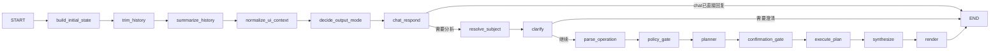

# FinSight AI（中文说明）

[English](./readme.md) | [中文](./readme_cn.md) | [文档索引](./docs/DOCS_INDEX.md)

## 1. 项目定位

FinSight 是一个“对话 + 仪表盘 + 工作台”一体化投研系统：

- `Chat`：面向问题驱动分析与报告生成
- `Dashboard`：面向结构化浏览与快速决策
- `Workbench`：面向任务流、报告索引与执行控制

后端统一走 `LangGraph` 主链，避免多套分析逻辑分叉。

## 2. 当前主链（代码实况）

主链定义位置：`backend/graph/runner.py`


```mermaid
flowchart LR
  START --> build_initial_state
  build_initial_state --> trim_history
  trim_history --> summarize_history
  summarize_history --> normalize_ui_context
  normalize_ui_context --> decide_output_mode
  decide_output_mode --> chat_respond
  chat_respond -->|chat已直接回复| END
  chat_respond -->|需要分析| resolve_subject
  resolve_subject --> clarify
  clarify -->|需要澄清| END
  clarify -->|继续| parse_operation
  parse_operation --> policy_gate
  policy_gate --> planner
  planner --> confirmation_gate
  confirmation_gate --> execute_plan
  execute_plan --> synthesize
  synthesize --> render
  render --> END
```

## 3. Planner / Policy / 执行层关键点

- `policy_gate`（`backend/graph/nodes/policy_gate.py`）
  - 按 `subject_type + operation + output_mode` 生成 tool allowlist
  - 按能力评分从 `REPORT_AGENT_CANDIDATES` 选择 agent
  - 支持 `agents_override`、`budget_override`、`analysis_depth`、`agent_preferences`
- `planner`（`backend/graph/nodes/planner.py`）
  - 支持 `stub/llm` 双模式与 A/B 统计
  - LLM 解析失败回退 `planner_stub`
- `planner_stub`（`backend/graph/nodes/planner_stub.py`）
  - 已支持新工具关键词路由（EPS/事件日历/期权/因子暴露/压力测试/信源可靠度）
- `execute_plan_stub` + `executor`
  - 串并行混合执行（`parallel_group`）
  - cache 命中复用
  - SSE 事件输出 `step/tool/agent` 全链路状态

## 4. Agent 与 Tool 现状

### 4.1 可用 Agent

- `price_agent`
- `news_agent`
- `fundamental_agent`
- `technical_agent`
- `macro_agent`
- `risk_agent`
- `deep_search_agent`

### 4.2 Tool 注册

注册文件：`backend/langchain_tools.py`

核心工具包括：

- 行情与技术：`get_stock_price`, `get_technical_snapshot`, `get_option_chain_metrics`
- 新闻与事件：`get_company_news`, `get_event_calendar`, `score_news_source_reliability`
- 基本面：`get_company_info`, `get_earnings_estimates`, `get_eps_revisions`
- 比较与风险：`get_performance_comparison`, `analyze_historical_drawdowns`, `get_factor_exposure`, `run_portfolio_stress_test`
- 通用：`search`, `get_current_datetime`, `get_market_sentiment`, `get_economic_events`

## 5. 核心 API

- 对话入口：`POST /chat/supervisor`、`POST /chat/supervisor/stream`
- 非对话执行：`POST /api/execute`、`POST /api/execute/resume`
- 仪表盘：`GET /api/dashboard`、`GET /api/dashboard/insights`
- Agent 偏好：`GET /api/agents/preferences`、`PUT /api/agents/preferences`
- 报告索引：`GET /api/reports/index`、`GET /api/reports/replay/{report_id}`、`GET /api/reports/compare`
- 健康检查：`GET /health`

## 6. 运行开关（建议）

- `LANGGRAPH_PLANNER_MODE=stub|llm`
- `LANGGRAPH_SYNTHESIZE_MODE=stub|llm`
- `LANGGRAPH_EXECUTE_LIVE_TOOLS=true|false`
- `LANGGRAPH_REPORT_MAX_AGENTS` / `LANGGRAPH_REPORT_MIN_AGENTS`
- `TRACE_RAW_ENABLED=true|false`
- `RAG_V2_BACKEND=auto|sqlite|postgres`

## 7. 本地启动

### Backend

```bash
python -m venv .venv
.venv\Scripts\activate
pip install -r requirements.txt
python -m uvicorn backend.api.main:app --host 0.0.0.0 --port 8000
```

### Frontend

```bash
pnpm install --dir frontend
pnpm dev --dir frontend
```

### 快速验证

```bash
pytest -q backend/tests/test_news_tags.py backend/tests/test_insights_engine.py backend/tests/test_policy_gate.py
npx tsc -b --noEmit --project frontend/tsconfig.json
```

## 8. 相关文档

- 总索引：`docs/DOCS_INDEX.md`
- 架构图与流程：`docs/01_ARCHITECTURE.md`
- Agent/Tool 细节：`docs/AGENTS_GUIDE.md`
- Dashboard 研发说明：`docs/DASHBOARD_DEVELOPMENT_GUIDE.md`
- Dashboard 路线与待办：`docs/DASHBOARD_AGENT_TODOLIST.md`
