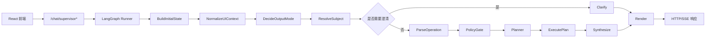
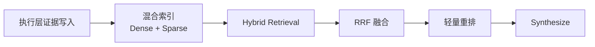

# FinSight AI：LangGraph 金融研究副驾

[](https://github.com/langchain-ai/langchain)
[](https://github.com/langchain-ai/langgraph)
[](https://www.python.org/)
[](https://react.dev/)
[](https://www.typescriptlang.org/)
[](./LICENSE)

[English](./README.md) | **中文** | [文档索引](./docs/DOCS_INDEX.md)

---

## 项目概述

> **SSOT（唯一标准）**：`docs/06_LANGGRAPH_REFACTOR_GUIDE.md`  
> **生产部署手册**：`docs/11_PRODUCTION_RUNBOOK.md`

FinSight 当前已收敛为 `/chat/supervisor*` 的 **LangGraph 单入口编排**：

- 单图主链：`BuildInitialState -> NormalizeUIContext -> DecideOutputMode -> ResolveSubject -> Clarify -> ParseOperation -> PolicyGate -> Planner -> ExecutePlan -> Synthesize -> Render`
- 统一任务模型：`subject_type + operation + output_mode`
- 研报模式必须显式指定：`options.output_mode=investment_report`
- Selection Context 是结构化输入（`news | filing | doc`），不再等同“研报意图”
- Checkpointer 支持 `sqlite` / `postgres`，并有受控回退策略

---

## 快速开始

### 后端

```bash
python -m venv .venv
# Windows: .venv\Scripts\activate
# macOS/Linux: source .venv/bin/activate
pip install -r requirements.txt
python -m uvicorn backend.api.main:app --host 0.0.0.0 --port 8000
```

### 前端

```bash
npm ci --prefix frontend
npm run dev --prefix frontend
```

### 发布门禁（必须通过）

```bash
pytest -q backend/tests
npm run build --prefix frontend
npm run test:e2e --prefix frontend
python tests/retrieval_eval/run_retrieval_eval.py --gate --report-prefix local
```

---

## 运行开关

| 变量 | 默认值 | 作用 |
|---|---:|---|
| `LANGGRAPH_PLANNER_MODE` | `stub` | `stub` 为可测确定性规划；`llm` 为受约束 PlanIR 规划 |
| `LANGGRAPH_PLANNER_AB_ENABLED` | `false` | 启用 Planner Prompt/Plan A/B 稳定分流（按会话/线程哈希） |
| `LANGGRAPH_PLANNER_AB_SPLIT` | `50` | A 组流量百分比（0-100），剩余归 B |
| `LANGGRAPH_PLANNER_AB_SALT` | `planner-ab-v1` | A/B 分桶盐值（用于稳定且可控的分组） |
| `LANGGRAPH_SYNTHESIZE_MODE` | `stub` | `stub` 为确定性综合；`llm` 为校验后综合 |
| `LANGGRAPH_EXECUTE_LIVE_TOOLS` | `false` | 是否执行真实工具/Agent |
| `LANGGRAPH_SHOW_EVIDENCE` | `false` | 是否在 markdown 内输出证据链接 |
| `LANGGRAPH_CHECKPOINTER_BACKEND` | `sqlite` | `sqlite` 或 `postgres` |
| `LANGGRAPH_CHECKPOINTER_ALLOW_MEMORY_FALLBACK` | `true` | 后端异常时是否允许回退到内存 checkpointer |
| `API_AUTH_ENABLED` | `false` | API Key 鉴权开关 |
| `RATE_LIMIT_ENABLED` | `false` | HTTP 限流开关 |
| `CORS_ALLOW_ORIGINS` | `http://localhost:5173,http://127.0.0.1:5173` | CORS 允许来源（逗号分隔） |
| `CORS_ALLOW_CREDENTIALS` | `false` | 是否允许携带凭证的 CORS 请求 |
| `API_PUBLIC_PATHS` | `/health,/docs,/openapi.json,/redoc` | 启用鉴权时的公开免认证路径 |
| `SESSION_CONTEXT_TTL_MINUTES` | `240` | 会话引用上下文 TTL（分钟） |
| `SESSION_CONTEXT_MAX_THREADS` | `1000` | 内存中最大会话上下文数（超出后 LRU 淘汰） |
| `VITE_API_BASE_URL` | `http://127.0.0.1:8000` | 前端运行时后端基础 URL |

---

## 当前架构


```mermaid
flowchart LR
    FE[React 前端] --> API["/chat/supervisor*"]
    API --> G[LangGraph Runner]
    G --> N1[BuildInitialState]
    N1 --> N2[NormalizeUIContext]
    N2 --> N3[DecideOutputMode]
    N3 --> N4[ResolveSubject]
    N4 --> N5{是否需要澄清}
    N5 -->|是| C[Clarify]
    N5 -->|否| N6[ParseOperation]
    C --> RENDER[Render]
    N6 --> N7[PolicyGate]
    N7 --> N8[Planner]
    N8 --> N9[ExecutePlan]
    N9 --> N10[Synthesize]
    N10 --> RENDER
    RENDER --> RESP[HTTP/SSE 响应]
```

### 检索 / RAG v2 联动


```mermaid
flowchart LR
    INGEST[执行层证据写入] --> IDX[混合索引\nDense + Sparse]
    IDX --> RETR[Hybrid Retrieval]
    RETR --> RRF[RRF 融合]
    RRF --> RERANK[轻量重排]
    RERANK --> SYN[Synthesize]
```

---

## Fallback 策略

| 层级 | 主路径 | 回退路径 |
|---|---|---|
| 澄清 | 图内 `Clarify` 节点 | 确定性澄清文案 |
| 规划 | `LANGGRAPH_PLANNER_MODE=llm` | `planner_stub`（受 Policy 约束） |
| 综合 | `LANGGRAPH_SYNTHESIZE_MODE=llm` | 确定性 synthesize 输出 |
| 工具数据 | 各数据源主通道 | 结构化 fallback 结果（带元数据） |
| Checkpointer | sqlite/postgres saver | memory saver（仅在允许时） |

---

## 内置工具

| 工具 | 说明 |
|---|---|
| `get_stock_price` | 行情快照 / 报价 |
| `get_company_news` | 公司新闻 |
| `get_company_info` | 公司资料与基本面摘要 |
| `search` | 网页检索兜底与补充 |
| `get_market_sentiment` | 市场情绪 |
| `get_economic_events` | 宏观事件 |
| `get_performance_comparison` | 标的表现对比 |
| `analyze_historical_drawdowns` | 历史回撤分析 |
| `get_technical_snapshot` | RSI/MACD/MA 技术快照 |
| `get_current_datetime` | 时间上下文 |

## 内置专家 Agent

- `price_agent`
- `news_agent`
- `fundamental_agent`
- `technical_agent`
- `macro_agent`
- `deep_search_agent`

---

## API 与契约

### 核心接口

- `POST /chat/supervisor`
- `POST /chat/supervisor/stream`
- `GET /health`
- `GET /metrics`
- `GET /diagnostics/orchestrator`
- `GET /diagnostics/planner-ab`（别名：`/diagnostics/planner_ab`，返回 A/B 的 requests/fallback_rate/retry_attempts/avg_steps）

### 契约版本

- `chat.request.v1`
- `chat.response.v1`
- `graph.state.v1`
- `chat.sse.v1`
- `trace.v1`

（定义于 `backend/contracts.py`）

---

## 界面截图


---

## 文档分层

### 当前有效（实现依据）

- `docs/06_LANGGRAPH_REFACTOR_GUIDE.md`
- `docs/11_PRODUCTION_RUNBOOK.md`
- `docs/01_ARCHITECTURE.md`（去黑盒版：query->agent 选路示例、planner/executor 内部 mermaid、各子 Agent 内部流程）
- `docs/05_RAG_ARCHITECTURE.md`
- `tests/retrieval_eval/run_retrieval_eval.py`（检索质量评测基线脚本）

## 检索评测基线（已落地）

```bash
# 指标计算逻辑单测
pytest -q tests/retrieval_eval/test_retrieval_eval_runner.py

# 离线检索门禁（Recall@K / nDCG@K / 引用覆盖率 / 延迟）
python tests/retrieval_eval/run_retrieval_eval.py --gate --report-prefix local
```

阈值与基线快照：

- `tests/retrieval_eval/thresholds.json`
- `tests/retrieval_eval/baseline_results.json`

### 历史阶段（仅参考）

- `docs/02_PHASE0_COMPLETION.md`
- `docs/03_PHASE1_IMPLEMENTATION.md`
- `docs/04_PHASE2_DEEP_RESEARCH.md`
- `docs/05_PHASE3_ACTIVE_SERVICE.md`
- `docs/Thinking/2026-01-31_architecture_refactor_guide.md`
- `docs/Thinking/2026-01-31_routing_architecture_decision.md`

---

## 当前优先事项

- 扩充检索评测集并加入 hard-negative 案例
- 增加 postgres 后端的 nightly 检索基准与漂移跟踪
- 强化生产可观测性与契约稳定性
- 每次架构变更后同步 SSOT 与入口文档

---

## 致谢

- [LangChain](https://github.com/langchain-ai/langchain)
- [LangGraph](https://github.com/langchain-ai/langgraph)
- [yfinance](https://github.com/ranaroussi/yfinance)
- [ECharts](https://echarts.apache.org/)

## 许可证

MIT License - 见 [LICENSE](./LICENSE)
